# 光学 Optics

!!! abstract "概述"

    发展：微粒、波动说，电磁理论（麦克斯韦），光子理论（爱因斯坦），波粒二象性。
    
    总体框架：
    
    -   光的传播和成像规律（几何方法）
    -   光的干涉、衍射和偏振（波动现象）
    -   光的粒子性将包含在量子力学中

## 几何光学

### 生词表

| Eng | Chn |
| :-: | :-: |
| refract | 折射 |
| prism | 三棱镜 |
| dispersion | 色散 |
| angle of deviation | 偏向角 |
| angle of incidence | 入射角 |
| angle of refraction | 折射角 |
| Fermat principle | 费马原理 |
| principle of the least optical path | 光程最短定律 |
| center of curvature | 曲率中心 |
| radius of curvature | 曲率半径 |
| principal optical axis | 主光轴 |
| object distance | 物距 |
| image distance | 像距 |
| focal length | 焦距 |
| focal plane | 焦平面 |
| focal point | 焦点 |
| focal length | 焦距 |
| sign convention | 正负号法则 |
| convex mirror | 凸面镜 |
| concave mirror | 凹面镜 |
| magnifier | 放大镜 |
| microscope | 显微镜 |
| telescope | 望远镜 |
| len | 透镜 |
| thin len | 薄透镜 |

- 传播定律：直线、独立、反射和折射定律

!!! note "折射定律"

    入射角 $i$ 与折射角 $r$ 的正弦之比与介质的相对折射率有关：

    $$
    \frac{\sin i}{\sin r} = \frac{n_2}{n_1} = n_{21}
    $$

    -   $n_{21}$：相对折射率，第二种介质相对于第一种介质的折射率

- 光路可逆原理
- 费马原理

!!! note "费马原理（光程最短定律）"

    光线在传播过程中，光程取极值。

    $$
    \delta \int_{A}^{B} n \mathrm{d} s = 0\\
    \int_{A}^{B} n \mathrm{d} s = 极值
    $$

    -   光程：光线在传播过程中所经过的路程 $s$ 与介质折射率 $n$ 的乘积。

    可以推出直线传播、反射和折射定律。

    !!! question "尝试使用费马原理推导折射定律（简单的求函数极值）"
     
        提示：固定入射点和出射点，未知量为折射点。

- 全反射

!!! note "全反射"

    条件：光线从光密介质（折射率大）射入光疏介质（折射率小），入射角大于临界角 $\theta_c$。

    利用折射定律得到：

    $$
    \theta_c = \arcsin \frac{n_2}{n_1}
    $$

    !!! info "一些常见介质"
    
        水到空气、各种玻璃到空气都会发生全反射。
    
    !!! info "隐失波"
    
        产生全反射时，入射波的能量不是在分界面上全部反射的，而是穿透到第二介质内一定深度后逐渐全部反射的。进入第二介质的深度约为一个波长。

### 典型的反射和折射模型

- 平面镜
- 三棱镜

!!! note "三棱镜的折射规律"

    -   对于给定的棱镜顶角，偏向角随入射角变化而变化，有最小值。

    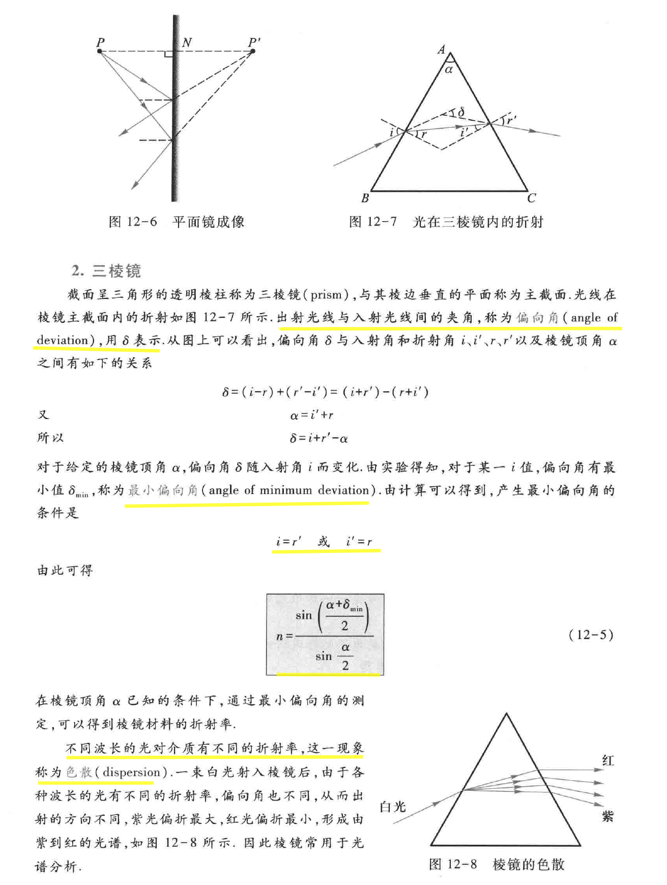

- 球面镜

!!! note "球面成像规律"

    !!! warning "为了方便几何作图，标注在图中的所有量都是正的，因此才需要正负号法则在计算时进行转换。"

    -   简单记忆：
        -   物距 $p$ 都是正的（仅在透镜、球面镜系统中存在虚物的情况）。
        -   像距：实像正，虚像负。
        -   曲率半径：凹面镜正，凸面镜负。
        -   焦距：实焦点正，虚焦点负。（同上，对反射镜来说，曲率半径和焦点在同侧）

    ??? note "正负号法则"
    
        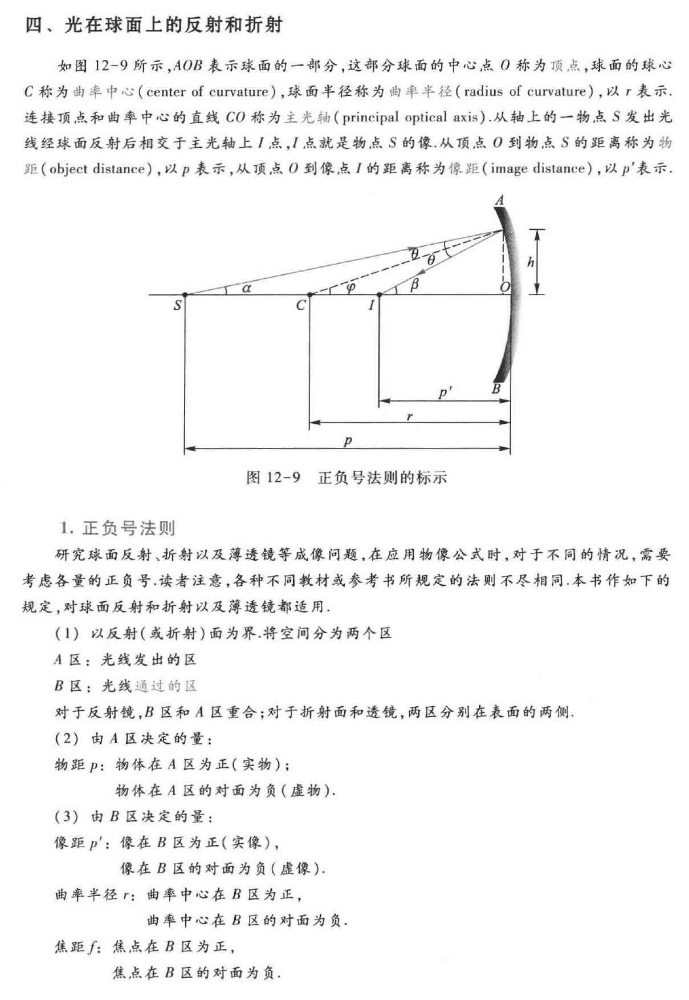
    
    ??? note "球面反射的物像公式"

        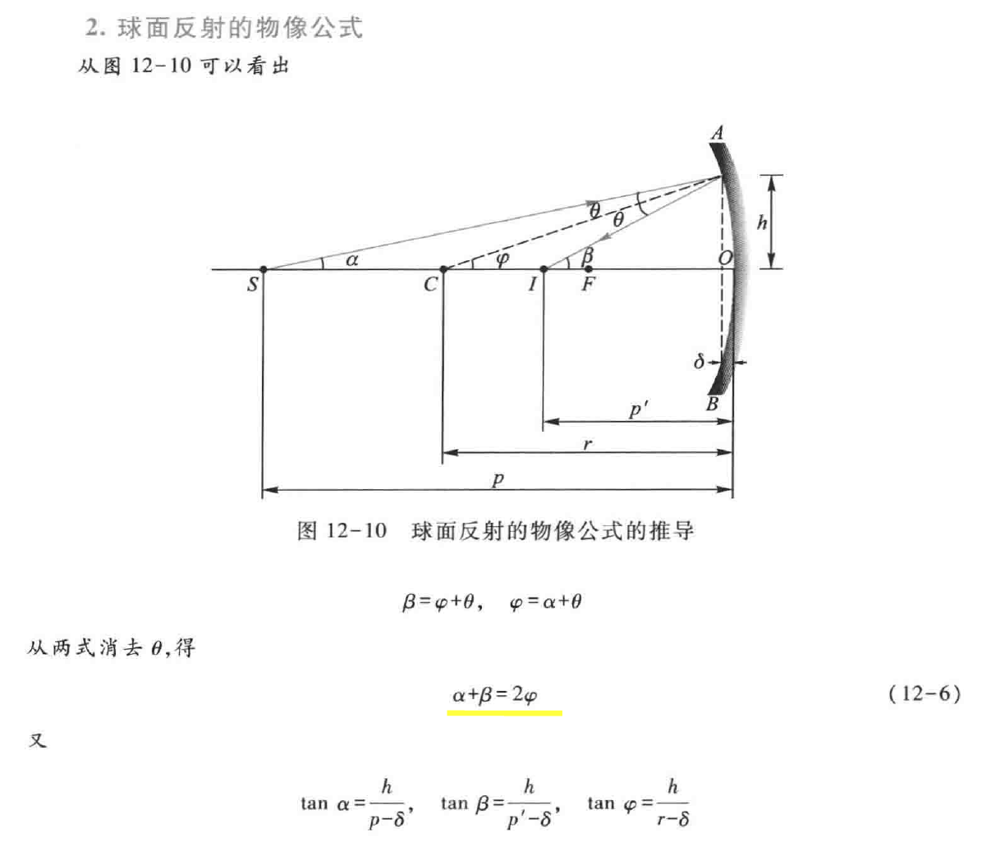

    -   核心：$\alpha+\beta=2\phi$
    -   傍轴条件：消去 $\delta$ 的影响
    -   反射物象公式、焦距定义（同样适用凸面镜，注意符号）
    
    $$
    \frac1{p}+\frac1{p'}=\frac1{f}=\frac2{r}
    $$

    $$
    m=-\frac{p'}{p}
    $$

    !!! warning "放大率的符号只是为了表达方向。不考虑方向时去掉该负号或全取绝对值即可。"

    

    !!! example "应用正负号法则将物象公式用于凸面镜"
    
        此时，焦距在 B 区对面，像也是虚像，因此物象公式中的 $p'$ 和 $f$ 都需要变号。此时，物象公式变为：

        $$
        \frac1{p}-\frac1{p'}=-\frac1{f}=\frac2{r}
        $$        

    ??? note "焦点、焦平面"

        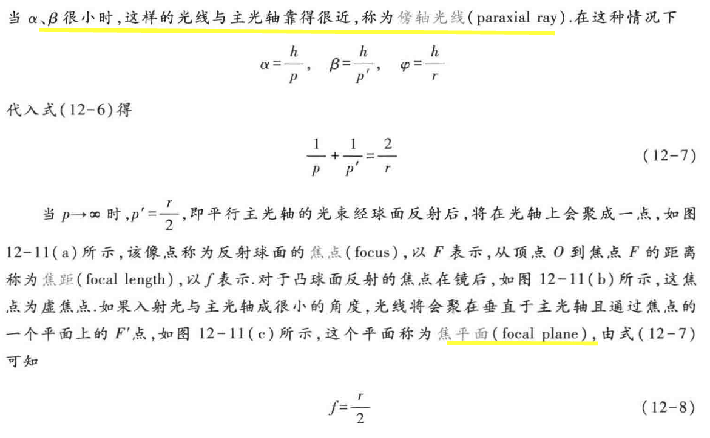
        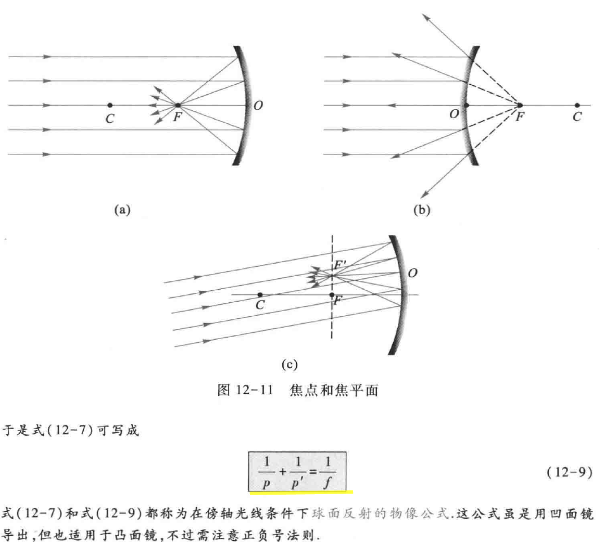

    ??? note "放大率"

        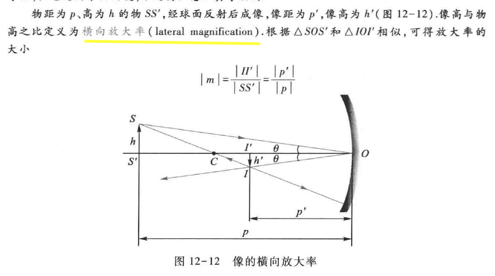
        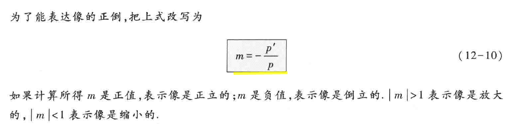

    -   作图法抓任意两条线：
        -   平行于主光轴：过焦点
        -   通过曲率中心：原路返回
        -   通过焦点：反射后平行

    ??? note "作图法：快速确定系统成像位置"
    
        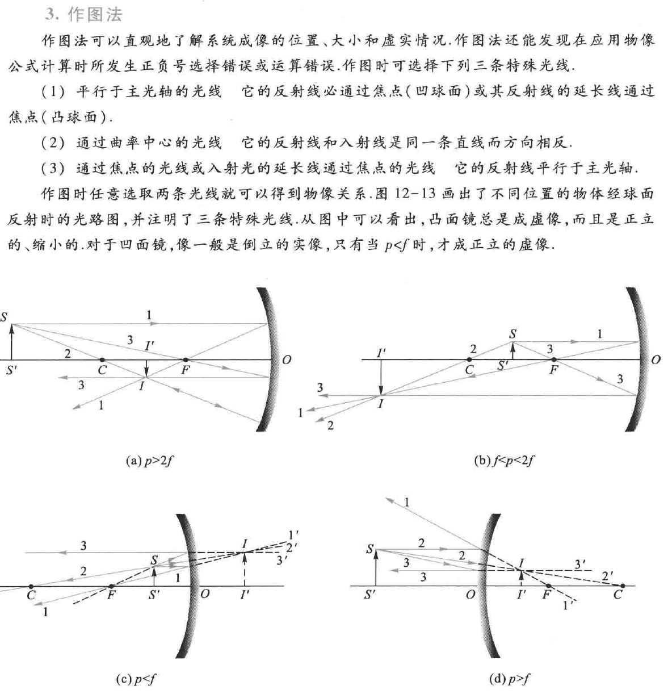
        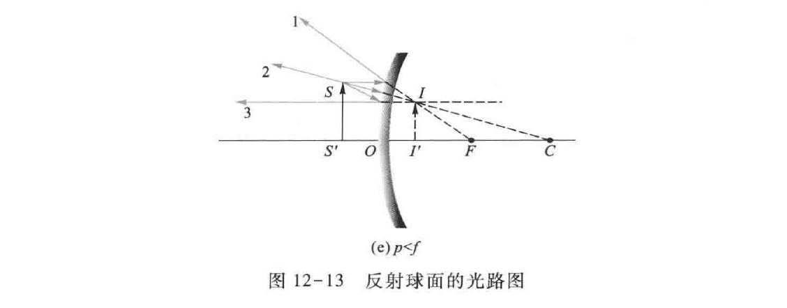
    
    -   折射的量较多，分析较为复杂。
    -   折射物象公式：

    $$
    \frac{n_1}{p}+\frac{n_2}{p'}=\frac{n_2-n_1}{r}
    $$

    $$
    m=\frac{n_1p'}{n_2p}
    $$

    -   平行于主轴入射：像方焦点、像方焦距 $f'=\frac{n_2}{n_2-n_1}r$
    -   从主轴上入射：物方焦点、物方焦距 $f=\frac{n_1}{n_2-n_1}r$

    $$
    \frac{f'}{f}=\frac{n_2}{n_1}
    $$

    ??? note "折射"

        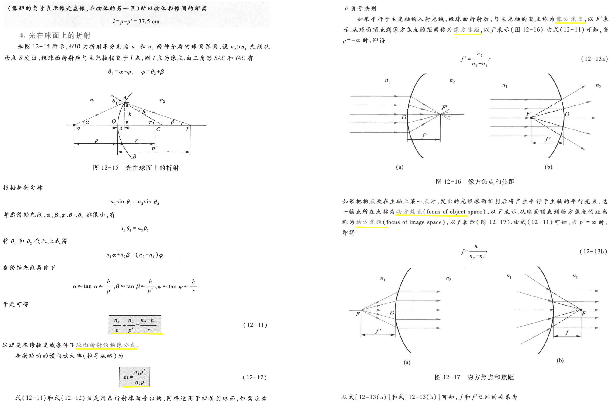

- 共轭球面系统：横向放大率等于各球面放大率乘积 $m=m_1m_2\dots$
- 薄透镜

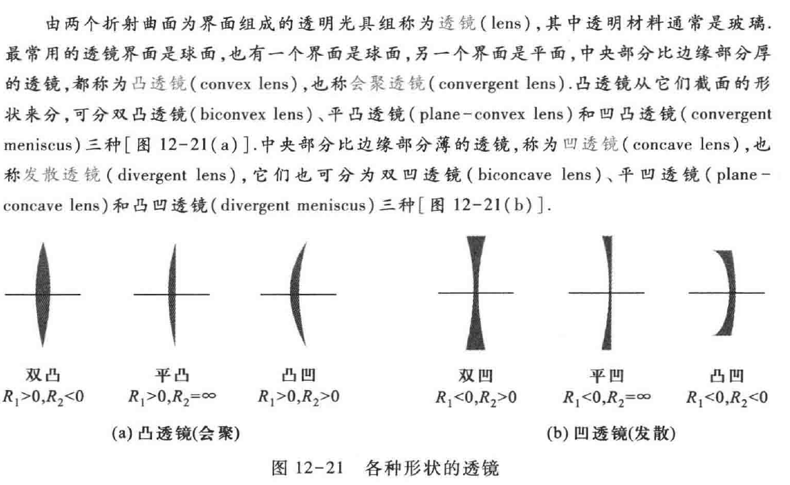

!!! note "薄透镜成像规律"

    -   空气中焦距（磨镜者公式）：

    $$
    f=f'=\frac1{(n-1)(\frac1{r_1}-\frac1{r_2})}
    $$

    -   物象公式同球面镜
    -   光焦度、屈光度

    ??? note "详解"

        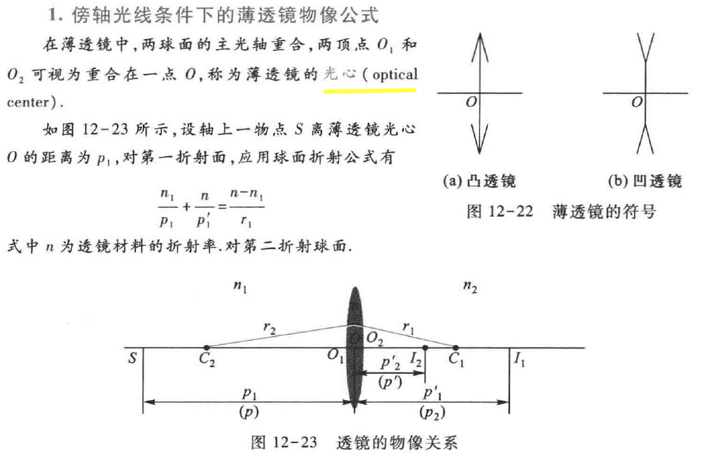
        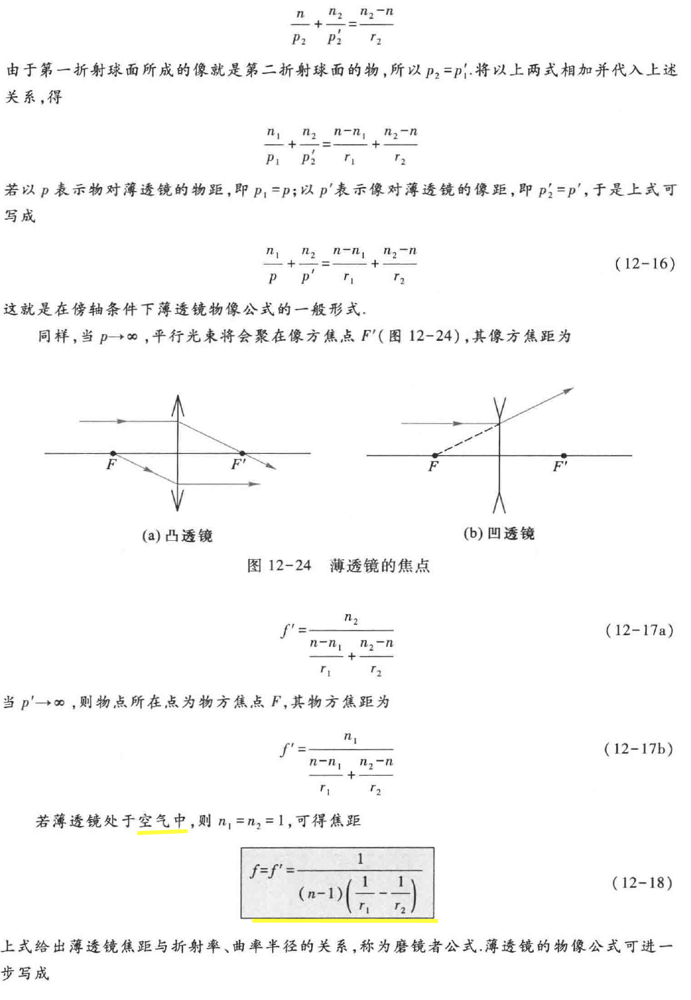
        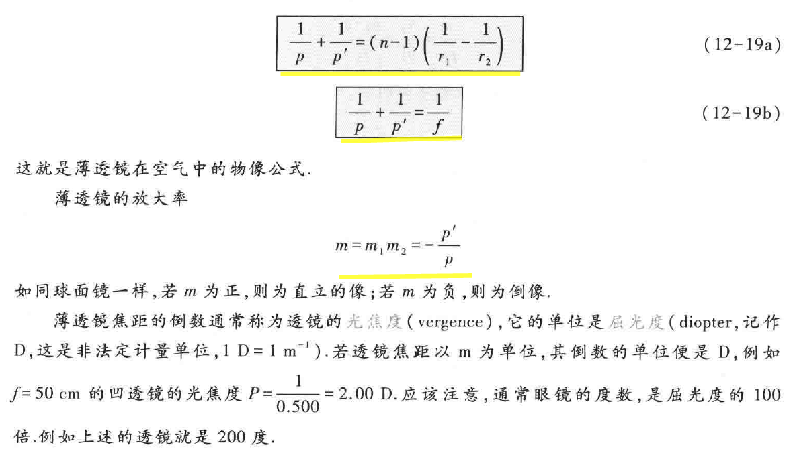
    
    ??? note "作图法"

        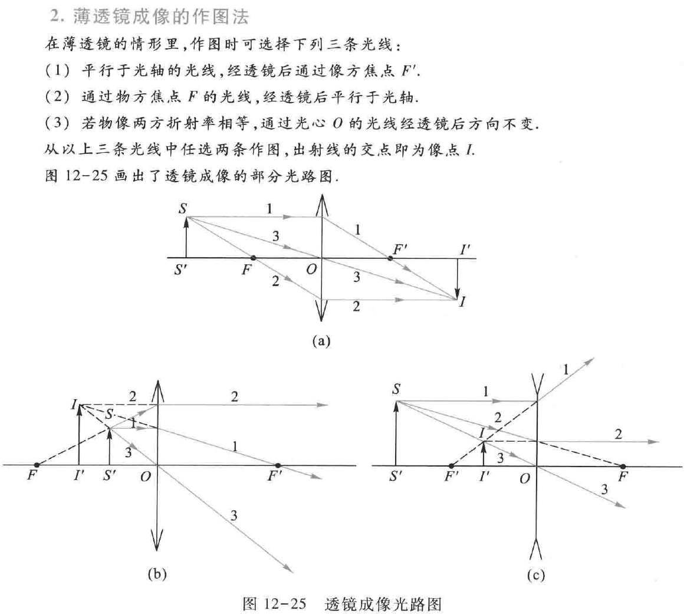

### 光学仪器

- 眼睛
- 放大镜
- 显微镜
- 望远镜

## 波动光学

### 生词表

| Eng | Chn |
| :-: | :-: |
| grating | 光栅 |
| spectral line | 谱线 |
| diffraction | 衍射 |
| polarization | 偏振 |
