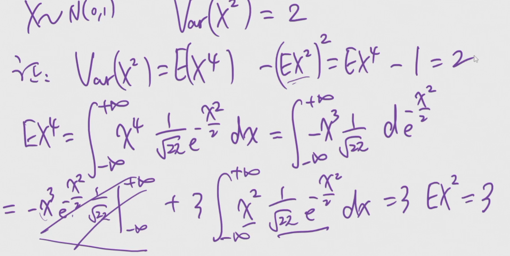

# 概率论与数理统计

概统就全都是公式，背就完事了。

## 第五章 大数定律与中心极限定理

!!! abstract "总结"

    前置知识：
    
    -   牢记样本与总体之间的关系：
        -   期望相同，方差为 $\frac1n$ 倍。
        -   因为用均值来估计，由性质：$Var(\bar{X})=\frac{1}{n^2}\sum^n_{i=1}Var(X_i)=\frac{Var(X)}{n}$。

    -   大数定律：随机变量序列的平均在一定条件下的稳定性
        -   伯努利大数定律
        -   辛钦大数定律
    -   中心极限定律：大量随机变量之和的分布在一定条件下可用正态分布逼近
        -   独立同分布情形

    两个重要不等式：

    -   马尔可夫不等式：$P{|Y|\geq \epsilon}\leq\frac{E(|Y|^k)}{\epsilon^k}$
        -   $k$ 阶原点矩存在
        -   切比雪夫不等式：在马尔可夫不等式中令 $k=2, Y=X-E(X)$，得到 $P(|X-E(X)|\geq\epsilon)\leq\frac{D(X)}{\epsilon^2}$
            -   只要已知数学期望、方差，就能对随机变量落入 $(E(X)-\epsilon, E(X)+\epsilon)$ 的概率给出一个上界
            -   例题：证明方差为 $0$ 时，$P{X=E(X)}=1$（即证 $P{|X-E(X)|\geq\epsilon}=0$）。

### 大数定律

如果随机变量 $X_1, X_2, \dots$：

- 独立
- 同均值 $\mu$
- 同分布或同方差

则当 $n\to\infty$ 时，他们的均值**依概率收敛**到共同的均值 $\mu$。

### 其他大数定律

- 伯努利：事件发生的频率收敛到概率。

### 中心极限定理

独立同分布，期望、方差均存在。

当 $n$ 很大时，$X_1+X_2+\dots+X_n$ 将近似服从正态分布 $N(n\mu, n\sigma^2)$。

记 $S_n=\sum^n_{i=1}X_i$，则 $P(S_n\leq x)\sim\Phi(\frac{x-n\mu}{\sqrt{n\sigma^2}})$。

!!! example "用二项分布试一试"

    我们知道二项分布的 $E(X)=np$，$D(X)=np(1-p)$。因此 $X\sim N(np, np(1-p))$。进而可以计算 $P(a<X<b)\sim\Phi(\frac{b-np}{\sqrt{np(1-p)}})-\Phi(\frac{a-np}{\sqrt{np(1-p)}})$。

!!! example "用正态分布的线性性质试一试"

    我们知道正态分布的线性性质是：$aX+b\sim N(a\mu+b, a^2\sigma^2)$。

    因此，$\frac{1}{n}S_n$（它们的均值）也是服从正态分布的，尝试用线性性质写出它的参数。

## 第六章 统计量与抽样分布

??? abstract "总结"

    ??? note "统计量"

        样本的函数，不包含未知参数。常用的：

        -   样本均值 $\bar{X}$
        -   样本方差（总体方差 $\sigma^2$ 的无偏估计） $S^2 = \frac{1}{n-1}\sum^n_{i=1}(X_i-\bar{X})^2$
        -   样本标准差 $S=\sqrt{S^2}$
        -   样本矩
            -   $k$ 阶样本原点矩 $A_k=\frac{1}{n}\sum^n_{i=1}X^k_i$
            -   $k$ 阶样本中心矩 $B_k=\frac{1}{n}\sum^n_{i=1}(X_i-\bar{X})^k$
                -   二阶中心距是样本方差的有偏估计

    ??? note "三个重要抽样分布"
    
        | 分布 | 性质 | 上 $\alpha$ 分位数 | 其他 |
        | :-: | :-: | :-: | :-: |
        | $\chi^2(n)=\sum_{i=1}^nX_i^2$ $X_i\sim N(0,1)$ | $E(\chi^2(n))=n$ $D(\chi^2(n))=2n$ 可加性 | $\chi^2_\alpha(n)$ | |
        | $t(n)=\frac{X}{\sqrt{Y/n}}$ $Y\sim\chi^2(n)$ | 当 $n$ 较大时近似于正态分布 |$t_\alpha(n)=-t_{1-\alpha}(n)$ |  |
        | $F(n_1, n_2)=\frac{X/n_1}{Y/n_2}$ $X\sim\chi^2(n_1)$ $Y\sim\chi^2(n_2)$ | $X\sim F(n_1, n_2)$ $\Rightarrow\frac{1}{X}\sim F(n_2, n_1)$ | $F_\alpha(n_1, n_2)=\frac{1}{F_{1-\alpha}(n_2, n_1)}$ | |

    ??? note "单个正态总体的抽样分布"

        -   定理一

        $$
        \bar{X}\sim N(\mu, \frac{\sigma^2}{n}) 
        $$

        $$
        \frac{(n-1)S^2}{\sigma^2}\sim\chi^2(n-1)
        $$

        $\bar{X}$ 与 $S^2$ 相互独立。
    
        -   定理二（直接从上面两个模仿 $t$ 分布形式构造）

        $$
        \frac{\bar{X}-\mu}{S/\sqrt{n}}\sim t(n-1)
        $$
    
    ??? note "两个正态总体的抽样分布"

        $$
        F=\frac{S_1^2/\sigma_1^2}{S_2^2/\sigma_2^2}\sim F(n_1-1, n_2-1)
        $$
        
        $$
        \frac{\bar{X}_1-\bar{X}_2-(\mu_1-\mu_2)}{\sqrt{\frac{\sigma_1^2}{n_1}+\frac{\sigma_2^2}{n_2}}}\sim N(0, 1)
        $$

        当 $\sigma_1^2=\sigma_2^2=\sigma^2$ 时，用 $S_w^2$ 估计样本方差：

        $$
        \frac{\bar{X}_1-\bar{X}_2-(\mu_1-\mu_2)}{S_w\sqrt{\frac{1}{n_1}+\frac{1}{n_2}}}\sim t(n_1+n_2-2)\\
        $$
        
        $$
        S_w^2=\frac{(n_1-1)S_1^2+(n_2-1)S_2^2}{n_1+n_2-2}
        $$

!!! example "练习"

    -   求 $E(S^2)$，说明为什么样本方差是总体方差的无偏估计。
    -   

- 总体的概念，总体被抽象为一个随机变量 $X\sim F(x)$。
- 简单样本：$X_1, X_2, \dots, X_n$，其实指的是独立同分布的一些随机变量，$X_i\sim F(x)$，与总体同分布。
- 样本值（观测值）用小写表示。我们将对这些样本值进行统计，得到**统计量**。

### 统计量

样本的不含任何未知参数的函数，**它们都是随机变量（随机变量的函数）**。

常用统计量：

- 样本均值 $\bar{X}=\frac{1}{n}\sum^n_{i=1}X_i$，即总体均值的无偏估计。
- 样本的二阶中心矩 $B_2=\frac{1}{n}\sum^n_{i=1}(X_i-\bar{X})^2$，即样本方差的无偏估计。
    - 因为样本的均值很多时候是不知道的，我们将均值替换为样本均值（它是无偏估计），得到样本的二阶中心矩。
- 样本方差 $S^2=\frac{1}{n-1}\sum^n_{i=1}(X_i-\bar{X})^2$，即样本方差的有偏估计。
- 样本标准差 $S=\sqrt{S^2}$。
- 样本矩：
    - $k$ 阶样本原点矩 $A_k=\frac{1}{n}\sum^n_{i=1}X^k_i$。
    - $k$ 阶样本中心矩 $B_k=\frac{1}{n}\sum^n_{i=1}(X_i-\bar{X})^k$。

根据**大数定律**，只要样本足够大，样本均值就会收敛到总体均值。

!!! warning "样本均值的均值是随机变量还是数？"

    是数。事实上，样本均值的期望就是总体的均值（请尝试用独立同分布的性质说明这一点，并尝试说明方差的值）。
    
    因为样本均值是随机变量，随机变量的均值是它的数字特征（期望），是数。

#### 总体方差的估计

样本方差是总体方差的无偏估计，样本的二阶中心矩是总体方差的有偏估计。这也就是说：

$$
E(S^2)=\sigma^2, E(B_2)\neq\sigma^2
$$

### 抽样分布

#### 卡方分布 $\chi^2(n)$

$n$ 个独立同分布的标准正态随机变量的平方和的分布。$n$ 是自由度。

密度函数啥的不用记，需要记性质：

- $E(\chi^2(n))=n, D(\chi^2(n))=2n$。
    - 期望：可加性，平方的期望用方差和期望得到。
    - 方差：独立$\rightarrow$方差可加，平方的方差请证明：$D(X^2)=E(X^4)-E^2(X^2)=2$。

??? note "证明"

    

- 可加性：$Y_1\sim\chi^2(n_1), Y_2\sim\chi^2(n_2)$，相互独立，则 $Y_1+Y_2\sim\chi^2(n_1+n_2)$。

#### $t$ 分布 $t(n)$

设 $X\sim N(0, 1), Y\sim\chi^2(n)$，且 $X, Y$ 相互独立，则 $t=\frac{X}{\sqrt{Y/n}}\sim t(n)$。

$T$ 与 $-T$ 的分布相同，容易想象它的概率密度函数是偶函数。

当 $n$ 很大时，它的概率密度函数逐渐向 $\phi$ 靠拢，即趋向正态分布。从 $t$ 分布的结构中可以看出这一点：当 $n$ 很大时，下方的 $\chi^2$ 分布的均值将趋向于 $1$，此时 $t$ 分布近似于标准正态分布。

!!! question "尝试用大数定律说明上面的结论"

#### $F$ 分布 $F(n_1, n_2)$

设 $X\sim\chi^2(n_1), Y\sim\chi^2(n_2)$，且 $X, Y$ 相互独立，则 $F=\frac{X/n_1}{Y/n_2}\sim F(n_1, n_2)$。

它始终大于 $0$（因为卡方分布大于 $0$）。

若 $X\sim F(n_1, n_2)$，则 $\frac{1}{X}\sim F(n_2, n_1)$。

#### 上 $\alpha$ 分位数

$0<\alpha<1$，有 $P(X\leq x_\alpha)=\alpha$，则称 $x_\alpha$ 为 $X$ 的上 $\alpha$ 分位数。

从图像上看，概率密度函数的上 $\alpha$ 分位数右侧的面积为 $\alpha$。

$\chi^2$ 分布的上 $\alpha$ 分位数记为 $\chi^2_\alpha(n)$。

$t$ 分布记为 $t_\alpha(n)$，性质为：$t_\alpha(n)=-t_{1-\alpha}(n)$。

$F$ 分布记为 $F_\alpha(n_1, n_2)$，性质为：$F_\alpha(n_1, n_2)=\frac{1}{F_{1-\alpha}(n_2, n_1)}$。

#### 单个正态总体的抽样分布

## 第七章 参数估计

### 点估计

- 构造一个适当的统计量 $\hat{\theta}=\hat{\theta}(X_1, X_2, \dots, X_n)$，用来估计未知参数 $\theta$。
- 区分一下估计量和估计值的概念。

点估计两种常用方法：矩法、极大似然法

- 矩法：
    - 原理：样本矩可以作为总体矩的估计（大数定律）
    - 方法：
        - 求总体的 $k$ 阶矩 $A_k$，表达为未知参数的函数。
        - 用方程组求解出**未知参数**关于**总体矩**的表达式。
        - 用样本句直接代替总体矩，即为未知参数的矩估计量。

## 第八章 假设检验

### 基础概念

两类：检验参数、检验分布。

一般过程：提出假设-抽取样本-作出判断。

两个假设：原假设、备择假设。

三类参数假设检验：左边检验、右边检验、双边检验。

统计量 T 和原假设是否成立有密切关系，能作为检验统计量。拒绝原假设时的取值范围称为拒绝域。

第一类错误：弃真；第二类错误：取伪。计算这两类错误的概率（条件概率），
