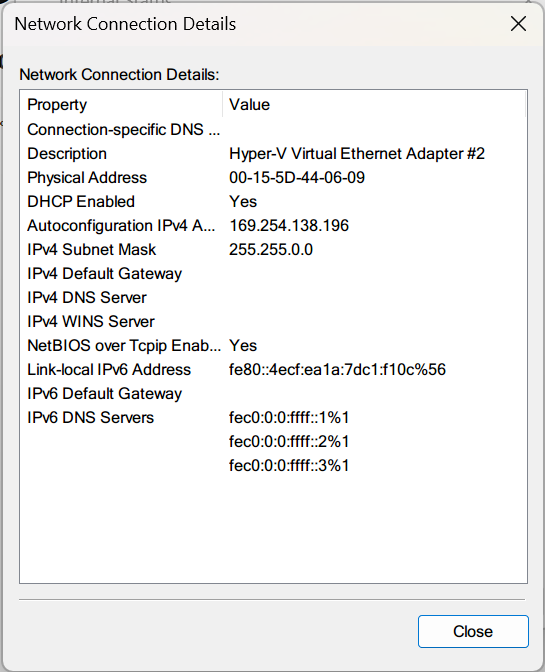
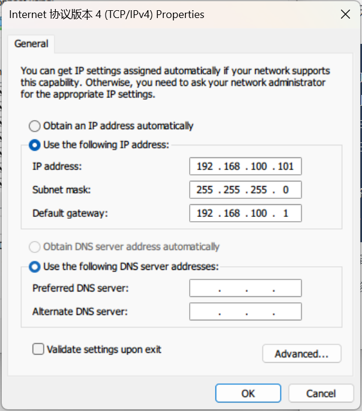
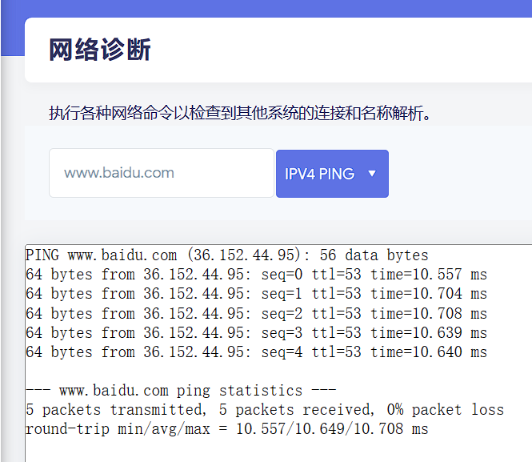

# OpenWRT 使用杂记

使用 Hyper-V 在 Windows 上搭建 OpenWRT 软路由系统

## 准备 OpenWRT 镜像

网络上有众多 OpenWRT 镜像可供选择。我在配置过程中尝试了 OpenWRT 原版镜像和 iStoreOS，均可配置成功。这里以 iStoreOS 为例，它的配置界面和原版 OpenWRT 差不多。

- 从官网下载得到镜像 `istoreos-22.03.4-2023070715-x86-64-squashfs-combined-efi.img`。
- 使用 StarWind V2V Converter 将镜像转换为 `.vhdx` 格式供 Hyper-V 使用。
    - 源镜像位置和目标镜像位置均选择 **Local File**（本地文件）。
    - 目标镜像格式选择 **VHD/VHDX**。
    - 镜像格式选项选择 **VHDX growable image**。
    - 完成转换。
- 将得到的 `.vhdx` 文件拷贝到你要存放虚拟机的地方。拷贝是为了方便你配置失败时用源镜像覆盖来重新开始。

## 配置虚拟网络设备

在 Hyper-V Manager 中，点击 Virtual Switch Manager。创建下列虚拟交换机：

- 一个 Internal Network（内部网络），用于 OpenWRT 系统与主机通信，命名为 `Internal`。
- 一个 External Network：OpenWRT 的 WAN 口，选择你接入 WAN 的网络接口，并取消勾选“允许管理操作系统共享此网络适配器”。执行完此操作你的系统将失去网络连接。命名为 `WAN`。
- 为你需要用作 LAN 口的其他网络接口逐一创建 External Network，同样取消勾选“允许管理操作系统共享此网络适配器”。命名为 `LAN1`、`LAN2` 等。

经过这些操作，你分配的网络接口将全由 OpenWRT 系统控制。

在控制面版 - 网络适配器页中检查，你应当看到新增了一个 `Hyper-V Virtual Ethernet Adapter`，这就是 `Internal` 对应的虚拟网络设备，可以将其重命名为 OpenWRT。

## 创建 Hyper-V 虚拟机

在 Hyper-V Manager 中创建虚拟机：

- 选择第二代虚拟机（适用于 `efi` 的 OpenWRT 镜像）。
- 网络连接配置：选择连接到 `Internal`。
- 连接到硬盘：选择刚刚拷贝的虚拟机镜像。

虚拟机创建完成。接下来进行一些设置再启动虚拟机：

- 安全 - 取消勾选“启用安全启动”。
- 检查点 - 取消勾选“启用检查点”。
- 自动启动 - 按需勾选自动启动。

完成设置后，点击应用并启动虚拟机。

## 登录虚拟机

打开浏览器，访问 `192.168.100.1`。默认 `root` 用户密码为 `password`，进入管理页面后，迅速修改账户密码。

??? failure "无法访问虚拟机"

    可能的一个原因是操作系统未能识别到 OpenWRT 的 DHCP 服务，无法得到正确的 IP 地址。在控制面板中查看虚拟网络设备，其状态往往显示为未识别，IP 地址为 `16` 开头的地址。这类地址是 Windows 系统在 DHCP 请求未得到响应时，为自己自动分配的 IP 地址。
    
    

​
    手动将 IP 地址更改到 `192.168.100.0/24` 网段，网关设置为 `192.168.100.1` 即可。

    

## 配置 WAN 连接

在网络 - 接口页面中，我们看到目前已有的接口 `lan`。

关闭 OpenWRT，在设置中添加网络设备 `WAN`，再次开启 OpenWRT 系统，进入管理页面。

在网络 - 接口页面，添加新接口，命名为 `wan`，协议选择 DHCP 客户端（此时 `wan` 的上游应当有 DHCP 服务器），设备指定为 `eth1`。

如果你所在的网络支持 IPv6，那么再添加一个 `wan6` 接口，协议选择 DHCPv6，设备同样指定为 `eth1`。

保存并应用更改。

在 ZJU，校内网站解析将得到 `10.0.0.0/8` 开头的 IP 地址，这会被丢弃，因此出现无法 ping 通校内网站的情况。在*网络 - DHCP/DNS - 常规设置*页面取消勾选“重绑定保护”后即可 ping 通。如果需要通过 IPv6 访问网站，在*网络 - DHCP/DNS - 高级设置*页面取消勾选*过滤 IPv6 AAAA 记录*即可。

此时在宿主操作系统也应该能访问本地网络中的内容。

## 使用 L2TP 登录校园网

OpenWRT 并没有自带 `xl2tp` 软件包。不过此时可以访问校内镜像，我们对 `opkg` 包管理器换源即可下载软件包。

在*系统 - 软件包*页面点击*配置 OPKG*，在 `/etc/opkg/distfeeds.conf` 中更换网址，将 `/etc/opkg/compatfeeds.conf` 中 iStoreOS 的软件源注释掉（因为此时还不能访问外网）。完成后点击*更新列表*。

在筛选器中输入 `xl2tp` 找到软件包，点击安装。安装完成后在*系统-重启*页面重启 OpenWRT 系统。

重启完成后，在*网络 - 接口*点击*添加新接口*，选择协议为 *L2TP*，创建接口。L2TP 服务器为 `lns.zju.edu.cn`，填写用户名密码。切换到*防火墙设置*选项页，将其分配到 `wan` 区域，保存并应用即可。

如果连接成功，就能在该接口看到分配的 IP 地址。尝试 `ping` 百度等网站应能成功连接。

