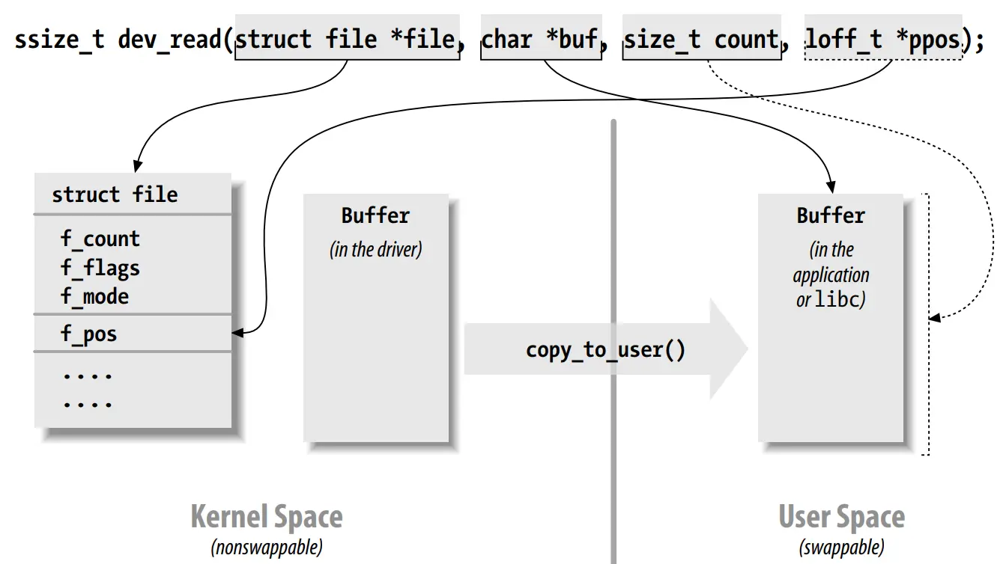
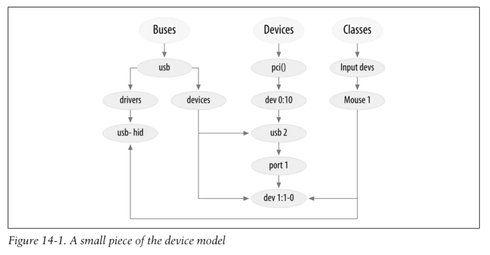

---
tags:
  - 读书笔记
---

# 📖 Linux Device Drivers (3rd)

!!! abstract

    - **英文版：**[Linux Device Drivers, 3rd Edition](https://www.oreilly.com/library/view/linux-device-drivers/0596005903/)
    - **中文版：**[Linux 设备驱动程序](https://book.douban.com/subject/1723151/)

    截止到 2025 年，这本书依然是 Linux 驱动开发的最佳入门书籍。和众多经典 Linux 书籍一样，大家对它们的评价是：内核源码处于不断的更新之中，书籍都只能作为起点。学习的最佳方式是从书籍了解相关概念，然后读内核源码和相关文档。

    > The LDD book is a reasonable starting point, but as you say it's quite dated in some areas. Kernel APIs tend to change fairly quickly by book standards, which makes it a bit of a tall order.
    >
    > Generally the best resources tend to be in-tree documentation (where it exists), which stands a higher chance of being up to date, and existing drivers that are doing something similar.

这本书基于 Linux 2.6。

!!! info "一些相关的资源"

    - 源码可以从 [examples / Linux Device Drivers 3rd Edition · GitLab](https://resources.oreilly.com/examples/9780596005900.git) 下载。但因其基于 Linux 2.6，基本上跑不起来。
    - [martinezjavier/ldd3: Linux Device Drivers 3 examples updated to work in recent kernels](https://github.com/martinezjavier/ldd3) 是目前持续在更新的版本，并且提供了比较好的指导，推荐使用。它基于 5.10。
    - [d0u9/Linux-Device-Driver: Advanced examples of Linux Device Drivers (LDD3) ](https://github.com/d0u9/Linux-Device-Driver)，基于 5.10，使用 QEMU 进行实验。

本篇笔记使用 `martinezjavier/ldd3` 进行实验。

## 第一章：设备驱动介绍

三类设备：

- 字符设备：提供字节流
    - 一般实现 `open`、`close`、`read`、`write`
    - 例子：`/dev/console`
- 块设备
- 网络接口

杂项：

- 概述了 Linux 系统的整体架构
- 提及了安全问题：
    - 驱动编写者应当将尽可能将安全策略移交给更高层次，而不是在驱动中实现。如果对设备的操作可能影响整个系统的安全，就需要做好访问控制，比如只有特权用户才能加载的内核模块。加载模块时，系统调用 `init_module` 会检查对应进程是否有加载模块的权限。
    - 此外要防范缓冲区溢出等 C 语言容易产生的问题。
    - 在验证之前，不能信任任何从用户空间传来的东西，并且要设计为不论用户给到什么信息都不至于使系统崩溃。从内核拿到的内存一定要初始化，检查内存泄露等。
- Linux 可以完全关闭模块功能，此时驱动必须编译进内核。

## 第二章：构建和运行模块

### 配置测试系统

首先需要拉取内核源码树并构建，下面记录我的操作过程：

!!! info "构建内核过程"

    ```shell
    git clone https://
    cd linux
    yes "" | make oldconfig
    make -j
    ```

    在 Debian 系发行版上，依照 [Chapter 4. Common kernel-related tasks](https://www.debian.org/doc/manuals/debian-kernel-handbook/ch-common-tasks.html) 操作更加可靠：

    ```shell
    apt-get install linux-source build-essential fakeroot devscripts rsync git linux-headers-amd64
    apt-get build-dep linux
    tar xaf /usr/src/linux-source-*.tar.xz
    cd linux-source-*
    ```

    在 RedHat 系发行版上，参考 [Building a Custom Kernel :: Fedora Docs](https://docs.fedoraproject.org/en-US/quick-docs/kernel-build-custom/)：

    ```shell
    dnf builddep kernel
    dnf download --source kernel
    rpm2cpio kernel*.rpm | cpio -idmv
    cd linux-source-*
    ```

    如果只需要特定的内核模块，参考 [Building External Modules¶](https://docs.kernel.org/kbuild/modules.html)

    ```shell
    cd drivers/net/bonding
    make -C /lib/modules/`uname -r`/build M=$PWD
    make -C /lib/modules/`uname -r`/build M=$PWD modules_install
    ```

    此时模块会被安装到 `/lib/modules/$(uname -r)/update/*.ko`。直接用其覆盖目标模块即可。

### 样例模块

略

### 内核模块与应用的对比

- 内核模块只与内核链接，因此只能使用内核导出的函数，不能使用标准库函数。
- 内核模块运行在内核空间，内存映射和地址空间也与普通应用不一样。
- 当应用执行系统调用或被硬件中断时，进入内核空间。系统调用运行在进程的上下文中，可以访问进程的地址空间。硬件中断是异步的，与特定进程无关。
- 需要考虑并发场景。并发的来源有：多进程使用驱动、硬件操作过程中发生中断、内核计时器、驱动在多个 CPU 上执行、抢占等。内核与内核模块都需要做到 reentrant，即可以同时运行在多个上下文中。
- `current` 指针指向当前进程的 `task_struct` 结构体。
- 内核的栈非常小，可以小到一个 4K 页。我们写的函数与内核空间的调用链一起使用这个栈。因此，不应当使用大型局部变量，应当动态分配。

### 编译和加载

内核模块的编译使用内核构建系统 `kbuild`。在内核模块的目录下放置这样的 Makefile：

```makefile
ifneq ($(KERNELRELEASE),)
    obj-m := hello.o

# Otherwise we were called directly from the command line; invoke the kernel build system.

else

    KERNELDIR ?= /lib/modules/$(shell uname -r)/build
    PWD := $(shell pwd)

default:
    $(MAKE) -C $(KERNELDIR) M=$(PWD) modules

endif
```

通过下面的命令编译：

```shell
KERNELDIR=/path/to/kernel make
```

其中的原理涉及 GNU Make 扩展语法，暂略。大致过程是让 `make` 调用内核的 `Makefile`，使用内核构建系统的 `module` 目标来构建内核模块。编译完成的模块文件是 `hello.ko`。

!!! todo

    `martinezjavier/ldd3` 可以使用当前运行的 6.1 内核源码编译，却不能使用下载的 5.10 内核源码编译。看报错是缺了函数定义。不知道是 Debian Patch 还是内核 API 变动导致的。

    ```text
    jit.c:96:47: error: implicit declaration of function ‘pde_data’ [-Werror=implicit-function-declaration]
    96 |         return single_open(file, jit_fn_show, pde_data(inode));
    ```

几个实用工具：

```text
insmod modprobe rmmod lsmod
```

- 加载内核模块时可以指定参数。
- `insmod` 通过 `sys_init_module` 系统调用加载模块，这会为模块分配一块内存区域，将模块的代码和数据复制到这个区域，然后进行解析模块的符号表等操作。
- 使用 `modprobe` 时，会检查模块中是否有内核符号表中的符号，如果没有，会自动加载依赖的模块。
- 如果内核检测到模块导出的设备等正在使用，会拒绝卸载模块。

内核版本依赖：

- 内核模块与特定内核版本紧密相关。构建内核模块时与 `vermagic.o` 链接，该文件中包含内核版本、处理器架构等信息，加载时会以此检查兼容性。
- 编写跨内核版本的模块时，与版本有关的接口，通常应当放置在一个头文件中用一层宏包装。

### 内核符号表

- 加载模块后，`EXPORT_SYMBOL()` 的符号进入内核符号表，其他模块可以使用。
- `EXPORT_SYMBOL_GPL()` 只允许 GPL 许可证的模块使用。

### 准备工作

- 使用 `MODULE_LICENSE()` 定义模块的许可证。如果未定义，内核会认为是专有的。加载这样的模块时，会有 `taint` 警告。

### 初始化和关闭

```c
static int __init init_func(void)
{
    return 0;
}
module_init(init_func);
module_exit(exit_func);
```

初始化函数向系统注册一些设备。注册可能失败，因此需要检查返回值。失败时，可能继续执行但提供有限的功能，也可能直接退出，此时要注意清理已经注册的资源，这些编程经常使用 `goto` 语句。

函数声明中的 `__init` 和 `__exit` 具有特定功能和作用，使用时需要注意。比如 `__init` 在模块加载后会被丢弃，`__exit` 会放在特殊的段中，只能在模块卸载时调用请，其他情况下产生错误。

需要考虑模块加载时的竞争条件，可能初始化函数尚未执行完毕，就会有对模块的访问。因此模块内部的初始化应当在注册设备之前完成。

### 模块参数

模块参数可以在命令行中指定，如：

```shell
insmod hello.ko howmany=3 whom="Mom"
```

也可以在 `/etc/modules.conf` 中配置。

模块参数不支持浮点数。

在模块中声明参数：

```c
static int howmany = 1;
module_param(name, type, perm);
module_param_array(name, type, num, perm);
```

所有模块参数都应该有默认值。`perm` 控制 `sysfs` 中参数的权限。

### 在用户空间内操作

`libusb` 就是一个实现在用户空间的 USB 驱动。实现在用户空间有一些好处，比如可以使用标准库、调试过程更简单等。但这也有很多限制，比如网络接口、块设备都无法在用户空间实现，DMA 受限，速度较慢等。

## 第三章：字符设备

本章讲解 Simple Character Utility for Loading Localities (scull) 设备的实现。它操作一块内存，表现为一个字符设备。

### scull 的设计

它将提供下列设备：

```text
scull0-3
scullpipe0-3
scullsingle
scullpriv
sculluid
scullwuid
```

### 主要和次要设备号

在 `/dev` 中使用 `ls -l` 会发现原先显示文件大小的地方被设备号占据。一般来说，主设备号标识管理该设备的驱动（现在 Linux 允许多个驱动共享一个主设备号），次设备号标识设备的实例。

常用固定设备号见内核文档 `devices.txt`。可以在 `/proc/devices` 中查看当前系统中注册的设备。

设备号存储在 `dev_t` 类型中，使用宏操作它：

```c
MAJOR(dev_t dev);
MINOR(dev_t dev);
MKDEV(int major, int minor);
```

设备号相关函数：

```c title="linux/fs.h"
//int register_chrdev_region(dev_t first, unsigned int count, const char *name);
int alloc_chrdev_region(dev_t *dev, unsigned int firstminor, unsigned int count, const char *name);
void unregister_chrdev_region(dev_t first, unsigned int count);
```

拿到设备号后，还需要将设备号与驱动内部实现硬件操作的函数关联起来。

### 一些重要的数据结构

- `file_operations`
    - 定义于 `linux/fs.h`，包含了设备驱动的操作函数指针。每个打开的文件 `file` 都含有 `f_op` 指向文件操作相关的系统调用，实现 `open`、`read` 等操作。
    - `struct module *owner` 指向持有这个结构的模块，避免模块在使用时被卸载。

    ```c
    loff_t (*llseek) (struct file *, loff_t, int)
    ssize_t (*read) (struct file *, char __user *, size_t, loff_t *)
    ssize_t (*write) (struct file *, const char __user *, size_t, loff_t *)
    int (*open) (struct inode *, struct file *)
    int (*ioctl) (struct inode *, struct file *, unsigned int, unsigned long)
    ...
    ```

- `file`
    - 定义于 `linux/fs.h`，与标准库中的 `FILE` 不同，表示打开的文件的描述符。`open` 时创建，传给每个用到的函数，最后 `close` 时释放。

    ```c
    mode_t f_mode;
    loff_t f_pos;
    struct file_operations *f_op;
    ...
    ```

- `inode`
    - 一个文件可以有多个 `file` 描述符，但都指向同一个 `inode`。

    ```c
    dev_t i_rdev;
    struct cdev *i_cdev;
    ```

### 注册字符设备

先初始化，再注册：

```c
struct cdev *my_cdev = cdev_alloc();
my_cdev->ops = &my_fops;
void cdev_init(struct cdev *cdev, const struct file_operations *fops);
my_cdev->owner = THIS_MODULE;

int cdev_add(struct cdev *dev, dev_t num, unsigned int count);
void cdev_del(struct cdev *dev);
```

### 打开和释放

`open` 的工作：

- 检查设备相关错误。
- 如果第一次打开，初始化设备。
- 必要时更新 `f_op`。
- 分配并填充 `filp->private_data` 中的结构。

`release` 的工作：

- 释放 `open` 分配的内存。
- 再最后一个文件描述符关闭时，关闭设备。
- 不是每个 `close` 调用都会导致 `release` 调用，内核做了引用计数，因此 `dup` 和 `fork` 能安全使用文件。
- 但每次 `close` 时总会调用 `flush`。

杂项：

- `container_of(pointer, container_type, container_field)` 宏，定义于 `linux/kernel.h`，用于从结构体的成员指针获取结构体指针。

### scull 的内存使用

```c title="linux/slab.h"
void *kmalloc(size_t size, gfp_t flags);
void kfree(const void *ptr);
```

### 读和写

```c
ssize_t (*read) (struct file *filp, char __user *buf, size_t count, loff_t *offp);
ssize_t (*write) (struct file *filp, const char __user *buf, size_t count, loff_t *offp);
```

注意缓冲区是用户空间地址，无法被内核程序直接访问。有几个原因：

- 根据体系结构的不同，用户空间的地址可能在内核空间中无效。
- 即使是同一个地址，用户空间内存是分页的，可能不在 RAM 中，会让内核产生段错误。
- 安全问题。

```c title="asm/uaccess.h"
unsigned long copy_to_user(void __user *to, const void *from, unsigned long n);
unsigned long copy_from_user(void *to, const void __user *from, unsigned long n);
```

拷贝时进程可能被 sleep（等待页从磁盘加载到内存），因此需要考虑并发和 reentrant。



`read` 函数的返回值：

- 与要求的字节数相同，表示成功。
- 小于要求的字节数，有多种原因。一般情况下，用户程序会再次尝试，直到传输完成。
- 0，表示到达文件尾。
- 负数，表示错误。

此外还有当前没有数据，但马上会有数据的情况，在后文讨论阻塞时详细说明。

`write` 函数返回值和 `read` 一致。

它们有向量版本：

```c
ssize_t (*readv) (struct file *filp, const struct iovec *iov, unsigned long count, loff_t *pos);
ssize_t (*writev) (struct file *filp, const struct iovec *iov, unsigned long count, loff_t *pos);
struct iovec {
    void __user *iov_base;
    __kernel_size_t iov_len;
};
```

### 使用新设备

可以用它吃满内存：

```shell
cp /dev/zero /dev/scull0
```

使用 `strace` 可以查看驱动中的系统调用。

## 第四章：调试技术

### 内核调试支持

自行编译内核，启用一般发行版自带内核没有启用的调试选项。

```text
CONFIG_DEBUG_KERNEL
CONFIG_DEBUG_SLAB
CONFIG_DEBUG_PAGEALLOC
CONFIG_DEBUG_SPINLOCK
CONFIG_DEBUG_SPINLOCK_SLEEP
...
```

### 通过打印调试

本节描述了内核日志系统，如何控制输出级别、控制台输出等。

介绍了通过宏包装的便捷调试函数：

```c
#undef PDEBUG /* undef it, just in case */
#ifdef SCULL_DEBUG
# ifdef __KERNEL__
/* This one if debugging is on, and kernel space */
# define PDEBUG(fmt, args...) printk( KERN_DEBUG "scull: " fmt, ## args)
# else
/* This one for user space */
# define PDEBUG(fmt, args...) fprintf(stderr, fmt, ## args)
# endif
#else
# define PDEBUG(fmt, args...) /* not debugging: nothing */
#endif
#undef PDEBUGG
#define PDEBUGG(fmt, args...) /* nothing: it's a placeholder */
```

```makefile title="Makefile"
# Comment/uncomment the following line to disable/enable debugging
DEBUG = y

# Add your debugging flag (or not) to CFLAGS
ifeq ($(DEBUG),y)
  DEBFLAGS = -O -g -DSCULL_DEBUG # "-O" is needed to expand inlines
else
  DEBFLAGS = -O2
endif

CFLAGS += $(DEBFLAGS)
```

对于驱动还有一些函数：

```c
int print_dev_t(char *buffer, dev_t dev);
char *format_dev_t(char *buffer, dev_t dev);
```

### 通过查询调试

`/proc` 文件系统中的每个文件都对应一个内核函数，产生该文件的内容。

```c title="linux/proc_fs.h"
int (*read_proc)(char *page, char **start, off_t offset, int count, int *eof, void *data);
struct proc_dir_entry *create_proc_read_entry(const char *name,
    mode_t mode, struct proc_dir_entry *base,
    read_proc_t *read_proc, void *data);
```

本节还介绍了 `seq_file` 接口。

### 通过观测调试

本节介绍使用 `strace` 观察从用户空间发出的系统调用。

### 调试系统错误

驱动发生错误时，可能导致使用该驱动的应用程序崩溃。此时动态分配到该上下文的数据可能丢失。程序崩溃时，内核会使用 `close` 关闭打开的文件，驱动程序可以收回 `open` 时分配的资源。

发生错误时，oops 消息打印处理器当前状态，如寄存器、EIP 等。本节用解引用 NULL 指针和缓冲区溢出两个例子演示了如何阅读 oops 消息。

还介绍了应对死机的方法。

### 调试器和相关工具

介绍了使用 GDB、kdb 和其他各类工具调试内核的方法。由于没有自行编译内核，故略去。

有趣的是本节提及了内核为什么不提供调试器：

> The answer, quite simply, is that Linus does not
> believe in interactive debuggers. He fears that they lead to poor fixes, those which
> patch up symptoms rather than addressing the real cause of problems. Thus, no
> built-in debuggers.

## 第五章：并发和竞争条件

### 并发及其管理

硬件和很多软件资源都需要共享，一般使用锁机制来控制线程对共享资源的访问。

### 旗语（Semaphore）和锁（Mutex）

旗语由一个整数值和 P、V 操作组成。当进程进入关键区时使用 P 操作将值减一，离开时使用 V 操作将值加一。当值为 0 时，进程会被阻塞。

将旗语整数值设置为 1 即可实现互斥锁，有时称为 mutex（即 mutual exclusion）。

在 Linux 中，V 对应 `up`，P 对应 `down`。源码目前位于 [linux/include/semaphore.h](https://github.com/torvalds/linux/blob/master/include/linux/semaphore.h)。

此外，内核还提供

- `rwsem` 读写锁，允许多个进程同时读，但只允许一个进程写。读写锁可能造成饥饿。
- `completion` 等待操作/子进程完成。
- `spinlock` 可以用在不可 sleep 的任务（如中断处理）中。需要获得锁的程序会不断轮训，因此称为自旋。这种情况容易造成死锁：持有锁的线程休眠，而需要锁的线程占用 CPU。因此，持有锁的进程应当执行原子化操作（期间不可 sleep）。
- `rwlock` 读写版的自旋锁。

不同类型的锁针对不同的使用场景进行性能优化。

### 锁的常见错误

略。

### 锁的替代品

circular buffer、atomic variable、seqlock 等可以实现无锁数据结构。这些在驱动中很常见，比如网络适配器就使用 circular buffer。

此外还有 Read-Copy-Update 算法，类似于写时复制。

## 第六章：高级字符驱动操作

### ioctl

略

### 阻塞 I/O

当读写请求无法立即完成时，驱动会将进程置于睡眠状态。本节学习进程睡眠的相关知识。睡眠就是将进程标记为一种状态，从调度器的可运行队列中移除。

- 可以在 `wait_queue_head_t` 中找到正在等待的进程并将其唤醒。
- 使用 `wait_event(queue, condition)` 使进程进入睡眠。
- 使用 `wake_up(queue)` 唤醒进程。
- `filp->f_flags` 有 `O_NONBLOCK` 标记，驱动可以考虑支持非阻塞 I/O。有些操作需要花费较长时间时可以使用非阻塞 I/O 返回 `EAGAIN`，让应用程序执行轮询。

本节以一个阻塞 I/O 的例程结尾：

- `read` 请求阻塞，直到硬件发出中断。作为中断处理的一部分，驱动唤醒等待的进程。
- 示例程序因为没有硬件，采用另一个进程生成数据并唤醒。
- 驱动具有读/写队列和缓冲区。

本章剩余部分暂略。

## 第七章：时间、延迟与延后工作

现实世界中的驱动还需要处理时间、内存管理和硬件访问等问题。

### 测量时间

- 使用内核的 `jiffies` 计数器：内核通过时钟中断来记录时间。时钟中断一般 1000 次/秒，可以通过 `HZ` 宏查看。时钟中断发生时，内核中的计数器 `jiffies` 就递增。
- 使用平台特定的寄存器：如果需要测量精确的时间，可以牺牲一些移植性，使用硬件的计时器。
    - 现代 CPU 的缓存、指令重排、分支预测等技术导致指令的时间无法预知。厂商通过提供时钟周期计数器解决高精度计时的问题。
    - 这样的计时器因平台而异，可能 64 位或 32 位，可能只读或可写，可能无法从用户空间访问。
    - 最有名的计时器是 x86 平台上的 TSC（Time Stamp Counter）。这个 64 位寄存器记录时钟周期数，可以从内核和用户空间访问。

        ```c title="asm/msr.h"
        rdtsc(low32, high32);
        rdtscl(low32);
        rdtscll(var64);
        ```

        举个例子，1 GHz 的 CPU 约 4.2 秒溢出一次 32 位计数器。

        ```c
        unsinged long ini, end;
        rdtscl(ini); rdtscl(end);
        printk("Time: %lu\n", end - ini);
        ```

    - 内核提供 `rdtsc` 的替代品 `get_cycles`，与平台无关。
    - 本节还介绍了使用汇编内联代码的方法。下面这个宏在 MIPS 平台上实现了 `rdtsc`：

        ```c
        #define rdtscl(dest) \
            __asm__ __volatile__("mfc0 %0,$9; nop" : "=r" (dest))
        ```

    - 需要注意的是，平台特定的计时器在 SMP 系统上可能不同步。因此，需要关闭 Linux 的抢占机制，使得代码始终在同一个 CPU 上运行。
- 当前时间（Wall-clock time）：这个英文很形象，就是挂载墙上的钟的时间
    - 对于驱动来说，一般不会使用这个时间。相关操作一般放到用户空间进行，如 `cron`。
    - 内核提供了 `gettimeofday` 等函数，可以获取当前时间戳。

### 延迟执行

略

## 第八章：分配内存

### `kmalloc` 的细节

```c title="linux/slab.h"
void *kmalloc(size_t size, int flags);
```

最常用的 `flags` 是 `GFP_KERNEL` 和 `GFP_ATOMIC`。前者表示为一个进程分配内存，可能会睡眠；后者可用于中断处理程序等不在进程上下文中的地方，且不会睡眠。

Linux 内核知道至少三种内存区域：DMA 使能内存、普通内存和高端内存。使用不同的 `flags` 可以指定从不同的区域分配内存。

- 对于绝大多数平台，所有的内存都在 DMA 区域。
- 高端内存用于 x86 平台访问大量内存，需要建立特别的映射。
- 对于 NUMA 架构来说，会尽量分配本地内存。

Linux 创建内存池，内存储中有固定大小的内存对象。分配内存时，从具有足够大的内存对象的池中取出内存，将其整块返回给调用者。内核编程者应当注意这一点，即分配的内存可能比请求的内存大。

本节没有深入探究具体机制。

### Lookaside 缓存

本章剩余部分略。

## 第九章：与硬件沟通

### I/O 端口和 I/O 内存

这是两种不同的硬件访问方式：

- 外围设备通过读/写其寄存器进行控制。每个设备有一些寄存器，在内存地址空间或 I/O 地址空间中连续分布。在硬件层面上，这些地址空间没有本质区别，都是向地址总线和控制总线发送信号，从数据总线读取或写入数据。
    - 有些 CPU（如 x86）则区分内存和 I/O 地址空间，使用专门的指令访问 I/O 端口。
    - 有的 CPU 使用统一地址空间，没有 I/O 端口的概念。但大多数总线标准都有 I/O 端口的概念，这些 CPU 就通过内/外部电路模拟 I/O 端口。
    - Linux 也在所有平台上实现 I/O 端口的概念，即使底层 CPU 是统一地址空间。
- 即使外围总线有 I/O 端口独立的地址空间，有些设备也不会把寄存器映射到 I/O 端口，而是映射到内存地址空间（比如 PCI 设备），因为这样：不需要专门的 CPU 指令、访问效率更高、编译器在寄存器分配和访存模式的选择上更灵活。

I/O 操作有副作用，而内存没有：

- 内存对 CPU 的性能非常重要，因此进行了很多优化：
    - 编译器可以进行缓存，使用寄存器或 CPU Cache，不进入物理内存。
    - 编译和硬件执行时都可能发生重排。
- 上面这些优化会造成 I/O 操作的 Bug，因此需要解决：
    - 缓存问题由 Linux 解决，在访问 I/O 区域时关闭所有硬件缓存。
    - 编译器和硬件的重排优化通过 memory barrier 解决。

        ```c title="linux/kernel.h"
        void barrier(void);
        ```

        ```c title="asm/system.h"
        void mb(void);
        void wmb(void); // write memory barrier
        void rmb(void); // read memory barrier
        void smp_rmb(void); // read memory barrier for SMP
        ...
        ```

        值得注意的是，与同步有关的原语（如 spinlock 和 `atomic_t` 操作）也会起到 memory barrier 的作用。

!!! bug "Avoid normal pointers!"

    Use wrapper functions instead.

### 使用 I/O 端口

```c title="linux/ioport.h"
struct resource *request_region(unsigned long start, unsigned long len, const char *name);
void release_region(unsigned long start, unsigned long len);
```

在 `/proc/ioports` 中可以查看当前系统中的 I/O 端口。

硬件可能提供 8、16、32 位的端口，因此有不同的函数用于访问：

```c title="asm/io.h"
unsigned inb(unsigned port);
void outb(unsigned char byte, unsigned port);
unsigned inw(unsigned port);
void outw(unsigned short word, unsigned port);
...
```

GNU C 提供了在用户空间访问 I/O 端口的方法（`<sys/io.h>`），但是需要系统调用来获取权限。

有些处理器还实现了一次向 I/O 端口读写多个字节的指令。

I/O 指令与处理器架构紧密相关，本节剩余部分概述了 Linux 支持的这些架构。

### 一个 I/O 端口例子

大多数 I/O 引脚有两处控制：

- 选择那些引脚用于输入/输出
- 读取或写入逻辑电平

A simple **parallel port** driver.

- **I/O Ports**：Two interface, begin at `0x378` and `0x278`

    Each interface consists of three ports:

        - Port 1: Bidirectional data register
        - Port 2: Read-only status register
        - Port 3: Output-only control register

- **Electrical Properties**：

    - Transistor-Transistor Logic (TTL), 0V and 5V.
    - 25 Pins. Some of the pins are inverted.

The driver performs output operation as follows:

```c
while(count--){
    outb(*(ptr++), port);
    wmb();
}
```

### Using I/O Memory

I/O memory includes: memory-mapped **registers** and device memory.

Access through **page tables**? Depending on the arch and bus used:

- Through page table: call `ioremap` before doing I/O. Kernel arrange for physical address to be visible from driver.
- Not through page table: like I/O ports.

Steps before access I/O memory:

- Allocation:

    ```c title="linux/ioport.h"
    struct resource *request_mem_region(unsigned long start, unsigned long len,
                                char *name);
    void release_mem_region(unsigned long start, unsigned long len);
    ```

- Set up mapping: functions used to assign **virtual addresses to I/O memory regions**

    ```c title="asm/io.h"
     void *ioremap(unsigned long phys_addr, unsigned long size);
    void *ioremap_nocache(unsigned long phys_addr, unsigned long size);
    void iounmap(void * addr);
    ```

- Accessor: in `asm/io.h`

    ```c
    unsigned int ioread8(void *addr);
    unsigned int ioread16(void *addr);
    unsigned int ioread32(void *addr);
    ...
    void iowrite8(u8 value, void *addr);
    ...
    // repeat
    void ioread8_rep(void *addr, void *buf, unsigned long count);
    void iowrite8_rep(void *addr, const void *buf, unsigned long count);
    ...
    // block
    void memset_io(void *addr, u8 value, unsigned int count);
    void memcpy_fromio(void *dest, void *source, unsigned int count);
    void memcpy_toio(void *dest, void *source, unsigned int count);
    ```

    !!! example

        ```c
        while(count--){
            iowrite8(*prt++, address);
            wmb();
        }
        ```

Ports as I/O memroy: makes I/O ports appear to be I/O memory

```c
void *ioport_map(unsigned long port, unsigned int count);
void ioport_unmap(void *addr);
```

!!! note "Industry Standard Architecture (ISA)"

    The term "ISA" used in this chapter does not refer to Instruction Set Architecture, but is a **bus architecture**.

    See:
        
    - [Industry Standard Architecture ISA | The Linux Tutorial](http://www.linux-tutorial.info/?page_id=267).
    - [Industry Standard Architecture - Wikipedia](https://en.wikipedia.org/wiki/Industry_Standard_Architecture)

## 第十章：中断处理

## 第十一章：内核中的数据类型

## 第十二章：PCI 驱动

## 第十三章：USB 驱动

## 第十四章：Linux 设备模型

2.5 版本内核的开发工作主要集中在创建统一的设备模型上。



统一的设备模型为下列功能提供基础：

- 电源管理
- 用户空间：`sysfs` 可以查看和修改设备状态
- 热插拔
- 设备类别（classes）
- 对象生命周期

### `Kobject` 和 `Kset`

在了解具体实现前，先看看 `kobject` 是如何被使用的。一般情况下不会使用独立的 `kobject`，而是将其嵌入到其他结构体中。用面向对象的思想理解，可以认为 `kobject` 是一个基类，其他结构体是派生类。

- 从其他结构体的 `.kobj` 成员可以访问 `kobject`，对 `kobject` 使用 `container_of()` 宏可以获取到其他结构体。
- `kobject` 提供：引用计数、`sysfs` 表示、数据结构胶水和热插拔处理等功能。
- 常见使用步骤：
    - 将 `kobject` 作为嵌入结构体的一部分，使用 `memset()` 初始化为 0。
    - `kobject_init()` 将引用计数置 1。
    - `kobject_set_name()` 设置名字，用于 `sysfs`。
    - 总的来说，创建者需要设置其 `ktype`、`parent` 和 `kset` 成员。
- 引用计数：

    ```c
    struct kobject *kobject_get(struct kobject *kobj);
    void kobject_put(struct kobject *kobj);
    ```

    在很多情况下，引用计数并不能完全解决问题，比如 `kobject` 作为内核模块的一部分，如果它在被使用，那么就不能卸载对应的模块。很多结构体包含 `struct module` 指针，在维护引用计数时检查：

    ```c
    struct kobject *cdev_get(struct cdev *p)
    {
        struct module *owner = p->owner;
        struct kobject *kobj = &p->kobj;
        if (owner && !try_module_get(owner))
            return NULL;
        kobj = kobject_get(&p->kobj);
        if (!kobj)
            module_put(owner);
        return kobj;
    }
    ```

```c title="linux/kobject.h"
struct kobject {
    const char *name;
    struct kobject *parent;
    struct kset *kset;
    struct kobj_type *ktype;
    struct sysfs_dirent *sd;
    struct kref kref;
    struct list_head entry;
};
```

## 第十五章：内存映射与 DMA

> 当我们进入复杂和性能关键的领域时，虚拟内存系统是 Linux 内核中非常有趣的一部分。
>
> 本节覆盖三个部分：
>
> - `mmap()` 系统调用如何将设备的内存映射到进程用户空间
> - `get_user_pages()` 如何直接访问用户空间页面
> - DMA

### Linux 内存管理

在 Linux 内核中，在什么情况下应该使用什么类型的地址并不总是显而易见。

- 用户虚拟地址
- 物理地址
- 总线地址

    有些体系结构提供了 IOMMU（Input/Output Memory Management Unit）来处理总线地址到物理地址的映射。IOMMU 提供许多便利，比如通过地址重映射，设备看到的地址空间是连续的，但操作系统可能无法找到一块足够大的连续物理内存空间来满足需求，IOMMU 将这些连续的设备地址动态映射到实际物理内存中分散的缓冲区。

    IOMMU 简化了设备驱动程序的设计。

- 内核逻辑地址

    某些物理地址映射为内核逻辑地址，具有**固定的偏移量**。`kmalloc()` 返回这类地，通常存储为 `unsigned long` 或 `void *`。

- 内核虚拟地址

    与内核逻辑地址不同，不一定是线性、一对一的映射。`vmalloc()` 和 `kmap()` 返回这类地址。

`<asm/page.h>` 一些宏：

- `__pa()`：返回物理地址
- `__va()`：返回虚拟地址，仅对低地址有效
- `PAGE_SIZE`
- `PAGE_SHIFT`

!!! info "高/低内存"

    见 [高内存处理 — The Linux Kernel documentation](https://www.kernel.org/doc/html/v5.18/translations/zh_CN/vm/highmem.html)。
    
    当物理内存的大小接近或超过虚拟内存的最大大小时，内核不可能在任何时候都保持所有可用的物理内存的映射。传统分配方式中，较低的一段地址空间被永久映射，而较高的一段地址空间则被动态映射。这就是高、低内存的由来。
    
    比如，32 位体系结构的虚拟内存空间为 4GB，如果物理内存有 8GB，那么内核就无法将所有物理内存映射到虚拟内存中。

    在 64 位体系结构上，高内存不再是问题，可用的地址空间达到了 16EB。

下列内容在 Linux Kernel Development 中已学习过，这里不再赘述：

- 物理内存页面映射和 `struct page`
- 页表
- VMA 和 `struct vm_area_struct`
- 进程内存映射 `struct mm_struct`，`current->mm`

### `mmap()` 设备操作

- `/proc/*/maps`
- `/proc/iomem`

使用 `mmap()` 的实例：

- X Server 映射显卡的显存，比 `lseek()`/`write()` 更加高效
- PCI 设备将控制寄存器映射到内存地址，比 `ioctl()` 更加高效

系统调用 `mmap()` (2)

```c
mmap (caddr_t addr, size_t len, int prot, int flags, int fd, off_t offset)
```

会调用作为 `file_operations` 结构的一部分的 `mmap()`

```c
int (*mmap) (struct file *filp, struct vm_area_struct *vma);
```

作为驱动程序的实现者，我们收到 `vma`，为相应地址范围构建页表，并视情况提供 `vma->vm_ops` 即可。

构建页表有两种方法：

- `remap_pfn_range()`、`io_remap_page_range()`：它们接收 `vma`、`virt_addr` 和 `pfn` 等参数，建立对应的映射关系。前者用于处理真实内存的映射，后者用于处理物理地址为 I/O 内存的映射。

    ```c
    static int simple_remap_mmap(struct file *filp, struct vm_area_struct *vma)
    {
        if (remap_pfn_range(vma, vma->vm_start, vm->vm_pgoff,
        vma->vm_end - vma->vm_start,
        vma->vm_page_prot))
        return -EAGAIN;
        vma->vm_ops = &simple_remap_vm_ops;
        simple_vma_open(vma);
        return 0;
    }
    ```

- `nopage()` 逐页映射，更加灵活，常用于系统调用 `mremap()`。当用户进程访问 VMA 中不存在于内存中的页面时，将调用 `nopage()`。

    ```c
    static int simple_nopage_mmap(struct file *filp, struct vm_area_struct *vma)
    {
        unsigned long offset = vma->vm_pgoff << PAGE_SHIFT;
        if (offset >= __pa(high_memory) || (filp->f_flags & O_SYNC))
        vma->vm_flags |= VM_IO;
        vma->vm_flags |= VM_RESERVED;
        vma->vm_ops = &simple_nopage_vm_ops;
        simple_vma_open(vma);
        return 0;
    }
    ```

    相应 `vm_operations_struct` 中的 `nopage()` 直接操作内存页面计数：

    ```c
    struct page *simple_vma_nopage(struct vm_area_struct *vma,
    unsigned long address, int *type)
    {
        struct page *pageptr;
        unsigned long offset = vma->vm_pgoff << PAGE_SHIFT;
        unsigned long physaddr = address - vma->vm_start + offset;
        unsigned long pageframe = physaddr >> PAGE_SHIFT;

        if (!pfn_valid(pageframe))
            return NOPAGE_SIGBUS;
        pageptr = pfn_to_page(pageframe);
        get_page(pageptr);
        if (type)
            *type = VM_FAULT_MINOR;
        return pageptr;
    }
    ```

一般来说，设备内存不应该被 cache，见 `pgprot_noncached`。

!!! todo "重映射章节"

### 执行直接 I/O

大多数 I/O 操作都被内核缓存。

实现直接 I/O 的关键在于 `get_user_pages()`：

```c
int get_user_pages(struct task_struct *tsk,
    struct mm_struct *mm,
    // 用户空间缓冲区起始地址和长度（按页对齐）
    unsigned long start,
    int len,
    // 权限
    int write,
    int force,
    // 返回 pin 在内存中的页面
    struct page **pages,
    struct vm_area_struct **vmas);
```

2.6 引入了异步 I/O，用户空间可以发起 I/O 而无需等待。驱动程序可以选择是否支持异步 I/O。其中，块设备和网络设备的 I/O 总是异步的，由内核中更高层次的代码提供支持（设置缓冲区等），驱动程序不需要管。见 `linux/aio.h`。

### DMA

外围设备可以通过 DMA 向内存传输数据，处理器无需参与。

两种输入方式：

- 程序请求：

    1. `read()` 调用，驱动程序分配 DMA 缓冲，令硬件向缓冲区写入，进程休眠。
    2. 硬件向缓冲区写入，完成时发起中断。
    3. 中断处理程序获得数据，唤醒进程。

- 硬件异步推送（异步使用 DMA）：

    1. 硬件发起中断，告知新数据到达。
    2. 中断处理程序分配缓冲区，告知硬件传输数据。
    3. 硬件向缓冲区写入，完成时发起中断。
    4. 中断处理程序获得数据，唤醒进程，管理簿记。

以网卡为例：网卡使用 DMA ring buffer，收到的包放在下一个可用的 buffer 中，并发起中断，由驱动程序将包传递给内核其他部分，并放置新的 DMA buffer。

#### 分配 DMA 缓冲区

需要考虑设备能处理的地址范围，使用 `GFP_DMA` 从 `kmalloc()` 或 `get_free_pages()` 调用中获得 DMA 区域的页面。

要求为连续物理页，因为设备在总线上使用物理地址传输。然而随着系统运行，内存逐渐碎片化。有几种方法：

- 启动时使用 `mem=` 内核参数限制内核使用的内存范围，剩余的高内存即可被驱动程序作为缓冲区。
- 使用 `GFP_NOFAIL` 选项分配内存，但会给系统带来压力，可能导致系统锁死。
- 如果设备支持**散射/聚集（scatter/gather）I/O**，则可以将缓冲区分为多个部分。

#### 通用 DMA 层

严格来说，设备使用的是总线地址而非物理地址，在某些平台上这两个地址间有映射关系。要编写一个通用的驱动程序是一件复杂的事情，因此 Linux 提供了通用 DMA 层，与总线和架构无关。

!!! todo "未完成"

## 第十七章：网络驱动

与上一节的块设备相比，网络设备有几个不同：

- 在 `/dev` 下没有对应的文件。对于网络设备来说，文件操作没有意义。

    尽管 Socket 仍然使用 `read/write` 操作，但 Socket 是软件层面的对象。

    因此，网络设备存在自己的命名空间，提供另一套操作。

- 块设备**被动地**接受内核的请求，而网络设备**主动地**向内核发送数据。

Linux 网络子系统被设计为与协议无关。

### `snull` 的设计

略

### 连接到内核

作者建议阅读内核源码的顺序：

```text
loopback.c
plip.c
e100.c
```

#### 设备注册

与块设备和字符设备不同，网络设备**不需要设备号，而是向全局网络设备列表中插入新的接口**。每个接口用 `struct net_device` 结构表示，与其他内核对象一样使用引用计数来管理。该结构通过 `netdev_alloc()` 分配。

```c title="linux/netdevice.h"
struct net_device *alloc_netdev(int sizeof_priv, const char *name,
    void (*setup)(struct net_device *));
```

其中 `sizeof_priv` 是私有数据的大小。

完成设备创建和初始化后，将其传递给 `register_netdev()` 即可。

#### 设备初始化

`ether_setup()` 初始化以太网设备的默认值，一般先用它初始化：

```c
ether_setup(dev);
dev->open = snull_open;
dev->flags |= IFF_NOARP;
```

访问私有数据使用 `netdev_priv()`：

```c
struct snull_priv *priv = netdev_priv(dev);
```

#### 模块卸载

取消注册，释放设备结构：

```c
unregister_netdev(dev);
snull_teardown_pool(dev);
free_netdev(dev);
```

`free_netdev()` 后可能仍然存在（引用计数），但驱动不关心。

### `net_device` 结构详解

略

#### 设备方法

基础方法：

```c
open(dev);
stop(dev);
hard_start_xmit(skb, dev); // 发起包传输
hard_header(skb, dev, type, saddr, len);
rebuild_header(skb);
tx_timeout(dev);
get_stats(dev);
set_config(dev, map);
```

- `skb` 是 Socket buffer

可选方法：

```c
weight;
poll(dev, quota);
poll_controller(dev);
do_ioctl(dev, ifr, cmd);
set_multicast_list(dev);
set_mac_address(dev, addr);
change_mtu(dev, new_mtu);
header_cache(neigh, hh);
header_cache_update(hh, dev, haddr);
hard_header_parse(skb, haddr);
```

#### 辅助字段

略

### 打开与关闭

使用 `ifconfig` 为网络接口设置地址时，有两项任务：

- 使用 `ioctl(SIOCSIFADDR)` 设置地址：没有驱动程序的参与，由内核执行。
- 使用 `ioctl(SIOCSIFFLAGS)` 设置标志 `IFF_UP`：驱动程序参与，调用 `open()`。
    - 和其他设备一样，请求各类资源（`requiest_region()` 等）。
    - 从设备拷贝硬件地址（MAC）到 `dev->dev_addr`。
    - 启动接口的传输队列，通过 `netif_start_queue()` 实现。

关闭端口时，调用 `stop()`。

### 包传输

!!! todo "未完成"

### 更改链路状态

物理上的连接提供 carrier 状态，表明硬件存在。

驱动程序检测到 carrier 状态变化时，可以通过下面的接口改变链路状态：

```c
void netif_carrier_on(dev);
void netif_carrier_off(dev);
int netif_carrier_ok(dev); // test
```

#### 补充内容：RTNL

!!! quote

    - [RTNL mutex, the network stack big kernel lock - RedHat](https://netdevconf.info/2.2/papers/westphal-rtnlmutex-talk.pdf)

rtnetlink 是 netlink 子系统之一，自 Linux 2.2 加入内核，用于处理网络相关的配置。
