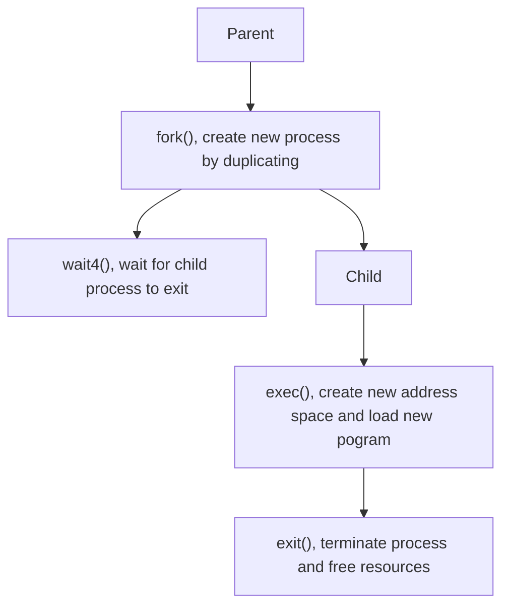
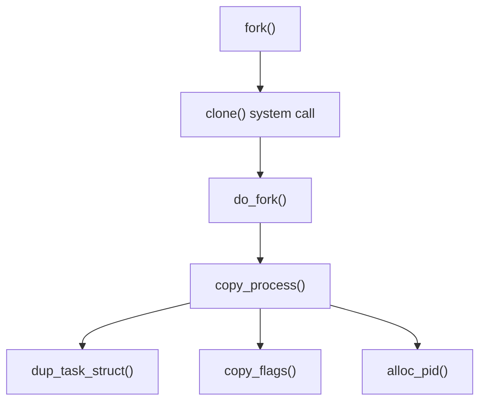
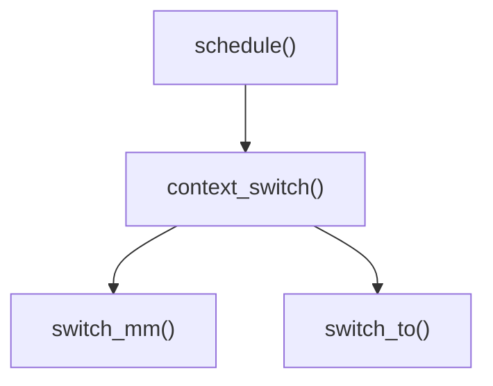
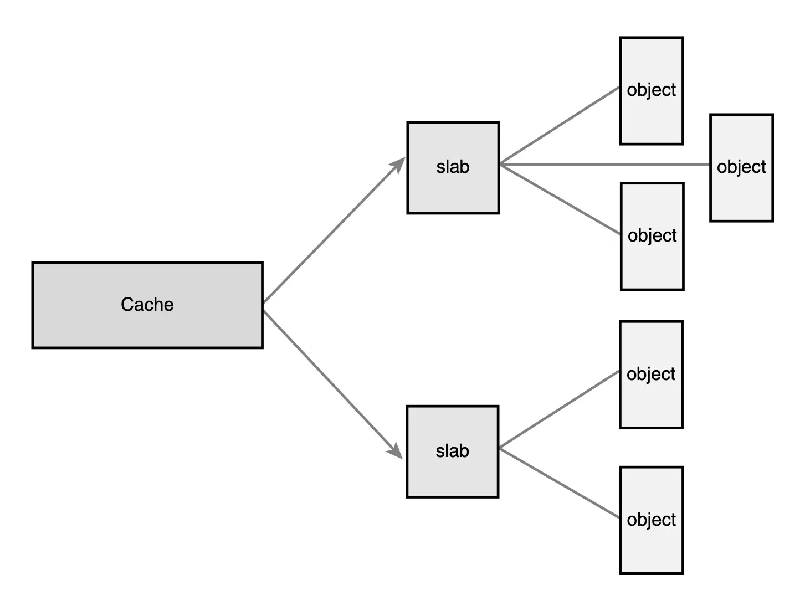
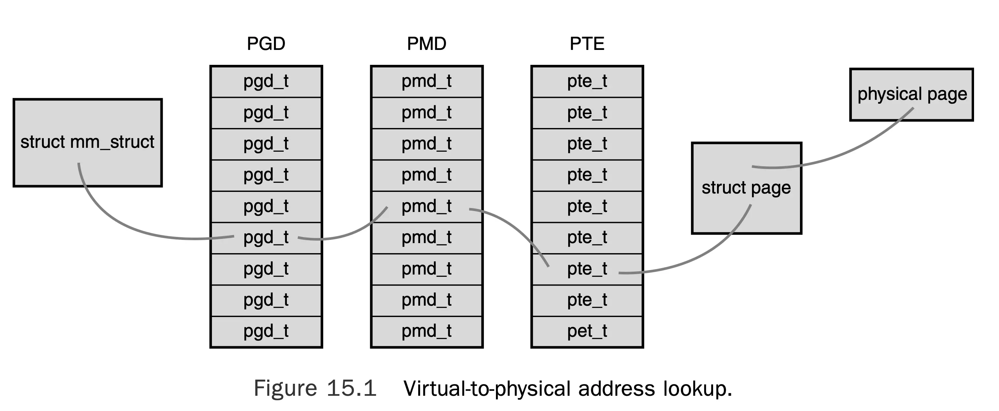

---
tags:
  - 读书笔记
  - 完成
---

# 📖 Linux Kernel Development (3rd)

!!! abstract

    - **中文版：**[Linux 内核设计与实现 (原书第 3 版)](https://book.douban.com/subject/6097773/)
    - **英文版：**[Linux Kernel Development (3rd)](https://www.amazon.com/Linux-Kernel-Development-Robert-Love/dp/0672329468)

    本书出版于 2010 年（Linux 2 版本时期），其中许多**细节**在现在的 Linux 内核中**已经发生了变化**，但**总体架构和设计思想仍然适用**。

## 第 3 章：进程管理

几个基本概念：

- 进程：正在运行的程序及其资源。Linux 内部将进程称为 task。
- 线程：
    - Linux 调度的最小单位。但与进程没有什么不同，在 Linux 中线程只是一种特殊的进程。
    - 具有自己的 PC、寄存器、栈。
    - 同一进程的线程间共享虚拟内存。
- 生命周期：



### 进程描述符和 task 结构

- `struct task_struct`
    - 在 32 位系统上约占 1.7KB。组成一个环形链表。
    - 2.6 以后使用 slab allocator 动态分配。
- `struct thread_info`
    - 2.6 以后，取代 `task_struct` 放置在栈尾部。
    - `task` 成员指向 `task_struct`。
- `pid_t` 进程描述符，默认值为 32768。见 `/proc/sys/kernel/pid_max`。
- `current` 指向当前进程的 `task_struct`。
- 五种进程状态：
    - `TASK_RUNNING`
    - `TASK_INTERRUPTIBLE` 睡眠状态。
    - `TASK_UNINTERRUPTIBLE` 不响应信号。该状态是 `ps` 中 dread 且无法杀死的进程的来源。常用于不中断的等待。
    - `__TASK_STOPPED`
    - `__TASK_TRACED`
- 进程状态控制：

    ```c
    set_task_state(task, state);
    set_current_state(state);
    ```

- 进程树
    - `init_task` 存放 `init` 进程的描述符。
    - 直接访问成员：

        ```c
        struct task_struct *task;
        task->parent;
        ```

    - 包装的宏：

        ```c
        next_task(task);
        prev_task(task);
        for_each_process(task) {}
        ```

### 进程创建

其他操作系统一般实现 spawn 机制在新地址空间中创建新进程，而 Linux 将其拆分为两步：`fork()` 和 `exec()`。

- 在 `fork()` 后，数据采用 copy-on-write 机制。唯一的开销就是页表和进程描述符。
- 如果在 `fork()` 后立即调用 `exec()`，则不会发生数据复制。因此，`do_fork()` 中，如果 `copy_process()` 成功返回，子进程优先被唤醒运行。

`fork()` 的调用链：



### Linux 的线程实现

向 `clone()` 传递特定的标志可以创建线程：

```c
clone(CLONE_VM | CLONE_FS | CLONE_FILES | CLONE_SIGHAND, 0);
```

在 `fork()` 的默认行为（`clone(SIGCHLD, 0)`）之外，共享了地址空间、文件系统资源、文件描述符和信号处理。

内核有些操作需要在后台进行，使用**内核线程**，这与普通的进程线程不同。

- 它运行在内核空间，没有一个地址空间（`mm` 指针为 `NULL`）。
- 但是可以调度，可以抢占。
- 使用 `ps -ef` 可以看到内核线程。
- 内核线程都从 `kthreadd` 派生。使用 `kthread_create()` 创建内核线程。

### 进程终止

程序通过 `exit()` 系统调用结束。C 编译器在 `main()` 结束时自动调用 `exit()`。程序也可能因为无法处理信号而终止。

不论何种形式，进程结束的任务都通过 `do_exit()` 完成。

调用链见书本。

- 进程结束的**清除工作**和移除进程描述符的工作是分开的。`do_exit()` 后进程描述符还保留，用于给父进程返回退出状态等。父进程可以通知内核移除进程描述符。`wait4()` 系统调用通过 `release_task()` 移除进程描述符。
- `do_exit()` 还通过 `exit_notify()` 调用 `find_new_reaper()` 为子进程寻找新的父进程。首先在 thread group 中找，找不到就用 `init`。在寻找新的父进程这一方面，`exit_ptrace()` 的处理方式有一些不同。

## 第 4 章：进程调度

时间片（timeslice）

### 多任务

- 协同多任务（cooperative multitasking）：进程主动让出 CPU，通过调用 `yield()` 或 `sleep()` 等函数。进程主动暂停自己的行为称为 yield。
- 抢占式多任务（preemptive multitasking）：内核决定何时切换进程，通过时钟中断实现。

### Linux 进程调度器

!!! quote

    - [ops-class.org | A Scheduling Story](https://ops-class.org/slides/2017-03-03-schedulingstory)
    - [On the Fairness of Linux O(1) Scheduler](https://ijssst.info/Vol-15/No-3/data/3857a668.pdf)

- 2.4 及以前使用非常简单的调度器。

    > Pre-2.6 Linux systems used a scheduler that scaled poorly, requiring O(n) time to schedule tasks where n is the number of runnable threads.

- 2.5 引入 $O(1)$ 调度器。它适合大工作负载，但对于交互式进程表现不佳。

    > The O(1) scheduler had limitations like poor interactive performance and low throughput for background jobs and hence was replaced by CFS.

- 2.6 开始进一步改进，RSDL 引入了公平调度的概念，进一步改进后成为 CFS（Completely Fair Scheduler），从 2.6.23 开始成为默认调度器。

### 策略

进程可以分为以下两类：

- I/O bound：很多时间花在提交和等待 I/O 操作上。这样的程序基本上只会运行很短的时间。
    - GUI 应用程序一般都是 I/O bound，等待用户交互。
- Processor bound：很多时间花在计算上，运行直到被抢占。对这样的程序一般策略是运行更少频次但更长时间。

Unix 系统的调度策略一般偏好 I/O bound 以提供更好的响应时间。

- Linux 具有两个独立的进程优先级：
    - nice value：具有更低 nice value 的京城获得更多处理器时间。
    - real-time priority：具有更高 real-time priority 的进程优先级更高。
- Timeslice：
    - 长时间片：interactive 降低，感觉不再并发；适合 processor bound。  
    - 短时间片：上下文切换开销大；适合 I/O bound。
    - Linux CFS 动态分配时间，是系统负载和 nice value 的函数。

具体例子见书本和博客。

### Linux 调度算法

Linux 调度器是模块化的，可以对不同种类的进程使用不同调度算法。

- Each scheduler **class** has a priority. Iterates over each scheduler class in priority order.
- Traditional Unix Scheduling has some pathological problems:
    - Mapping nice values onto timeslices **backward** from ideal. High nice value process tend to be background (process bound), but allotted short timeslices. Normal priority process tend to be foreground user task, but allotted long timeslices.
    - Relative nice value has wildly different effects depending on the starting nice value.
    - Need the ability to assign an absolute timeslice (must be integer multiple of the timer tick). This introduces serveral problems.

Changes can be made to address these problems:

- make nice values geometric instead of additive.
- mapping naice values to timeslices using a measurement decoupled from the timer tick

But belie the true problem: assigning absolute timeslices yields a constant switching rate but variable fairness.

CFS **do away with timeslices completely** and assign each process a proportion of the processor. CFS thus yields constant fairness but a variable switching rate.

#### Fair Scheduling

CFS is based on a simple concept: Model process scheduling as if the system had **an ideal, perfectly multitasking processor**. In such a system, **each process would receive $1/n$ of the processor’s time**, where $n$ is the number of runnable processes, and we’d schedule them for **infinitely small durations**, so that in any measurable period we’d have run all n processes for the same amount of time.

CFS will run each process for some amount of time, round-robin, selecting next the process that has run the least. Rather than assign each process a timeslice, CFS calculates how long a process should run as **a function of the total number of runnable processes**. Instead of using the nice value to calculate a timeslice, CFS **uses the nice value to weight the proportion of processor** a process is to receive.

### Linux 调度实现

CFS 由四个部分组成：

- 时间簿记
    - 给每个进程分配时间片。每次时钟 tick，将进程的时间片减少。当时间片用完，进程被抢占。
    - 使用调度器实体结构 `struct sched_entity` 来记录，它嵌在进程描述符 `struct task_struct` 中。

        ```c title="linux/sched.h"
        struct sched_entity {
            struct load_weight load;
            struct rb_node run_node;
            unsigned int on_rq;
            u64 exec_start;
            u64 sum_exec_runtime;
            u64 vruntime;
            u64 prev_sum_exec_runtime;
            //...
        };
        ```

        - `vruntime`: normalized runtime of the process. On an ideal processor, the virtual runtime of all processes of the same priority would be identi- cal—all tasks would have received an equal, fair share of the processor. `update_curr()` manages this field.
- 进程选择
    - When CFS is deciding what process to run next, it picks the process with the **smallest `vruntime`**.
    - CFS uses a **red-black tree** to manage the list of runnable processes and efficiently find the process with the smallest vruntime.
    - The **key** for each node is the runnable process’s virtual runtime.

        ```c title="kernel/shed_fair.c"
        static struct sched_entity *__pick_next_entity(struct cfs_rq *cfs_rq)
        {
            struct rb_node *left = cfs_rq->rb_leftmost;
            if(!left)
                return NULL;
            return rb_entry(left, struct sched_entity, run_node);
        }
        ```

        **Thus CFS is $O(\log n)$, where $n$ is the number of runnable processes.**

- 调度器入点 `schedule()`
- 睡眠和唤醒
    - Sleep (wake back is the inverse):
        - marks itself as sleeping
        - puts itself on a wait queue
        - removes itself from the red-black tree of runnable
        - calls `schedule()` to select a new process to execute

        ```c
        DEFINE_WAIT(wait);
        add_wait_queue(&q, &wait);
        while(!condition) {
            prepare_to_wait(&q, &wait, TASK_INTERRUPTIBLE);
            if(signal_pending(current))
                break;
            schedule();
        }
        finish_wait(&q, &wait);
        ```

    - Wake up:
        - `wake_up()` wakes up **all** the tasks waiting on the given wait queue -> `try_to_wake_up()` sets the task’s state to `TASK_RUNNING` -> `enqueue_task()` to add the task to the red-black tree
        - spurious wake-up:  a task is awakened **does not mean that the event for which the task is waiting has occurred**. Sleeping should always be handled **in a loop that** ensures that the condition for which the task is waiting has indeed occurred.

### Preemption and Context Switching



- `switch_mm()`: switch **virtual memory mapping**.
- `switch_to()`: switch **processor state**.

`need_resched` flag signify whether a reschedule should be performed. In many cases kernel checks this flag and calls `schedule()`.

Linux kernel is **fully** preemptive (unlike most other Unix variants' cooperative kernel). So long as the kernel is in **a state in which it is safe** to reschedule. The safe state is: it does not hold a **lock**. **Locks are used as markers of regions of nonpreemptibility**.

- User Preemption
    - When returning **to user-space** from a system call
    - When returning **to user-space** from an interrupt handler
- Kernel Preemption
    - When an interrupt handler exits, before returning **to kernel-space**
    - When kernel code becomes **preemptible** again
    - If a task in the kernel **explicitly** calls `schedule()`
    - If a task in the kernel blocks (which results in a call to `schedule()`)

### Real-Time Scheduling Policies

!!! todo "skipped"

### Scheduler-Related System Calls

!!! todo "skipped"

## 第 7 章：中断和中断处理

相比起等待和轮询（polling），中断是最好的和硬件协作的方式。

### 基本概念

- 中断控制器（interrupt controller）：将多个中断线 mux 到单线通往 CPU。收到中断时，中断控制器向 CPU 发信号。
- 通过在中断中携带一个唯一的值，不同设备能够与不同的中断关联。这些值被称为中断行（IRQ lines）。一般来说，`0` 是时钟中断，`1` 是键盘中断，更多设备的 IRQ line 是动态分配的。
- 与异步产生的中断相比，异常是同步产生的（由于指令产生）。
- 内核为特定的中断运行中断处理程序（interrupt service routine，ISR），每个设备的 ISR 是其驱动的一部分。它们是普通的 C 函数，只不过需要匹配特定的函数原型，以便内核按标准的方式传送数据。
- 中断处理程序运行在独立的上下文（中断上下文，也称为原子上下文），在该上下文执行无法阻塞。
- 中断处理程序最少的任务是：告知设备收到中断。然而比如网络设备的中断处理程序还有很多工作要做。因此，**中断处理程序分为上半和下半**：上半立即执行快速的响应，而更多的工作推迟到下半在未来执行。以网络设备为例，上半将网络数据拷贝到主存，并通知网卡接受更多包；下半延迟执行，将数据包送到网络栈的不同层次。

### 写一个中断处理程序

```c title="linux/interrupt.h"
/* request_irq: allocate a given interrupt line */
int request_irq(unsigned int irq,
    irq_handler_t handler,
    unsigned long flags,
    const char *name,
    void *dev);
typedef irqreturn_t (*irq_handler_t)(int, void *);
void free_irq(unsigned int irq, void *dev);
```

值得注意的是，大部分 IRQ Line 是共享的，除非设备很老，直接住在 ISA 总线上。

有趣的是 `request_irq()` 会阻塞，所以要注意不能在非阻塞上下文使用（比如中断处理程序）。它阻塞原因来自调用链：`request_irq()` -> `proc_mkdir()` -> `proc_create()` -> `kmalloc()`，在 procfs 创建条目需要分配内存，因此可能阻塞。

收到中断时，内核顺序调起相同 IRQ Line 的所有中断处理程序。这些中断处理程序需要判断是否是自己的设备发出的中断，这需要设备上具有中断处理程序可以确认的状态寄存器。

### 例子：RTC 中断程序

实时时钟（real-time clock，RTC）与系统时钟不同，它是一个独立的硬件设备。RTC 设备通常依靠一个石英晶体振荡器来生成精确的时间基准。晶体振荡器产生的固定频率脉冲被计数，用来计算时间的流逝。

具体代码见书本。

### 中断上下文

与内存章节内容相同，注意中断上下文可能为共享或单页。

此外与进程上下文不同，`current` 指针没有意义（虽然它指向被中断的进程），因为中断与进程无关。

### 实现中断处理程序

!!! note

    本节的一些内容已经过时，比如 `do_IRQ()` 已经被移除。较新的中断机制为 flow handler，见 [Linux generic IRQ handling](https://www.kernel.org/doc/html/v4.18/core-api/genericirq.html)。
    
    本书所描述的旧代码见 [linux/kernel/irq/handle.c](https://github.com/spotify/linux/blob/master/kernel/irq/handle.c)。


- 处理器停止正在做的事情，关闭中断系统，跳到与定义的内存位置执行代码。该位置由内核设置，称为中断处理程序的入口（entry point）。
- 对于每个中断行，跳转到一个唯一的位置，这样内核就能知道 IRQ Line。
- 初始中断程序简单地保存 IRQ Line 的值和寄存器（上下文）到栈中，然后调用 `do_IRQ()`。
- `do_IRQ()` 解析 IRQ Line，停止该中断行的中断，确认该中断行上有合法的中断处理程序且没有在执行，然后调用 `handle_IRQ_event()`。
- 运行结束后调用 `ret_from_intr()`，检查是否有等待的 reschedule，如果有，调用 `schedule()`（根据返回的是内核空间还是用户空间，还有其他判断条件）。

### 中断控制

- 内核提供中断控制接口，主要是为了同步的需求：保证中断处理程序不会抢占当前代码。
    - 然而，关闭中断和内核抢占并不能保证没有其他进程并发访问。这需要使用锁。

```c
// 全局
local_irq_disable();
local_irq_enable();
local_irq_save(flags);
local_irq_restore(flags);
// IRQ Line
void disable_irq(unsigned int irq);
void disable_irq_nosync(unsigned int irq);
void enable_irq(unsigned int irq);
void synchronize_irq(unsigned int irq);
// status
in_interrupt();
in_irq();
```

### 杂项

- 查看 `/proc/interrupts` 可以看到中断情况统计，有各 CPU 和中断行。
- PCI 规范强制中断共享，现代 PCI 设备都支持中断共享。

## 第 8 章：下半和延迟工作

## [undone] Chapter 11: Timers and Time Management

- A large number of kernel functions are **time-driven**.
- Events occur **periodically** are driven by the **system timer** (hardware). Its timer interrupt is used to update the system time and to drive the kernel's timer facilities.
- **Dynamic timer** is used to schedule events. Create and destroy timers dynamically.

### Kernel Notino of Time

The system timer goes off at a **preprogrammed frequency called the tick rate**. Kernel knows the tick rate, and it knows the time between any two successive timer interrupts.

### The Tick Rate: HZ

The frequency of the system timer (the tick rate) is **programmed on system boot** based on a static preprocessor define, `HZ`.

!!! note

    As of now, `HZ` is defined in `asm-generic/param.h` to be `100` for all architectures.

!!! note "Rest part of this section discusses the impact of large `HZ` values on the system. Ignored for now."

### Jiffies

```c
extern unsigned long volatile jiffies;
extern u64 jiffies_64;
```

The global variable `jiffies` holds the number of ticks that have occurred since the system booted.

Interstingly, `ld` script `arch/.../kernel/vmlinux.lds` overlays the `jiffies` variable over the start of the `jiffies_64` variable.

```text
jiffies = jiffies_64;
```

Because `jiffies` can wraparound, some macro functions are provided to handle this.

```c
#define time_after(unknow, known) ((long)(known) - (long)(unknow) < 0)
#define time_before(unknow, known) ((long)(unknow) - (long)(known) < 0)
#define time_after_eq(unknow, known) ((long)(unknow) - (long)(known) >= 0)  
#define time_before_eq(unknow, known) ((long)(known) - (long)(unknow) >= 0)
```

From kernel 2.6, there is `USER_HZ` exported to user space.

### Hardware Clocks and Timers

- RTC: a nonvolatile device for storing the system time. On boot, the kernel reads the RTC and uses it to initialize the wall time.
- System Timer: an electronic clock that oscillates at a programmable frequency. On x86, the primary system timer is the programmable interrupt timer (PIT). Other x86 time sources include the local APIC timer and the processor’s time stamp counter (TSC).

!!! note

    TSC is an important metric for performance monitoring and tuning. It is a high-resolution counter that increments with each clock cycle.

### The Timer Interrupt Handler

!!! todo "skipped"

### The Time of Day

### Timers

### Delaying Execution

## 第 12 章：内存管理

本章介绍内核如何管理**物理内存**。此外，内核还管理用户空间内存，见第 15 章。

### 内存基本概念

- 页面 Page
    - 内存按字节寻址。
    - MMU 管理内存，执行虚拟到物理地址的转换。它以页面为粒度维护系统的页表。**每种体系结构都有自己的页表大小和格式**。大多数 32 位架构使用 4KB 大小的页面。对于虚拟内存来说，页面是最小的可分配单位。
    - 内核中，每个物理页面表示为 `struct page`：

        ```text
        struct page {
            unsigned long flags;
            atomic_t _count;
            atomic_t _mapcount;
            unsigned long private;
            struct address_space *mapping;
            pgoff_t index;
            struct list_head lru;
            void *virtual;
        };
        ```

        `struct page` 描述的是物理页面，因此是**流动**的，并不总是关联到特定的物理页面（可能被置换等）。内核使用该数据结构跟踪物理页面的情况，包括页面的引用计数、使用者（可能为用户空间程序、内核代码和数据结构等）等。

        相关函数：

        ```c
        page_count()
        ```

        - `_count`：引用计数。
        - `virtual`：该物理页面的虚拟地址。
- 区域 Zone
    - 由于硬件架构的限制，并不是所有页面都能以相同的方式对待。例如：某些 DMA 只能访问特定的内存区域。
    - Linux 四种内存区域：

        ```text
        ZONE_DMA ZONE_DMA32 ZONE_NORMAL ZONE_HIGHMEM
        ```

        x86-64 支持 full map，因此没有 `ZONE_HIGHMEM` 区域。所有内存区域都包含在 `ZONE_NORMAL` 和 `ZONE_DMA` 中。

        x86 仅能寻址 $2^{32}$（4 GB）内存空间。如果物理内存更大，访问这些无法直接寻址的内存就需要通过 `ZONE_HIGHMEM` 区域。

    - Linux 使用 `struct zone` 描述内存区域。
- 页面相关接口：

    ```c
    struct page *alloc_pages(gfp_t gfp_mask, unsigned int order);
    struct page *alloc_page(gfp_t gfp_mask);
    void * page_address(struct page *page);
    unsigned long __get_free_pages(gfp_t gfp_mask, unsigned int order);
    unsinged long __get_free_page(gfp_t gfp_mask);
    unsigned long get_zeroed_page(gfp_t gfp_mask);
    void __free_pages(struct page *page, unsigned int order);
    void free_pages(unsigned long addr, unsigned int order);
    void free_page(unsigned long addr);
    ```

    `gfp` 就是 get free page 的缩写。

- 内核中的两个内存分配函数：

    ```c
    void * kmalloc(size_t size, gfp_t flags);
    void kfree(const void *ptr);
    void * vmalloc(unsigned long size);
    void vfreen(const void *addr);
    ```

    其中，`gfp_t` 是 `unsigned int`，意味着至少有 32 个标志可以设置。标志可以分为三类：

    - action modifiers：更改内存分配行为。例如 interrupt handlers 不能阻塞，因此需要 `GFP_ATOMIC`。
    - zone modifiers：指定内存分配的区域。例如 `GFP_DMA`。
    - types：多个 modifiers 的结合，方便特定种类内存分配。最常用的是 `GFP_KERNEL`。

### Slab 层

- 在 Understanding Linux Network Internals 开篇见到过这一层次。
- Slab 层是一个 free list，用于内核对象，相当于内存对象的 cache。常用的对象直接从表中获取，释放时归还，而省去了频繁的内存分配和释放操作。
- 有趣的是，`kmalloc()` 也是通过 Slab 层实现的，它使用 general purpose cache。
- `kmem_cache`、`kmem_list3`、`struct slab`

    

- Slab 有三种状态：
    - full：没有空闲对象。
    - partial：有空闲对象。
    - empty：没有被分配的对象。

    分配请求优先由 partial 处理；若无，则由 empty 分配；若无 empty slab，则创建一个。Slab allocator 与 `__get_free_pages()` 等底层接口交互，见

    ```c
    static void *kmem_getpages(struct kmem_cache *cachep, gfp_t flags, int nodeid);
    ```

    最后一个参数 `nodeid` 是 NUMA 架构的节点 ID，使得该函数 NUMA-aware。

- Slab 层对外的接口十分简洁：

    ```c
    struct kmem_cache * kmem_cache_create(const char *name, size_t size, size_t align, unsigned long flags, void (*ctor)(void *));
    int kmem_cache_destroy(struct kmem_cache *cachep);
    void * kmem_cache_alloc(struct kmem_cache *cachep, gfp_t flags);
    void kmem_cache_free(struct kmem_cache *cachep, void *objp);
    ```

    用例：

    ```c
    struct kmem_cache *task_struct_cachep;
    task_struct_cachep = kmem_cache_create("task_struct", sizeof(struct task_struct), ARCH_MIN_TASKALIGN, SLAB_PANIC | SLAB_NOTRACK, NULL);
    struct task_struct *tsk;
    tsk = kmem_cache_alloc(task_struct_cachep, GFP_KERNEL);
    if (!tsk) {
        return NULL;
    }
    kmem_cache_free(task_struct_cachep, tsk);
    int err;
    err = kmem_cache_destroy(task_struct_cachep);
    if(err) {
        //...
    }
    ```

### 栈上的静态分配

与用户空间程序相比，内核的栈小且固定。内核栈的大小受架构和编译选项影响，通常是两页大小（即 32 位 8KB、64 位 16 KB）。

- 单页内核栈（2.6 起）

    进程的整个调用链需要能够放入栈中，而中断处理程序也会使用进程的栈。当调整为单页时，中断处理程序放不进去了。

    内核设计者的方法是，给每个处理器放一个单页的中断处理栈，中断处理程序用这个栈，不再与进程共享。

- 在栈上工作

    内核没有栈管理，因此要注意栈上分配的内容不要超过数百字节。如果栈溢出，最先吞噬的应该是 `thread_info`，它在每个进程内核栈的最低处。

### 高内存映射

- 永久映射：

    ```c
    void *kmap(struct page *page)
    void kunmap(struct page *page)
    ```

    高低内存都能用。

- 临时映射（原子映射）：用于需要映射但上下文不允许睡眠的情况，此外这些函数还关闭抢占

    ```c
    void *kmap_atomic(struct page* page, enum km_type type)
    void kunmap_atomic(void *kvaddr, enum km_type type)
    ```

### 逐 CPU 分配

```c
int cpu;
cpu = get_cpu(); /* get current processor and disable kernel preemption */
my_percpu[cpu]++; /* ... or whatever */
printk(“my_percpu on cpu=%d is %lu\n”, cpu, my_percpu[cpu]);
put_cpu(); /* enable kernel preemption */
```

内核抢占会造成这些问题：

- 如果代码被安排到其他 CPU 上，上面的 `cpu` 变量将失效。
- 其他代码可能同样读写 `my_percpu` 中的数据，造成竞争。

2.6 开始提供了新的逐 CPU 接口：

```c title="linux/percpu.h"
// 编译时
DEFINE_PER_CPU(type, name);
DECLARE_PER_CPU(type, name);
get_cpu_var(name)++; /* increment name on this processor */
put_cpu_var(name); /* done; enable kernel preemption */
per_cpu(name, cpu)++; /* increment name on the given processor */
// 运行时
void *alloc_percpu(type); /* a macro */
void *__alloc_percpu(size_t size, size_t align);
void free_percpu(const void *);
```

Per-CPU Data 有一些特点：

- 一定要注意保证只有一个 CPU 访问数据
- 显著减少了缓存失效：如果 CPU 更改其他 CPU 缓存了的数据，必须将它们 flush 掉以保持一致性。
- Linux 提供的 Per-CPU 接口将数据按缓存对齐（cache-align），确保访问单 CPU 的数据不会带入同缓存行中其他 CPU 的数据。
- 因此，使用 Per-CPU 数据极少需要锁。

### 内存分配总结

- 如果需要连续物理页，使用底层页分配器 `kmalloc()`。
- 需要从高内存分配，用 `alloc_pages()`。
- 只需要虚拟连续，用 `vmalloc()`。
- 创建并销毁大量对象数据，使用 Slab Cache。它维护 Per-CPU 对象缓存。

## 第 15 章：进程地址空间

对于单个进程来说，内存就好像它独自拥有整个系统的物理内存一样。单个进程的地址空间可能比物理内存大得多。

### 地址空间

- 平坦（flat）：地址空间存在于一个连续的地址范围内，如 32 位为 $0 \sim 2^{32}-1$。
- 分段（segmented）：地址空间由多个段组成，每个段有自己的基址和大小。

现代虚拟内存操作系统都使用平坦地址空间，Linux 也不例外。

地址空间对单个进程唯一，不同进程相同地址没有任何关系。不过，我们知道线程可以共享地址空间。

我们只对地址空间进程有权限访问（legal）的内存区域（memory area）感兴趣。进程可以通过内核动态添加和删除内存区域。进程访问不在内存区域中的地址，或以错误的方式访问内存区域中的地址时，操作系统会终止进程并报告段错误。

内存区域中包含的东西例如：

- mmap of text section：代码的内存映射
- mmap of data section：初始化的全局变量的内存映射
- mmap of zero page：未初始化的全局变量的内存映射，可能用于用户空间栈或者 bss 段
- 载入内存的动态链接器和共享库的各种段
- mmap 的文件
- 共享内存段
- 匿名内存映射（`malloc()`）

### 内存描述符

内核使用 `struct mm_struct` 描述进程的地址空间。

```c
struct mm_struct {
    struct vm_area_struct   *mmap;          /* list of memory areas */
    struct rb_root          mm_rb;          /* red-black tree of VMAs */
    struct vm_area_struct   *mmap_cache;    /* last used VMA */
    unsigned long           free_area_cache;/* 1st addr space hole */
    pgd_t                   *pgd;           /* page global directory */
    atomic_t                mm_users;       /* number of users */
    atomic_t                mm_count;       /* number of references */
    int                     map_count;      /* number of VMAs */
    struct rw_semaphore     mmap_sem;       /* VMA semaphore */
    spinlock_t              page_table_lock;/* page table lock */
    struct list_head        mmlist;         /* list of all mm_structs */
    unsigned long           start_code, end_code,   /* code */
                            start_data, end_data,   /* data */
                            start_brk, brk,         /* heap */
                            start_stack,            /* stack */
                            arg_start, arg_end,     /* arguments */
                            env_start, env_end;     /* environment */
                            rss, total_vm, locked_vm;   /* pages */
    unsigned long           saved_auxv[AT_VECTOR_SIZE]; /* for /proc/PID/auxv */
    cpumask_t               cpu_vm_mask;    /* lazy TLB switch mask */
    mm_context_t            context;        /* architecture-specific data */
    unsigned long           flags;          /* status flags */
    int                     core_waiters;   /* thread core dump waiters */
    struct core_state       *core_state;    /* core dump info */
    spinlock_t              ioctx_lock;     /* AIO I/O list lock */
    struct hlist_head       ioctx_list;     /* AIO I/O list */
}
```

`mm_struct` 通过 `mmlist` 构成双向链表，链表最初的元素是 `init_mm`。链表通过 `mmlist_lock` 保护。

- 分配内存描述符：
    - 由 `allocate_mm()` 从 Slab 层的 `mm_cachep` 分配。
    - `task_struct` 中有一个 `mm` 指针，指向 `mm_struct`。
    - 在 `fork()` 中，`copy_mm()` 将父进程的 `mm_struct` 复制给子进程。
    - `clone()` 传入 `CLONE_VM` 标志时，`copy_mm` 使子进程的 `mm` **指向** 父进程的 `mm`，而不是复制。
- 销毁内存描述符：
    - `exit_mm()` 释放内存描述符。
    - `mmput()` 减少 `mm_users` 计数，如果为 0，则调用 `mmdrop()` 减少 `mm_count` 计数，如果为 0，则调用 `free_mm()` 通过 `kmem_cache_free()` 释放内存描述符。

在前文我们了解到，内核线程没有地址空间。但它需要使用页表访问内核内存。因此，内核线程直接使用上一个进程的 `mm`，但它不会访问用户空间内存，只会利用地址空间中关于内核内存的信息，这些信息在所有进程中都是相同的。

当进程被调度时，进程描述符中的 `active_mm` 更新为 `mm`。内核线程的 `mm` 是 `NULL`，在调度内核线程时，内核特地将其 `active_mm` 更新为上一个进程的 `mm`。

### VMA

```c
struct vm_area_struct {
    struct mm_struct *vm_mm;    /* associated mm_struct */
    unsigned long vm_start;     /* VMA start, inclusive */
    unsigned long vm_end;       /* VMA end, exclusive */
    struct vm_area_struct *vm_next; /* VMA list */
    pgprot_t vm_page_prot;      /* access permissions */
    unsigned long vm_flags;     /* flags */
    struct rb_node vm_rb;       /* red-black tree node */
    struct list_head vm_list;   /* VMA list */
    union { /* links to address_space->i_mmap or i_mmap_nonlinear */
        struct {
            struct list_head list;
            void *parent;
            struct vm_area_struct *head;
        } vm_set;
        struct prio_tree_node prio_tree_node;
    } shared;
    struct list_head anon_vma_node; /* anonymous VMA list */
    struct anon_vma *anon_vma;      /* anonymous VMA object */
    struct vm_operations_struct *vm_ops; /* VMA operations */
    unsigned long vm_pgoff;     /* offset in PAGE_SIZE units */
    struct file *vm_file;       /* mapped file, if any */
    void *vm_private_data;      /* private data */
}
```

VMA flags 的行为由内核负责。与之相比，物理内存的 flags 由硬件 MMU 负责。一些重要的 flags：

- `VM_READ`、`VM_WRITE`、`VM_EXEC`：读、写、执行权限。
- `VM_SHARED`：是否包含一个在多进程间共享的映射。
- `VM_IO`：映射的是设备 I/O 空间，通常由设备驱动使用 `mmap()` 映射。
- `VM_RESERVED`：不可交换。
- `VM_SEQ_READ`：顺序读，可以进行 read-ahead 优化。
- `VM_RAND_READ`

`vm_operations_struct` 是一组函数指针，用于处理 VMA 的操作。

```c
struct vm_operations_struct {
    void (*open)(struct vm_area_struct *vma);
    void (*close)(struct vm_area_struct *vma);
    int (*fault)(struct vm_area_struct *vma, struct vm_fault *vmf);
    int (*page_mkwrite)(struct vm_area_struct *vma, struct vm_fault *vmf);
    int (*access)(struct vm_area_struct *vma, unsigned long addr, void *buf, int len, int write);
}
```

### 内存区域列表和树

下面两个数据结构中的元素都是 `struct vm_area_struct`：

- `mm_rb` 是红黑树，通过 `vm_rb` 链入。
- `mmap` 是单向链表（singly linked list），通过 `vm_next` 升序（ascend）连接。

这两个并不是分开的数据结构，其实是线段树（threaded tree），链表覆盖在树上。

可以使用 `pmap` 或 `/proc` 文件系统查看进程的地址空间。

### 操作内存区域

```c
struct vm_area_struct * find_vma(struct mm_struct *mm, unsigned long addr);
struct vm_area_struct * find_vma_prev(struct mm_struct *mm, unsigned long addr, 
                                      struct vm_area_struct **pprev);
static inline struct vm_area_struct * 
find_vma_intersection(struct mm_struct *mm, unsigned long start_addr, 
                      unsigned long end_addr);
```

下面两个函数创建地址区间：

```c
unsigned long do_mmap(struct file *file, unsigned long addr,
                        unsigned long len, unsigned long prot,
                        unsigned long flag, unsigned long offset);
```

如果创建的地址区间与某个已存在的区间相邻且权限相同，则会被合并。

映射 `file` 的 `offset` 开始的 `len` 字节到 `addr` 开始的地址。`file` 为 `NULL` 时不是文件映射（file-backed mapping)，称为匿名映射（anonymous mapping）。

`prot` 表示权限（page protection），与架构有关，一般是 `PROT_READ`、`PROT_WRITE`、`PROT_EXEC`、`PROT_NONE`。

`flag` 与剩余的 VMA flags 对应，以 `MAP_` 开头。

`do_mmap()` 作为系统调用 `mmap()` 被导出至用户空间。

```c
void *mmap2(void *start, size_t length, int prot, int flags, int fd, off_t pgoff);
```

与 `mmap()` 的区别在于 `pgoff` 是以页面为单位的偏移量，而 `mmap()` 是以字节为单位的。`mmap()` 使用 `mmap2()` 作为后端。

下面两个函数移除地址区间：

```c
int do_munmap(struct mm_struct *mm, unsigned long start, size_t len);
int munmap(void *start, size_t len);
```

### 页表

在处理器解析请求前，虚拟地址必须被转换为物理地址。虚拟地址被划分为区块，作为页表的索引（index）。表项指向其他表或者相关的物理页。

Linux 中的页表有三级结构，形成一个稀疏填充的地址空间。从上到下分别是：

- Page Global Directory（PGD）：`pgd_t` 的数组，每个表项指向 PMD 中的表项。
- Page Middle Directory（PMD）：`pmd_t` 的数组，每个表项指向 PTE 中的表项。
- Page Table Entry（PTE）：`pte_t` 的数组，每个表项指向物理页。



在页表上遍历和操作需要获取内存描述符中的 `page_table_lock`。

页表数据结构与架构有很大关系。

大多数处理器还实现 TLB（Translation Lookaside Buffer）缓存，处理器首先查找 TLB，如果没有命中，再查找页表。

在 2.6，内核中的页表仍然在快速演变。

## 第 16 章：页缓存和页写回

Linux 实现磁盘缓存，通过将数据保存在内存中减少磁盘 I/O 操作，称为页缓存（page cache）。

!!! todo "暂略。"
