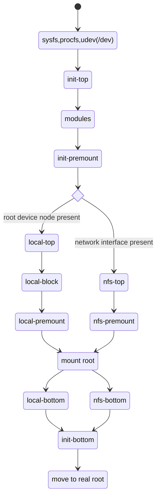

# 启动过程

!!! info

    - [https://wiki.debian.org/BootProcess](https://wiki.debian.org/BootProcess)
    - [https://www.debian.org/doc/manuals/debian-reference/ch03.en.html](https://www.debian.org/doc/manuals/debian-reference/ch03.en.html)

## Kernel

!!! info

    - [https://docs.kernel.org/admin-guide/kernel-parameters.html](https://docs.kernel.org/admin-guide/kernel-parameters.html)
    - [https://www.kernel.org/doc/Documentation/filesystems/nfs/nfsroot.txt](https://www.kernel.org/doc/Documentation/filesystems/nfs/nfsroot.txt)

- boot loader 启动内核时可以向内核传递参数，NFS Root 所需的参数也在这时传递。下面是目前我们配置在 `pxelinux` 启动菜单中，传递给内核的参数。

```bash
root=/dev/nfs 
initrd=<initrd.img-...> 
nfsroot=172.25.2.10:/pxe/rootfs/<os>/<version> rw 
panic=60
ipv6.disable=1
ip=dhcp
nfsrootdebug
```

## vmlinuz 与 initramfs

!!! info

    - [https://superuser.com/questions/734124/need-to-uncompress-the-initramfs-file](https://superuser.com/questions/734124/need-to-uncompress-the-initramfs-file)
    - [https://www.linuxquestions.org/questions/linux-general-1/how-to-uncompress-vmlinuz-233741/](https://www.linuxquestions.org/questions/linux-general-1/how-to-uncompress-vmlinuz-233741/)
    - [https://stackoverflow.com/questions/12002315/extract-vmlinux-from-vmlinuz-or-bzimage/12002789#12002789](https://stackoverflow.com/questions/12002315/extract-vmlinux-from-vmlinuz-or-bzimage/12002789#12002789)
    - [https://manpages.ubuntu.com/manpages/trusty/man5/initramfs.conf.5.html](https://manpages.ubuntu.com/manpages/trusty/man5/initramfs.conf.5.html)
    - [https://manpages.debian.org/testing/initramfs-tools/update-initramfs.conf.5.en.html](https://manpages.debian.org/testing/initramfs-tools/update-initramfs.conf.5.en.html)

- `vmlinuz` 是压缩过的 Linux 内核，分为两部分。第一部分用于将压缩的部分解压载入内存，第二部分就是压缩的内核。可选的压缩方法非常多，参考链接中的方式解压可以得到 `vmlinux` 这个 ELF 文件。
- `initramfs` 是 gzip 压缩的 cpio 归档格式。先使用 gunzip 再使用 cpio 即可解压出来。

建议把 initramfs 解压出来，看看里面的 /init 大概在干些什么。不多，就一个 200-300 行的脚本。

## `/init`

!!! info

    - [https://manpages.ubuntu.com/manpages/xenial/man8/initramfs-tools.8.html](https://manpages.ubuntu.com/manpages/xenial/man8/initramfs-tools.8.html)

- 内核挂上 initramfs 后就开始在用户空间执行 /init 进行一系列初始化工作，最重要的目的是挂载真正的根文件系统，以及由 klibc 执行网络配置。这个脚本文件可以由 initramfs-tools 或 dracut 生成。
- 当根文件系统挂载完成、设备准备好、伪文件系统也迁移完成后，控制权交给下一阶段。

### initramfs-tools

- Hook Scripts 用于将文件复制到 initramfs 中:`/etc/initramfs-tools/hooks/`

```bash
#!/bin/sh
PREREQ="" # name of other hook scripts that this one depends on
prereqs()
{
    echo "$PREREQ"
}

case $1 in
prereqs)
    prereqs
    exit 0
    ;;
esac

. /usr/share/initramfs-tools/hook-functions
# includes: manual_add_modules, add_modules_from_file, force_load, copy_modules_dir (from /lib/modules/KERNEL_VERSION)
# Begin real processing below this line
# copy_exec /sbin/mdadm /sbin (will detect dependencies)
TEMP_FILE=$(mktemp ...)
    ...
prepend_earlyinitramfs ${TEMP_FILE}
rm -f ${TEMP_FILE}
```

- Boot Scripts 用于在 initramfs 中执行：`/etc/initramfs-tools/scripts/`

```bash
#!/bin/sh
PREREQ=""
prereqs()
{
    echo "$PREREQ"
}

case $1 in
prereqs)
    prereqs
    exit 0
    ;;
esac
. /scripts/functions
# provide: log_success_msg, log_failure_msg, log_warning_msg, log_begin_msg, log_end_msg
#          panic, add_mountroot_fail_hook
```



以 `init` 为例：

- 在 ramfs 中创建 /dev、/root、/sys、/proc、/tmp 并挂载
- 


## NFS 挂载根目录

!!! info

    - [https://www.eventhelix.com/networking/NFS_Protocol_Sequence_Diagram.pdf](https://www.eventhelix.com/networking/NFS_Protocol_Sequence_Diagram.pdf)

Debian 遵守 Linux FHS 标准，根目录结构如下：


## /usr/sbin/init 即 systemd

目前常用的一般是 systemd 和 cloud-init。SysV 风格的以及逐渐不受支持，所以不要再使用 /etc/init.d/rc[0123456S].d/[KS]name 下的脚本。

!!! info

    - [https://www.digitalocean.com/community/tutorials/systemd-essentials-working-with-services-units-and-the-journal](https://www.digitalocean.com/community/tutorials/systemd-essentials-working-with-services-units-and-the-journal)
    - [https://unix.stackexchange.com/questions/90723/is-there-any-reason-to-move-away-from-fstab-on-a-systemd-system](https://unix.stackexchange.com/questions/90723/is-there-any-reason-to-move-away-from-fstab-on-a-systemd-system)
    - [https://www.freedesktop.org/software/systemd/man/latest/systemd.special.html](https://www.freedesktop.org/software/systemd/man/latest/systemd.special.html)
    - [https://opensource.com/article/20/5/systemd-startup](https://opensource.com/article/20/5/systemd-startup)
    - [https://insujang.github.io/2018-11-22/systemd-boot-process/](https://insujang.github.io/2018-11-22/systemd-boot-process/)
    - 入门推荐 systemd by example：[https://seb.jambor.dev/posts/systemd-by-example-part-1-minimization/](https://seb.jambor.dev/posts/systemd-by-example-part-1-minimization/)
        - 这个还提供了配套的 playground，你可以修改配置然后启动系统查看输出和 journalctl，非常适合学习。

我们比较常用的 unit 类型：service、target。其实网络栈之类的都可以由 systemd 监管，不过目前还不是主流，所以先不用管。

