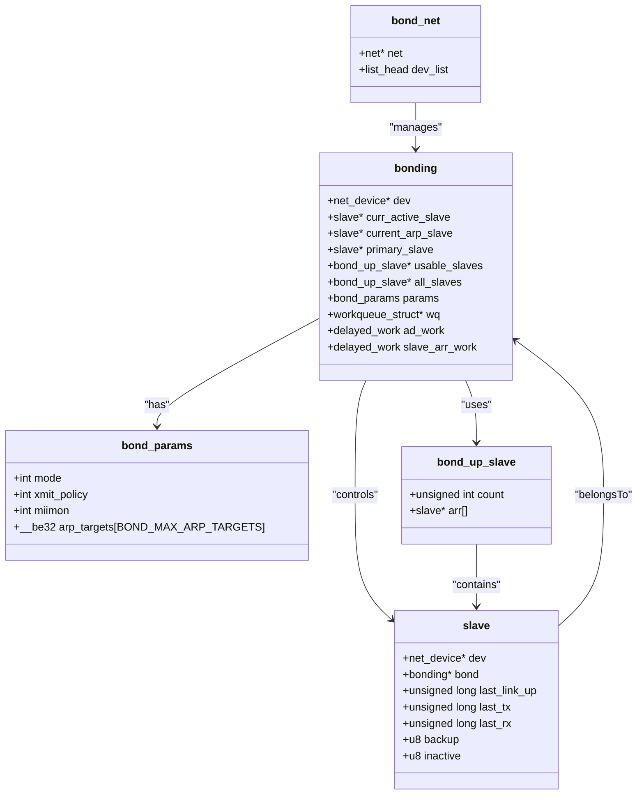
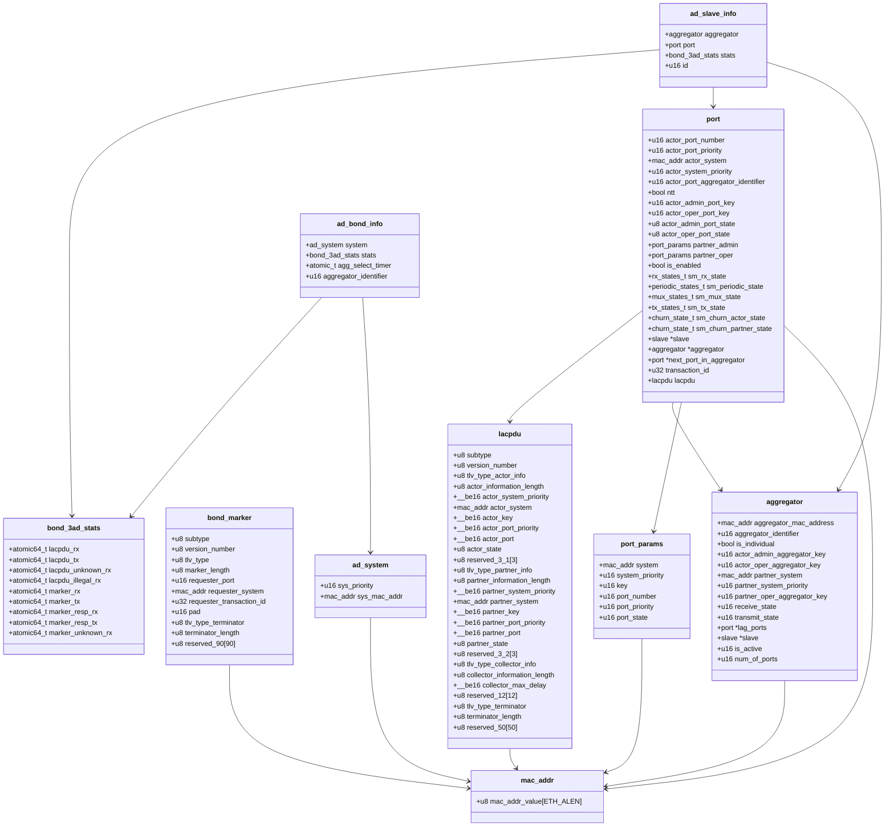

# drivers/net/bonding

## 数据结构及其关系

`include/net/bonding`：



`include/net/bond_3ad.h`：



1. **`mac_addr`**:
   - 是许多结构（如 `lacpdu`, `bond_marker`, `aggregator`, `port`, `port_params`, `ad_system`）中用来表示 MAC 地址的基础单元。

2. **`lacpdu` 和 `bond_marker`**:
   - 这两个结构描述了链路聚合控制协议（LACP）和标记协议（Marker Protocol）的数据包结构，用于链路聚合的通信。

3. **`aggregator`**:
   - 表示链路聚合的一部分，包含 MAC 地址、聚合相关的键值，以及关联的 `port` 和 `slave` 指针。
   - 每个 `aggregator` 可以包含多个 `port`。

4. **`port`**:
   - 描述链路聚合中的一个端口，包含 `actor` 和 `partner` 的信息以及状态机的状态。
   - 包含指向其所属的 `slave` 和 `aggregator` 的指针。
   - 与 `lacpdu` 直接相关，因为其发送和接收的 LACP 信息存储在 `lacpdu` 字段中。

5. **`port_params`**:
   - 用于存储端口的系统、优先级、键值等信息。
   - `port` 中有两个 `port_params`（`partner_admin` 和 `partner_oper`），分别代表管理和操作的伙伴信息。

6. **`ad_system`**:
   - 表示链路聚合系统中全局的系统优先级和系统 MAC 地址。
   - 被 `ad_bond_info` 使用。

7. **`bond_3ad_stats`**:
   - 用于统计 LACP 和 Marker PDU 的发送、接收和错误信息。
   - 被 `ad_bond_info` 和 `ad_slave_info` 使用。

8. **`ad_bond_info` 和 `ad_slave_info`**:
   - 这些结构分别存储链路聚合的全局信息和特定从属设备（slave）的信息。
   - `ad_slave_info` 包含一个 `aggregator` 和一个 `port`。

## 模块基本信息

`bonding_init()`：该内核模块的初始化函数，注册了 `bonding` 设备类型和 `bonding` netlink 组。

```c
bond_check_params()
bnod_create_debugfs()
register_pernet_subsys(&bond_net_ops)
bond_netlink_init()
for(max_bonds) 默认为 1
bond_create(&init_net, NULL)
register_netdevice_notifier(&bond_netdev_notifier)
```

其中 `init_net` 是定义在 `net/core/net_namespace.c` 中的一个全局变量，表示初始网络命名空间。

### 设备创建过程

测试命令：

```shell
ip l del bond0
systemctl restart systemd-networkd
```

日志信息：

??? info "搭配 `bnxt_en` 驱动"

    ```text
    bond0 (uninitialized): Setting MII monitoring interval to 100
    bond0 (uninitialized): Setting resend_igmp to 1
    bond0 (uninitialized): Begin bond_init
    bond0 (uninitialized): bond_netdev_event received NETDEV_POST_INIT
    bond0 (uninitialized): bond_master_netdev_event called
    bond0: bond_netdev_event received NETDEV_REGISTER
    bond0: bond_master_netdev_event called
    bond0: (slave ens2f0np0): is !NETIF_F_VLAN_CHALLENGED
    bnxt_en 0000:18:00.0 ens2f0np0: bond_netdev_event received NETDEV_JOIN
    bnxt_en 0000:18:00.0 ens2f0np0: bond_netdev_event received NETDEV_PRE_CHANGEADDR
    bnxt_en 0000:18:00.0 ens2f0np0: bond_netdev_event received NETDEV_CHANGEADDR
    bnxt_en 0000:18:00.0 ens2f0np0: bond_netdev_event received NETDEV_PRE_UP
    bnxt_en 0000:18:00.0 ens2f0np0: NIC Link is Down
    bnxt_en 0000:18:00.0 ens2f0np0: bond_netdev_event received NETDEV_UP
    bnxt_en 0000:18:00.0 ens2f0np0: bond_netdev_event received NETDEV_CHANGELOWERSTATE
    bond0: (slave ens2f0np0): Initial state of slave is BOND_LINK_DOWN
    bnxt_en 0000:18:00.0 ens2f0np0: bond_netdev_event received NETDEV_CHANGELOWERSTATE
    bond0: (slave ens2f0np0): Port 1 Received link speed 0 update from adapter
    NULL: LAG 0 was cleared
    bnxt_en 0000:18:00.0 ens2f0np0: bond_netdev_event received NETDEV_PRECHANGEUPPER
    bnxt_en 0000:18:00.0 ens2f0np0: bond_netdev_event received NETDEV_CHANGEUPPER
    bnxt_en 0000:18:00.0 ens2f0np0: bond_netdev_event received NETDEV_CHANGELOWERSTATE
    bond0: (slave ens2f0np0): bond_slave_netdev_event called
    bond0: bond_netdev_event received NETDEV_FEAT_CHANGE
    bond0: bond_master_netdev_event called
    bond_3ad_get_active_agg_info failed
    bond0: bond_netdev_event received NETDEV_XDP_FEAT_CHANGE
    bond0: bond_master_netdev_event called
    bond0: (slave ens2f0np0): Enslaving as a backup interface with a down link
    bond0: (slave ens2f1np1): is !NETIF_F_VLAN_CHALLENGED
    bnxt_en 0000:18:00.1 ens2f1np1: bond_netdev_event received NETDEV_JOIN
    bnxt_en 0000:18:00.1 ens2f1np1: bond_netdev_event received NETDEV_PRE_CHANGEADDR
    bnxt_en 0000:18:00.1 ens2f1np1: bond_netdev_event received NETDEV_CHANGEADDR
    bnxt_en 0000:18:00.1 ens2f1np1: bond_netdev_event received NETDEV_PRE_UP
    bnxt_en 0000:18:00.1 ens2f1np1: NIC Link is Down
    bnxt_en 0000:18:00.1 ens2f1np1: bond_netdev_event received NETDEV_UP
    bnxt_en 0000:18:00.1 ens2f1np1: bond_netdev_event received NETDEV_CHANGELOWERSTATE
    bond0: (slave ens2f1np1): Initial state of slave is BOND_LINK_DOWN
    bnxt_en 0000:18:00.1 ens2f1np1: bond_netdev_event received NETDEV_CHANGELOWERSTATE
    bond0: (slave ens2f1np1): Port 2 Received link speed 0 update from adapter
    NULL: LAG 0 was cleared
    bnxt_en 0000:18:00.1 ens2f1np1: bond_netdev_event received NETDEV_PRECHANGEUPPER
    bnxt_en 0000:18:00.1 ens2f1np1: bond_netdev_event received NETDEV_CHANGEUPPER
    bnxt_en 0000:18:00.1 ens2f1np1: bond_netdev_event received NETDEV_CHANGELOWERSTATE
    bond0: (slave ens2f1np1): bond_slave_netdev_event called
    bond0: bond_netdev_event received NETDEV_FEAT_CHANGE
    bond0: bond_master_netdev_event called
    bond_3ad_get_active_agg_info failed
    bond0: (slave ens2f1np1): Enslaving as a backup interface with a down link
    bnxt_en 0000:18:00.0 ens2f0np0: bond_netdev_event received NETDEV_BONDING_INFO
    bond0: (slave ens2f0np0): bond_slave_netdev_event called
    bnxt_en 0000:18:00.1 ens2f1np1: bond_netdev_event received NETDEV_BONDING_INFO
    bond0: (slave ens2f1np1): bond_slave_netdev_event called
    bnxt_en 0000:18:00.0 ens2f0np0: NIC Link is Up, 10000 Mbps full duplex, Flow control: ON - receive & transmit
    bnxt_en 0000:18:00.0 ens2f0np0: FEC autoneg off encoding: None
    bnxt_en 0000:18:00.0 ens2f0np0: bond_netdev_event received NETDEV_CHANGE
    bond0: (slave ens2f0np0): bond_slave_netdev_event called
    bond0: (slave ens2f0np0): Port 1 Received link speed 0 update from adapter
    bond0: (slave ens2f0np0): Port 1 changed speed/duplex
    bond_3ad_get_active_agg_info failed
    bnxt_en 0000:18:00.1 ens2f1np1: NIC Link is Up, 10000 Mbps full duplex, Flow control: ON - receive & transmit
    bnxt_en 0000:18:00.1 ens2f1np1: FEC autoneg off encoding: None
    bnxt_en 0000:18:00.1 ens2f1np1: bond_netdev_event received NETDEV_CHANGE
    bond0: (slave ens2f1np1): bond_slave_netdev_event called
    bond0: (slave ens2f1np1): Port 2 Received link speed 0 update from adapter
    bond0: (slave ens2f1np1): Port 2 changed speed/duplex
    bond_3ad_get_active_agg_info failed
    ```

#### master 注册阶段

- `bond_init(struct net_device *bond_dev)`：注册为 `bond_netdev_ops.ndo_init`，调用链如下

    ```text
    ret = dev->netdev_ops->ndo_init(dev);
        register_netdevice(struct net_device *dev) net/core/dev.c include/linux/netdevice.h
            bond_create() drivers/net/bonding/bond_main.c include/net/bonding.h
                bonding_init()
    ```

    关于内核网络设备的注册过程，见 [Documentation/networking/netdevices.rst](https://github.com/torvalds/linux/blob/master/Documentation/networking/netdevices.rst)。

- `bond_create(struct net *net, const char *name)`：负责创建一个新的 bonding 设备

    ```c
    struct net_device *bond_dev = alloc_netdev_mq(..., bond_setup, ...);
    struct bonding *bond = netdev_priv(bond_dev);
    dev_net_set(bond_dev, net);
    register_netdevice(bond_dev);
    netif_carrier_off(bond_dev);
    bond_work_init_all(bond);
    ```

- `bond_setup(struct net_device *bond_dev)`：初始化 bonding 网络设备的各种属性和默认参数

    ```c
    struct bonding *bond = netdev_priv(bond_dev);
    bond->params = bonding_defaults;
    bond->dev = bond_dev;
    ether_setup(bond_dev);
    bond_dev->netdev_ops = &bond_netdev_ops;
    bond_dev->flags |= IFF_MASTER;
    ...
    ```

- `bond_work_init_all(struct bonding *bond)`：完成延迟工作任务的初始化

    ```c
    INIT_DELAYED_WORK(&bond->ad_work, bond_3ad_state_machine_handler);
    INIT_DELAYED_WORK(&bond->slave_arr_work, bond_slave_arr_handler);
    ```

    详见 [Deferred work](https://linux-kernel-labs.github.io/refs/heads/master/labs/deferred_work.html#workqueues)。

#### slave 注册阶段

slave 及其初始化

```c
static struct slave *bond_alloc_slave(struct bonding *bond,
          struct net_device *slave_dev)
{
 struct slave *slave = NULL;

 slave = kzalloc(sizeof(*slave), GFP_KERNEL);
 if (!slave)
  return NULL;

 slave->bond = bond;
 slave->dev = slave_dev;
 INIT_DELAYED_WORK(&slave->notify_work, bond_netdev_notify_work);

 if (bond_kobj_init(slave))
  return NULL;

 if (BOND_MODE(bond) == BOND_MODE_8023AD) {
  SLAVE_AD_INFO(slave) = kzalloc(sizeof(struct ad_slave_info),
            GFP_KERNEL);
  if (!SLAVE_AD_INFO(slave)) {
   kobject_put(&slave->kobj);
   return NULL;
  }
 }

 return slave;
}
```
