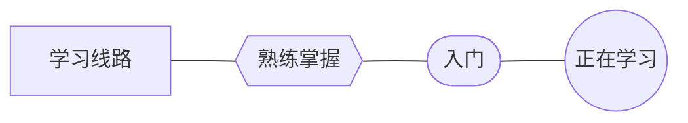

# :bowling: Bowling's TechStack

!!! note "私、アイドル宣言"
    

        写代码是热爱，写到世界充满爱！
    

这是 Bowling 的笔记本📓。我想把自己学过的技术都记录下来，搭建起自己的技术栈。

## Current Working On

图例：

路线：

## TechStack

> 参考：
>
> * [Developer Roadmaps](https://roadmap.sh/)
> * [Wikipedia](https://en.wikipedia.org/wiki/Computer_science)

### 基础

* [ ] [Markdown](basic/Markdown.md) 及其扩展
    * [ ] [MkDocs](basic/Markdown.md#MkDocs)
    * [ ] [Mermaid](basic/Markdown.md#Mermaid)
* [ ] Linux
    * [ ] ==《Linux 就该这样学》==
* [ ] Git
    * [ ] ==《Git Pro》==

### Web 开发

* [ ] 网络知识
    * [ ] HTTP
      * [ ] ==图解HTTP==
    * [ ] TCP/IP
      * [ ] ==图解TCP/IP==

* [ ] 前端
    * [ ] HTML
        * [x] Head First HTML & CSS
    * [ ] CSS
        * [ ] CSS Secret
    * [ ] JavaScript
        * [ ] ==MDN==
        * [ ] JavaScript 高级编程语言
        * [ ] JavaScript DOM 编程艺术
    * [ ] React
        * [ ] React Docs
* [ ] 后端

### 理论计算机科学

* [ ] 数据结构和算法
* [ ] 计算理论
* [ ] 信息论与编码理论
* [ ] 编程语言和编译器
    * [ ] C
        * [ ] ==C Primer Plus==
        * [ ] ==C Standard Library==
    * [ ] C++
        * [ ] C++ Primer
    * [ ] Java
        * [ ] On Java 8
* [ ] 编程语言理论和形式化方法

### 计算机系统

* [ ] 计算机体系结构与计算机工程
* [ ] 操作系统
    * [ ] 深入理解计算机系统
* [ ] 并发、并行与分布式系统
* [ ] 计算机网络
    * [ ] 计算机网络：自顶向下方法
* [ ] 计算机安全和密码学
* [ ] 数据库和数据挖掘

### 人工智能

* [ ] 人工智能基础（基础：数据结构与算法、数学分析）

### 计算机应用技术

* [ ] 计算机图形学和视觉
    * [ ] OpenGL
    * [x] 计算机图形学编程 使用OpenGL/C++
    * [ ] OpenGL 编程宝典
* [ ] 软件工程

