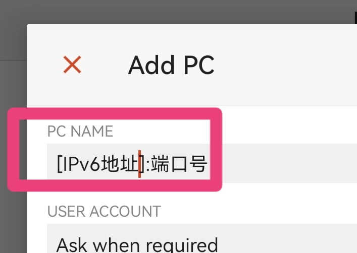
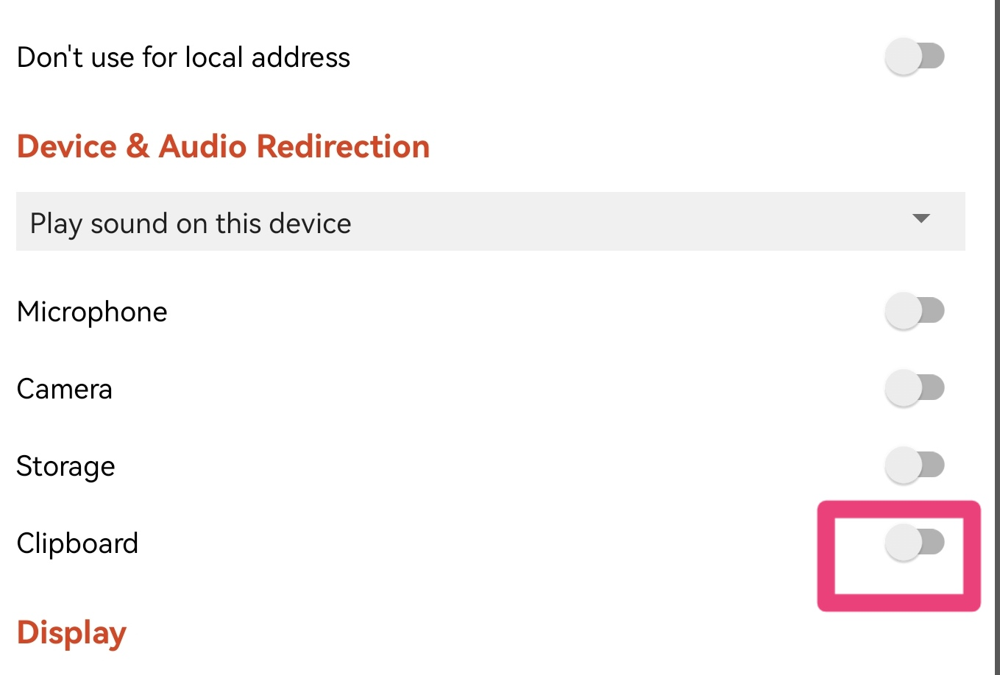
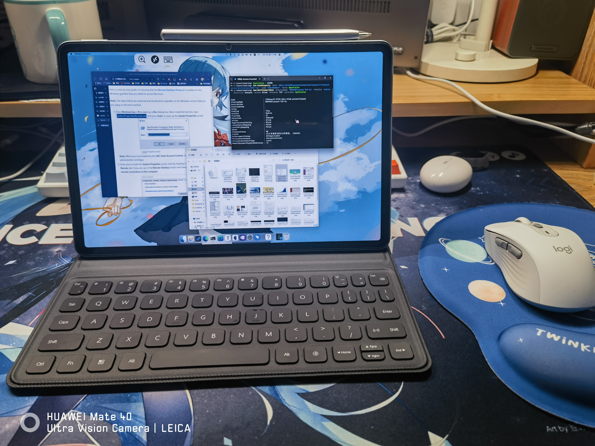

# 远程桌面教程

<!-- prettier-ignore-start -->
!!! abstract "摘要"
    
    你是否也因为笔记本太大太重而不想把它背去教室？身边的平板因功能不如电脑也没有多少用武之地？不妨试试把电脑放在宿舍，平板远程控制。这样只需要携带轻薄的平板就好啦~

    本教程写的很详细，电脑小白只要照着做应该也能完成！
<!-- prettier-ignore-end -->

## 准备

- 电脑端：放在宿舍，连上有线网络（建议）或者 `ZJUWLAN-Secure`。
- 移动端
    - 安装 {: style="height:20px;width:20px"}`Microsoft Remote Desktop`。这是微软开发的远程桌面客户端，使用体验最好。
    - 建议使用连接了蓝牙键鼠的平板，以获得笔记本的体验。触控笔也可。

## 电脑端设置

<!-- prettier-ignore-start -->
!!! quote
    
    参考 98 帖子：[校外使用rvpn连接内网Windows 10电脑](https://www.cc98.org/topic/5482686)
<!-- prettier-ignore-end -->

- 打开远程桌面功能：按 ++win+r++，输入 `SystemPropertiesRemote.exe`，打开远程桌面功能，如下设置：


- 以管理员模式打开 `PowerShell`：搜索框输入 `Windows PowerShell`，右键，以管理员身份运行。


- 更改远程桌面端口号：逐行输入并运行以下命令。可以将 `3390` 更改为你自己的数值（建议为 `65535` 以内的五位数）。

   ```powershell
   $portvalue = 3390
    Set-ItemProperty -Path 'HKLM:\SYSTEM\CurrentControlSet\Control\Terminal Server\WinStations\RDP-Tcp' -name "PortNumber" -Value $portvalue 
    New-NetFirewallRule -DisplayName 'RDPPORTLatest-TCP-In' -Profile 'Public' -Direction Inbound -Action Allow -Protocol TCP -LocalPort $portvalue 
    New-NetFirewallRule -DisplayName 'RDPPORTLatest-UDP-In' -Profile 'Public' -Direction Inbound -Action Allow -Protocol UDP -LocalPort $portvalue 
    ```


- 获取电脑的 IP 地址：在设置-网络-以太网（有线）或 WLAN 页面中可以找到自己的 IPv6 地址，记录下来。


<!-- prettier-ignore-start -->
??? info "技术细节"
    
    - 为什么要更改端口号？

    出于安全性考虑，学校屏蔽了远程桌面的默认端口，因此需要更改。

    - 为什么使用 IPv6 地址？

    在校园内网，不同子网段的 IPv4 地址常常不能互连。但 IPv6 地址可以，这可能与校网环境有关。此外 IPv6 地址的租期似乎更长，更加稳定。
<!-- prettier-ignore-end -->


电脑端设置完成。

## 移动端设置

以安卓平板为例，苹果设备同理。

- 打开 `Remote Desktop` 应用，点击右上角的 `+` 号添加远程主机。


- 填入 IPv6 地址和端口号，如：`[xxxx:xxxx:xxxx:xxxx:xxxx:xxxx:xxxx:xxxx]:12345`。注意：IPv6 地址用中括号括起来。



- 添加自己的微软账户（如果你的电脑登录了微软账户）或本地账户（未使用微软账户）。


- 下拉选择需要与电脑共享的设备，一般开启剪贴板共享即可（在电脑和平板之间共享剪贴板）。



- 点击保存。
- 点击刚刚添加的远程主机，即可连接。初次连接可能会弹出一些警告窗口，勾选不再提醒并确认即可。
- 享受远程桌面体验吧！



如果移动端无法连接，可能是电脑端 IPv6 地址发生了变化，更改地址即可。

## 疑难解答