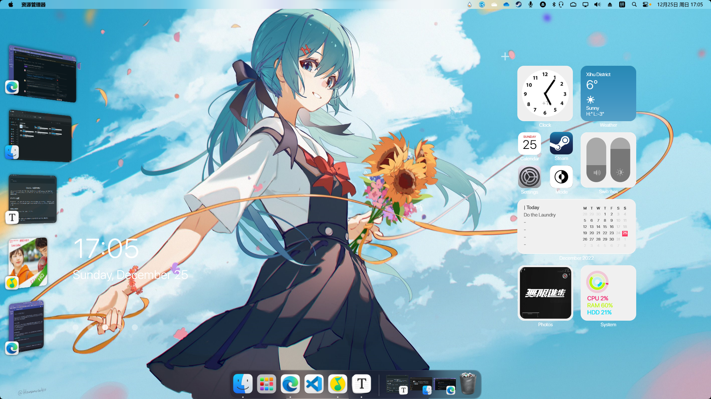
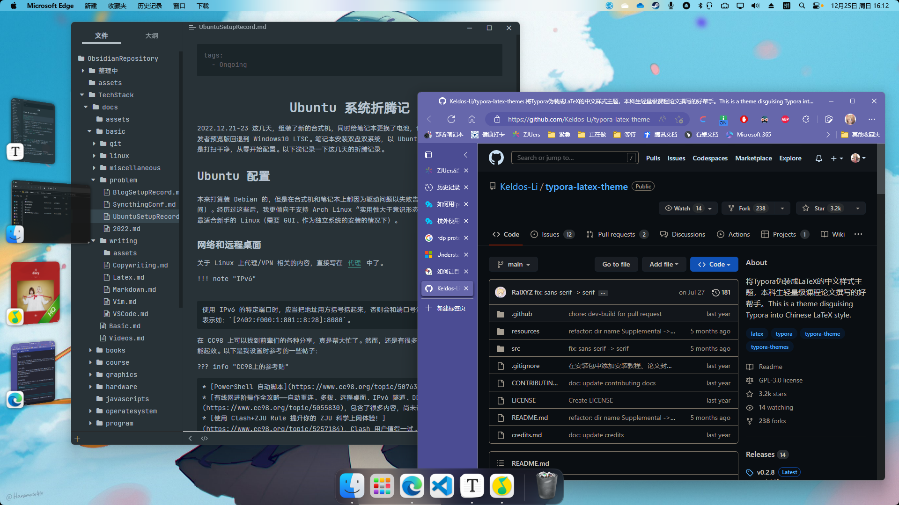

# 电脑折腾记

2022.12.21-23 这几天，组装了新的台式机，同时给笔记本更换了电池，也将系统从 Windows11 开发者预览版回退到 Windows10 LTSC。笔记本安装双盘双系统，以 Ubuntu 作为主系统。两台机子都是打扫干净，从零开始配置。以下浅记录一下这几天的折腾记录。

## Ubuntu 配置

本来打算装 Debian 的，但是在台式机和笔记本上都因为驱动问题以失败告终（浪费了我半天的时间）。经历过这些后，我更倾向于支持 Arch Linux “实用性大于意识形态”的选择。Ubuntu 果然是最适合新手的 Linux。

### 网络和远程桌面

关于 Linux 上代理/VPN 相关的内容，直接写在 [代理](../../webdev/webserver/Proxy.md) 中了。

<!-- prettier-ignore-start -->
!!! note "IPv6"
    

    使用 IPv6 的特定端口时，应当把地址用方括号括起来，否则会和端口号混在一起导致错误。正确的表示如：`[2402:f000:1:801::8:28]:8080`。
<!-- prettier-ignore-end -->

在 CC98 上可以找到前辈们的各种分享，真是帮大忙了。然而，还是有很多东西要自己试过才知道能不能起效。以下是我设置时参考的一些帖子：

<!-- prettier-ignore-start -->
??? info "CC98上的参考贴"

    * [win10校园网自建VPN & 自动重连脚本（PowerShell）](https://www.cc98.org/topic/5076398)，实测可用。
    * [有线网进阶操作全攻略——自动重连、多拨、远程桌面、IPv6 隧道、DDNS、自建内网穿透……](https://www.cc98.org/topic/5055830)，包含了很多内容，尚未详细研究。
    * [在家如何搞学术：远程桌面、ssh、跳板机攻略（针对Win10）](https://www.cc98.org/topic/5483684)
    * [使用 Clash+ZJU Rule 提升你的 ZJU 科学上网体验！](https://www.cc98.org/topic/5257184)，Clash 用户值得一试。
    * [校外使用rvpn连接内网Windows 10电脑](https://www.cc98.org/topic/5482686)，主要涉及更改默认端口。
<!-- prettier-ignore-end -->

1. 更改端口：在内网（特别是相同子网）访问时，不需要更改端口。如果出现找不到设备，很可能是因为 RDP 协议的 `3389` 端口被校网出于安全原因禁用了。

至今仍未解决的问题是：

-   通过 rvpn 在校外连接电脑的远程桌面。初步判断为手机端网卡 IPv6 功能不完善（查询是有 IPv6 网址的，但是联不通）。
-   被控端，连接 l2tp 后无法被远程桌面连接，断开后可以。

### 蓝牙连接

<!-- prettier-ignore-start -->
??? info "blueman"
    
    一个管理蓝牙设备的软件 `blueman`，在 GitHub 有 [项目主页](https://github.com/blueman-project/blueman)，可以通过它监测各个蓝牙设备的连接状况。
<!-- prettier-ignore-end -->

首先，需要在 `/etc/bluetooth/main.conf` 中找到并修改如下值，才能连接蓝牙耳机：

```conf
ControllerMode = dual
```

连接成功后，试听了歌曲感觉音质很差，怀疑是蓝牙编码的问题。Ubuntu 自带 `SBC` 编码，而现在的蓝牙耳机至少都是 `AAC` 起步。于是查找资料，了解了一些 Linux 音频系统的知识。

Ubuntu 的音频由 [`pluseaudio`](https://wiki.archlinux.org/title/PulseAudio) 管理。插件 [`pulseaudio-modules-bt`](https://github.com/EHfive/pulseaudio-modules-bt) 为 `pluseaduio` 提供了 AAC、LDAC 等蓝牙编解码器。但该插件仓库作者已经不再维护，PPA 源也仅支持到 Ubuntu 20.04。查看 Issue 得知作者已经转移到 [`PipeWire`](https://wiki.archlinux.org/title/PipeWire)，经过一番查找，我也找到了使用 PipeWire 支持高质量音频编码的博客：[在 Ubuntu 21.10 上启用蓝牙 LDAC/AAC/AptX 高质量音频编码支持](https://kenvix.com/post/setup-ubuntu-21-10-ldac/)。

按照博客安装完成后，我的蓝牙设置选项中并无 AAC 编码可选。阅读 [Gist：Enable PipeWire on Ubuntu 22.04](https://gist.github.com/the-spyke/2de98b22ff4f978ebf0650c90e82027e) 发现 AAC 支持需要使用 [PPA：pipewire-extra-bt-codecs](https://launchpad.net/~aglasgall/+archive/ubuntu/pipewire-extra-bt-codecs)，按说明完成安装后，就可以选用 AAC 编码了。虽然监控显示蓝牙传输仍只有 30 KB/S，但音质已经好很多了。

<!-- prettier-ignore-start -->
??? info "参考"
    
    * [知乎：如何让Ubuntu系统支持LDAC，APTX，AAC编码（提升蓝牙音质）](https://zhuanlan.zhihu.com/p/132409283)
    * [Bilibili：耳机性能基础自测](https://www.bilibili.com/video/BV16t411N7tS/)，可以测试你的蓝牙连接性能有多好。
<!-- prettier-ignore-end -->

### 有线连接

拆机修理过程中，我弄断了笔记本无线网卡的天线，不得不被迫体验一把 Ubuntu 连有线网络。目前个人尝试下来，GUI 界面最好使用 GNOME 自带的 VPN，CLI 最好使用求是潮的 [zjunet](https://github.com/QSCTech/zjunet)。如果会使用 CLI，那么 `zjunet` 不需要我过多介绍，你能自己了解它的使用方法（阅读 README 和使用 `-h`）。以下介绍 GNOME 的配置。

首先，Linux 发行版基本都不会附带 L2TP 协议支持，所以必须先用无线联网，或在其他电脑上下载好相关软件包。在 Ubuntu 中使用图形界面的 `network-manager` 时，需要：

```bash
sudo apt install network-manager-l2tp network-manager-l2tp-gnome
```

安装完成后，重启。在 VPN 界面可以创建 L2TP VPN，网关填写 `10.5.1.9`。在 PPP 选项中，“身份验证”全选，安全性及压缩仅勾选 BSD 和 Deflate。配置就完成啦！

<!-- prettier-ignore-start -->
??? note "网关选哪个？"

    在 L2TP VPN 的网关配置中，应当填写 `10.5.1.9` 或 `10.5.1.10` （玉湖测试通过）。注意，网关和 Windows 中的 VPN 服务器不一样。`lns.zju.edu.cn` 、 `10.0.2.72` 和 `10.0.2.73` （VPN 服务器的 IP）都是不行的。

??? info "CC98上的参考贴"

    * [CC98：2019年ubuntu图形界面连接vpn，不再需要命令行](https://www.cc98.org/topic/4848071)
    * [CC98：记录一下Linux下有线接校网](https://www.cc98.org/topic/5394591) 王重阳老师的这个配置我试了不行，不知道是什么原因，或许是教师允许使用的协议不同？
<!-- prettier-ignore-end -->

### 杂七杂八的

-   `gnome-tweaks` 是一个用于优化 GNOME 的小工具，我也不知道它能有什么用。
-   `lollypop` 是 GNOME 的一个不错的音乐播放器，颜值比 `RhythomBox` 高。
-   Ubuntu 默认合盖休眠，虽然开盖恢复时间挺快，但恢复蓝牙需要一段时间。如果正在播放音频，就会社死。设置系统处理电源行为可以参考 [简书：Ubuntu 笔记本设置合盖不休眠](https://www.jianshu.com/p/3fe469fc60c9)。
-   安装 [搜狗输入法 Linux 版](http://shurufa.sogou.com/linux)，比自带输入法好太多。网站上有安装指南。
-   [`tabby` 终端](https://tabby.sh/)，目前我见过最好看，同时方便配置的跨平台终端，甚至提供了 [Web app](https://app.tabby.sh/)。GNOME 自带的终端在使用 zsh 的 powerlevel10k 主题时可能出现问题，tabby 则对各种功能都提供了完善的支持。在我的 Ubuntu 上运行时，资源占用也不高。

## Windows 11 美化

Windows 当然也需要美化啦。在网上看过各式各样的美化效果，最后还是觉得：美化的尽头是 macOS。

想在 Windows 上获得最好的 dock 体验，可以在 Steam 购买 [MyDockFinder](https://www.mydockfinder.com/)，体验非常好，动画流畅。

如果希望让桌面丰富一些，可以安装 Rainmeter 的 [Big Sur RC1](https://www.deviantart.com/fediafedia/art/Big-Sur-RC1-for-Rainmeter-846882462)。

<!-- prettier-ignore-start -->
!!! bug "Weather 组件无法使用"
    

    作者的 apikey 似乎过期了，因此组件显示不了数据。在 `UserVariables.inc`文件中将 apikey 更改为 `21d8a80b3d6b444998a80b3d6b1449d3` 就可以使用了，当然这一密钥也随时面临无法使用的情况。密钥来源：[Weather.com API Access Denied](https://github.com/raiguard/ModernGadgets/issues/274)。
<!-- prettier-ignore-end -->

我的目前的台式机美化效果如图：





## 硬件部分

### 配置

这个台式机是因为看上了华硕的 AP201 机箱配的，具体配置如下：

-   机箱：华硕 AP201
-   主板：微星 B66OM 迫击炮 WIFI DDR4
-   处理器：Intel Core i5-12400
-   内存：镁光 16 GB 普条
-   电源：酷冷至尊 GX750 白色版
-   固态硬盘：三星 980 PRO 500 GB + MZVLW256HEHP
-   机械硬盘：Hitachi 4 TB x2
-   散热器：九州风神 AK400 HW

### 第一次装机

装机前，请务必看一遍硬件茶谈的装机视频：[【装机教程】全网最好的装机教程，没有之一](https://www.bilibili.com/video/BV1BG4y137mG/?spm_id_from=333.1007.top_right_bar_window_default_collection.content.click&vd_source=3010141ca72391f9e3cb40e673c1414e)。该视频几乎囊括了所有细节，比如内存插槽可能只有一侧有锁扣，这正巧是我在安装时遇到的问题。

1. 查看机箱的说明书，它一般会告诉你：对于这个机箱，整机的各个组件应当按照什么样的顺序组装。
2. 在主板上安装 CPU、内存、SSD 和风冷散热器。**动手前请完整阅读**各部分的安装说明，比如 SSD 全长是不需要安装卡扣的，我就为此疑惑了半天。
3. 将各组件装入机箱。在做每一步前，回看硬件茶谈的视频，有一些细节还是需要注意，比如主板可能需要斜插放入机箱，我垂直放进去的时候对不上 IO 挡板。
4. 确保 IO 面板的各个接口线缆**安插到位**，要用力试试。我第一次开机点不亮就是因为 HDMI 线没有完全插入。
5. 打开电源，尝试点亮。
