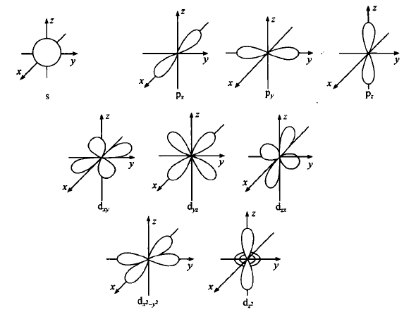
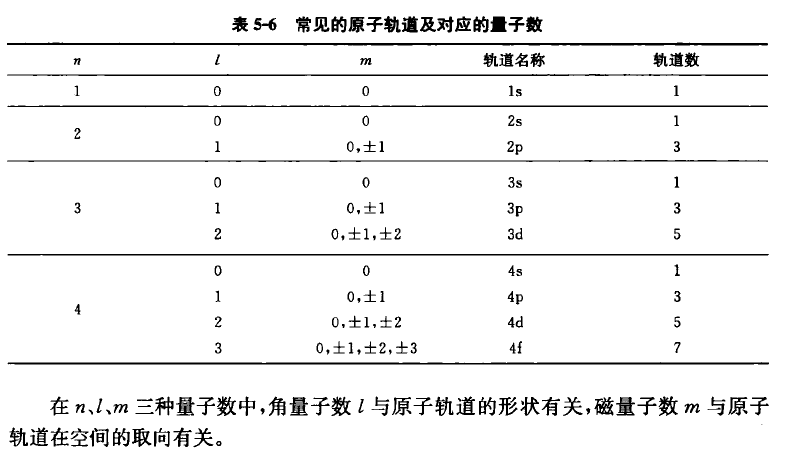
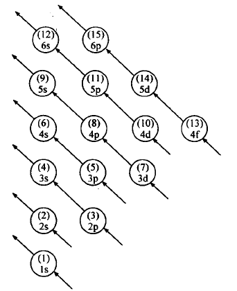
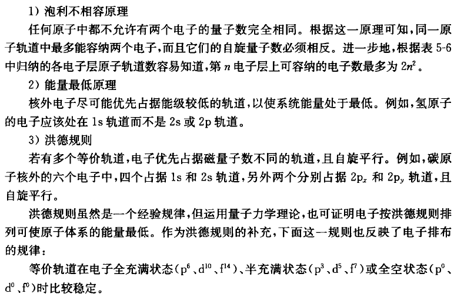
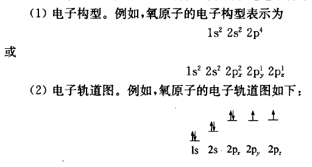
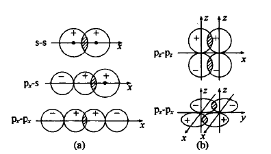

# 物质结构

## 分子结构测定

-   物质结构基本问题：测定原子坐标。
-   测定分子结构用 X 射线晶体衍射技术。通过晶体中电子云密度分布确定原子坐标，从而了解晶体中的分子结构。
-   周期性是晶体与非晶体的根本区别。
-   测定晶体结构需要：测定周期性和对称性、测定不对成单元内各原子坐标值。

## 分子结构的规律

-   键长：成键原子之间的距离。
-   共价半径：认为成键时相邻原子小球紧密接触，原子半径即为键长的一半，称为共价半径。
-   范德华半径：相邻分子最靠近时，它们中最靠近的原子之间的距离。比如相邻分子的羰基氧原子之间最近时距离的一半称为原子的范德华半径。
-   氢键：一种 H 原子参与的原子间作用力。

## 蛋白质结构

略

## 核外电子排布规律

-   核外电子是一种波。波动方程的解是一系列函数。
-   薛定谔方程是描述氢原子核外电子运动的波动方程。求解薛定谔方程可以了解原子核外电子云分布情况。
-   薛定谔方程的解与三种量子数有关：
    -   $n=1,2,3,\dots$：主量子数，即电子层 1，2，3
    -   $l=0,1,2,\dots,(n-1)$：角量子数，即能级 spdf 等，与轨道形状有关
    -   $m=0,\pm1,\pm2,\dots,\pm l$：磁量子数，即轨道 $p_x,p_y$ 等，与轨道在空间取向有关
    -   量子数不同，解出的波函数不同，绘制概率密度图如下

-   第四个量子数 $m_s$ 自旋量子数，可取 $\pm \frac12$。
-   电子排布方式：
-   三大原则：

-   电子排布表达方式：

## 价键理论

-   原子核外的**未成对电子**与另一个原子核外自旋相反未成对电子配对。两个电子所在原子轨道尽可能多重叠，这对自选相反的电子被两个原子共用，形成共价键。
-   共价键具有饱和性、方向性。
-   原子轨道重叠示意图：
-   杂化轨道理论：波函数可以叠加，轨道可以“杂化”
    -   能量相近的若干轨道线性组合为杂化轨道，杂化轨道能量介于形成杂化轨道的原子轨道之间。
    -   杂化轨道数目等于参与杂化轨道数目。
    -   电子填充在杂化轨道上，符合三大原理。
    -   杂化轨道间相互重叠 or 杂化轨道与未杂化轨道重叠，共享电子对形成化学键。

## 分子间作用力

-   范德华力：正负电荷的静电作用（电中性的分子、原子之间）。没有方向性和饱和性。
    -   色散力：相邻原子因色散（由于热运动，正负电荷重心发生偏移，由电中性变成一侧正、一侧负）作用产生瞬间电荷发生的相互吸引（排斥）。
    -   取向力：极性分子之间的静电吸引。
    -   诱导力：取向力诱导分子正负电荷中心更加分开，静电作用更强。也存在于非极性和极性分子间。
-   氢键：氢原子与电负性较大的原子以共价键结合时显正电性，能与另一个电负性较大的原子发生静电吸引。比共价键弱得多，比范德华力强得多。
    -   水、羧酸、醇、胺类化合物、蛋白质和核算等生物大分子中普遍存在氢键。
-   芳环堆积：相邻得芳香环近似平行地、近距离重叠排列。
-   