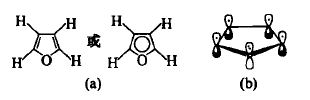
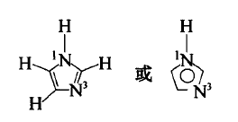
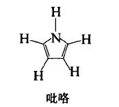
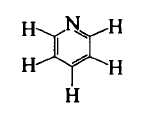
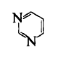
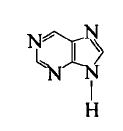
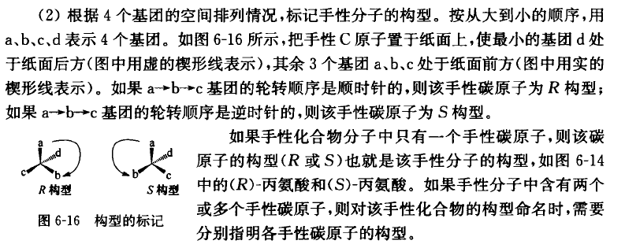

# 有机化合物

## 有机化合物的分类

-   比起高中新增的一些分类：杂环、`-SH` 巯（qiu）基、酰胺基、氰基。

## 有机化合物的命名

略

## 有机物分子结构的基本规律

-   交叉式构象分子能量最低、重叠式构象分子能量最高。
-   顺式、反式异构体。
-   离域键：余下的 p 轨道上电子垂直于 $\sigma$ 键平面。多个原子的原子轨道重叠，共用多个电子。
-   大 pi 键：大的离域键。
    -   芳香性：不易加成、不易氧化、比较容易取代、环稳定。
    -   休克尔规则：含环的有机物，具有平面离域体系，pi 电子数为 $4n+2$，就具有芳香性。

## 杂环化合物

-   呋喃：

-   咪唑：
-   吡咯：

-   吡啶：
-   嘧啶：
-   嘌呤：

## 有机化合物的手性

-   R/S 标记法：原子的原子序数排大小；最小基团在纸后，从大到小顺时针为 R，逆时针为 S

-   旋光性：偏振光透过手性化合物或它的溶液时，偏振面发生旋转，改变的角度称为旋光度。
    -   对映的 R 异构体和 S 异构体使偏振面选装的方向相反。
    -   同一手性化合物 R 异构体和 S 异构体等量组成混合物，溶液旋光度为零，称为外消旋混合物。
-   手性拆分和对映异构转化：略。

## 有机化合物的反应规律

与高中大致相同

## 生物体内合成反应

略

## 小结

