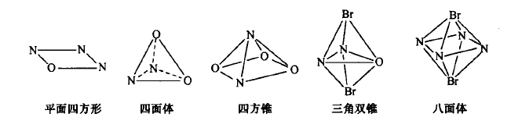
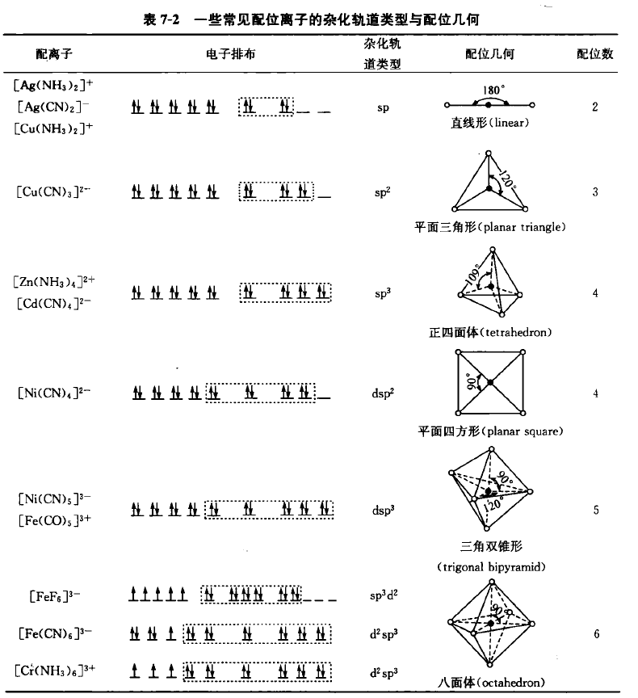
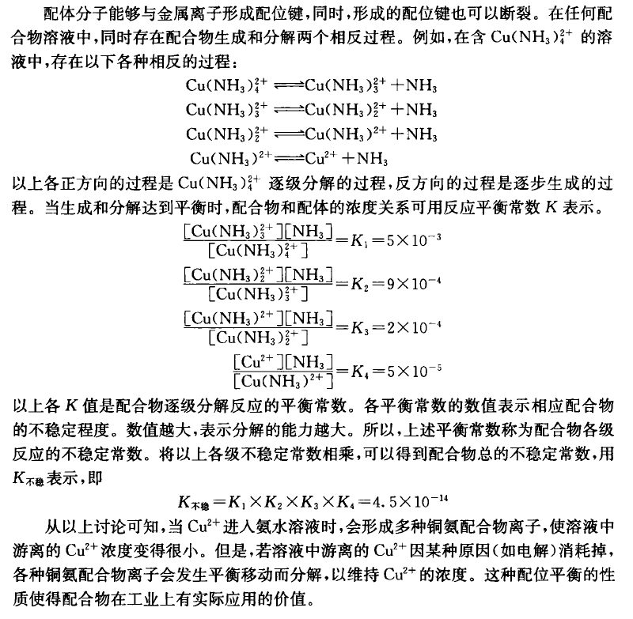

# 配位化学基础

## 配合物的组成和配位方式

-   中心离子或原子：主要是金属。
-   配体：与中心离子有化学键。
-   配合物离子：与抗衡离子之间并无离子键，而存在氢键。
-   配合物分子

-   常见的配位原子：N, O, S 和卤素原子。
    -   单齿配体：只有一个配位原子。
    -   多齿配体：有多个配原子。
    -   一个配体的多个配位原子与同一个中心离子配位，称为螯合配位。
    -   配体同时与多个中心离子配位，称为桥联配位。
    -   双键 pi 键的一对电子与金属离子发生配位，称为 pi 配位

## 配位几何

-   以配位原子为顶点形成的几何图形称为配合物的配位几何。

-   以过渡金属为中心离子的配合物，常见配位数有 4、5、6；以稀土元素为中心常见配位数为 7~12。
-   配合物有两种异构：空间异构、配位键不同异构（竞争配位，轮流处于内界）。

## 配位键理论

## 配体交换和配位平衡

