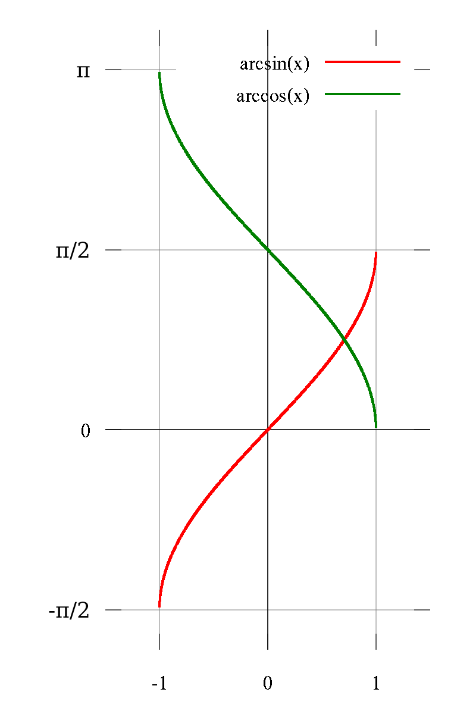

# 反三角函数

数学分析中仅要求掌握一下四个反三角函数。它们的导数、积分见[[基本导数表]]、[[基本积分表]]

|  名称  |                  常用符号                  |           定义           |           定义域            |                          值域                          |
| :----: | :----------------------------------------: | :----------------------: | :-------------------------: | :----------------------------------------------------: |
| 反正弦 |        $\displaystyle y=\arcsin x$         | $\displaystyle x=\sin y$ |   $\displaystyle [-1,1]$    | $\displaystyle [-{\frac {\pi }{2}},{\frac {\pi }{2}}]$ |
| 反余弦 |        $\displaystyle y=\arccos x$         | $\displaystyle x=\cos y$ |   $\displaystyle [-1,1]$    |                $\displaystyle [0,\pi ]$                |
| 反正切 |        $\displaystyle y=\arctan x$         | $\displaystyle x=\tan y$ | $\displaystyle \mathbb {R}$ | $\displaystyle (-{\frac {\pi }{2}},{\frac {\pi }{2}})$ |
| 反余切 | $\displaystyle y=\operatorname {arccot} x$ | $\displaystyle x=\cot y$ | $\displaystyle \mathbb {R}$ |                $\displaystyle (0,\pi )$                |

