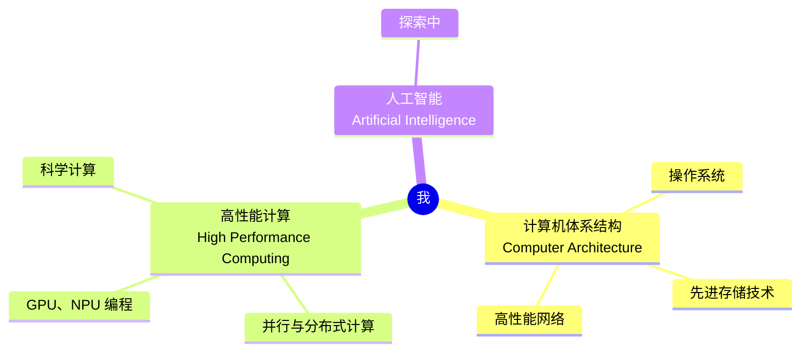

# 首页

!!! success "欢迎来到 Bowling 的笔记本～"

    

        写代码是热爱，写到世界充满爱！
    

## 📒关于笔记

做笔记的确是一门学问。

搭建笔记本的初期，我的笔记本处于十分混乱的状态。大大小小的笔记文档混杂在一起，没有一个完善的体系来管理。于是我逐渐开始思考自己做笔记的目的。笔记可以承担的角色很多：助记、防止遗忘、知识总结、记录思考……想要实现的目标越多，笔记本的体系就越复杂，管理就越困难。初期我试图将笔记作为教程一样写作，但由于自己水平有限，最后难免成为搬运工，并没有多少自己的产出，这样的重复劳动意义并不大。**于是在重构笔记本时，我决定让自己轻松一些，将笔记作为纯粹的个人笔记，不再追求完美，更加偏重对自己的实用性。**

现在的这个笔记本更像一个助记簿，只会用尽可能简洁的语言记录自己觉得十分重要的知识，方便自己查阅，可能并不适合他人。不常用的、量太大的内容，也不会记录，而是给出链接、索引等。**至于教程类的文章，我想后续会使用博客的形式呈现给大家**，这或许是一个更好的选择。

## 😉关于我

我主攻的领域方向如下图所示，也代表该笔记本的主要内容。

