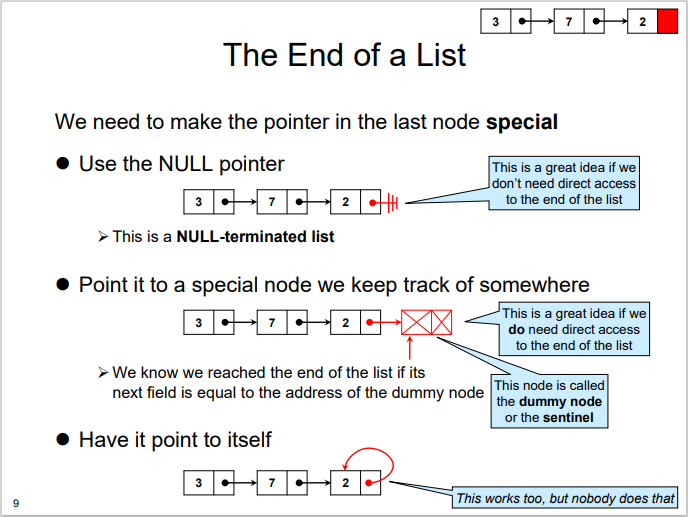

# 关于结构和高级数据类型的一切

## Chapter 14 Structures and Other Data Forms

-   Keywords: struct, union, typedef
-   Operators: `. ->`
-   structure templates and variables
-   unions and pointers to functions

**One of the most important steps in designing a program is choosing a good way to represent the data.**

### 14.1 Sample Problem

Three skill to learn

-   setting up format (or layout) for structure
-   declaring variables to fit that layout
-   gaining access to the members (or fields) of structure

### 14.2 Setting Up the Structure Declaration

-   Structure declaration is often referred to as **template**.

Structure declaration:

-   keyword `struct`
-   optional **tag**
-   list of structure members `{}`
-   semicolon after the closing brace `;`

<!-- prettier-ignore-start -->
!!! example
    
    ```c
    struct book
    {
        char isbn[16];
        double price;
    } book1, *books [10]; //variable names followed
    ```
<!-- prettier-ignore-end -->

Scope:

-   if declared inside a function, can only be used inside that function
-   if declared externally, available to all the functions **followed**

### 14.3 Defining a Structure Variable

<!-- prettier-ignore-start -->
!!! example 
    
    ```c
    struct book book1, *books[10];
    ```
<!-- prettier-ignore-end -->

Initialization of a structure variable is similar to array:

<!-- prettier-ignore-start -->
!!! example

    ```c
    struct book book1 = { "1234556", 11.11 }; //list of initializers
    struct book book2 = { .price = 11.11, .isbn = "123" }; //designated initializers (C99)
    ```
<!-- prettier-ignore-end -->

> Storage Class Duration:
>
> if you initialize a variable with static storage duration (static external linkage, static internal linkage, or static with no linkage), you have to use **constant** value.

Gaining access to structure members: `.` member operator. It has **higher precedence** than `&` and `*`.

**Designated initializer:** `={.value = 25.99, ...};`, notice the use of dot operator

### 14.4 Arrays of Structures

> Structure and Memory:
>
> -   Array is an **automatic storage class object**, typically place on the **stack**.
> -   Large array can cause runtime error.
>
> Solution:
>
> -   make the array static or external
> -   use the compiler options to set the stack size larger

### 14.5 Nested Structures


> print out particular numbers of blanks: `printf("%40s", " ");`

### 14.6 Pointers to Structures

Pointer to structures is a good idea:

-   pass a pointer as an argument is more efficient

> On some systems, the size of a structure may be greater than the sum of its parts. That's because the system's alignment requirements,

Member Access by Pointer: `->` equals to `(*pts).member`

### 14.7 Telling Functions About Structures

-   Passing members: function doesn't care about whether it's a member of a structure; it only requires the **corresponding type**
-   Using the Structure Address
-   Passing a Structure as an Argument: will create automatic variable, initialized to be copies of the values

Structure can be assigned to each other. This works **even if a member is an array**

-   called/calling function

**【nodus】** Character Arrays or Character Pointers in a Structure

-   where the arrays are stored?
-

### 14.8 Saving the Structure Contents in a File

### 14.9 Structures: What Next?

### 14.10 Unions: A Quick Look

Unions: store different data types in the same memory space (but not simultaneously)

Union template:

```C
union hold{
    int digit;
    double bigfl;
};
```

The compiler allots enough space so that it **can hold the largest** of the described possibilities.

Initialization:

-   initialize **a union to another union** of the same type
-   initialize the **first element**
-   use a **designated initializer**

> However, sometimes it can be useful to use one member to place values into a union and to then **use a different member for viewing the contents**.

Usage:

-   in a structure for which the stored information depends on **one of the members** (usually the flag indicating which member is used)

Anonymous Unions:

### 14.11 Enumerated Types

Enumerated type: declare **symbolic names** to represent **integer constants**

-   Keyword: `enum`

-   enum constants are **type int**

-   Purpose: to enhance the readability of a program

Enum declarations: keyword, tag, **enumerators ** (identifiers, symbolic constants)

```C
enum spectrum {red, orange, yellow, green, blue, violet};
enum specturm color;//variable
color = blue;//assignment
printf("%d", red);//use alone
```

> `enum` in C and C++:
>
> -   C allows you to apply the `++` operator to an enumeration variable

Values:

-   Default values: begin with 0

-   Assigned values: `enum levels {low = 100, medium = 500, high = 2000};`

**【Nodus】** Shared Namespaces

-   **Namespace**: to identify parts of a program in which a name is recognized

-   Structure **tags**, union tags, and enumeration tags in a particular scope all share the same namespace, and that namespace is different from the one used by **ordinary variables**.

> Namespace in C and C++:
>
> -   C++ doesn’t allow this because it puts **tags and variable names into the same namespace**

### 14.12 typedef: A Quick Look

### 14.13 Fancy Declarations

### 14.14 Functions and Pointers

Function Pointer: telling which function to use

```C
void qsort( void *ptr, size_t count, size_t size,int (*comp)(const void *, const void *) );
int cmp(const void *a, const void *b);
```

-   A pointer to a function can hold the address marking the start of the function code.

-   To specify the function type, specify the function signature

    `int (*pf)(char *)`

-   Assign to it the addresses of functions: the name of a function represent the address of the function

    `pf = ToLower`

-   Usage: `(*pf)(mis)` or `pf(mis)`

-   Function pointer as parameter: `void show(void (* fp)(char *), char * str)`

-   with `typedef`: `typedef void (*V_FP_CHARP)(char *)`, `V_FP_CHARP pfun`

-   with array: `	V_FP_CHARP arpf[4] = {ToUpper, ToLower}`


## 数据结构

### 链表

>   内容来自 CMU [CS 15-122]

<!-- prettier-ignore-start -->
??? tip "与表有关的英文单词"
    
    - linked-list
    - list
    - table
    - form

    这些名词代表了不同的数据结构或应用。链表指的是 `linked-list`。
<!-- prettier-ignore-end -->

-   链表由节点构成，节点含有数据和指向下一个节点的指针。
-   链表可以由数组或基于指针的结构实现。

处理头、尾部节点有多种方式：



在本课程中，采用第二种方式：设置尾部哑节点。

-   列表的片段（Segment）
    -   本课中，我们认为片段是左闭右开的。这符合尾部哑节点的处理处理方式。
    -   **编写函数** `bool is_segment(list * start, list * end)`。
-   如何检查链表中的循环？
    -   **编写函数** `bool is_acyclic(list* start)`。
    -   
