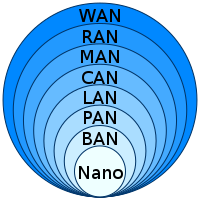

# 网络基础

辨析几个名词：

* 互联网（Internet，因特网）
  * 互联网是指网络与网络之间所串而连成的一个逻辑上的单一巨大国际网络，这些网络以一组通用的协议相连。
* 万维网（World Wide Web、WWW、Web、全球广域网）
  * 万维网是一个由许多互相链接的超文本组成的系统，可以理解为**互联网的一项服务**，通过互联网访问。
  * 万维网是由**超链接和统一资源标志符连接**的文件和其他资源的全球集合。
  * 万维网资源通常使用**HTTP或HTTPS访问**，是**互联网通信协议**的其中之一。
* 以太网（Ethernet）
  * 以太网（英语：Ethernet）是一种计算机局域网技术

## 电脑网络层级

> 参考文献：
>
> [全球互联网拓扑探索](https://steinslab.io/archives/2210)
>
> [趣谈网络协议](https://doc.vercel.app/netprotocol/article/8590.html#%E5%B0%8F%E7%BB%93)
>

### 网络层级

从我们身边常用的开始：

* LAN（Local Area Network，局域网）
  * 技术：以太网、Wi-Fi
  * 连接住宅、学校、实验室、大学校园或办公大楼等有限区域内计算机
  * 在这一层设备之间可以**直接交换流量**
* MAN（Metropolitan Area Network，城域网）
  * 标准：IEEE802.6
  * 一个大学校园、城市或都会区
* WAN（Wide Area Network，广域网、外网、公网）
  * 国际性的远程网络
  * 能连接多个地区、城市和国家，或横跨几个洲并能提供远距离通信
  * 可能是私有的
* Internet（互联网）
  * 由全球所有服务器和网络设备组成，面向**公共**服务

网路服务实体：

* ISP（Internet Service Provider，互联网服务供应商）

