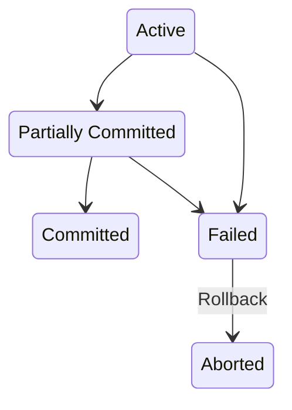
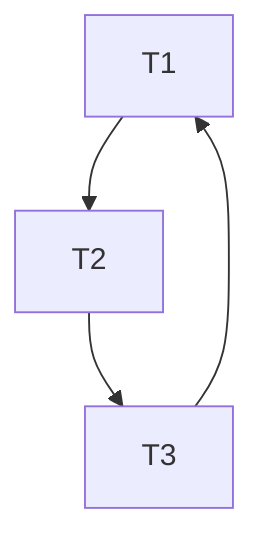

---
tags:
  - 读书笔记
  - 需要整理
---

# 📖 数据库系统概念

## 关系代数

| Operation | Description | Symbol |
| --- | --- | --- |
| Select | satisfy a **predicate** | $\sigma_{predicate}(relation)$ |
| Project | select a subset of **attributes** | $\Pi_{attribute-list}(relation)$ |
| Cartesian-Product | combine two relations | $relation_1 \times relation_2$ |
| Join | combine two relations | $\sigma_{common\ predicate}(relation_1\times relation_2) = relation_1 \bowtie_{predicate} relation_2$ |
| Basic Set Operation | union, intersection, difference | $relation_1 \cup relation_2, relation_1 \cap relation_2, relation_1 - relation_2$ |
| Assignment | assign a new name to a relation | $new\_relation \leftarrow expression$ |
| Rename | rename the attributes of a relation | $\rho_{new\_name(new\_attribute\_list)}(relation)$ |

## 第四章

!!! abstract

    - Join
    - View
    - Index
    - Transaction
    - Integrity Constraint
    - Data Types and Schemas
    - Authorization

### 联结 Join

- 联结的种类：inner、left outer、right outer、full outer
- 联结的条件：natural、on、using

#### 自然联结：匹配公共属性相同的元组

注意下面两个的不同：

```sql
from student natural join takes natural join course

from student natural join takes, course
where takes.course_id = course.course_id
```

为防止上面的情况，一般使用 `using` 指定联结列：

```sql
from (student natural join takes) natural join course using (course_id)
```

使用 `on` 指定联结条件：

```sql
from student join takes on student.ID = takes.ID
```

#### 外部联结

可以理解为：如果没有匹配的元组，就用 NULL 填充其他属性。保留所有信息。

有 left、right、full 三种。关系代数符号：⟕、⟖、⟗。

#### 内部联结

使用自然联结时，会自动去掉重复的（联结所使用的）列。内部联结则保留。

### 视图 View

```sql
create view v as <query expression>
```

相当于存储了一个表达式。

Materialized view：存储了结果，而不是表达式。

允许简单视图的更新。

```sql
insert into faculty values ('30765', 'Green', 'Music');
```

### 索引 Index

```sql
create index <name> on <relation-name> (attribute);
```

### 事务 Transaction

作为一个整体执行的一组操作。

事务的结尾必须是 commit 或 rollback。

### 完整性约束 Integrity Constraint

常见：

```sql
not null
primary key
unique(a1, a2, ...)
check(predicate)
```

- unique 指明了 superkey，其中 candidate key 可以是空的，primary key 不可以。
- check 可以含有查询，比如

```sql
check(time_slot_id in (select time_slot_id from time_slot))
```

#### 引用完整性 Referential Integrity

默认拒绝。

cascade 级联操作

```sql
foreign key (a1, a2, ...) references r(b1, b2, ...)
    on delete cascade
    on update cascade
```

#### 断言 Assertion

数据库始终满足的条件。

```sql
create assertion <assertion-name> check (predicate)
```

### 触发器 Triggers

对数据库进行修改时的副作用。

ECA：Event-Condition-Action

- 事件：insert、delete、update
    - 发生前后：`after update of salary on instructor`
    - 引用发生前后的值：`new.salary`、`old.salary`

```sql
create trigger setnull_trigger before update of takes
    referencing new row as nrow
    for each row
        when (nrow.grade= ' ')
        begin atomic
            set nrow.grade = null;
end;
```

### 数据类型和模式 Data Types and Schemas

- date、time、timestamp、interval
- Large Object: BLOB (binary)、CLOB (character)，查询时返回定位器 pointer 而不是实际数据
- 自定义：
    - `create type Dollars as numeric (12,2) final`
    - `create domain person_name char(20) not null`

### 授权 Authorization

- 权限 privilege：read、insert、update、delete
    - index、resources、alteration、drop

```sql
grant <privilege list> on <relation or view> to <user list>
grant select on  department to Amit,Satoshi
revoke <privilege list> on <relation or view> from <user list>
create role <name>
grant <role> to <users>
```

## 第五章

!!! abstract

    - SQL 编程
    - 函数和过程

### JDBC

- Open connection
- Create statement
- Execute query
- Fetch result
- Handle Errors

#### SQL Injection

不使用字符串拼接，而是使用参数化查询。

```java
PreparedStatement pstmt = conn.prepareStatement("select * from student where ID = ?");
pstmt.setString(1, "12345");
ResultSet rs = pstmt.executeQuery();
```

这里的 `?` 就是参数。

```java
setString
setInt
setDate
```

#### 结果

```java
while (rs.next()) {
    System.out.println(rs.getString("ID"));
}
```

元数据 `.getMetaData()`：

```java
ResultSet rsmd = rs.getMetaData();
int numCols = rsmd.getColumnCount();
for (int i = 1; i <= numCols; i++) {
    System.out.print(rsmd.getColumnName(i) + "\t");
    System.out.print(rsmd.getColumnTypeName(i) + "\t");
}
```

#### 事务

```java
conn.setAutoCommit(false);
conn.commit();
conn.rollback();
```

### 函数与过程

```sql
create function f (a1 type1, a2 type2, ...) returns type
    begin
    declare v1 type1;
        select ... into v1
        from ...
        where ...;
    return v1;
end;

select ...
from ...
where f(a1, a2, ...) = ...;
```

表函数：

```sql
create function f (a1 type1, a2 type2, ...) returns table (c1 type1, c2 type2, ...)
    begin
    ...
end;
```

过程：

```sql
create procedure p (in a1 type1, out a2 type2, inout a3 type3, ...)
    begin
    ...
end;

declare a2 type2;
call p(a1, a2, a3, ...);
```

常用语句：

```sql
while ... do
    ...
end while;

repeat 
    ...
until ...
end repeat;

declare n interger default 0;
for r as 
    select ... from ...
    where ...
do
    set n = n + r.budget
end for;

if ... then
    ...
elseif ... then
    ...
else
    ...
end if;
```

## 第六章 E-R 模型

设计数据库的两种模式：ER 模型、范式理论。

- Entity：由 attributes 描述，如 `instructor=(ID, name, dept_name, salary)`
- Relationship：多个 entities 之间的联系。Relationshop Sets 表示为：$\{(e_1, e_2, ..., e_n)|e_i \in E_i\}$
- 整体用 ER 图表示
- 基本概念：entity sets、relationship sets、attributes

### Relationship Set

- 可以有 attributes
- Degree：relationship 的元素个数。一般都是二元关系 binary relationship。

### Attribute

- Simple/Composite
- Single-Valued/Multi-Valued
- Derived
- Domain：属性的取值范围

### E-R 模型

- 基本概念：实体集、关系集、属性
- entity set, extension of the entity set, attributes possessed by each member of an entity set, simple attributes, composite and multivalued attributes, value
- relationships of the same type, relationship instance, participation, entity's role, descriptive attributes, degree of the relationship set
- Complex Attributes: domain (value set), simple, composite, single-valued, multivalued, derived
- Mapping Cardinalities: one-to-one, one-to-many, ..., total, partial participation, minimum and maximum cardinality
- Primary Key: primary key of the "many" side is a minimal superkey, replace the non-binary relationship set as an entity, weak entity set, identifying entity set, discriminator attributes, strong entity set, existence dependent, own, identifying relationship
- Removing Redundant Attributes in Entity Sets: <!-- Skip From 6.6 -->

### 关系型数据库

标准化方法：

- 一个给定的关系提要是不是好的形式
- 如果不是，无损分解为更小的关系提要

## 第六部分：查询处理与优化

查询需要被分解成能用关系代数表示的操作。有多种分解方法，需要找到代价最低的。

// TODO：查询过程

### 第十五章：查询处理

本章学习对各种操作进行估值的算法，以及如何估计这些操作的代价。

### 第十六章：查询优化

## 第七部分：事务管理 Transaction Management

- 事务：逻辑上的一组操作。
- 原子性（atomicity）：要么全部执行，要么全部不执行。
- 持久性（durability）：一旦事务提交，其结果就是永久的。
- 隔离（isolation）：并发执行的事务之间需要隔离，不应该互相影响。
- 一致性（consistency）：事务执行前后，数据库应该保持一致性。

事务的以上性质合称为 ACID 特性。

### 第十七章：事务 Transaction

!!! abstract

    讲解事务的抽象的性质。介绍用可串行化（serializability）来描述事务的隔离性。

#### 事务模型

在本章建立的模型中，考虑事务对数据执行两类简单操作：`read(X)` 和 `write(X)`，分别表示从硬盘读取数据到内存和将内存中的数据写回硬盘。并且，`write(X)` 操作立即发生。在第十九章恢复管理中，会讨论何时将数据写回硬盘。

一个示例的事务如：

```text
T1: read(A); A := A - 50; write(A)
```

事务具有状态，如下图所示：



- 实现原子性：由恢复系统（recovery system）负责。
    -所有对数据库的更改（modification）都在执行前先写入日志（log）中。记录的内容包括事务、数据、新旧值。
    - 如果事务没有成功执行（abort），就应当由恢复系统执行借助日志（log）进行回滚（roll back）。
- 实现持久性：同样由恢复系统负责。第十九章将讨论如何应对硬盘上的数据丢失。本章考虑主存中的数据丢失，可以通过：
    - 写回完成后再返回事务完成
    - 事务更新的有关信息写入磁盘，以便故障恢复后重建
- 实现隔离：一种办法是串行执行。并发执行由并发控制系统（concurrency control system）负责。

#### 事务的调度

- 调度（schedule）：用于表示事务中的具体指令（instruction）的执行顺序。
    - 不同事务中访问相同数据的指令，只要其中一个为写指令，就会产生冲突。
    - 不冲突的指令可以交换执行顺序。能通过交换顺序得到的调度称为冲突等价。
- 冲突可串行化（conflict serializable）：一个调度是某个可串行（serial）调度的等价。

!!! example

    ```text
        T1   |   T2
     read(A) | 
     write(A)|
             | read(A)
             | write(A)
     read(B) |
     write(B)|
    ```

    等价于下面这个串行的调度：

    ```text
        T1   |   T2
             | read(A)
             | write(A)
     read(A) | 
     write(A)| 
     read(B) |
     write(B)|
    ```

- 视图等价（view equivalent）：两个调度中事务读取和写入的数据均相同。
- 视图可串行化（view serializable）：视图等价于某个可串行调度。

!!! example

    视图可串行化但不冲突可串行化的例子：

    ```text
        T1   |   T2     |   T3
     read(A) |          |
             | write(A) |
     write(A)|          |
             |          | write(A)
    ```

    这样的调度有盲写（blind write）的问题。

- 前驱图（precedence graph）：用于判断一个调度是否可串行化。
    - 节点表示事务
    - 边表示一个事务的操作依赖于另一个事务的操作（即读取了另一个事务的写入结果）
    - 如果图中没有环（acyclic），那么调度是可串行化的，串行化的结果就是前驱图的拓扑排序。



- 可恢复调度（recoverable schedule）：如果事务 T2 读取了事务 T1 的写入结果，那么 T1 必须在 T2 之前提交（commit）。否则就会出现幻读等问题。
- 级联回滚（cascading rollback）：一个事务的回滚导致其他事务的回滚。比如一个事务写入的数据此后被多个事务使用，然后该事务回滚，那么其他事务也需要回滚。
- 无级联调度（cascadeless schedule）：不存在级联回滚的调度。
    - 读取某个事务的写入结果前，保证该事务已经提交即可。
    - 无级联调度是可恢复的。

#### 并发控制

所有调度都是冲突或视图可串行化（conflict/ view serializable）的，可恢复的（recoverable）和无级联的（cascadeless）。

#### 一致性级别 Levels of Consistency

- 串行（serializable）：默认
- 可重复读（repeatable read）：只读取已提交的数据
- 读已提交（Read commited）：读取已提交的数据
- 读未提交（Read uncommited）：读取未提交的数据

### 第十八章：并发控制 Concurrency Control

!!! abstract

    介绍几种并发控制技术以保证事务隔离：封锁（lock）、时间戳（timestamp）、多版本（multiversion）。

#### 并发执行可能产生的几种问题

- 丢失更新（lost update）：两个事务同时读取数据，然后一个事务更新数据，另一个事务再更新数据。
- 脏读（dirty read）：一个事务读取了另一个事务的中间结果。比如，一个事务读取了另一个事务更新的数据，但随后另一个事务回滚了。
- 不可重复读（nonrepeatable read）：字面意思。隔离性应当保证事务连续两次读取相同数据获得的值一样。
- 幻读（phantom read）：相同的查询在事务执行过程中返回不同的结果。或者第二次读取相同数据时被告知不存在。

### 第十九章：恢复管理 Recovery Management

## 关系型数据库

!!! abstract "知识结构"

    主要依据的书籍为：

    - MySQL Crash Course 入门
    - MySQL Cookbook 深入理解

    可以按两种方式梳理 MySQL 的知识：

    - 语句
    - 对象

    需要掌握的语句：

    ```text
    SHOW, CREATE, SELECT, ...
    ```

    需要掌握的对象：

    - 数据库
    - 表
    - 函数
    - 视图
    - 存储过程
    - 游标
    - 事务

### 数据类型

==todo==

### 语句

- `CREATE`：知道数据库、表、视图、索引、过程、用户怎么创建

    ```mysql
    # 数据库
    CREATE DATABASE databasename;
    # 表
    CREATE TABLE tablename
    (
        column datatype [NULL|NOT NULL] [CONSTRAINTS],
        #...
    );
    # 视图
    CREATE [OR REPLACE] VIEW viewname
    AS
    SELECT 
    #...
    ;
    # 索引
    CREATE INDEX indexname
    ON tablename (column [ASC|DESC], ...);
    # 过程
    CREATE PROCEDURE procedurename( [parameters] )
    BEGIN
    #...
    END;
    # 用户
    CREATE USER username[@hostname]
    [IDENTIFIED BY [PASSWORD] 'password'];
    ```

- `SELECT`：

    ```mysql
    SELECT columnname [AS name], ...
    FROM tablename, ...
    [WHERE
    GROUP BY 
    HAVING 
    ORDER BY columnname [ASC|DESC]
    LIMIT start OFFSET offset];
    ```

    - 变种：
        - `SELECT DISTINCT` 应用于所有选择的列
        - `SELECT Concat(a, 'b', ...)` 拼接字段，可以结合 `RTrim()` 等函数
    - `ORDER BY`
        - 可以使用非检索列
    - `WHERE`
        - 操作符 `= <> != < <= > >=` `BETWEEN AND` `IS NULL` `IN (val1, val2, ...)`
        - 组合子句：`AND OR`，最好使用圆括号
        - 取反：`NOT` 可用于 `IN`、`BETWEEN`、`EXISTS` 子句
        - `LIKE` 匹配整个列（完全匹配）
            - 通配符：`%` 任意字符任意次数，但不匹配 `NULL`；`_` 单个字符。
        - `REGEXP` 在列值内进行匹配（部分匹配）
            - `.` 任意单字符
            - `a|b` 其中之一
            - `[abC]` 其中一个字符，`[^abC]` 否定，`[a-z]` 范围，`[:alnum:]` 字符类
            - `\\` 前导匹配特殊字符和元字符，如 `\\n`，自身为 `\\\`

                !!! question "为什么是两个斜杠"

                    MySQL 自己解释一个，正则表达式库解释另一个。

            - 重复元字符：`*` 0 或多个，`+` 1 或多个，`?` 0 或 1，`{n}` 指定数目，`{n,m}` 指定范围。用例：`[[:digit:]]{4}`
            - 定位符：`^` 开始，`$` 结尾，`[[:<:]] [[:<:]]` 词开始结尾

        !!! note "`NULL` 的比较"

            MySQL 使用三值逻辑 —— TRUE, FALSE 和 UNKNOWN。任何与 NULL 值进行的比较都会与第三种值 UNKNOWN 做比较。这个“任何值”包括 NULL 本身！也就是说：`NULL = NULL` 是错的。
            
            应当使用 IS NULL 和 IS NOT NULL 两种操作来对 NULL 特殊判断。

- `ALTER TABLE tablename` 仅列出部分常用：
  
    ```mysql
    ALTER TABLE tbl_name
      [alter_option [, alter_option] ...]
      [partition_options];
    alter_option: {
        table_options
      | ADD [COLUMN] col_name column_definition
            [FIRST | AFTER col_name]
      | DROP {CHECK | CONSTRAINT} symbol
      | ALTER {CHECK | CONSTRAINT} symbol [NOT] ENFORCED
      | CHANGE [COLUMN] old_col_name new_col_name column_definition
            [FIRST | AFTER col_name]
      | DROP [COLUMN] col_name
      | DROP {INDEX | KEY} index_name
      | DROP PRIMARY KEY
      | DROP FOREIGN KEY fk_symbol
      | LOCK [=] {DEFAULT | NONE | SHARED | EXCLUSIVE}
      | MODIFY [COLUMN] col_name column_definition
            [FIRST | AFTER col_name]
      | ORDER BY col_name [, col_name] ...
      | RENAME COLUMN old_col_name TO new_col_name
      | RENAME {INDEX | KEY} old_index_name TO new_index_name
      | RENAME [TO | AS] new_tbl_name
    }
    table_option: {
        AUTOEXTEND_SIZE [=] value
      | AUTO_INCREMENT [=] value
      | AVG_ROW_LENGTH [=] value
      | ENGINE [=] engine_name
      | ENGINE_ATTRIBUTE [=] 'string'
      | INSERT_METHOD [=] { NO | FIRST | LAST }
      | UNION [=] (tbl_name[,tbl_name]...)
    }
    ```

### 视图

视图是虚拟的表，使用时动态检索数据，本质上是一个包装的查询，可以用与表基本相同的方式利用。

视图的常用场景：

- 存储一个基础的查询，多次使用
- 结合计算字段，对数据进行格式化
- 过滤不想要的数据

使用方法：

- 可以嵌套
- 不能索引
- 可以和表一起使用，比如和表联结
- 可以 `ORDER BY`

具体操作：

```sql
CREATE VIEW view_name AS;
SHOW CREATE VIEW view_name;
CREATE OR REPLACE VIEW view_name AS;
```

更新视图：视图的更新是对基础表的更新。只要出现了分组、联结、子查询、并等操作，就不能更新视图。大部分视图都是不能更新的。

### 函数

```sql
Concat()
# 文本
Left, Right; Length; Locate, SubString; Lower, Upper; LTrim, Trim, RTrim; Soundex
# 日期
Date, Time, Year, Month, Day, Hour, Minute, Second; Now, CurDate, CurTime; AddDate, AddTime; DateDiff; Date_Add, Date_Format; DayOfWeek
# 数值
Abs, Cos, Exp, Mod, Pi, Rand, Sin, Sqrt, Tan
```

!!! note "日期"

    如果要的是日期，请使用Date() 比如，存储的order_date 值为2005-09-01 11:30:05，则WHERE order_date = '2005-09-01'失败。

!!! note "字符"

    建议使用 `CHAR_LENGTH` 而不是 `LENGTH`，因为 `LENGTH` 对特殊字符可能返回意想不到的结果。比如对于 `¥`，前者返回 1，后者返回 2。

### 触发器

触发器是一些语句，在事件发生时自动执行。MySQL 触发器能够相应 `DELETE`、`INSERT`、`UPDATE` 事件。

```sql
CREATE TRIGGER trigger_name
BEFORE|AFTER DELETE|INSERT|UPDATE
ON table_name
FOR EACH ROW
BEGIN
    -- ...
END;
```

- 对于每个表每个事件只允许一个触发器，因此每个表最多有 6 个触发器。
- 如果 `BEFORE` 触发器失败，操作不执行；如果操作失败，`AFTER` 触发器不执行。

### 联结

很多子查询都可以使用联结完成。

自联结很简单，用别名理解即可。

#### 内部联结 `INNER JOIN`

内部联结得到笛卡尔积。传递给 `ON` 的条件和直接使用 `WHERE` 建立联结相同：

```mysql
SELECT * FROM a, b WHERE a.a = b.a;
SELECT * FROM a INNER JOIN b ON a.a=b.a;
```

用于联结的列会重复出现。手动指定需要的列就是所谓的“自然联结”。

#### 外部联结 `LEFT|RIGHT OUTER JOIN`

需要包含没有关联行的那些行时，使用外部联结。`LEFT|RIGHT` 指定从哪一侧的表格选择所有行。

```mysql
SELECT * FROM a LEFT OUTER JOIN b ON a.a=b.a;
```

#### 交叉联结 `CROSS JOIN`

### 约束

#### 外键

##### `ON` 子句

可以在外键被 `UPDATE` 或 `DELETE` 时指定操作：

- `RESTRICT` 默认，拒绝操作
- `CASCADE` 级联操作，删除或更新主表的行时，从表的行也会被删除或更新
- `SET NULL` 从表的外键列被设置为 `NULL`

#### `INSERT`

- `NEW` 关键字引用新插入的行
- `AUTO_INCREMENT` 在 `INSERT` 执行后才生成值

建议：

- `BEFORE` 用于数据验证和净化
- `AFTER` 用于日志记录和数据审计

#### `DELETE`

- `OLD` 关键字引用被删除的行，全只读

#### `UPDATE`

- `OLD` 关键字引用被更新的行，全只读
- `NEW` 关键字引用新插入的行

### 事务

#### 使用

事务处理（transaction processing）用于维护数据库完整性，确保一批操作要么全部执行，要么全部不执行。

三个术语：Rollback、Commit、Savepoint

!!! warning "无法回退 `CREATE` 或 `DROP`"

!!! warning "`DROP DATABASE` 等语句无法作为事务的一部分"

执行一条 `ROLLBACK` 或 `COMMIT` 意味着事务结束。

```mysql
# Example1 回退
SELECT * FROM table;
START TRANSACTION;
DELETE FROM table;
SELECT * FROM table;
ROLLBACK;
SELECT * FROM table;

# Example2 多表一致性
START TRANSACTION;
DELETE FROM table1 WHERE id=1;
DELETE FROM table2 WHERE id=1;
COMMIT;

# Example3 保存点
START TRANSACTION;
DELETE FROM table1 WHERE id=1;
SAVEPOINT delete1;
DELETE FROM table2 WHERE id=1;
ROLLBACK TO delete1;
COMMIT;
```

#### 锁

### 安全

#### 用户

```mysql
USE mysql;
SELECT user, host FROM user;
CREATE USER 'username'@'hostname' IDENTIFIED BY 'password';
RENAME USER 'oldname' TO 'newname';
DROP USER 'username'@'hostname';
SHOW GRANTS FOR 'username'@'hostname';
GRANT SELECT, INSERT, UPDATE, DELETE ON databasename.tablename TO 'username'@'hostname';
REVOKE SELECT, INSERT, UPDATE, DELETE ON databasename.tablename FROM 'username'@'hostname';
SET PASSWORD FOR 'username'@'hostname' = PASSWORD('newpassword');
```

### 聚合与分组

```sql
AVG, COUNT, MAX, MIN, SUM
```

- 可为这些函数指定DISTINCT
- 如果在GROUP BY子句中嵌套了分组，数据将在最后规定的分组上进行汇总。
- 除聚集计算语句外，SELECT语句中的每个列都必须在GROUP BY子句中给出。

> 🤔这一点是合理的，因为如果有某一列被选择，却不对它进行分组，那它的值要怎么显示？

#### 组合查询

- 多个SELECT语句之间使用UNION合成一个结果返回
- 显然，每个查询的列、表达式等必须相同、兼容
- 会自动去除重复行，使用UNION ALL保留。WHERE无法实现这种。
- UNION组合只能使用一条ORDER BY，出现在最后的SELECT之后。

#### 全文本搜索

- 原理是为指定列中的词创建索引，搜索针对这些词进行。快速决定匹配和频率等。
- 只有 MyISAM 引擎支持，而 InnoDB 不支持
- 创建表时使用 `FULLTEXT` 子句

    ```sql
    CREATE TABLE a
    (
        FULLTEXT(a_column)
    ) ENGINE=MyISAM;
    ```

- 用 `Match()` 和 `Against()` 执行全文本搜索

    ```sql
    WHERE Match(note_text) Against('rabbit');
    ```

    - 这一表达式给出全文本搜索的 rank
- 查询扩展 `WITH QUERY EXPANSION`
- 布尔文本搜索 `IN BOOLEAM MODE`，全文本布尔操作符查表
- 此外有一些使用上的说明，比如出现频率过高的词自动忽略、短词自动忽略、中日文等无词分隔符的语言无法搜索等

### 数据修改

插入：

```sql
INSERT INTO table() VALUE (), (), ...;
```

- 除了 `VALUE`，`SELECT` 的结果也可以插入，且 SQL 不关心返回的列名，只关心位置，这样可以从不同表中导入数据

更新：

```sql
UPDATE table
SET col=newval, col=newval, ...
WHERE condition;
```

- 可以使用子查询
- 若发生错误则该更新的**全部操作**被取消，`UPDATE IGNORE` 忽略错误

删除：

```sql
DELETE table
WHERE condition;

TRUNCATE TABLE;
```

!!! warning "SQL 没有撤销按钮"

### 表操作

`CREATE TABLE`

- `PRIMARY KEY ()` 关键字指定主键，可以是多个列
- `AUTO_INCREMENT` 自动增量
    - 在 `INSERT` 时仍然可以指定值，且后续增量将基于该值
    - `SELECT last_insert_id();` 获得最后一个 `AUTO_INCREMENT` 值
- `NOT NULL` 不允许空值
- `DEFAULT value` 默认值，只能是常量
- `ENGINE=` 指定引擎
    - 外键不能跨引擎
    - 如果需要事务处理，使用 InnoDB
    - 其余情况都可以用 MyISAM
    - MEMORY 引擎：临时表，存放于内存

`DROP TABLE`

`RENAME TABLE a TO b, c TO d, ...;`

### 存储过程

```mysql
CREATE PROCEDURE proc_name(
    OUT p1 INT,
    OUT p2 DECIMAL(5,2)
)
BEGIN
    -- ...
    SELECT *
    INTO p1
    FROM table;
END;

CALL proc_name(@p1, @p2);
SELECT @p1, @p2;
SHOW PROCEDURE STATUS LIKE 'proc_name';
```

存储过程的重点在于业务规则和智能处理。

```mysql
CREATE PROCEDURE proc_name(
) COMMENT 'some comment'
BEGIN

    DECLARE var_name INT;
    DECLARE CONTINUE HANDLER FOR SQLEXCEPTION
    BEGIN
        ROLLBACK;
    END;

    START TRANSACTION;
    -- ...
    COMMIT;

    IF condition THEN
        -- ...
    ELSEIF condition THEN
        -- ...
    ELSE
        -- ...
    END IF;
END;
```

### 游标

游标是一个指向结果集的指针，可以用于遍历结果集。使用流程：

- 声明游标
- 打开游标（真正执行查询）
- 检索数据
- 关闭游标

```mysql
DECLARE cur_name CURSOR FOR SELECT * FROM table;
OPEN cur_name;
FETCH cur_name INTO var1, var2;
DECLARE CONTINUE HANDLER FOR NOT FOUND SET done = 1;
REPEAT
    FETCH cur_name INTO var1, var2;
UNTIL done END REPEAT;
```

