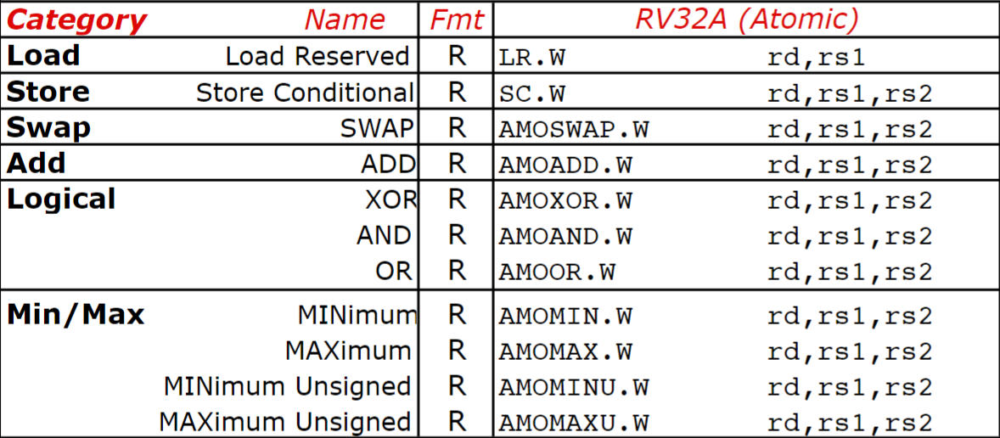

# RISC-V

| 对应课程 | 对应书本 |
| --- | --- |
| 《计算机组成》 | 《计算机组成与设计：硬件/软件接口 RISC-V 版》 |

!!! abstract

    - 算是课程笔记，也算是读书笔记。
    - 正文都是应该记在脑子中的东西，不需要记忆的都折叠起来了。
    - 写得尽可能简略，有些地方一个词代表一整个句子了。

!!! info "参考笔记"

    - [咸鱼暄](https://xuan-insr.github.io/computer_organization/)
    - [大 Q 老师](https://note.hobbitqia.cc/CO/)

## 导论

!!! note "计算机系统八大思想"

    - 摩尔定律 Moore's Law
    - 抽象 Abstraction
    - 普遍情况 Common Case
    - 并行 Parallelism
    - 流水线 Pipeline
    - 预测 Prediction
    - 存储器结构层次 Memory Hierarchy
    - 冗余 Redundancy

性能方面的概念：

- 吞吐量 Throughput：实际处理的任务数
- 带宽 Bandwidth：能够处理的任务数

CPU 的几个指标：

- （程序在 CPU 上总的）执行时间 Execution Time
- （指令所消耗的）时钟周期数 Clock Cycle
- （CPU 的）时钟频率/周期 Clock Rate/Cycle Time
- （指令的）平均周期数 CPI：Cycles Per Instruction
- MIPS：Million Instructions Per Second

其他：

- 不太常见的存储单位：T P E Z Y
- Amdahl 定律（无非就是分有影响没影响）

## RISC-V 32I 指令集

一些东西的大小：

- 寄存器：64b。
- 字 Word：32b。衍生 Half Word、Double Word。
- 地址：64b，即可寻 $2^61$ dword。

一些概念：

- 对齐（其他指令集中重要）：要求 word 起始于 word 整数倍，dword 起始于 dword 整数倍。RISC-V 对此不要求但低效。
- 小端
- 扩展：不足 64b 的数据载入寄存器需要做。
    - lw, lh, lb; lwu, lhu, lbu

### 指令

图片均来自 [RISC-V Reference Card](https://riscv.org/wp-content/uploads/2018/05/1-RISC-V-ISA-Foundation-Overview-DAC2018-1.pdf)

::cards:: cols=2

[
  {
    "title": "寄存器名称",
    "content": "调用者保存，说明被调可以随意使用。<br>被调保存，需要保存后才能覆盖使用。",
    "image": "RISC-V.assets/image-20240508171500133.png"
  },
  {
    "title": "RISC-V 32I",
    "content": "",
    "image": "RISC-V.assets/image-20240508170129915.png"
  },
  {
    "title": "RVM 乘除法扩展",
    "content": "",
    "image": "RISC-V.assets/image-20240508170751558.png"
  },

  {
    "title": "常见伪指令",
    "content": "",
    "image": "https://xuan-insr.github.io/assets/1653470001735-c9b5f2b8-f4c6-48ca-beec-7987bea5d71f.png"
  },
  {
    "title": "指令格式",
    "content": "理解 SB 和 UJ 型指令立即数：[StackOverflow](https://stackoverflow.com/questions/58414772/why-are-risc-v-s-b-and-u-j-instruction-types-encoded-in-this-way)<br>符号位保持在最前面用于扩展，其余位尽可能与其他指令保持一致，用走线避免移位运算。",
    "image": "RISC-V.assets/image-20240508171657744.png"
  },

]

::/cards::

- 名称和意义都要记忆并理解。
- 从意义能推出用法和格式。

### C 与汇编

#### 简单模块

<div class="grid" markdown>

```c title="if-then-else"
if (i == j) f = g + h;
else f = g - h;
```

```mips title="if-then-else"
        beq t0, t1, ELSE
        add t2, t3, t4
        beq x0, x0, EXIT #(j EXIT)
ELSE: 
        sub t2, t3, t4
EXIT:
```

```c title="while"
while (save[i] == k)
    i += 1;
```

```mips title="while"
LOOP: 
        slli t1, t0, 3
        add t1, t1, t2
        ld t3, 0(t1)
        bne t3, t4, EXIT
        addi t0, t0, 1
        beq x0, x0 EXIT #(j LOOP)
EXIT:
```

```c title="switch"
switch (i) {
    case 1: f = g - h; break;
    case 2: f = g * h; break;
    case 3: f = g / h; break;
    case 4: f = g % h; break;
}
```

```mips title="switch"
        blt t0, x0, EXIT
        bge t0, x5, EXIT
        slli t1, t0, 3
        add t1, t1, t2
        ld t1, 0(t1)
        jalr x1, 0(t1)
EXIT:
...
L0:     sub t3, t4, t5
        jalr x0, 0(x1)
L1:     mul t3, t4, t5
        jalr x0, 0(x1)
L2:     div t3, t4, t5
        jalr x0, 0(x1)
L3:     rem t3, t4, t5
        jalr x0, 0(x1)
```

</div>

#### 函数调用

!!! info

    - [Understanding RISC-V Calling Convention](https://inst.eecs.berkeley.edu/~cs61c/resources/RISCV_Calling_Convention.pdf)

函数调用前后的要求，也是我们可以检查正确性的地方：

- `sp` 应当相同
- `s` 寄存器应当不变
- 默认应该返回到 `ra/x1`。

为了完成上面的要求，函数调用归纳为 6 个步骤：

1. 设置参数 `a0-a7/x10-x17`。保存自己需要的寄存器 `a0-a7/x10-x17` 和 `t0-t6/x5-x7,x28-x31`。
2. 调用函数。`jal` 保存返回地址到 `x1/ra`。
3. 移动栈指针 `sp`。保存调用者寄存器 `s0-s11/x8-x9,x18-x27`。
4. 执行。
5. 放置返回值。`a0/x10`。
6. 返回。`jalr x0, 0(x1)`。

<div class="grid" markdown>

```c title="递归"
long long fact(long long n) {
    if (n <= 1) return 1;
    else return n * fact(n - 1);
}
```

```mips title="递归"
fact:
        addi sp, sp, -16
        sd ra, 0(sp)
        sd a0, 8(sp)
        bgt a0, x0, ELSE
        addi a0, x0, 1 #(li a0, 1)
        ld ra, 0(sp)
        ld a0, 8(sp)
        addi sp, sp, 16
        jalr x0, 0(ra)
ELSE:
        addi a0, a0, -1
        jal ra, fact
        ld ra, 0(sp)
        ld t0, 8(sp)
        mul a0, t0, a0
        addi sp, sp, 16
        jalr x0, 0(ra)
```

</div>

### 汇编与机器码

!!! warning "注意 RISC-V 指令是小端存储的，从中读取的立即数也是小端存储的，需要反着来。"

分段：func7（7）、rs2（5）、rs1（5）、func3（3）、rd（5）、opcode（7）。

### 其他

- 各类跳转总结：
    - 长度：
        - PC 相对寻址：branch，SB-type 12b（imm[12:1]）
        - 立即数、基址寻址 jump：UJ，20b（imm[20] + imm[10:1] + imm[11] + imm[19:12]）
    - 32b 地址跳转：结合 `lui` 和 `addi`：

    ```mips
    # 跳转到 0x12345678
    lui t0, 0x12345
    addi t0, t0, 0x678
    jalr x0, 0(t0)
    ```

??? note "锁与原子化 Lock and Atomicity"

​    RVA 扩展原子指令集：

!!! note "总结：一个 C 排序程序"

    ```c
    void swap(long long v[], size_t k)
    {
        long long temp = v[k];
        v[k] = v[k+1];
        v[k+1] = temp;
    }

    void sort(long long v[], size_t n)
    {
        for (size_t i = 0; i < n; i++)
            for (size_t j = 0; j < n - 1; j++)
                if (v[j] > v[j+1])
                    swap(v, j);
    }
    ```

## RISC-V 32I CPU 实现

### 约定

- 时序：寄存器在时钟上升沿更新。
    - 从而可以在一个时钟周期读写同一个寄存器：读到现有值，写入值在下一个上升沿才生效。

### 数据通路

<div class="grid cards" markdown>

-   __R-type__

    ---

    


-   __ImmGen__

    ---

    需要产生的立即数：

    - I-type：`imm[11:0]`
    - S-type：`imm[11:5] + imm[4:0]`
    - B-type：`imm[12] + imm[10:5] + imm[4:1] + imm[11]`

    将指令对应部分引出对应模式，然后根据指令类型选择。

    - Opcode[5]
        - 0：Load I-type
        - 1：Store S-type
    - Opcode[6]
        - 0：Data Transfer ↑
        - 1：Conditional Branch B-type

-   __控制单元__

    ---

    ALU control 四位：`Ainvert`、`Bnegate`、`Operation`，由 `func7`、`func3`、`ALUOp` 产生。

    Control 七位：`ALUOp`（2）、`Mux`（ALUSrc、Branch、MemtoReg、Jump）、`R/W`（MemRead、MemWrite、RegWrite）。由 `opcode` 产生。

    `PCSrc` 由 `Branch` 和 `Zero` 产生。

-   :material-scale-balance:{ .lg .middle } __Open Source, MIT__

    ---

    Material for MkDocs is licensed under MIT and available on [GitHub]

    [:octicons-arrow-right-24: License](#)

</div>

??? note "其他"

    - Memory 读写都需要控制信号。读错产生的结果与存储器层次结构有关。

### 五级流水线

### 异常与中断

