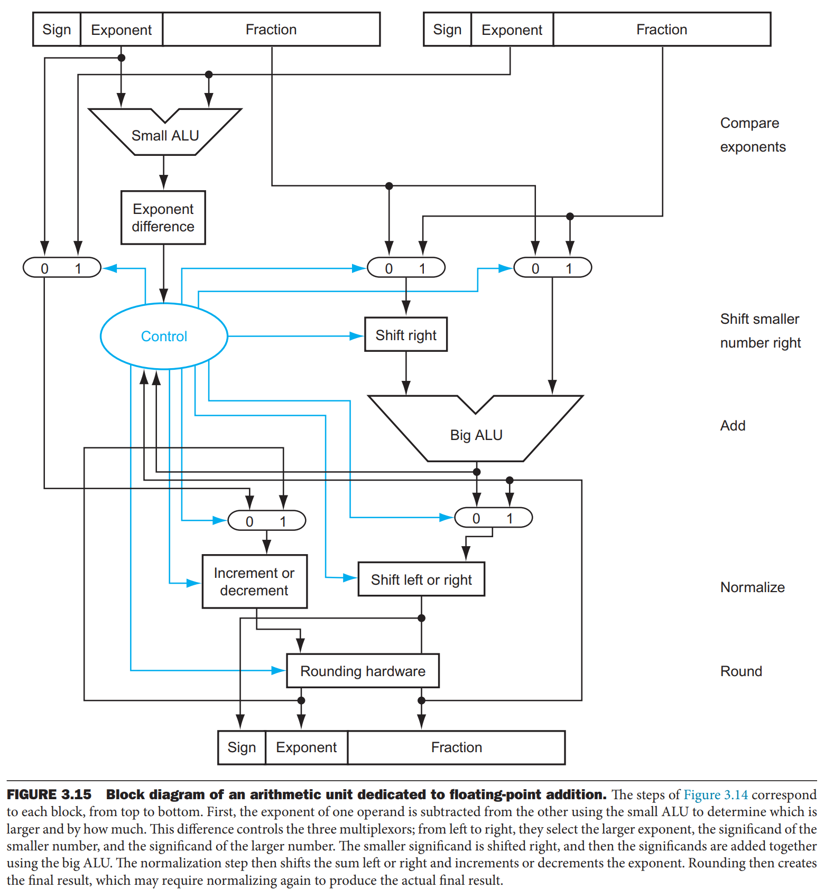

# 数据表示与运算

## 数字

-   __二进制__

    ---

    `111111100101`

-   __八进制__

    ---

    `111 111 100 101`

    `07745`

-   __十进制__

    ---

    `501`

-   __十六进制__

    ---

    `1111 1110 0101`

    `0xFE5`

### 整数

-   __无符号 Unsigned__

    ---

-  __符号加绝对值 Sign-Magnitude__

    ---

-   __补码 Two's Complement__

    ---

-   __反码 One's Complement__

    ---

-  __余码 Diminished Radix Complement__

    ---

### 浮点数

- __IEEE 754 标准__

    ---

    ??? info

        - [IEEE Standard 754 Floating Point Numbers](https://steve.hollasch.net/cgindex/coding/ieeefloat.html)

    | 精度 | 位数 | 符号位（Sign） | 指数位（Exponent） | 尾数位（Mantissa/Significand） |
    | --- | --- | --- | --- | --- |
    | 单精度 | 32 | 1 | 8 | 23 |
    | 双精度 | 64 | 1 | 11 | 52 |

    ??? tip "Reason for Design"

        - 指数使用余码：比较和运算时不需要考虑符号

- __特殊值__

    ---

    ??? info

        - [Denormalized Numbers - IEEE 754 Floating Point](https://stackoverflow.com/questions/15140847/denormalized-numbers-ieee-754-floating-point)

    | 类型 | 指数 | 尾数 | 备注 |
    | --- |  --- | --- | --- |
    | 非规范化数 | $0$ | 非 $0$ | 用于表示非常小的数，需特殊处理。假定小数点前为 $0$ 而不是 $1$。越小精度越低（为什么？）|
    | $0$ | $0$ | $0$ | 有正负 $0$ |
    | 无穷 | $1$ | $0$ | 正负无穷 |
    | NAN | $1$ | 非 $0$ | 非数值 |

- __实数转二进制__

    ---

    - 整数部分：除 2 取余
    - 小数部分：乘 2 取整

- __实数转 IEEE 浮点数__

    ---

    - 符号位 S
    - 转二进制
    - 规范化
    - E=指数+偏移量（余码）
    - 在 M 右侧补位
    - 连接

- __溢出__

    ---

    - 上溢 Overflow：超出表示范围（无法表示）
    - 下溢 Underflow：小数部分过小（精度损失）

    发生溢出时，抛出异常。

- __截断错误__

    ---

    尾数过大时发生截断。

- __运算__

    ---

    - 加减法：
        - 对齐小数点 Align
        - 加减
        - 规范化 Normalize
        - 舍入 Round
    - 乘法：指数尾数分别处理
        - 尾数相乘
        - 指数相加
        - 规范化
        - 符号位
    - 除法与乘法类似

- __舍入方法__

    ---

    ??? info

        - [Floating Point Arithmetic Unit – Computer Architecture](https://www.cs.umd.edu/~meesh/411/CA-online/chapter/floating-point-arithmetic-unit/index.html#:~:text=the%20IEEE%20standard.-,Rounding%20Methods%3A,-Truncate)
        - [How to perform round to even with floating point numbers](https://stackoverflow.com/questions/8981913/how-to-perform-round-to-even-with-floating-point-numbers)

    - 向零舍入 Truncate
    - 向上舍入 Round Up
    - 向下舍入 Round Down
    - （默认）四舍五入到偶数 Round to Nearest Even

    默认的舍入法需要考虑移到尾数外的三个的比特：Guard、Round、Sticky。
    
    GRS - Action
    
    0xx - round down = do nothing (x means any bit value, 0 or 1)
    
    100 - this is a tie: round up if the mantissa's bit just before G is 1, else round down=do nothing
    
    101 - round up
    
    110 - round up
    
    111 - round up

---

以下内容未整理。

- 描述以下存储整数的方法：它们能存储哪些数字？存储、还原的步骤是怎样的？主要应用在哪里？溢出情况如何？
    - 无符号表示法
    - 符号加绝对值表示法（原码）
    - 二进制补码表示法
    - 反码表示法（本书未介绍）

> CSAPP：理解补码表示的方法：把最高位看作权重为$-2^{w-1}$的位
>
> 尝试给出反码运算的数学表达式，并理解反码的表达式是如何构建的？
>
> 注意**反码操作**和**整数的反码表示**。反码表示的整数中，只有负数才进行反码操作。

- **浮点数的上溢和下溢**：举例单精度浮点数最大负值为$-(1-2^{-24})\times 2^{+128}$，其中，尾数 23 位无符号数，最大绝对值为$2^{24}-1$，指数 8 位余码数，最大为$2^{8-1}=128$。最小负值为$-(1-2^{-1})\times 2^{-127}$

## Ch4. 数据运算

关键词：算术运算、移位运算、逻辑运算

### 逻辑运算

位层次和模式层次上的逻辑运算

- 非、与、或和异或
- 思考：如何用其他运算符模拟异或？异或的特性
- 位模式的四种应用：求反、使指定的位复位（置 0）、对指定的位置位（置 1）、使指定的位反转
- **掩码**

### 移位（Shift）运算

- 逻辑移位运算
    - 不带符号位的数：这些移位运算可能改变数的符号
    - 填 0 或循环移位（旋转运算）
- 算数移位运算
    - 假定位模式是使用**二进制补码**存储的带符号整数。
    - 算数右移对整数除二，算数左移对整数乘二，这些运算本不应该改变符号位
    - 算数右移：保留符号位，并复制入右侧位中，因此保存符号
    - 算数左移：丢弃符号位，接受左边为符号位。如果新符号位与原先相同，运算**成功**，否则发生溢出

### 算术运算

#### 二进制补码中的加减法

- 遇到减法时，转变为加法，只需为第二个数求二进制的补
- 加法正常

> ### [深入理解原码，反码，补码的原理](https://www.cnblogs.com/zhxmdefj/p/10902322.html)
>
> 花了很长时间理解补码的构造意图。自己理了一遍逻辑如下：
>
> - 计算机只能进行加法，不能进行减法
> - 由于位数的限制，加法相当于在模运算下进行
> - 模运算下的加法可以看作一个闭环
>
> 由上面三条说明，我们的目标是：在模运算的闭环中用加法模拟减法
>
> - 数学定义：
>     - 对于长度为 $\omega$ 的位向量，它的模为 $2^{\omega}$ ，这一位向量在长度 $0\sim 2^{\omega}-1$ 的环内
> - 要用加法模拟减法 $a - b = c$ ，目的是找到 $d$ 使得 $ (a + d)mod 2^\omega = c$
> - 画出这样一个环，很容易看出加到 $c$ 和减到 $c$ 合起来绕了一个圈，因此： $d = 2^\omega - b$
> - 通过这一等式可以建立从负数 $-b$ 到 $x_d$ 的映射，这个映射把负整数 $b$ 映射为 $d = 2^\omega - b$ 的位模式， $d$ 的位模式就是 $-b$ 的补码表示
> - 这样的映射就是补码操作：先取反码再+1
>
> 接下来再分析以上过程，以 0110 - 0010 = 0100 即 6-2=4 为例
>
> - $x$ 是一个负数
>
> - 找到 $d=10000-0010=1110$。我们发现：**$d$ 可以通过取反码再+1 的找到**。
>
>     原理：$${|x|}_反+|x| = 2^\omega-1$$
>
> - $0110 + 1110 = 10100$ 取模后即为 $0100$
>
>     原理：负数的补码和它的绝对值相加等于模（本质是闭环内绕一圈的两种方法）
>
>     $$2^\omega = x_补 + |x| $$
>
>     - 由以上两式，我们得到了反码和补码的关系：$x_补={|x|}_反+1$
>
> - 要把 $1110$ 映射为 $-2$ ，就需要把最左侧的权重设置为 $-8$
>
> - 为什么把最左侧位的权重解释为 $-8$ 可以做到呢？**其实就是进行了 $-16$ 的操作，反向转了一圈**。$14-16=-2$

> 遇到一个有趣的题目：对于一个补码表示的系统，表达式`~x`的值是多少？
>
> 写出三个函数（数字到二进制补码，反码操作，二进制到数字），对分段函数分类讨论，容易得到，`~x` = $-1-x$

#### 符号加绝对值（原码）表示的加减法

一共有四种不同的符号组合，需要考虑 8 种不同的情况

- 第一步，检查运算，统一为加法
- 第二步，用异或检查两数的符号一致性
- 第三步：若符号相同，绝对值相加；若符号不同，绝对值相减（减法原理同上，转换为补码加法），符号是绝对值较大的符号
    - 此处需要考虑上溢：如果 $A\geq B$ 则有上溢（模运算后舍弃）
    - 如果 $A < B$ 则无上溢，结果是一个负数，应当取其二进制补码（可以这样理解：绝对值部分使用了补码式的减法运算，结果仍然是补码表示。现在取补码就是转换为无符号整数模式，结合先前确定的符号位，就变回符号加绝对值表示）

> 值得注意的是，在该加减法中，符号位和绝对值分开计算。绝对值之间的减法运算仍然与补码相同。比如：17-22，
>
> $ 0010001-0010110 = 0010001 + 1101010 = 1111011$，所得结果是补码表示，需要再进行一次补码以还原为无符号整数表示。

#### 实数的加减法

将实数的加减法简化为*小数点对齐后以符号加绝对值格式存储的两整数的加法和减法*

- 统一为加法
- 去规范化
- 使指数相等
- 相加，处理上溢
- 规范化
- 四舍五入，停止