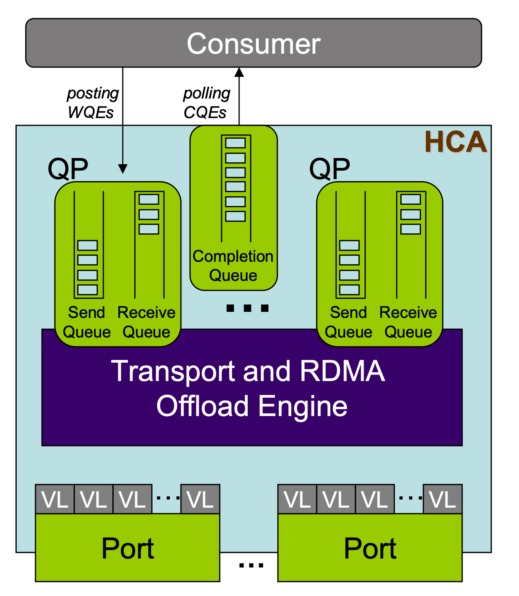

---
tags:
  - 个人笔记
  - 正在做
---

# 📒 高性能网络

## 传统网络的缺点

## RDMA 基本概念

!!! quote

    - [RDMA Tutorial - LSDS](https://www.doc.ic.ac.uk/~jgiceva/teaching/ssc18-rdma.pdf)

### 注册内存区域

RDMA 通信前，需要先注册内存区域 **MR（memory region）**，供 RDMA 设备访问。相关的要求和步骤如下：

- 内存页面必须被 Pin 住不可换出。
- 注册时获得 **L_Key（local key）** 和 **R_Key（remote key）**。前者用于本地访问，后者用于远程访问。

### 异步通信

RDMA 基于三个队列进行**异步**通信：

- Send、Receive 队列用于**调度**工作（work）。这两个队列也合称为 **Queue Pair（QP）**。
- Completion 队列用于**通知**工作完成。

RDMA 通信流程如下：

- 应用程序将 **WR（work request，也称为 work queue element）**放入（post）到 Send 或 Receive 队列。
- WR 中含有 **SGE（Scatter/Gather Elements）**，指向 RDMA 设备可以访问的一块 MR 区域。在 Send 队列中指向发送数据，Receive 队列中指向接收数据。
- WR 完成后，RDMA 设备创建 **WC（work completion，也称为 completion queue element）**放入 Completion 队列。应用向适配器轮询（poll）Completion 队列，获取 WC。

对于一个应用，QP 和 CQ 可以是多对一的关系。QP、CQ 和 MR 都定义在一个 **Protection Domain（PD）** 中。

<figure markdown="span">
    { width=40% align=center}
    <figcaption>
    RDMA 通信队列
    <br /><small>
    [InfiniBand Technology Overview - SNIA](https://www.snia.org/sites/default/education/tutorials/2008/spring/networking/Goldenberg-D_InfiniBand_Technology_Overview.pdf)
</small></figcaption></figure>

### 访存模式

RDMA 支持两种访存模式：

- 单边（one-sided）：**read、write、atomic** 操作。
    - 被动方注册一块内存区域，然后将控制权交给主动方；主动方使用 RDMA Read/Write 操作这块内存区域。
    - **被动方不会使用 CPU 资源**，不会知道 read、write 操作的发生。
    - WR 必须包含远端的**虚拟内存地址**和**R_key**，主动方必须提前知道这些信息。
- 双边（two-sided）：**send、receive** 操作。
    - 源和目的应用都需要主动参与通信。双方都需要创建 QP 和 CQ。
    - 一方发送 receive，则对端需要发送 send，来消耗（consume）这个 receive。
    - 接收方需要先发送自己接收的数据结构，然后发送端按照这个数据结构发送数据。这意味着接收方的缓冲区和数据结构对发送方不可见。

在单个连接中，可以**混用并匹配（mix and match）**这两种模式。

### 内核旁路

RDMA 提供内核旁路（kernel bypass）功能：

- 原先由 CPU 负责的分片、可靠性、重传等功能，现在由适配器负责。
- RDMA 硬件和驱动具有特殊的设计，可以安全地将硬件映射到用户空间，让应用程序直接访问硬件资源。
- 数据通路直接从用户空间到硬件，但控制通路仍然通过内核，包括资源管理、状态监控和清理等。保证系统安全稳定。

!!! question

    事实上，通信双方的 QP 被直接映射到了用户空间，因此相当于直接访问对方的内存。

    如果你对操作系统和硬件驱动有一些了解，不妨想一想下面的问题：

    - 如何才能让应用程序直接访问硬件资源，同时实现操作系统提供的应用隔离和保护呢？
    - 如果在两个独立的虚拟内存空间（可能在不同物理机、不同架构上）之间建立联系？

## Linux RDMA 编程

具体地说，学习的是 `libibverbs` 库。

!!! quote

    - 阅读 [For the RDMA novice: libfabric, libibverbs, InfiniBand, OFED, MOFED? — Rohit Zambre](https://www.rohitzambre.com/blog/2018/2/9/for-the-rdma-novice-libfabric-libibverbs-infiniband-ofed-mofed)，了解这些软件包的关系。
    - 阅读 [InfiniBand: An Introduction + Simple IB verbs program with RDMA Write - Service Engineering (ICCLab & SPLab)](https://blog.zhaw.ch/icclab/infiniband-an-introduction-simple-ib-verbs-program-with-rdma-write/)，了解 PD、MR、QP、CQ、WR、SGE、WC 等基本概念。
    - 阅读 [RDMA Tutorial - Netdev](https://netdevconf.info/0x16/slides/40/RDMA%20Tutorial.pdf)，其中介绍了 `ipv_pd` 等重要的 API。
    - 阅读 [Introduction to Programming Infiniband RDMA · Better Tomorrow with Computer Science](https://insujang.github.io/2020-02-09/introduction-to-programming-infiniband/)，这篇文章逐步讲解了如何编写一个简单的 RDMA 程序，并给出了详细的代码。

    其他参考资料：

    - [RDMA Aware Networks Programming User Manual - NVIDIA Docs](https://docs.nvidia.com/networking/display/rdmaawareprogrammingv17)：作为手册使用。包含 RDMA 架构概述和 ibverb、rdma_cm 等 API 文档。**该文档第八章包含了一个使用 IB Verbs API 编程的例子，具有比较详细的注释，适合初学者学习。**

### ibverbs

#### 准备工作

- 打开设备

    ```cpp
    ibv_device = ibv_get_device_list(), ibv_get_device_name()
    ```

- 初始化上下文

    ```cpp
    // mlx5
    mlx5dv_context_attr
    ibv_context = mlx5dv_open_device()
    // other
    ibv_context = ibv_open_device()
    ```

- 各种信息

    ```cpp
    context->device->transport_type
    ibv_port_attr
    ibv_query_port()
    ibv_device_attr
    ibv_query_device()
    ```

#### 资源创建

顺序从大到小：

- PD：

    ```cpp
    ibv_pd = ibv_alloc_pd()
    ```

- MR：

    ```cpp
    ibv_mr = ibv_reg_mr()
    ```

- QP 和 CQ：

    ```cpp
    ibv_cq, ibv_comp_channel = ibv_create_cq()
    ibv_qp = ibv_create_qp()
    // modify
    ibv_qp_attr
    ibv_modify_qp()
    ```

- WR、SGE：

    ```cpp
    ibv_send_wr
    ibv_recv_wr
    ibv_sge
    ```

#### 连接

```cpp
ibv_modify_qp() // 修改为 RTS
ibv_create_ah()
```

!!! TODO "address handler 的作用"

#### 通信

```cpp
ibv_wc // work completion
ibv_post_send()
ibv_poll_cq()
```

### 学长的 `libr`

#### `rdma_bench.cpp`

- `init_net_param` 检查参数
- `socket_init` 熟悉的 Socket 编程

    ```cpp
    socket()
    for(){
        accept()
    }
    ```

- `roce_init` 打开设备和上下文
- `benchmark` 使用 C++ `thread` 执行测试函数
    - `sub_task_server`
    - `sub_task_client` 发送、轮询、计时

运行参数：

```shell
# server
./rdma_bench --threads 24
# client
./rdma_bench --serverIp 10.0.0.8 --nodeId 1 --threads 24
```

## Linux RDMA 运维

```bash
ib_read_bw
show_gids
```


---

待整理

- 交换芯片 BlueField：用于 DPU 产品线，简单来说就是网卡上有独立的 CPU，可以处理网络流量。例如，下面是 BlueField-2 DPU 的架构图：

<figure markdown="span">
    { width=50% align=center}
    <figcaption>
    BlueField-2 DPU 架构
    <br /><small>
    [Nvidia Bluefield DPU Architecture - DELL](https://infohub.delltechnologies.com/en-us/l/dpus-in-the-new-vsphere-8-0-and-16th-generation-dell-poweredge-servers/nvidia-bluefield-dpu-architecture/)
</small></figcaption></figure>

## RoCE 原理

??? quote

    - [端到端 RoCE 概念原理与部署调优](http://www.bj-joynet.com/static/upload/file/20221025/1666684563267006.pdf)：大部分是实际操作，没有清晰的理论讲解。

RoCE 协议存在 RoCEv1 和 RoCEv2 两个版本，取决于所使用的网络适配器。

- RoCE v1：基于以太网**链路层**实现的 RDMA 协议 (交换机需要支持 PFC 等流控技术，在物理层保证可靠传输）。
- RoCE v2：封装为 **UDP（端口 4791） + IPv4/IPv6**，从而实现 L3 路由功能。可以跨 VLAN、进行 IP 组播了。RoCEv2 可以工作在 Lossless 和 Lossy 模式下。
    - Lossless：适用于数据中心网络，要求交换机支持 DCB（Data Center Bridging）技术。

### RoCE 包格式

<figure markdown="span">
    { width=80% align=center}
    { width=80% align=center}
    <figcaption>
    RoCE 包格式
    <br /><small>
    [RoCE 指南 - FS](https://community.fs.com/hk/article/roce-rdma-over-converged-ethernet.html)
</small></figcaption></figure>

## DPDK

## 问题记录

### 编译相关

- 编译 DPDK 时

    ```text
    Generating drivers/rte_common_ionic.pmd.c with a custom command
    FAILED: drivers/rte_common_ionic.pmd.c
    ...
    Exception: elftools module not found
    ```

    解决方法：`pip` 安装 `pyelftools` 模块

## 其他相关知识

- DMA 机制：包括 IOVA、VFIO 等。
- Linux 内存管理机制：包括 Hugepage、NUMA 等。
- Linux 资源分配机制：包括 cgroup 等。
- 基础线程库 pthread。

- Non-Uniform Memory Access (NUMA)：非一致性内存访问。
    - 与 UMA 相比的优劣：内存带宽增大，需要编程者考虑局部性
    - 每块内存有
        - home：物理上持有该地址空间的处理器
        - owner：持有该块内存值（写了该块内存）的处理器
    - Linux NUMA：<https://docs.kernel.org/mm/numa.html>
        - Cache Coherent NUMA
        - 硬件资源划分为 node
            - 隐藏了一些细节，不能预期同个 node 上的访存效率相同
            - 每个 node 有自己的内存管理系统
            - Linux 会尽可能为任务分配 node-local 内存
            - 在足够不平衡的条件下，scheduler 会将任务迁移到其他 node，造成访存效率下降
        - Memory Policy
    - Linux 实践
        - `numactl`
        - `lstopo`

- Hugepage
    - 受限于 TLB 大小，Hugepage 会减少 TLB miss
    - 场景：随机访存、大型数据结构
    - <https://www.evanjones.ca/hugepages-are-a-good-idea.html>
    - <https://rigtorp.se/hugepages/>
    -

