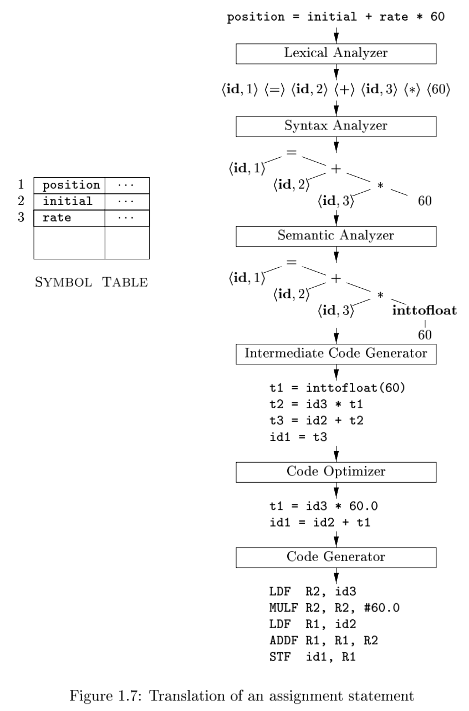
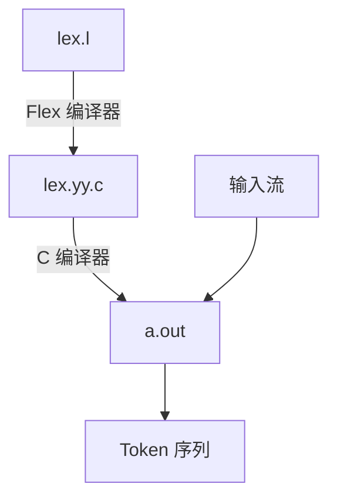

---
tags:
  - 读书笔记
  - 正在做
---

# 📖 编译原理

!!! abstract "书籍信息"

    - **中文版：**[编译原理](https://book.douban.com/subject/3296317/)
    - **英文版：**[Compilers: Principles, Techniques, and Tools](https://suif.stanford.edu/dragonbook/)
    - **原书出版年份：**2006

## 引论

- 回顾程序编译过程：
    - 预处理器：处理头文件和宏定义
    - 编译器：源语言到目标语言
    - 汇编器：汇编语言翻译到机器码
    - 链接器：解决符号引用问题

### 编辑器结构

整体来看分为两个部分：

- 前端（Front End）：进行分析（Analysis），将源程序转换为中间表示，收集信息生成符号表。
- 后端（Back End）：进行综合（Synthesis），转换为目标代码，进行优化。

具体来看分为多个阶段（Phase）：



- **词法分析（Lexical Analysis）或扫描（scanning）**：字符 -> 词素（lexeme） -> token 序列。

    Token 形如：`<token-name, attribute>`。`token-name` 是**抽象符号**，用于语法分析；`attribute` 指向符号表项，符号表中包含变量名、类型、值等信息。

- **语法分析（Syntax Analysis）或解析（parsing）**：使用抽象符号构建语法树。

    语法树的中间节点表示操作，叶子节点表示参数。

- **语义分析（Semantic Analysis）**：使用语法树和符号表进行**类型检查（Type Checking）**，类型信息存储到语法树或符号表中，用于中间代码生成。

    类型检查涉及运算符与操作数是否匹配。

    部分语言发生强制类型转换（coercion），添加如 `inttofloat` 的转换节点。

- **中间代码生成（Intermediate Code Generation）**：将语法树转换为中间代码，通常是**三地址码（three-address code）**。

    三地址码的每个指令最多有三个操作数，形式如 `x = y op z`。

- **代码优化（Code Optimization）**：对中间代码进行优化。

    可能有多种目标，如更快的执行速度、更小的代码体积、更少的能耗等。

- **目标代码生成（Code Generation）**：将中间代码转换为目标代码（汇编）。

    进行**存储分配决策（storage-allocation decision），例如如何选择寄存器存放变量。

此外是涉及所有阶段的**符号表管理（symbol-table management）**，用于存储变量名、类型、值等信息。

这些阶段不一定各自独立，往往被组成为**趟（pass）**。

## Lexical Analysis

!!! "生词表"

    | 单词 | 释义 |
    | ---- | ---- |
    | lexeme | 词素，组成 token |

!!! abstract

    - 正则表达式
    - 如何将正则表达式转换为有限自动机
    - 词法分析器将运行有限自动机

可以自己写词法分析器，也可以将词法规则输入**词法分析器生成器（lexical analyzer generator）**，生成词法分析器。本书使用 Flex 作为词法分析器生成器。

### 3.5 Flex

Flex 编译器将 Flex 语言描述的词法规则转换为 C 语言代码，模拟转换图。



Flex 语法：

```flex
声明
%%
翻译规则 PATTERN { ACTION }
%%
辅助函数
```

