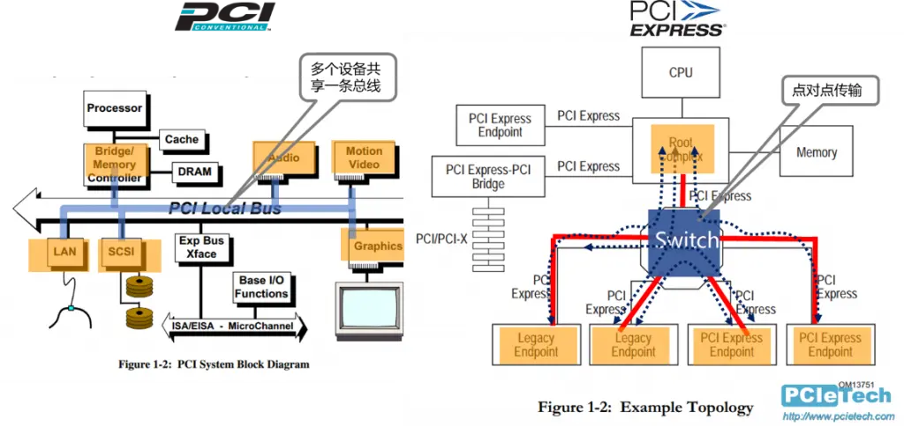
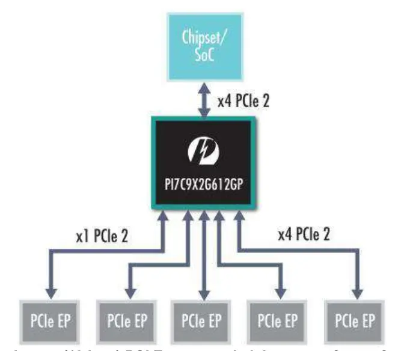
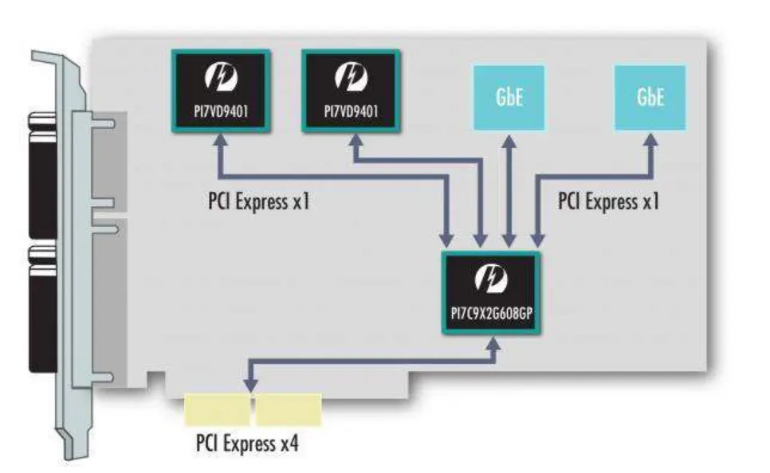

---
tags:
- 个人笔记
---

# 📖 总线

总线（Bus）是计算机系统中用于在各组件之间传输数据、地址和控制信号的公共通信通道。它负责连接CPU、内存、存储设备、I/O设备等，使它们能够高效协同工作。

总线发展的趋势是从并行演变为串行：

- **并行**就是用多根线同时传输数据，**串行**就是用一根线顺序传输数据。看起来串行慢，但并行占用空间大，I/O 引脚过多变得无法接受，且随着传输速率的提高出现了难以解决的串扰问题。
- 这两种总线架构不同：**串行总线只能点对点**连接两个设备，而**并行总线可以在单一总线上连接多个设备**，并且很容易增减总线上的设备。对于串行总线，我们需要使用交换机和多个总线设备连接。

!!! example

    - PCI（Peripheral Component Interconnect）是并行总线，PCIe（PCI Express）是串行总线。
    - ATA（Advanced Technology Attachment）是并行总线，SATA（Serial ATA）是串行总线。
    - SCSI（Small Computer System Interface）是并行总线，SAS（Serial Attached SCSI）是串行总线。
    - USB（Universal Serial Bus）是串行总线。

## PCIe

!!! quote

    - [Best way to learn PCIE protocol from scratch? : r/FPGA](https://www.reddit.com/r/FPGA/comments/1et3zhl/best_way_to_learn_pcie_protocol_from_scratch/)
    - [Specifications | PCI-SIG](https://pcisig.com/specifications)

<figure markdown="span">
    

    { width=80% align=center }
    

    <figcaption>
    PCI 与 PCIe 总线
    </figcaption>
</figure>

PCIe 的学习可以从两个方向入手：

- **硬件方向**：在 FPGA 上实现一个 SERDES（串行解串器）
- **软件方向**：学习 PCIe 协议栈

让我们从软件侧开始，从内核 PCI 驱动入手。

### PCI 驱动

!!! quote

    - Linux Device Drivers, 3rd Edition, Chapter 12: PCI Drivers

### PCIe Switch

!!! quote

    - [Top 3 Uses for PCI Express Switches](https://www.arrow.com/en/-/media/e81e083f51ea49c28099182f435e1ec7.ashx)

PCIe Switch 是一种用于扩展 PCIe 总线的设备，可以将一个 PCIe 总线扩展为多个 PCIe 总线。它利用了 PCIe 串行总线点对点通信的特点。它的应用场景有：

- **扩展 PCIe 总线**：将一个 PCIe 总线扩展为多个 PCIe 总线，可以连接多个 PCIe 设备。**多见于 GPU 服务器**，一般为 4U，支持 8 卡，比如我们的宁畅 X640 G40。

    如下图所示，CPU 只需要向 PCIe Switch 提供 x4 PCIe，就能扩展出 4 个 x4 PCIe 设备和一个 x1 PCIe 设备。当然这肯定会有延迟、带宽之类的损失，比如在该 PCIe Switch 下的所有设备 Host to Device 的**总带宽**只能局限在 x4，但是 Device to Device 带宽一般可以达到满速。

    <figure markdown="span">
        

        { width=60% align=center }
        

        <figcaption>
        PCIe Switch 扩展 PCIe 总线
        </figcaption>
    </figure>

- **拆分 PCIe 总线**：将一个 PCIe 总线拆分为多个 PCIe 总线，可以连接多个 PCIe 设备。多见于 PCIe 转接卡。这里就不会有总带宽的问题，因为每个设备都有独立的 PCIe 总线。

    !!! example

        比如有一些 PCIe x16 转 4 U.2 的转接卡（因为 U.2 每个只占 x4 通道）。这些自带 PCIe Switch 的转接卡不需要主板支持 PCIe 拆分（PCie Bifurcation）。而比较便宜的 PCIe x16 转 4 U.2 转接卡就不带 PCIe Switch，需要主板支持 PCIe 拆分。这就是价格差异的原因。

    <figure markdown="span">
        

        { width=60% align=center }
        

        <figcaption>
        PCIe Switch 拆分 PCIe 总线
        </figcaption>
    </figure>
