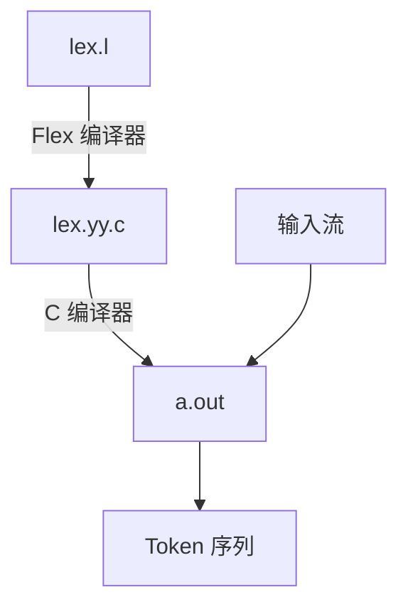

---
tags:
  - 读书笔记
  - 正在做
---

# 📖 编译原理

!!! abstract "书籍信息"

    - **中文版：**[编译原理](https://book.douban.com/subject/3296317/)
    - **英文版：**[Compilers: Principles, Techniques, and Tools](https://suif.stanford.edu/dragonbook/)
    - **原书出版年份：**2006

## Ch3. Lexical Analysis

!!! "生词表"

    | 单词 | 释义 |
    | ---- | ---- |
    | lexeme | 词素，组成 token |

!!! abstract

    - 正则表达式
    - 如何将正则表达式转换为有限自动机
    - 词法分析器将运行有限自动机

可以自己写词法分析器，也可以将词法规则输入**词法分析器生成器（lexical analyzer generator）**，生成词法分析器。本书使用 Flex 作为词法分析器生成器。

### 3.5 Flex

Flex 编译器将 Flex 语言描述的词法规则转换为 C 语言代码，模拟转换图。



Flex 语法：

```flex
声明
%%
翻译规则 PATTERN { ACTION }
%%
辅助函数
```

