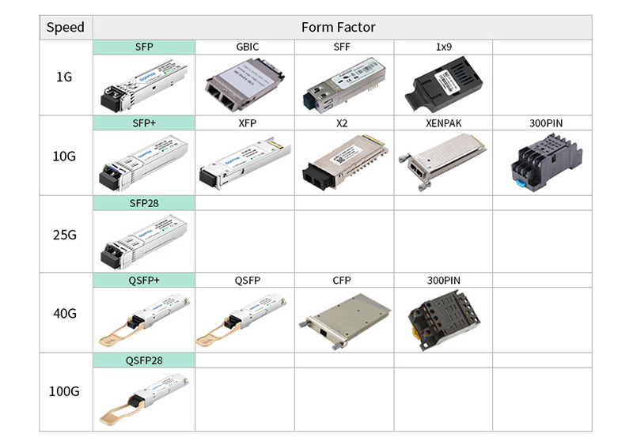
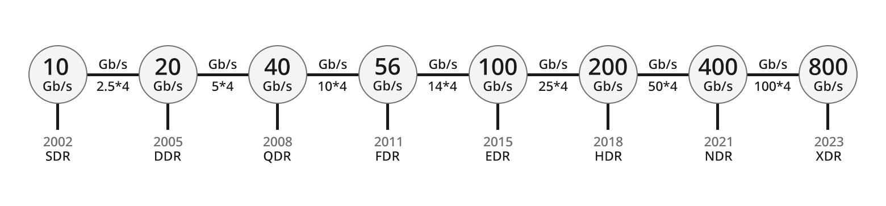
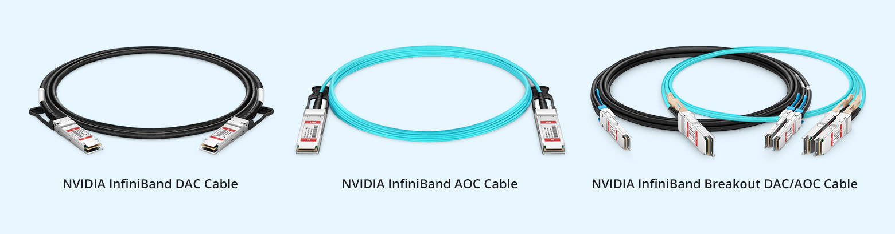

# 硬件

## 控制端口/串行端口

控制端口/串行端口用于网络硬件初始设置、管理、调试。

::cards::

[
  {
    "title": "DB-9/RS-232",
    "content": "",
    "image": "hardware.assets/db9_pinout.jpg"
  },
  {
    "title": "RJ-45",
    "content": "",
    "image": "hardware.assets/rj45_pinout.jpg"
  },

]

::/cards::

## 数据端口

### 光纤

!!! info "[详谈单模光纤和多模光纤的区别及常见疑问解答 | 飞速（FS）社区](https://community.fs.com/cn/article/single-mode-cabling-cost-vs-multimode-cabling-cost.html)"

用于长距离高速通信。

::cards::

[
  {
    "title": "光纤种类",
    "content": "<table><thead><tr><th></th><th>单模SMF</th><th>多模MMF</th></tr></thead><tbody><tr><td>颜色</td><td>黄色</td><td>多种颜色</td></tr><tr><td>纤芯</td><td>细</td><td>粗</td></tr><tr><td>传输</td><td>一种模式</td><td>多种模式</td></tr><tr><td>色散</td><td>小</td><td>大</td></tr><tr><td>带宽</td><td>高</td><td>低</td></tr><tr><td>适用</td><td>长距离</td><td>短距离</td></tr></tbody></table>",
    "image": "hardware.assets/fiber_type.png"
  },
]

::/cards::

::cards::

[
  {
    "title": "光纤接头种类",
    "content": "目前 LC 和 SC 接头应用最广。MTP、MPO 用于 40G 以上的高速网络。",
    "image": "hardware.assets/fiber_connector.webp"
  },
  {
    "title": "端面研磨角度",
    "content": "目前 UPC 在基础网络中应用最多。",
    "image": "hardware.assets/fiber_polishing.jpg"
  }
]

::/cards::

### 信号转换器

!!! info "[SFP Vs SFP+ Vs SFP28 Vs QSFP+ Vs QSFP28 Vs QSFP-DD Vs OSFP, What Are The Differences? (bonelinks.com)](https://www.bonelinks.com/sfp-vs-sfp-vs-sfp28-vs-qsfp-vs-qsfp28-vs-qsfp-dd-vs-osfp-differences/)"

!!! warning "不同种类的信号转换器不能直接连接，比如 SFP 和 SFP+ 虽然长得很相似，但大小不同。"

SFP 和 SFP+ 使用 LC 接头，QSFP 使用 MTP/MPO 接头。

### InfiniBand

!!! info "[InfiniBand Cable: Key Component of High-performance Computing | FS Community](https://community.fs.com/article/infiniband-cable-key-component-of-highperformance-computing.html)"

InfiniBand 支持 1X、4X、8X 和 12X 传输，下面是 4X 情况下各版本的传输速率，DR 是 Data Rate 的缩写：

线缆支持电缆（DAC）和光缆（AOC）两种：

