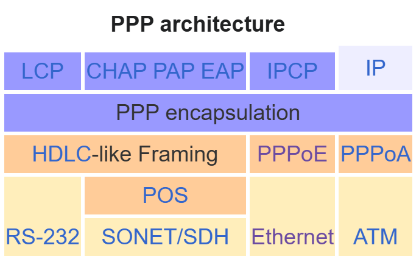
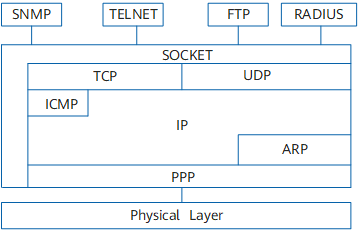
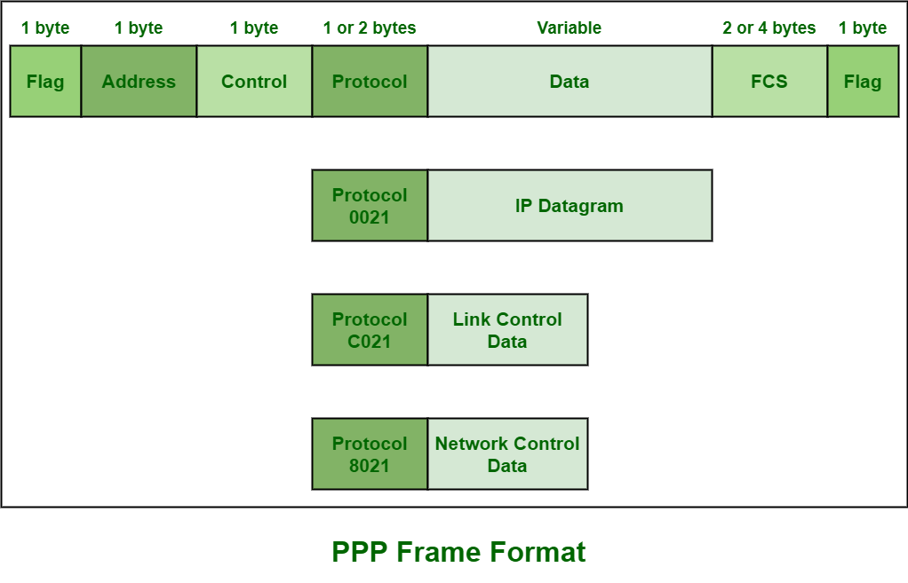
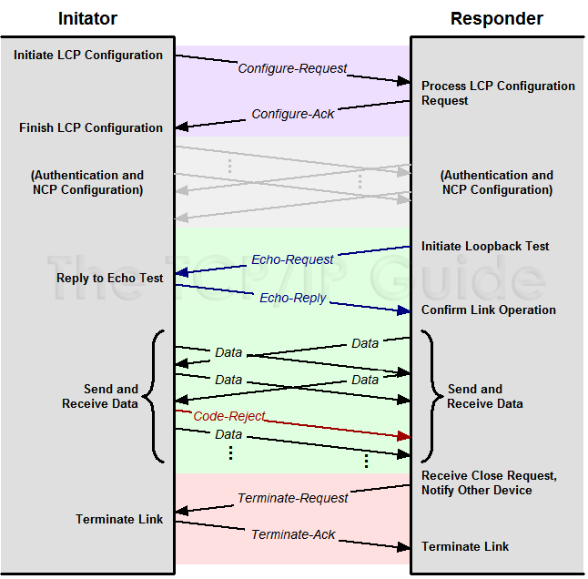
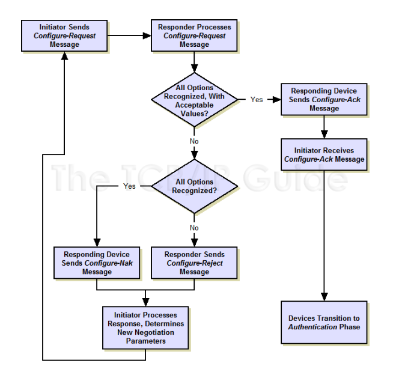
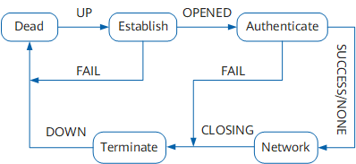
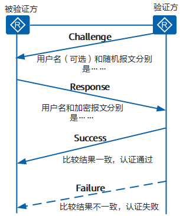
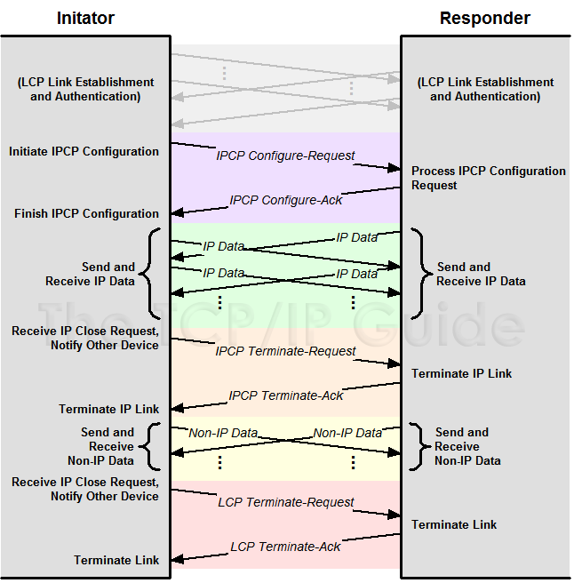
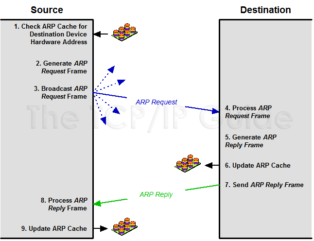
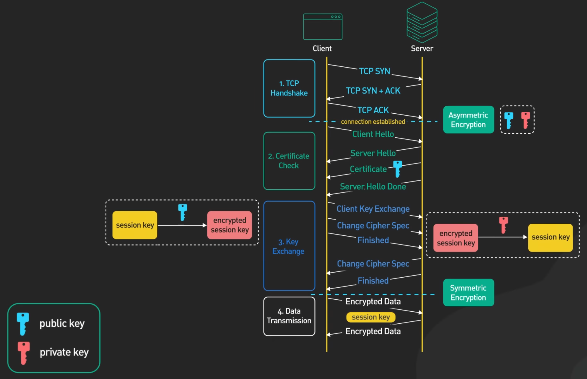

# 网络技术

## 物理层

## 链路层

- MAC 地址 MAC address
    - 6 字节
    - IEEE 管理 MAC 地址空间，分配前 24 比特
    - 广播地址 `FF-FF-FF-FF-FF-FF`

### 以太网技术

以太网向网络层提供无连接、不可靠服务。

以太网不是单一协议标准，而是有多种技术：

- 10BASE-T
- 100BASE-T
- 1000BASE-LX
- 10GBASE-T

这些技术被 IEEE 802.3 标准化。

#### 以太网历史

- 早期以太网采用总线型拓扑，同轴电缆总线连接各节点
- 20 世纪 90 年代采用基于集线器的星形拓扑，集线器位于物理层，重新生成比特并向所有接口传输
- 21 世纪以来采用基于存储转发分组交换机的星形拓扑

现代交换机是全双工的，任何时候绝不会向相同接口转发超过一个帧。在这种局域网中，不需要使用 MAC 协议。

以太网帧格式才是以太网标准一个真正重要的特征。

#### 存储转发分组交换机

- 过滤 filtering：决定转发到某个接口还是丢弃
- 转发 forwarding：决定帧转发到哪个接口

这些功能基于交换机表 switch table，表项包含：MAC 地址、对应接口、放置时间。交换机表通过自学习建立。

#### 虚拟局域网 VLAN

由 802.1Q 扩展以太网帧格式定义。

### PPP

PPP 点对点协议 Point-to-Point Protocol

!!! quote

    - [RFC 1661 - The Point-to-Point Protocol (PPP)](https://datatracker.ietf.org/doc/html/rfc1661)
    - [1. Intro to the Point to Point Protocol PPP - YouTube](https://www.youtube.com/watch?v=7PtTn38f4os&ab_channel=SystemEngineer)
    - [PPP 配置 - 华为](https://support.huawei.com/enterprise/zh/doc/EDOC1100112418/294c574c)
    - [PPP - WireShark](https://wiki.wireshark.org/PPP)

PPP 诞生的目的是为了封装三层网络协议，使得两个节点之间的通信可以跨越不同的物理链路。

#### PPP 组成部分

PPP 由两个部分组成：

- LCP 链路控制协议 Link Control Protocol：
    - 建立、配置、测试链路
    - 包括认证、错误检测、多路复用、环回检测等功能
- NCP 网络控制协议 Network Control Protocol：配置网络层协议

<figure markdown="span">
    { width=50% align=center style="float: left;" }
    { width=50% align=center }
    <figcaption>
    PPP 协议栈
     <small>
    [Wikipedia](https://en.wikipedia.org/wiki/Point-to-Point_Protocol), [Huawei](https://support.huawei.com/enterprise/en/doc/EDOC1100112361/a57612e/ppp-packet-format)
    </small>
    </figcaption>
</figure>

#### PPP 帧格式

<figure markdown="span">
    

    { width=80% align=center }
    

    <figcaption>
    PPP 帧格式
     <small>
    [GeeksforGeeks](https://www.geeksforgeeks.org/point-to-point-protocol-ppp-frame-format/)
    </small>
    </figcaption>
</figure>

#### LCP

!!! quote

    - [Protocols/lcp - WireShark](https://wiki.wireshark.org/Protocols/lcp)
    - [PPP Link Control Protocol (LCP) - Huawei](https://forum.huawei.com/enterprise/en/ppp-link-control-protocol-lcp/thread/765272277523587072-667213852955258880)

LCP 链路控制协议 Link Control Protocol

当 PPP 帧 Protocol 字段为 `0xC021` 时，表示 LCP 协议。

<figure markdown="span">
    

    { width=80% align=center }
    

    <figcaption>
    PPP LCP 时序图
     <small>
    [The TCP/IP Guide](http://www.tcpipguide.com/free/t_PPPLinkControlProtocolLCP.htm)
    </small>
    </figcaption>
</figure>

<figure markdown="span">
    

    { width=80% align=center }
    

    <figcaption>
    PPP LCP 状态图
     <small>
    [The TCP/IP Guide](http://www.tcpipguide.com/free/t_PPPLinkControlProtocolLCP-2.htm)
    </small>
    </figcaption>
</figure>

#### PPP 建链过程

<figure markdown="span">
    

    
    

    <figcaption>
    PPP 链路建立过程
     <small>
    [Huawei](https://support.huawei.com/enterprise/zh/doc/EDOC1100112418/935e3094)
    </small>
    </figcaption>
</figure>

PPP 运行的过程简单描述如下：

1. 通信双方开始建立 PPP 链路时，先进入到 Establish 阶段。
2. 在 Establish 阶段，PPP 链路进行 LCP 协商。协商内容包括工作方式是 SP（Single-link PPP）还是 MP（Multilink PPP）、最大接收单元 MRU（Maximum Receive Unit）、验证方式和魔术字（magic number）等选项。LCP 协商成功后进入 Opened 状态，表示底层链路已经建立。
3. 如果配置了验证，将进入 Authenticate 阶段，开始 CHAP 或 PAP 验证。如果没有配置验证，则直接进入 Network 阶段。
4. 在 Authenticate 阶段，如果验证失败，进入 Terminate 阶段，拆除链路，LCP 状态转为 Down。如果验证成功，进入 Network 阶段，此时 LCP 状态仍为 Opened。
5. 在 Network 阶段，PPP 链路进行 NCP 协商。通过 NCP 协商来选择和配置一个网络层协议并进行网络层参数协商。只有相应的网络层协议协商成功后，该网络层协议才可以通过这条 PPP 链路发送报文。
6. NCP 协商包括 IPCP（IP Control Protocol）、MPLSCP（MPLS Control Protocol）等协商。IPCP 协商内容主要包括双方的 IP 地址。
7. NCP 协商成功后，PPP 链路将一直保持通信。PPP 运行过程中，可以随时中断连接，物理链路断开、认证失败、超时定时器时间到、管理员通过配置关闭连接等动作都可能导致链路进入 Terminate 阶段。
8. 在 Terminate 阶段，如果所有的资源都被释放，通信双方将回到 Dead 阶段，直到通信双方重新建立 PPP 连接，开始新的 PPP 链路建立。

#### CHAP

CHAP 挑战 - 应答认证协议 Challenge-Handshake Authentication Protocol

!!! quote

    - [RFC 1994 - PPP Challenge Handshake Authentication Protocol (CHAP)](https://datatracker.ietf.org/doc/html/rfc1994)

CHAP 验证协议为三次握手验证协议。它只在网络上传输用户名，而并不传输用户密码，因此安全性要比 PAP 高。

<figure markdown="span">
    

    
    

    <figcaption>
    CHAP 的验证过程
     <small>
    [Huawei](https://support.huawei.com/enterprise/zh/doc/EDOC1100112418/935e3094)
    </small>
    </figcaption>
</figure>

#### IPCP

IP 控制协议 IP Control Protocol

!!! quote

    - [RFC 1332 - The PPP Internet Protocol Control Protocol (IPCP)](https://datatracker.ietf.org/doc/html/rfc1332)

IPCP 是 PPP 的一个 NCP，用于配置 IPv4 协议。协商内容包括 IP 地址、DNS 服务器地址等。

<figure markdown="span">
    

    { width=80% align=center }
    

    <figcaption>
    IPCP 的协商过程
     <small>
    [The TCP/IP Guide](http://www.tcpipguide.com/free/t_PPPNetworkControlProtocolsIPCPIPXCPNBFCPandothers-2.htm)
    </small>
    </figcaption>
</figure>

## 链路层和网络层间：ARP

!!! quote

    - [什么是 ARP？ - 华为](https://info.support.huawei.com/info-finder/encyclopedia/zh/ARP.html)

ARP 地址解析协议 Address Resolution Protocol

<figure markdown="span">
    

    { width=80% align=center }
    

    <figcaption>
    ARP 时序图
     <small>
    [The TCP/IP Guide](http://www.tcpipguide.com/free/t_ARPAddressSpecificationandGeneralOperation-2.htm)
    </small>
    </figcaption>
</figure>

### ARP 类型

- 动态 ARP：通过 ARP 报文生成和维护
- 静态 ARP：手动配置，不会被动态 ARP 覆盖
- 免费 ARP：主动使用自己的 IP 地址作为目的地址发送 ARP 请求
    - IP 地址冲突检测
    - 通告新 MAC 地址

### ARP 代理

!!! quote

    - [Understand Proxy Address Resolution Protocol (ARP) - Cisco](https://www.cisco.com/c/en/us/support/docs/ip/dynamic-address-allocation-resolution/13718-5.html)
    - [Why does cisco recommend "no IP proxy-arp " to be configured on a router interface connected to the isp router - Cisco](https://learningnetwork.cisco.com/s/question/0D53i00000Kt4rVCAR/hwhy-does-cisco-recommend-no-ip-proxyarp-to-be-configured-on-a-router-interface-connected-to-the-isp-router)

!!! warning "一般情况下，不应当开启 ARP 代理"

    - 开启 ARP 代理说明网段/广播域划分或路由功能有问题
    - 可能造成不希望的流量传输，容易遭受 ARP 欺骗攻击

常见三类 Proxy ARP 的场景如下：

- 路由式 Proxy ARP：设备没有配置默认网关，与在同一网段却不在同一物理网络上的设备通信
- VLAN 内 Proxy ARP：VLAN 内配置了端口隔离，用户间需要三层互通
    - 端口隔离是通过 Switch 的接口在接收到目的地址不是自己的 ARP 请求报文后立即丢弃实现的
- VLAN 间 Proxy ARP：相同网段但属于不同的 VLAN，用户间要进行三层互通

## 网络层：控制平面

### 路由

### 路由协议

### SDN

## 网络层：数据平面

### IPv4

### IPv6

## 传输层

### TCP

### UDP

## 会话层

### SSL/TLS

!!! quote

    - [SSL, TLS, HTTPS Explained - YouTube](https://www.youtube.com/watch?v=j9QmMEWmcfo&ab_channel=ByteByteGo)

TLS 传输层安全 Transport Layer Security

SSL 安全套接层 Secure Sockets Layer

TLS 构建于并取代现已废弃的 SSL 协议，用于保护网络通信的安全性。

## 应用层
