# VPN 技术

VPN 的基本原理是利用隧道技术把报文封装在隧道中。VPN 不是一种简单的高层业务，它比普通的点到点应用要复杂得多。VPN 的实现需要建立用户之间的网络互联，包括建立 VPN 内部的网络拓扑、进行路由计算、管理用户等。

因此，VPN 体系结构较复杂，可以概括为以下三个组成部分：

- VPN 隧道：包括隧道的建立和管理。
- VPN 管理：包括 VPN 配置管理、VPN 成员管理、VPN 属性管理（管理服务提供商边缘设备 PE 上多个 VPN 的属性，区分不同的 VPN 地址空间）、VPN 自动配置（指在二层 VPN 中，收到对端链路信息后，建立 VPN 内部链路之间的对应关系）。
- VPN 信令协议：完成 VPN 中各用户网络边缘设备间 VPN 资源信息的交换和共享（对于 L2VPN，需要交换数据链路信息；对于 L3VPN，需要交换路由信息；对于 VPDN，需要交换单条数据链路直连信息），以及在某些应用中完成 VPN 的成员发现。

VPN 分类如下：

=== "根据建设单位划分"

    - 租用运营商专线搭建 VPN：MPLS VPN
    - 企业内部自建基于 Internet 的 VPN：IPSec VPN、GRE VPN、L2TP VPN、SSL VPN

=== "根据组网方式划分"

    - 远程访问 VPN 适用于出差员工拨号接入：SSL VPN、L2TP VPN
    - 站点间 VPN 适用于局域网互通：MPLS VPN、IPSec VPN、GRE VPN

=== "根据网络层次划分"

    - 应用层 VPN：SSL VPN
    - 网络层 VPN：IPSec VPN、GRE VPN
    - 链路层 VPN：L2TP VPN

<figure markdown="span">
    <center>
    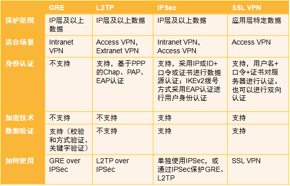{ width=80% align=center }
    </center>
    <figcaption>
    VPN 常用的安全技术和使用的场景
    <br/><small>
    [Huawei](https://forum.huawei.com/enterprise/zh/thread/580889961249521664)
    </small>
    </figcaption>
</figure>

## 传统 VPN 技术

### GRE

通用路由封装协议 GRE（Generic Routing Encapsulation）可以对某些网络层协议（如 IPX、ATM、IPv6、AppleTalk 等）的数据报文进行封装，使这些被封装的数据报文能够在另一个网络层协议（如 IPv4）中传输。GRE 提供了将一种协议的报文封装在另一种协议报文中的机制，是一种三层隧道封装技术，使报文可以通过 GRE 隧道透明的传输，解决异种网络的传输问题。

多协议本地网可以通过 GRE 隧道传输。

<figure markdown="span">
    <center>
    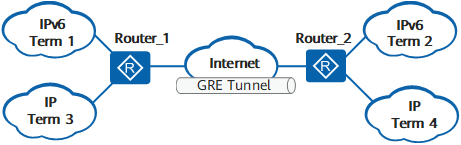{ width=80% align=center }
    </center>
    <figcaption>
    多协议本地网通过 GRE 隧道传输，Term1 和 Term2、Term3 和 Term4 可以互不影响地进行通信。
    <br/><small>
    [Huawei](https://support.huawei.com/enterprise/zh/doc/EDOC1100332366/c61ca7a0?idPath=24030814|21782164|7923148|256863201)
    </small>
    </figcaption>
</figure>

分支与总部的网络都是以太网络，分支与总部之间通过 IP 骨干网相连，如果用户希望分支与总部之间能够互通，可以部署 Ethernet over GRE 功能，实现以太报文通过 GRE 隧道进行透传。

<figure markdown="span">
    <center>
    { width=80% align=center }
    </center>
    <figcaption>
    Ethernet over GRE 的应用
    <br/><small>
    [Huawei](https://support.huawei.com/enterprise/zh/doc/EDOC1100332366/e205b406?idPath=24030814|21782164|7923148|256863201)
    </small>
    </figcaption>
</figure>

### PPTP

点对点隧道协议 PPTP（Point-to-Point Tunneling Protocol）是一种用于建立虚拟私有网络（VPN）的协议。PPTP 使用传输控制协议（TCP）建立控制通道来发送控制命令，以及利用通用路由封装（GRE）通道来封装点对点协议（PPP）数据包以发送资料。因为 PPTP 需要 2 个网络状态，因此会对穿越防火墙造成困难。很多防火墙不能完整地传递连线，导致无法连接。PPTP 是第一个被 Microsoft 拨号网络支持的 VPN 通信协议。

!!! warning "因为它的加密方式容易被破解，微软已不建议使用这个协议。目前已经发现了 PPTP 严重的安全漏洞。"

### L2TP

!!! abstract

    - 工作层次：数据链路层
    - 适用场景：远程访问

!!! quote

    - [L2TP 配置 - 华为](https://support.huawei.com/enterprise/zh/doc/EDOC1100332366/83e5177f?idPath=24030814|21782164|7923148|256863201)
    - [L2TP Tunnel Setup and Teardown - Cisco](https://www.cisco.com/c/en/us/support/docs/dial-access/virtual-private-dialup-network-vpdn/23980-l2tp-23980.html)
    - [L2TP 接入特性描述 - 华为](https://support.huawei.com/hedex/hdx.do?docid=EDOC1100168801&id=ZH-CN_CONCEPT_0172359012)

二层隧道协议 L2TP（Layer 2 Tunneling Protocol）是虚拟私有拨号网 VPDN（Virtual Private Dial-up Network）隧道协议的一种。L2TP 协议提供了对 PPP 链路层数据包的隧道（Tunnel）传输支持，允许二层链路端点和 PPP 会话点驻留在不同设备上，并采用包交换技术进行信息交互，从而扩展了 PPP 模型。L2TP 功能可以简单描述为在非点对点的网络上建立点对点的 PPP 会话连接。L2TP 协议结合了 L2F（Layer 2 Forwarding）协议和 PPTP（Point-to-Point Tunneling protocol）协议的优点，成为 IETF 有关二层隧道协议的工业标准。

L2TP 是应用于远程办公场景中为出差员工远程访问企业内网资源提供接入服务的一种重要 VPN 技术。传统的拨号网络需要租用因特网服务提供商 ISP（Internet Service Provider）的电话线路，申请公共的号码或 IP 地址，不仅产生高额的费用，而且无法为远程用户尤其是出差员工提供便利的接入服务。L2TP 技术出现以后，使用 L2TP 隧道承载 PPP 报文在 Internet 上传输成为了解决上述问题的一种途径。无论出差员工是通过传统拨号方式接入 Internet，还是通过以太网方式接入 Internet，L2TP 都可以提供远程接入服务。

#### L2TP 组成部分

- PPP 终端：L2TP 应用中，PPP 终端指发起拨号，将数据封装为 PPP 类型的设备，如远程用户 PC、企业分支网关等均可作为 PPP 终端。
- L2TP 访问集中器 LAC：交换网络上具有 PPP 和 L2TP 协议处理能力的设备。LAC 根据 PPP 报文中所携带的用户名或者域名信息，和 LNS 建立 L2TP 隧道连接，将 PPP 协商延展到 LNS。
    - NAS-Initiated 场景：在传统的拨号网络中，ISP 在 NAS 上部署 LAC，或在企业分支的以太网络中，为 PPP 终端配备网关设备，网关作为 PPPoE 服务器，同时部署为 LAC。
    - L2TP Client-Initiated 场景：企业分支在网关设备配置可以主动向 LNS 发起 L2TP 隧道连接请求的 L2TP Client，不需要远端系统拨号触发，L2TP Client 为 LAC。
    - Client-Initiated 场景：出差人员使用 PC 或移动终端接入 Internet，在 PC 或移动终端上使用 L2TP 拨号软件，则 PC 或移动终端终端为 LAC。
    - LAC 可以发起建立多条 L2TP 隧道使数据流之间相互隔离。
- L2TP 网络服务器 LNS：终止 PPP 会话的一端，通过 LNS 的认证，PPP 会话协商成功，远程用户可以访问企业总部的资源。对 L2TP 协商，LNS 是 LAC 的对端设备，即 LAC 和 LNS 建立了 L2TP 隧道；对 PPP，LNS 是 PPP 会话的逻辑终止端点，即 PPP 终端和 LNS 建立了一条点到点的虚拟链路。LNS 位于企业总部私网与公网边界，通常是企业总部的网关设备。必要时，LNS 还兼有网络地址转换（NAT）功能，对企业总部网络内的私有 IP 地址与公共 IP 地址进行转换。

在 LAC 和 LNS 的 L2TP 交互过程中存在两种类型的连接。

- 隧道（Tunnel）连接：L2TP 隧道在 LAC 和 LNS 之间建立，一对 LAC 和 LNS 可以建立多个 L2TP 隧道，一个 L2TP 隧道可以包含多个 L2TP 会话。
- 会话（Session）连接：L2TP 会话发生在隧道连接成功之后，L2TP 会话承载在 L2TP 隧道之上，每个 L2TP 会话对应一个 PPP 会话，PPP 会话的数据帧通过 L2TP 会话所在的 L2TP 隧道传输。

#### L2TP 报文

在 L2TP 隧道中交换的的数据包可分类为控制数据包或是数据包。L2TP 提供控制数据包的可靠性，数据包则没有。

<figure markdown="span">
    <center>
    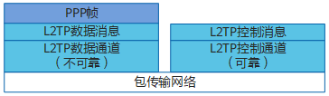{ width=80% align=center }
    </center>
    <figcaption>
    L2TP 协议架构
    <br/><small>
    [Huawei](https://support.huawei.com/enterprise/zh/doc/EDOC1100332366/1aec46c5)
    </small>
    </figcaption>
</figure>

- 控制消息：用于 L2TP 隧道和会话连接的建立、维护和拆除。在控制消息的传输过程中，使用消息丢失重传和定时检测隧道连通性等机制来保证控制消息传输的可靠性，支持对控制消息的流量控制和拥塞控制。
    - AVP：控制消息中的参数统一使用属性值对 AVP（Attribute Value Pair）来表示，使得协议具有很好的互操作性和可扩展性。控制消息包含多个 AVP。
- 数据消息：用于封装 PPP 数据帧并在隧道上传输。数据消息是不可靠的传输，不重传丢失的数据报文，不支持对数据消息的流量控制和拥塞控制。

<figure markdown="span">
    <center>
    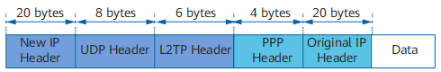{ width=80% align=center }
    </center>
    <figcaption>
    L2TP 报文格式
    <br/><small>
    [Huawei](https://support.huawei.com/enterprise/zh/doc/EDOC1100332366/1aec46c5)
    </small>
    </figcaption>
</figure>

L2TP 报文进行了多次封装，比原始报文多出 38 个字节（如果需要携带序列号信息，则比原始报文多出 42 个字节），封装后报文的长度可能会超出接口的 MTU 值，而 L2TP 协议本身不支持报文分片功能，这时需要设备支持对 IP 报文的分片功能。当 L2TP 报文长度超出发送接口的 MTU 值时，在发送接口进行报文分片处理，接收端对收到分片报文进行还原，重组为 L2TP 报文。

#### Client-Initiated 场景

!!! info

    移动办公用户（即出差员工）通过以太网方式接入 Internet，LNS 是企业总部的出口网关。移动办公用户可以通过移动终端上的 VPN 软件与 LNS 设备直接建立 L2TP 隧道，而无需再经过一个单独的 NAS 设备。该场景下，用户远程访问企业内网资源可以不受地域限制，使得远程办公更为灵活方便。

Client-Initiated 场景，移动办公用户在访问企业总部服务器之前，需要先通过 L2TP VPN 软件与 LNS 建立 L2TP 隧道。

<figure markdown="span">
    <center>
    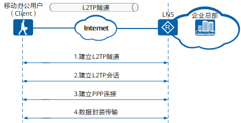
    </center>
    <figcaption>
    Client-Initiated 场景下 L2TP 隧道建立过程
    <br/><small>
    [Huawei](https://support.huawei.com/enterprise/zh/doc/EDOC1100332366/f38fe3f0?idPath=24030814|21782164|7923148|256863201)
    </small>
    </figcaption>
</figure>

1. 移动办公用户与 LNS 建立 L2TP 隧道。
1. 移动办公用户与 LNS 建立 L2TP 会话：移动办公用户在第 3 步会与 LNS 间建立 PPP 连接，L2TP 会话用来记录和管理它们之间的 PPP 连接状态。因此，在建立 PPP 连接以前，隧道双方需要为 PPP 连接预先协商出一个 L2TP 会话。会话中携带了移动办公用户的 LCP 协商信息和用户认证信息，LNS 对收到的信息认证通过后，通知移动办公用户会话建立成功。L2TP 会话连接由会话 ID 进行标识。
1. 移动办公用户与 LNS 建立 PPP 连接：移动办公用户通过与 LNS 建立 PPP 连接获取 LNS 分配的企业内网 IP 地址。
1. 移动办公用户发送业务报文访问企业总部服务器。

报文的封装和解封装过程：

<figure markdown="span">
    <center>
    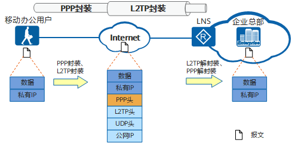
    </center>
    <figcaption>
    Client-Initiated 场景下报文的封装过程
    <br/><small>
    [Huawei](https://support.huawei.com/enterprise/zh/doc/EDOC1100332366/f38fe3f0?idPath=24030814|21782164|7923148|256863201)
    </small>
    </figcaption>
</figure>

1. 移动办公用户向企业总部服务器发送业务报文：业务报文通过 L2TP 拨号软件进行 PPP 封装和 L2TP 封装，然后按照移动办公用户 PC 的本地路由转发给 LNS。
1. LNS 接收到报文以后，拆除报文的 L2TP 头和 PPP 头，然后按照到企业内网的路由将报文转发给企业总部服务器。
1. 企业总部服务器收到移动办公用户的报文后，向移动办公用户返回响应报文。

#### L2TP Client-Initiated 场景

!!! info

    L2TP 除了可以为出差员工提供远程接入服务以外，还可以进行企业分支与总部的内网互联，实现分支用户与总部用户的互访。
    
    企业分支用户访问企业总部时，会部署 L2TP Client 自动向 LNS 发起拨号，建立 L2TP 隧道和会话，此时不需要分支机构用户拨号来触发。对于分支机构用户来说，访问总部网络就跟访问自己所在的分支机构网络一样，完全感觉不到自己是在远程接入。L2TP Client 是企业分支的出口网关，LNS 是企业总部的出口网关。L2TP Client 和 LNS 部署了 L2TP 以后，L2TP Client 设备会主动向 LNS 发起 L2TP 隧道建立请求，隧道建立完成后，分支用户访问总部的流量直接通过 L2TP 隧道传输到对端。该场景下，L2TP 隧道建立在 L2TP Client 与 LNS 之间，隧道对于用户是透明的，用户感知不到隧道的存在。
    
    当我们在路由器上配置 L2TP 上网时，即为 L2TP Client-Initiated 场景。

L2TP Client-Initiated 场景，L2TP Client 和 LNS 配置完 L2TP 以后，L2TP Client 会主动向 LNS 发起隧道协商请求。

<figure markdown="span">
    <center>
    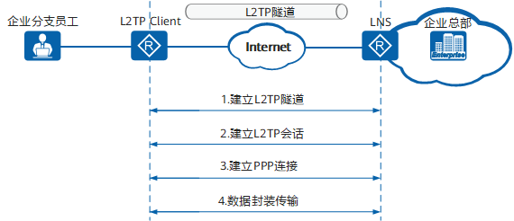
    </center>
    <figcaption>
    L2TP Client-Initiated 场景下 L2TP 隧道建立过程
    <br/><small>
    [Huawei](https://support.huawei.com/enterprise/zh/doc/EDOC1100332366/f38fe3f0?idPath=24030814|21782164|7923148|256863201)
    </small>
    </figcaption>
</figure>

1. L2TP Client 与 LNS 建立 L2TP 隧道。
1. L2TP Client 与 LNS 建立 L2TP 会话：L2TP Client 在第 3 步会与 LNS 间建立 PPP 连接，L2TP 会话用来记录和管理它们之间的 PPP 连接状态。因此，在建立 PPP 连接以前，隧道双方需要为 PPP 连接预先协商出一个 L2TP 会话。
1. L2TP Client 与 LNS 建立 PPP 连接：L2TP Client 通过与 LNS 建立 PPP 连接获取 LNS 分配的企业内网 IP 地址。
1. 企业分支员工发送访问企业总部服务器的业务报文，报文经过 L2TP Client 和 LNS 的加解封装后到达对端。

报文的封装和解封装过程：

<figure markdown="span">
    <center>
    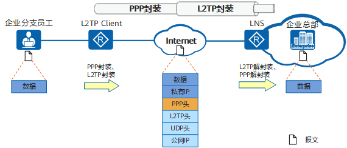
    </center>
    <figcaption>
    L2TP Client-Initiated 场景下报文的封装过程
    <br/><small>
    [Huawei](https://support.huawei.com/enterprise/zh/doc/EDOC1100332366/f38fe3f0?idPath=24030814|21782164|7923148|256863201)
    </small>
    </figcaption>
</figure>

1. 企业分支员工向总部内网服务器发送访问请求：分支员工的 PC 按照本地路由将请求报文转发给 L2TP Client。
1. L2TP Client 收到报文后使用 VT（Virtual-Template）接口对此报文进行 PPP 封装和 L2TP 封装：报文封装完成后 L2TP Client 再按照到 Internet 的公网路由将封装好的报文发送出去。
1. LNS 设备接收到报文以后，使用 VT 接口拆除报文的 L2TP 头和 PPP 头，然后按照到企业内网的路由将报文转发给总部内网服务器。
1. 企业总部服务器收到分支员工的报文后，向分支员工返回响应报文。

#### L2TP 安全性

L2TP 协议自身不提供加密与可靠性验证的功能，可以和安全协议搭配使用，从而实现数据的加密传输。经常与 L2TP 协议搭配的加密协议是 IPsec，当这两个协议搭配使用时，通常合称 L2TP/IPsec。

#### L2TP 隧道建立过程

L2TP 隧道建立过程中涉及的消息包括：

- SCCRQ（Start-Control-Connection-Request）：用来向对端请求建立控制连接。
- SCCRP（Start-Control-Connection-Reply）：用来告诉对端，本端收到了对端的 SCCRQ 消息，允许建立控制连接。
- StopCCN（Stop-Control-Connection-Notification）：用来通知对端拆除控制连接。
- SCCCN（Start-Control-Connection-Connected）：用来告诉对端，本端收到了对端的 SCCRP 消息，本端已完成隧道的建立。
- Hello：用来检测隧道的连通性。
- ZLB（Zero-Length Body）：如果本端的队列没有要发送的消息时，发送 ZLB 给对端。在控制连接的拆除过程中，发送方需要发送 STOPCCN，接收方发送 ZLB。ZLB 只有 L2TP 头，没有负载部分，因此而得名。

控制连接的建立先于会话连接。只有控制连接建立起来了，会话连接才可能建立起来。

<figure markdown="span">
    <center>
    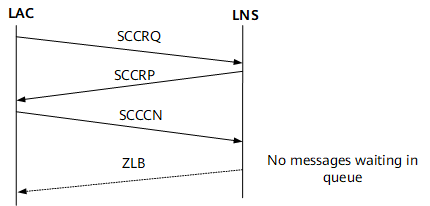
    </center>
    <figcaption>
    控制连接建立的三次握手
    <br/><small>
    [Huawei](https://support.huawei.com/enterprise/zh/doc/EDOC1100332366/83e5177f?idPath=24030814|21782164|7923148|256863201)
    </small>
    </figcaption>
</figure>

- LAC 和 LNS 之间路由相互可达后，LAC 端设置相应 AVP，向 LNS 端发出 SCCRQ 报文，请求建立控制连接。
- LNS 收到来自 LAC 的 SCCRQ。根据其中的 AVP，如果同意建立隧道，便发送 SCCRP 报文给 LAC。
- LAC 对接收到的 SCCRP 报文进行检查，从中取出隧道信息，并向 LNS 发送 SCCCN 报文，表示控制连接建立成功。
- 当消息队列中没有消息时，LNS 发送 ZLB 给对端。

隧道验证是和建立隧道同时进行的，不是单独进行的。隧道验证过程如下：

1. 首先 LAC 向 LNS 发 SCCRQ 请求消息时，产生一个随机的字符串作为本端的 CHAP Challenge（SCCRQ 携带的字段）发给 LNS。
1. LNS 收到 SCCRQ 后，利用 LAC 侧发送的 CHAP Challenge 和本端配置的密码产生一个 16 个字节的 Response；同时也产生一个随机的字符串（LNS CHAP Challenge），将随机生成的这个字符串和 Response 放在 SCCRP 中一起发给 LAC。
1. LAC 端收到 SCCRP 后，对 LNS 进行验证。
    - LAC 端利用自己的 CHAP Challenge 和本端配置的密码，产生一个新的 16 字节的字符串；
    - LAC 端将新产生的字符串与 LNS 端发来的 SCCRP 中带的 LNS CHAP Response 做比较，如果相同，则隧道验证通过，否则隧道验证不通过，断掉隧道连接。
1. 如果验证通过，LAC 将自己的 CHAP Response 放在 SCCCN 消息中发给 LNS。
1. LNS 收到 SCCCN 消息后，也进行验证：
    - LNS 端利用本端的 CHAP Challenge、本端配置的密码，产生一个 16 字节的字符串；
    - LNS 端与 SCCCN 消息中得到的 LAC CHAP Response 做比较。如果相同，则验证通过，否则拆除隧道。

L2TP 使用 Hello 报文检测隧道的连通性。LAC 和 LNS 定时向对端发送 Hello 报文，若在一段时间内未收到 Hello 报文的应答，则重复发送 Hello 报文。如果重复发送报文的次数超过 5 次，则认为 L2TP 隧道已经断开，该 PPP 会话将被清除。此时需要重新建立隧道。

控制连接拆除的发起端可以是 LAC 或 LNS。发起端通过发送 StopCCN 消息报文到对端来通知对端拆除控制连接。对端收到后发送 ZLB ACK 消息作为回应，同时在一定时间内保持控制连接以防止 ZLB ACK 消息丢失。

#### L2TP 会话建立过程

L2TP 会话建立过程中涉及的消息包括：

- ICRQ（Incoming-Call-Request）：只有 LAC 才会发送；每当检测到用户的呼叫请求，LAC 就发送 ICRQ 消息给 LNS，请求建立会话连接。ICRQ 中携带会话参数。
- ICRP（Incoming-Call-Reply）：只有 LNS 才会发送；收到 LAC 的 ICRQ，LNS 就使用 ICRP 回复，表示允许建立会话连接。
- ICCN（Incoming-Call-Connected）：只有 LAC 才会发送；LAC 收到 LNS 的 ICRP，就使用 ICCN 回复，表示 LAC 已回复用户的呼叫，通知 LNS 建立会话连接。
- CDN（Call-Disconnect-Notify）：用来通知对端拆除会话连接，并告知对端拆除的原因。
- ZLB（Zero-Length Body）：如果本端的队列没有要发送的消息时，发送 ZLB 给对端。在会话连接的拆除过程中，发送 ZLB 还表示收到 CDN。ZLB 只有 L2TP 头，没有负载部分，因此而得名。

控制连接成功建立之后，一旦检测到用户呼叫，就请求建立会话连接。与控制连接不同的是，会话连接的建立具有方向性。L2TP 的会话建立由 PPP 触发。

<figure markdown="span">
    <center>
    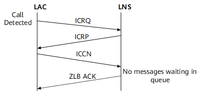
    </center>
    <figcaption>
    会话连接建立过程
    <br/><small>
    [Huawei](https://support.huawei.com/enterprise/zh/doc/EDOC1100332366/83e5177f?idPath=24030814|21782164|7923148|256863201)
    </small>
    </figcaption>
</figure>

会话连接拆除的发起端可以是 LAC 或 LNS。发起端通过发送 CDN 消息报文到对端来通知对端拆除会话连接。对端收到后发送 ZLB ACK 消息作为回应。

用户验证会进行两次：第一次发生在 LAC 侧，第二次发生在 LNS 侧。用户验证方式有三种：代理验证、强制 CHAP 验证和 LCP 重协商。

- LCP 重协商：如果需要在 LNS 侧进行比 LAC 侧更严格的认证，或者 LNS 侧需要直接从用户获取某些信息（当 LNS 与 LAC 是不同厂商的设备时可能发生这种情况），则可以配置 LNS 与用户间进行 LCP 重协商。LCP 重协商使用相应虚拟接口模板 VT 上配置的验证方式。此时将忽略 NAS 侧的代理验证信息。
- 强制 CHAP 验证：如果只配置强制 CHAP 验证，则 LNS 对用户进行 CHAP 验证，如果验证不过的话，会话就不能建立成功。
- 代理验证：如果既不配置 LCP 重协商，也不配置强制 CHAP 验证，则 LNS 对用户进行的是代理验证。代理验证就是 LAC 侧将 PAP 认证和 CHAP 认证的认证信息通过 ICCN 报文传给 LNS，LNS 侧会利用这些认证信息对用户进行认证。

#### L2TP 配置注意事项

!!! quote

    - [MTU Tuning for L2TP - Cisco](https://www.cisco.com/c/en/us/support/docs/dial-access/virtual-private-dialup-network-vpdn/24320-l2tp-mtu-tuning.html)

执行 L2TP 的时候应要考虑最大传输单元（MTU）。当以太网链路 MTU 为 1500 时，推荐配置如下：

- L2TP 隧道上的 IP MTU 为 1460
- TCP MSS 为 1420

#### L2TP 实践

##### Windows 拨号

点击 VPN Connect 后，可以看到 Windows 立即向 LNS 建立 L2TP 隧道。


LAC 的 ICCN 接着 LNS 的 ZLB 标志着 L2TP 隧道建立成功，接下来进入 PPP Establish 阶段。


PPP Establish 阶段使用 PPP LCP 协商链路配置（MTU、压缩等）和验证方式，让我们来看看其中的一些报文内容：

!!! info ""

    === "来自客户端的 Configuration Request"
    
        ```text
        PPP Link Control Protocol
            Code: Configuration Request (1)
            Identifier: 1 (0x01)
            Length: 18
            Options: (14 bytes), Maximum Receive Unit, Magic Number, Protocol Field Compression, Address and Control Field Compression
                Maximum Receive Unit: 1400
                Magic Number: 0x776b2584
                Protocol Field Compression
                Address and Control Field Compression
        ```
    
    === "来自服务器的 Configuration Request"
    
        ```text
        PPP Link Control Protocol
            Code: Configuration Ack (2)
            Identifier: 101 (0x65)
            Length: 15
            Options: (11 bytes), Authentication Protocol, Magic Number
                Authentication Protocol: Challenge Handshake Authentication Protocol (0xc223)
                Magic Number: 0x2b80df7b
        ```

Establish 成功后进入 Authenticate 阶段，由于服务器配置了 CHAP 验证，此处为三次 CHAP 握手。


Authenticate 阶段成功后，进入 Network 阶段。可以看到客户端请求 IPV6CP 和 IPCP 协商，服务器拒绝了 IPV6CP，回复了 IPCP。


让我们来看看最后一个从服务端发给客户端的 IPCP 报文内容：

```text
PPP IP Control Protocol
    Code: Configuration Ack (2)
    Identifier: 8 (0x08)
    Length: 22
    Options: (18 bytes), IP Address, Primary DNS Server IP Address, Secondary DNS Server IP Address
        IP Address
            Type: IP Address (3)
            Length: 6
            IP Address: ***.***.***.***(VPN IP)
        Primary DNS Server IP Address
            Type: Primary DNS Server IP Address (129)
            Length: 6
            Primary DNS Address: ***.***.***.***
        Secondary DNS Server IP Address
            Type: Secondary DNS Server IP Address (131)
            Length: 6
            Secondary DNS Address: ***.***.***.***
```

通过 IPCP，服务器给客户端分配了一个 VPN 中的 IP 地址。

接下来，各种 IP 流量都封装到 PPP 中。让我们以 DNS 为例看看封装：

```text
Frame 162: 114 bytes on wire (912 bits), 114 bytes captured (912 bits) on interface \Device\NPF_{************************************}, id 0
Ethernet II, Src: MicroStarINT_**:**:** (04:7c:16:**:**:**), Dst: HuaweiTechno_**:**:** (7c:d9:a0:**:**:**)
Internet Protocol Version 4, Src: ***.***.***.***(Client), Dst: ***.***.***.***(LNS)
User Datagram Protocol, Src Port: 1701, Dst Port: 1701
Layer 2 Tunneling Protocol, Type: Data Message
Point-to-Point Protocol, Protocol: Internet Protocol Version 4
Internet Protocol Version 4, Src: ***.***.***.***(VPN IP), Dst: ***.***.***.***(DNS Server)
User Datagram Protocol, Src Port: 63077, Dst Port: 53
Domain Name System (query)
```

按下 Disconnect 按钮后，PPP 和 L2TP 连接先后中断：


### IPSec

!!! abstract

    - 工作层次：网络层
    - 适用场景：站点到站点互联

### SSL VPN

SSL VPN 是采用 SSL（Security Socket Layer）/TLS（Transport Layer Security）协议来实现远程接入的一种轻量级 VPN 技术。SSL VPN 充分利用了 SSL 协议提供的基于证书的身份认证、数据加密和消息完整性验证机制，可以为应用层之间的通信建立安全连接。因为 SSL 协议内置于浏览器中，使用 SSL 协议进行认证和数据加密的 SSL VPN 可以免于安装客户端。移动办公用户使用终端（如便携机、PAD 或智能手机）与企业内部的 SSL VPN 服务器建立 SSL VPN 隧道以后，就能通过 SSL VPN 隧道远程访问企业内网的 Web 服务器、文件服务器、邮件服务器等资源。

<figure markdown="span">
    <center>
    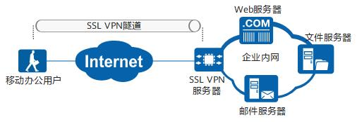
    </center>
    <figcaption>
    SSL VPN 场景
    <br/><small>
    </small>
    </figcaption>
</figure>

## 新兴 VPN 技术：异地组网

### OpenVPN

### WireGuard

### ZeroTier
