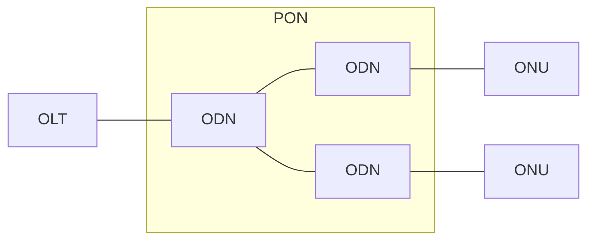

---
tags:
  - 个人笔记
---

# 📒 物理和数据链路层

## 以太网

### PoE

??? info

    - [什么是 Power over Ethernet（PoE）? 它是如何工作的？ - 华为](https://info.support.huawei.com/info-finder/encyclopedia/zh/PoE.html)

PoE（Power over Ethernet）是指通过网线传输电力的一种技术，借助现有以太网通过网线同时为 IP 终端设备（如：IP 电话、AP、IP 摄像头等）进行数据传输和供电。

PoE 供电系统包括如下两个设备角色：

- **供电设备 PSE（Power-sourcing Equipment）**：通过以太网给受电设备供电的 PoE 设备，提供检测、分析、智能功率管理等功能，例如：PoE 交换机。
- **受电设备 PD（Powered Device）**：如无线 AP、便携设备充电器、刷卡机、摄像头等受电方设备。按照是否符合 IEEE 标准，PD 分为标准 PD 和非标准 PD。

| 技术 | 标准 | 供电端功率要求 |
| --- | --- | --- |
| PoE | IEEE 802.3af | 15.4 W |
| PoE+ | IEEE 802.3at | 30 W |
| PoE++ | IEEE 802.3bt | 60 W(Type 3)   90 W (Type 4) |

### PoE 供电模式

PSE 设备依据使用的供电线对不同分为 Alternative A（1/2 和 3/6 线对）和 Alternative B（4/5 和 7/8 线对）两种供电模式。

- Alternative A 供电模式通过数据对供电。PSE 通过 1/2 和 3/6 线对给 PD 供电，1/2 链接形成负极，3/6 链接形成正极。10BASE-T、100BASE-TX 接口使用 1/2 和 3/6 线对传输数据，1000BASE-T 接口使用全部的 4 对线对传输数据。由于 DC 直流电和数据频率互不干扰，所以可以在同一对线同时传输电流和数据。
- Alternative B 供电模式通过空闲对供电。PSE 通过 4/5 和 7/8 线对给 PD 供电，4/5 链接形成正极，7/8 链接形成负极。

IEEE 标准不允许同时应用以上两种供电模式。供电设备 PSE 只能提供一种用法，但是受电设备 PD 必须能够同时适应两种情况。

### PoE 供电协商

PSE 与 PD 之间可以通过解析电阻和 LLDP 协议等方式进行供电协商。

1. 检测 PD：PSE 在端口周期性输出电流受限的小电压，用以检测 PD 设备的存在。如果检测到特定阻值的电阻，说明线缆终端连接着支持 PoE 标准的受电端设备（电阻值在 19kΩ～26.5kΩ的特定电阻，通常的小电压为 2.7V～10.1V，检测周期为 2 秒）。
1. 供电能力协商（即 PD 设备分类）过程：PSE 对 PD 进行分类，并协商供电功率。供电能力协商不仅可以通过解析 PSE 与 PD 发送的电阻实现的，还可以通过链路层发现协议 LLDP（Link Layer Discovery Protocol）协议发现和通告供电能力进行协商。
1. 开始供电：在启动期内 (一般小于 15μs)，PSE 设备开始从低电压向 PD 设备供电，直至提供 48V 的直流电压。
1. 正常供电：电压达到 48V 之后，PSE 为 PD 设备提供稳定可靠 48V 的直流电，PD 设备功率消耗不超过 PSE 最大输出功率。
1. 断电：供电过程中，PSE 会不断监测 PD 电流输入，当 PD 电流消耗下降到最低值以下，或电流激增，例如拔下设备或遇到 PD 设备功率消耗过载、短路、超过 PSE 的供电负荷等，PSE 会断开电源，并重复检测过程。

## 无源光网络

??? info

    - [5.1 PON 网络概述](https://www.bilibili.com/video/BV1RU4y1M7NB)
    - [5.2.1 PON 网络设备简介 OLT](https://www.bilibili.com/video/BV1iF411h7ie/?spm_id_from=333.1387.upload.video_card.click)
    - [5.2.2 PON 网络设备简介 ONU](https://www.bilibili.com/video/BV1tQ4y1U7Ev/?spm_id_from=333.1387.upload.video_card.click)

无源光网络（Passive Optical Network, PON）技术是最新发展的点到多点（Point-to-Multipoint, P2MP）的光纤接入技术。PON 是一种纯介质网络，利用光纤实现数据、语音和视频的全业务接入。

PON 不包含任何有源电子器件，全部由无源光器件组成。这就避免了外部设备的电磁干扰和雷电影响，减少了线路和外部设备的故障率，简化了供电配置和网管复杂度，提高了系统可靠性，同时节省了维护成本。PON 的业务透明性较好，原则上可适用于任何制式和速率的信号。

PON 系统由三部分组成，分别为：

- 光线路终端 OLT（Optical Line Terminal）

    放置在局端的终结 PON 协议的汇聚设备。

- 无源光分路器 ODN（Optical Distribution Network）

    一个连接 OLT 和 ONU 的无源设备，它的功能是分发下行数据，并集中上行数据。

- 光网络单元 ONU（Optical Network Unit）。

    位于客户侧的给用户提供各种接口的用户侧终端。路由器作为 ONU 来部署。

PON 网络通过单纤双向传输，采用波分复用（Wavelength Division Multiplexing, WDM）技术：

- **下行方向：**OLT 采用广播方式，将 IP 数据、语音、视频等多种业务，通过 1：N 无源光分路器分配到所有 ONU 单元。当数据信号到达 ONU 时，ONU 根据 OLT 分配的逻辑标识，在物理层上做判断，接收给它自己的数据帧，丢弃那些给其它 ONU 的数据帧。
- **上行方向：**来自各个 ONU 的多种业务信息，采用时分多址接入 (Time Division Multiple Access，TDMA) 技术，分时隙互不干扰地通过 1：N 无源光分路器耦合到同一根光纤，最终送到 OLT。

### EPON 和 GPON

GPON 和 EPON 是两种主要的 PON 技术，由不同的标准化组织制定。

| 技术标准 | 国际标准命名 | 全名 | 年份 |
| --- | --- | --- | --- |
| GPON | ITU-T G.984 | Gigabit-capable Passive Optical Network 千兆级无源光网络 | 2003 |
| EPON | IEEE 802.3ah | Ethernet Passive Optical Network 以太网无源光网络 | 2004 |
| XG-PON | ITU-T G.987 | 10 Gigabit-capable Passive Optical Network 10 千兆级无源光网络 | 2009 |
| 10G-EPON | IEEE 802.3av | 10 Gigabit Ethernet Passive Optical Network 10 千兆以太网无源光网络 | 2009 |
| XGS-PON | ITU-T G.9807.1 | 10 Gigabit Symmetric Passive Optical Network 10 千兆对称无源光网络 | 2016 |
| 50G-PON | ITU-T G.989 | 50 Gigabit-capable Passive Optical Network 50 千兆级无源光网络 | 2020 |

在高速率和支持多业务方面，GPON 有优势，但技术的复杂和成本目前要高于 EPON，产品的成熟性也逊于 EPON。

### FTTx

FTTX 是“Fiber To The x”的缩写，意谓“光纤到某地”，为各种光纤通讯网络的总称，其中 x 代表光纤线路的目的地。

- Fiber To the Home，光纤到户。
- FTTO；Fiber to the Office，光纤到办公室。
