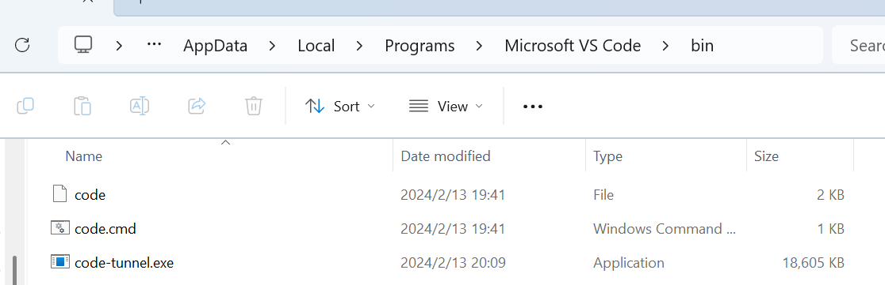

# 临时笔记

## Vivado 自定义编辑器 VSCode 无法打开

报错内容：vivado unable to launch external text editor

原因：VSCode 默认的执行路径不是 `.exe` 文件，而是为了方便在 WSL 中使用而包装的脚本文件。查看 Windows Path，可以看到设置在 `AppData\Local\Programs\Microsoft VS Code\bin` 下，而该目录下只有几个脚本文件：



大致内容如下：

```cmd
@echo off
setlocal
set VSCODE_DEV=
set ELECTRON_RUN_AS_NODE=1
"%~dp0..\Code.exe" "%~dp0..\resources\app\out\cli.js" %*
endlocal
```

在 PowerShell 中执行 `(Get-Command code).Path` 也显示为 `AppData\Local\Programs\Microsoft VS Code\bin\code.cmd`，因此 Vivado 对脚本的调用不成功（推测是 Java 调用外部程序，没有 Shell 环境）。

解决方法：真正的 `code.exe` 在上层目录，将 `Path` 末尾的 `bin` 去掉即可。
