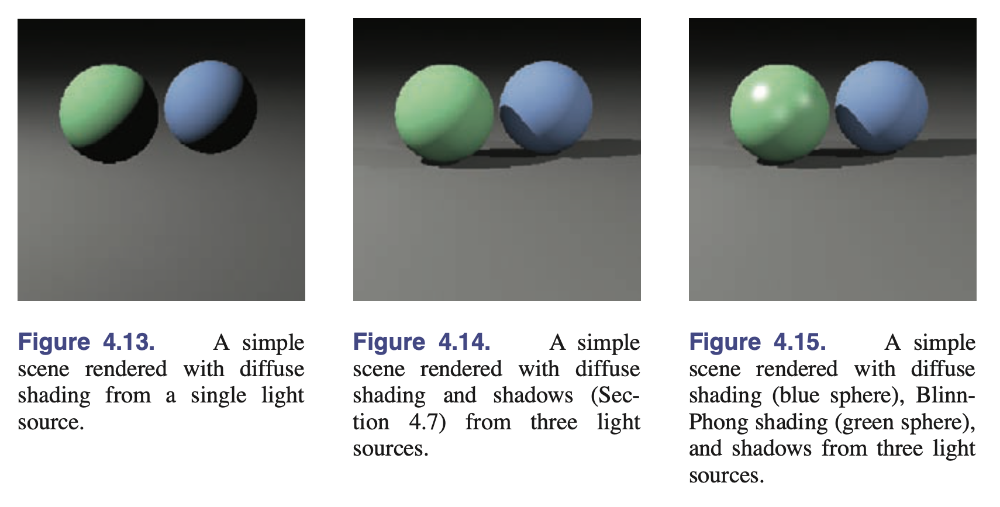

# Fundamentals of Computer Graphics, Fourth Edition

## 第一章：简介

- 1.6：效率
    - 比起运算次数，程序员应当更加重视访存模式，因为如今内存速度跟不上处理器。
    - 提高局部性，尝试使数据结构的大小与目标体系结构的内存页面、缓存行大小相适配。
    - 当心老旧的优化建议，可能已经不再适用。
    - 一定要做 Profiling。
- 1.7：图形程序的设计和编程
    - 一些基本的数据结构：

        ```text
        vector2, vector3, hvector, rgb, transform, image
        ```

    - 还介绍了图形程序中常用的调试技术。对于图形程序来说，调试器基本没什么用，**输出的图像本身是最好的调试信息**。比如，可以在某个阶段把像素直接拷贝到屏幕上，以检测后面阶段的问题。

## 第二章：数学大杂烩

> The cleaner the math, the cleaner the resulting code.

本章内容包括：

- 集合与映射
- 求解二次方程
- 三角函数
- 向量
- 曲线和曲面
- 线性插值
- 三角形

让我们直接从曲面开始：

### 曲面

!!! quote

    - [GAMES 301: 第 1 讲 曲面参数化介绍 - USTC](http://staff.ustc.edu.cn/~renjiec/GAMES301/games301_lec01.pdf)

- **三维曲面**：$f(\mathbf{p}) = 0$。
- **法向量（normal vector）**：$\mathbf{n} = \nabla f(\mathbf{p}) = \left( \frac{\partial f}{\partial x}, \frac{\partial f}{\partial y}, \frac{\partial f}{\partial z} \right)$，指向 $f(\mathbf{p}) > 0$ 的方向。
- **三维平面**：
    - $(\mathbf{p} - \mathbf{a}) \cdot \mathbf{n} = 0$。
    - $(\mathbf{p} - \mathbf{a}) \cdot ((\mathbf{b} - \mathbf{a}) \times (\mathbf{c} - \mathbf{a})) = 0$。
    - $\begin{vmatrix} x - x_a & y - y_a & z - z_a \\ x_b - x_a & y_b - y_a & z_b - z_a \\ x_c - x_a & y_c - y_a & z_c - z_a \end{vmatrix} = 0$。
- **三维曲线**：使用曲面的交集表示，$f(\mathbf{p}) = 0$ 和 $g(\mathbf{p}) = 0$。
- **二维参数化曲线**：$\begin{bmatrix} x \\ y \end{bmatrix} = \begin{bmatrix} x(t) \\ y(t) \end{bmatrix}$ 或者表示为向量函数 $\mathbf{p} = f(t)$。
    - **直线**：$\mathbf{p}(t) = \mathbf{o} + t (\mathbf{d}$)。
    - **椭圆**：$\begin{bmatrix} x \\ y \end{bmatrix} = \begin{bmatrix} x_c + a \cos \phi \\ y_c + b \sin \phi \end{bmatrix}$。
- **三维参数化曲线**：$\begin{bmatrix} x \\ y \\ z \end{bmatrix} = \mathbf{p}(t)$。
- **三维参数化曲面**：$\begin{bmatrix} x \\ y \\ z \end{bmatrix} = \mathbf{p}(u, v)$。
    - 曲面上的等值曲线（isoparametric curve）：$\mathbf{q}(t) = \mathbf{p}(t, v_0)$。
    - 法向量 $\mathbf{n} = \mathbf{p}_u \times \mathbf{p}_v$。
- 总结：
    - 隐式二维曲线、三维曲面：$S=\{\mathbf{p}|f(\mathbf{p})=0\}$，$f$ 是 $\mathbb{R}^3$ 或 $\mathbb{R}^2 \to \mathbb{R}$。法向量由 $f$ 的导数（梯度）给出，用法向量构建基底得到切向量或切平面。
    - 二维、三维参数化曲线：$S=\{\mathbf{p}(t) | t \in D\}$。$\mathbf{p}$ 的导数给出切向量（tangent vector）。
    - 参数化曲面：$S=\{\mathbf{p}(u, v) | (u, v) \in D\}$。

### 线性插值

$$
(1-t)A+tB
$$

### 三角形

三角形是二维和三维建模的原语（primitive）。颜色等信息标记在顶点，在三角形内部插值，这样的坐标系称为**质心坐标系（barycentric coordinates）**。

- 法向量：$\mathbf{n} = (\mathbf{b} - \mathbf{a}) \times (\mathbf{c} - \mathbf{a})$。

以三角形的两条边为基底，可以构建质心坐标系：

$$
\mathbf{p} = \mathbf{a} + \beta(\mathbf{b} - \mathbf{a}) + \gamma(\mathbf{c} - \mathbf{a}) = (1 - \beta - \gamma)\mathbf{a} + \beta\mathbf{b} + \gamma\mathbf{c}\\
\alpha \equiv 1 - \beta - \gamma\\
\mathbf{p}(\alpha, \beta, \gamma) = \alpha\mathbf{a} + \beta\mathbf{b} + \gamma\mathbf{c}
$$

要计算任意一点的质心坐标其实很容易，**因为 $f(x,y)$ 表明该点到直线的距离（按某比例缩放）**，再与三角形顶点的距离做比值即可。如：$\beta = \frac{f_{ac}(x, y)}{f_{ac}(x_b, y_b)}$。通常计算其中两个，用和为 1 计算最后一个参数。

相同的道理，还可以使用面积比例计算质心坐标。

$$
\alpha = \frac{A(\mathbf{p}, \mathbf{b}, \mathbf{c})}{A(\mathbf{a}, \mathbf{b}, \mathbf{c})}
$$

注意到法向量的长度是三角形的面积的两倍，上式又可以用法向量表示：

$$
\alpha = \frac{\mathbf{n} \cdot \mathbf{n}_a}{||\mathbf{n}||^2}, \mathbf{n}_a = (\mathbf{c} - \mathbf{b}) \times (\mathbf{p} - \mathbf{b})
$$

## 第三章：栅格化图像

### 像素与几何

- 伽马值
    - 人眼对亮度的感知是非线性的，显示器的输出相较于输入也是非线性的。
    - 通常用该式拟合 $\text{displayed intensity} = (\text{maximum intensity})a^\gamma$。

### RGB 颜色空间

显示器领域使用三原色为 RGB，称为叠加混合（additive mixing），与出版业的 CMYK 颜色空间不同，CMYK 是减色混合（subtractive mixing）。这很容易理解，因为显示器是发光体，而印刷品是反射体，前者主动发光，后者靠吸收光线和反射光线来表现颜色。

<figure markdown="span">
    <center>
    
    </center>
    <figcaption>
    Additive vs. Subtractive Colour Mixing
    <br /><small>
    [Colour Theory: Understanding and Working with Colour - RMIT](https://rmit.pressbooks.pub/app/uploads/sites/42/2022/10/additivesubtractivecolour.png)
    </small>
    </figcaption>
</figure>

颜色生词表：

| 英文 | 中文 | CSS 颜色 |
| --- | --- | --- |
| magenta | 洋红 | <span style="color: magenta">magenta</span> |
| cyan | 青色 | <span style="color: cyan">cyan</span> |

### Alpha 混合

$$
\mathbf{c} = \alpha \mathbf{c}_f + (1 - \alpha) \mathbf{c}_b
$$

分别为前景色（foreground）和背景色（background）。

## 第四章：光线追踪

### 简单光线追踪算法

渲染的过程就是接收一组物体，产生二维图像。

两种渲染顺序：

- **物体顺序（object-order）**：逐个物体渲染，更新影响的像素。
- **图像顺序（image-order）**：逐个像素渲染，考虑所有物体。

这两种顺序用于不同效果，性能也不同。

光线追踪是一种图像顺序算法。从观察者的视角出发，每个像素**看向不同地方**，目标是找到该视线所看到的物体。找到视线与物体的交点后，着色器使用**交点、表面法向量和其他信息确定像素的颜色**。光线追踪器包含三个部分：

- **光线生成器**：确定视线的起点和方向。
- **光线求交器**：找到视线与物体的交点。
- **着色器**：确定像素的颜色。

```text
for each pixel (x, y) {
    generate ray r from eye through (x, y)
    find first intersection i of r with scene
    set pixel (x, y) to color of i
}
```

### 透视

- **平行投影（parallel projection）**：视线是平行的。若投影面与投影线垂直，所得图像是正交的（orthographic），否则为斜交的（oblique）。
- **透视投影（perspective projection）**：视线收敛于一点，所得图像是透视的（perspective）。

在艺术中，使用三点透视法（three-point perspective）。有趣的是，只要使用透视投影，三点透视法的条件就自然满足。

### 计算视线

三维参数化曲线很适合描述视线。令**视点（viewpoint 或 eye point）**为 $e$，所看点为 $s$，则视线表示为

$$
\mathbf{p}(t) = e + t(s - e)
$$

相机坐标系三个向量组成右手系：

- $\mathbf{u}$：指向右侧。
- $\mathbf{v}$：指向上方。
- $\mathbf{w}$：指向后方。

观察方向为 $-\mathbf{w}$。

| 投影方式 | 光线方向 | 光线起点 |
| --- | --- | --- |
| 正交投影 | $-\mathbf{w}$ | $e + u\mathbf{u} + v\mathbf{v}$ |
| 透视投影 | $-d\mathbf{w} + u\mathbf{u} + v\mathbf{v}$ | $e$ |

其中焦距 $d$ 为视点 $e$ 与投影面的距离。

### 光线求交

直接代入即可：

$$
f(\mathbf{p}(t)) = 0
$$

对于参数化曲面：

$$
\mathbf{e} + t\mathbf{d} = \mathbf{f}(u, v)
$$

**三角形**是平面图形，上式换成平面方程：

$$
\mathbf{e} + t\mathbf{d} = \mathbf{a} + \beta(\mathbf{b} - \mathbf{a}) + \gamma(\mathbf{c} - \mathbf{a})
$$

1. 解出 $t, \beta, \gamma$。
1. 如果满足 $\beta > 0, \gamma > 0, \beta + \gamma < 1$，则交点在三角形内部。

**平面多边形**具有顶点 $\mathbf{p}_1 \ldots \mathbf{p}_n$ 和法向量 $\mathbf{n}$。

1. 计算光线与平面交点：$(\mathbf{p} - \mathbf{p}_1) \cdot \mathbf{n} = 0$ 得到 $t$。
2. 将交点和平面多边形投影到 $xy$ 平面上，判断是否在多边形内部。

    - 最简单的方法是从该点发出一条**射线，计算与多边形的交点数**。奇数个交点则在内部，偶数个交点则在外部。
    - 另一种方法是**用多个三角形拼接多边形**，转化为点是否在三角形内部的问题。
    - 如果投影到 $xy$ 平面是一条线，我们可以选用其他平面，如 $yz$、$zx$ 平面。

### 着色

计算光的反射需要光线方向 $\mathbf{l}$、法向量 $\mathbf{n}$ 和视线方向 $\mathbf{v}$。本节的着色算法对每个颜色通道分别计算。

- Lambertian Shading：
    - 像素颜色 $L=k_d I \max(0, \mathbf{n} \cdot \mathbf{l})$。$k_d$ 为漫反射系数（diffuse coefficient），$I$ 为光强。
    - 效果是哑光的，表面的颜色与视角无关，无法表现高光等效果。
- Blinn-Phong Shading：
    - 在 Lambertian Shading 的基础上加入镜面部分（specular component），前者成为漫反射部分（diffuse component）。
    - 半向量 $\mathbf{h} = \frac{\mathbf{l} + \mathbf{v}}{||\mathbf{l} + \mathbf{v}||}$ 是光线和视线的平分线。比较它和法向量的夹角，夹角越小，镜面反射越强。
    - 像素颜色 $L = k_d I \max(0, \mathbf{n} \cdot \mathbf{l}) + k_s I \max(0, \mathbf{n} \cdot \mathbf{h})^n$。$k_s$ 为镜面反射系数（specular coefficient），$p$ 为高光系数。
- Ambient Shading：
    - 为了避免黑暗区域，我们加入环境光（ambient light）。
    - 像素颜色 $L = k_a I_a + k_d I \max(0, \mathbf{n} \cdot \mathbf{l}) + k_s I \max(0, \mathbf{n} \cdot \mathbf{h})^n$。$k_a$ 为环境光系数（ambient coefficient），$I_a$ 为环境光强。
- 多点光源：$L = k_a I_a + \sum_{i=1}^n [k_d I_i \max(0, \mathbf{n} \cdot \mathbf{l}_i) + k_s I_i \max(0, \mathbf{n} \cdot \mathbf{h}_i)^n]$。



### 光线追踪程序

展示了使用面向对象的方法写一个简单的光线追踪程序。

### 阴影

从交点沿光线入射反方向发射光线 $\mathbf{p} + t\mathbf{l}$，如果遇到物体，则交点在阴影中。该射线称为**阴影射线（shadow ray）**，与观测射线（view ray）区分。

!!! warning "数值问题"

    可能计算到 $p$ 点表面附近的区域，因此从 $\mathbf{p} + \epsilon\mathbf{l}$ 开始发射阴影射线。

### 理想镜面反射

加入一次递归的光线追踪：

$$
\text{color }c=c+k_m\text{raycolor}(\mathbf{p}+s\mathbf{r},\epsilon, \infty)
$$

!!! note "为什么是递归？"

    因为光线就是递归的。

    需要注意的是，递归可能永远不会停下。此时需要加入最大递归深度进行限制。

## 第五章：线性代数

!!! todo

## 第六章：变换矩阵

### 二维线性变换

简单列一下：

- 缩放 $S = \begin{bmatrix} s_x & 0 \\ 0 & s_y \end{bmatrix}$
- 剪切（shear 或 tilt） $S = \begin{bmatrix} 1 & t_x \\ t_y & 1 \end{bmatrix}$ 或 $S = \begin{bmatrix} 1 & \tan(\phi) \\ \tan(\theta) & 1 \end{bmatrix}$
- 旋转 $S = \begin{bmatrix} \cos(\theta) & -\sin(\theta) \\ \sin(\theta) & \cos(\theta) \end{bmatrix}$
- 翻转 $S = \begin{bmatrix} -1 & 0 \\ 0 & 1 \end{bmatrix}$ 或 $S = \begin{bmatrix} 1 & 0 \\ 0 & -1 \end{bmatrix}$

重要的是 6.1.6 节变换的分解：

- 任何二维线性变换都可以分解为旋转、缩放、旋转的乘积。
- 对称特征值分解：**对称矩阵**总是能使用特征分解分解为 $\mathbf{A}=\mathbf{RSR}^T$，其中 $R$ 是正交矩阵，$S$ 是对角矩阵。
- 奇异值分解：**非对称矩阵**使用 SVD 分解为 $\mathbf{A}=\mathbf{USV}^T$，其中 $\mathbf{U}$ 和 $\mathbf{V}$ 是正交矩阵，$\mathbf{S}$ 是对角矩阵。

### 三维线性变换

- 缩放：$\text{scale}(s_x, s_y, s_z) = \begin{bmatrix} s_x & 0 & 0 \\ 0 & s_y & 0 \\ 0 & 0 & s_z \end{bmatrix}$
- 旋转：
    - 绕 x 轴：$\text{rotate-x}(\theta) = \begin{bmatrix} 1 & 0 & 0 \\ 0 & \cos(\theta) & -\sin(\theta) \\ 0 & \sin(\theta) & \cos(\theta) \end{bmatrix}$
    - 绕 y 轴：$\text{rotate-y}(\theta) = \begin{bmatrix} \cos(\theta) & 0 & \sin(\theta) \\ 0 & 1 & 0 \\ -\sin(\theta) & 0 & \cos(\theta) \end{bmatrix}$
    - 绕 z 轴：$\text{rotate-z}(\theta) = \begin{bmatrix} \cos(\theta) & -\sin(\theta) & 0 \\ \sin(\theta) & \cos(\theta) & 0 \\ 0 & 0 & 1 \end{bmatrix}$
- 剪切：
    - 沿 x 轴：$\text{shear-x}(d_y, d_z) = \begin{bmatrix} 1 & d_y & d_z \\ 0 & 1 & 0 \\ 0 & 0 & 1 \end{bmatrix}$
- 任意旋转：三个列向量是相互正交的单位向量。

    若沿任意轴 $\mathbf{a}$ 旋转 $\phi$，则可以构建基底得到旋转矩阵：$\begin{bmatrix} x_u & y_v & z_w \\ x_v & y_v & z_w \\ x_w & y_w & z_w \end{bmatrix}\begin{bmatrix} \cos\phi & -\sin\phi & 0 \\ \sin\phi & \cos\phi & 0 \\ 0 & 0 & 1 \end{bmatrix}\begin{bmatrix} x_u & x_v & x_w \\ y_u & y_v & y_w \\ z_u & z_v & z_w \end{bmatrix}$。

- 旋转法向量

    我们的目标是想要找到，进行旋转 $M$ 后仍能使 $\mathbf{Nn}^T\mathbf{Mt}=\mathbf{0}$ 的矩阵 $N$。

    经过一番推导，得到 $\mathbf{N} = (\mathbf{M}^{-1})^T$。

### 仿射变换

!!! todo

### 坐标变换

!!! todo

## 第七章：视图

本章解决三维物体到二维屏幕的投影问题。这称为视图变换（view transformation）。这可以看作第四章光线追踪的逆过程。

### 视图变换

涉及相机位置、投影类型、视场、分辨率等。一般被分为三个变换：

- **相机变换（camera transformation）**：将世界坐标系转换为相机坐标系。取决于相机姿态（pose）。
- **投影变换（projection transformation）**：将可见的点投影到 $[-1, 1]$ 范围内。取决于投影类型。
- **视口变换（viewport transformation）**：将 $[-1, 1]$ 范围内的点映射到屏幕上。取决于屏幕大小。

## 第八章：图像管线

## 第九章：信号处理

## 第十章：表面阴影

## 第十一章：纹理映射

## 第十二章：图形数据结构

## 第十三章：更多光线追踪

## 第十四章：采样

## 第十五章：曲线

## 第十六章：计算机动画

## 第十七章：使用图形硬件

## 第十八章：光照

## 第十九章：色彩

## 第二十章：视觉感知

### 视觉敏感度

#### 色彩

- 人眼：
    - 可视的波长范围从 370nm 到 730nm。
    - 视网膜两种光受体（photoreceptor）：视锥细胞（cone）负责颜色感知，（rod）负责光强。
    - 有三种视锥细胞，对光谱的敏感度不同。
- 光谱的不同分布可以产生相同的颜色。比如 540nm 和 700nm 混合产生的效果与 580nm 无法分辨。

## 第二十一章：风格化

## 第二十二章：隐式模型

## 第二十三章：全局光照

## 第二十四章：反射模型

## 第二十五章：游戏中的计算机图形学

## 第二十六章：可视化
