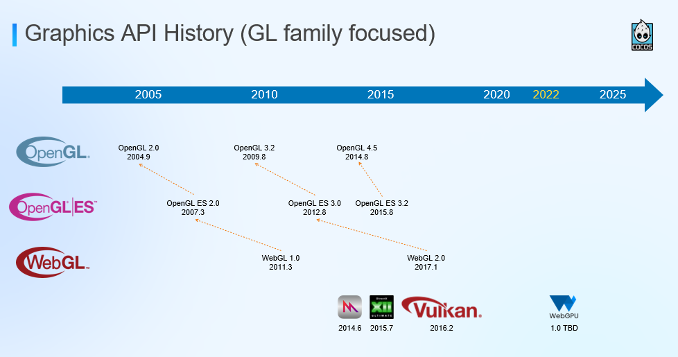

# 底层 3D 图形库概述

!!! quote

    - [List of 3D graphics libraries - Wikipedia](<https://en.wikipedia.org/wiki/List_of_3D_graphics_libraries>)
    - [A Comparison of Modern Graphics APIs - Alain Galvan](https://alain.xyz/blog/comparison-of-modern-graphics-apis)
    - [The story of WebGPU: The successor to WebGL - Medium](https://eytanmanor.medium.com/the-story-of-webgpu-the-successor-to-webgl-bf5f74bc036a)
    - :simple-bilibili: Up 主 [Redknot-乔红](https://space.bilibili.com/38154792) 制作的系列图形 API 科普视频：
        - [为什么游戏总要编译着色器？](https://www.bilibili.com/video/BV1zi421h7tJ)：3D 图形接口的发展历史（主要为 OpenGL），着色器语言。
        - [SteamDeck 搭载 Linux，凭什么可以玩 Win 游戏？](https://www.bilibili.com/video/BV1VeHFeTEjo)：现代着色器语言 HLSL、GLSL，中间格式 SPIR-V，Wine 和 Proton 如何实现 Direct3D 的转换。

请阅读 quote 中的参考资料，了解 3D 图形库的发展历史和现状。总体上，这些图形库的关系如下：

<figure markdown="span">
    

    
    

    <figcaption>
    3D 图形库的发展历史
     <small>
    [Building New 3D Web Games With Cocos Creator and WebGPU - COCOS](https://www.cocos.com/en/post/ODdxxWGryD6DiM6wPJ3yhPklSzCLCCxE)
    </small>
    </figcaption>
</figure>

## OpenGL 与 Vulkan

总体来说，Vulkan 的设计理念更新，跨平台兼容性更好，对硬件的控制更细致，性能更高，是未来的必然选择。但 OpenGL 仍然有其优势，比如更简单易用，对于一些简单的 3D 游戏或应用，OpenGL 仍然是一个不错的选择。

目前，入门 OpenGL 最好的书本应该是 [OpenGL Programming Guide: The Official Guide to Learning OpenGL, Version 4.5 with SPIR-V](https://archive.org/details/openglprogrammin0000kess)，其中文版为 [OpenGL 编程指南 (原书第 9 版)](https://book.douban.com/subject/27123094/)。如果要在 Windows 上进行开发，[Computer Graphics Programming in OpenGL with C++](https://terrorgum.com/tfox/books/computergraphicsprogrammminginopenglusingcplusplussecondedition.pdf) 提供了较为详细的 Windows 开发环境配置。

!!! info "硬件支持情况"

    Khronos 开发的所有 API 都有 Adopter Program：如果某公司实现了 Khronos 标准的 API，则必须通过 Khronos 的一致性测试，才能使用相关标准的名字和标志。

    - [OpenGL Conformant Products - Khronos](https://www.khronos.org/conformance/adopters/conformant-products/opengl)：从 OpenGL 4.4 开始，Khronos 启动了 Adopter Program。硬件制造厂商可以向 Khronos 提交 OpenGL 4.4 及更高版本的一致性测试。我们可以在其中看到的产品包括 2024 年的 Apple M2（OpenGL 4.6）到 2013 年的 GT 465（OpenGL 4.4）。
    - [OpenGL ES](https://www.khronos.org/conformance/adopters/conformant-products/opengles)
    - [Vulkan Conformant Products - Khronos](https://www.khronos.org/conformance/adopters/conformant-products/vulkan)

    此外，[gpuinfo.org](https://gpuinfo.org/) 是一个社区维护的 Khronos API 数据库。
