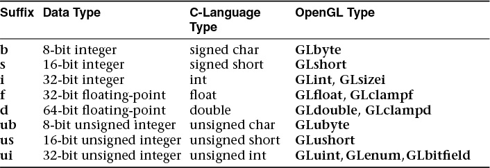
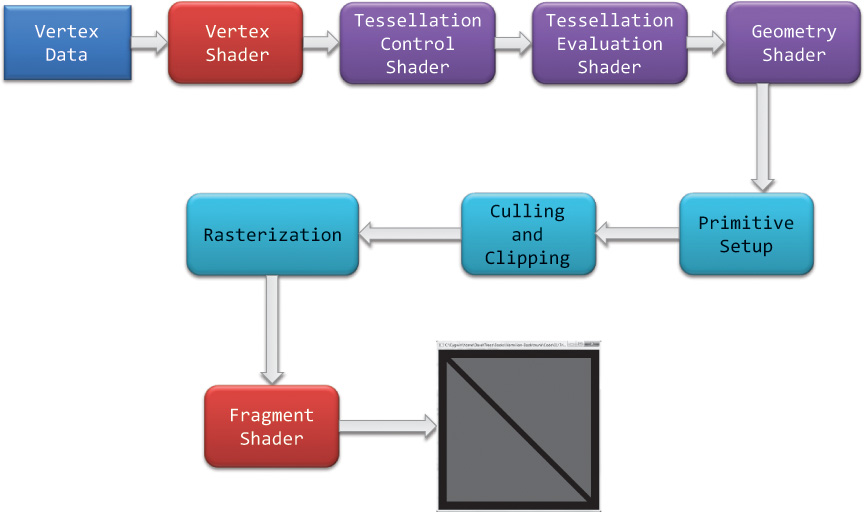

# OpenGL Programming Guide: The Official Guide to Learning OpenGL, Version 4.5 with SPIR-V

## 附录 B：OpenGL ES 与 WebGL

- 在大多数系统中 OpenGL ES 命名为 EGL。

## 第一章：OpenGL 简介

- OpenGL 是什么
    - 与硬件、操作系统和窗口系统独立，也不提供这些服务。
    - 不提供三维模型描述、读取图片等功能，需要自己使用点、线、面等基本图元描述。
    - 实现为 C/S 架构。
- 基本概念
    - 着色器：为 GPU 编译的小程序。
    - OpenGL 有六个着色器阶段，顶点（vertex）和片段（fragment）着色器是最常见的。
    - 像素存储在 framebuffer 中，这是由图形硬件管理的内存区域，用于给显示器显示。
- 基本程序框架：
    - `init()`：准备数据
        - 顶点信息
        - shader plumbing
    - `display()`：执行渲染
        - 使用 `glClearBuffer()` 清空 framebuffer
        - 绘制图形
        - 交换缓冲区
    - `main()`：主程序
        - 初始化
        - 创建窗口
        - 进入主循环
- OpenGL 语法
    - 所有 OpenGL 函数以 `gl` 开头，后接驼峰命名。如 `glBindBuffer()`。
    - 常量以 `GL_` 开头。如 `GL_COLOR_BUFFER_BIT`。
    - 为了可移植性，OpenGL 为函数定义各种数据类型，以 `GL` 开头。如 `GLint`、`GLfloat`。

        

    - 因为 OpenGL 是 C 库，没有重载，所以函数名后缀表示参数类型。如 `glUniform1f()`、`glUniform3fv()`。

- OpenGL 渲染管线：

    

    - 顶点和片元着色器必须被包含。
    - 传送给 OpenGL 的数据应当存放在 **buffer object** 中，这是 OpenGL 管理的一块内存。常用 `glNamedBufferStorage()` 指定缓冲区大小和数据。
    - 调用 `glDrawArrays()` 等命令意味着将顶点数据传送给 OpenGL。
    - 绘制命令的每个顶点都会执行**顶点着色器**，有可能会使用变换矩阵计算该顶点在屏幕上的位置等。
    - **曲面细分着色器（tessellation）**使用**面片（patch）**来描述对象，作用是细分、增加图元数量以提供更好的模型。
    - 几何着色器对几何图元进行处理。
    - 图元装配（primitive assembly）
    - 裁剪（clipping）自动进行，视口（viewport）
    - 光栅化（rasterizer）生成片元（fragment）。它确定屏幕的位置被哪个几何图元覆盖，结合输入的顶点数据，为片元着色器中的变量进行**线性插值**。这一阶段的实现与平台有关（platform-dependent）。
    - **片元着色器（fragment shader）**修改颜色和**深度**信息，执行**纹理映射**，丢弃（discard）不可见的片元。
    - 逐片元操作：使用深度检测（z-buffering）和模板测试（stencil testing）决定片元的**可见性**。
    - 如果开启了混合（blending），则与当前片元的颜色叠加写入 framebuffer。
    - 总体理解：顶点着色器负责图元在屏幕的哪个位置，片元着色器负责颜色。
- 解剖程序：
    - 应用的每个线程都有一个**当前上下文**，OpenGL 指令发送到当前上下文。应用可以有多个上下文和多个窗口，`glfwCreateWindow()` 将上下文和窗口关联起来。
    - `glCreate*()` 分配一些**对象名**。对象名有点像指针，使用 `glBind*()` 将对象名绑定到上下文，使它成为**当前对象**，后续的操作都是对当前对象的。一般有两种情况要做绑定操作：创建并初始化对象（`init()` 中），使用对象（`display()` 中）。
    - buffer 有不同地方可以存储，称为**绑定目标（binding target）**。如 `GL_ARRAY_BUFFER`、`GL_ELEMENT_ARRAY_BUFFER`。
    - `glNamedBufferStorage()` 为 buffer 分配内存，并将数据复制到 buffer 中。
- GLSL
    - 指定版本。
    - 分配着色器变量，这是它与外界通信的方式。布局限定符（layout qualifier）提供变量的元数据，其中有些与不同着色器阶段有关。
    - `gl_` 开头的内建变量。
- 连接管道
    - `glVertextAttribPointer()` 将顶点着色器的 `in` 变量连接到顶点属性数组（vertex-attribute array）。

## Chapter2: Shader Fundamentals

### Shaders and OpenGL

- GLSL: the OpenGL Shading Language,  since OpenGL Version 2.0

### OpenGL 可编程管线

- 输入和输出变量：在 OpenGL 每次执行着色器时更新。如果处理顶点，会为每个顶点传递新值；片元也是。
- 统一变量：不随顶点或片元变化而变化。

### GLSL 概述

基本数据类型：

```text
float double int uint bool
```

- GLSL 注重类型安全，支持的数值隐式转换有限。比如布尔值不能隐式转换为整数。

向量和矩阵类型举例：

```text
float vec2 vec3 vec4 mat2 mat3 mat4
double dvec2 dvec3 dvec4 dmat2 dmat3 dmat4
bool bvec2 bvec3 bvec4
```

构造函数的名字与类型名称相同，支持函数重载：

```glsl
vec4 color;
vec3 RGB = vec3(color);
mat3(4.0);
```

分量操作符支持一种叫 swizzle 的操作：

```glsl
vec3 luminance = color.rrr;
color = color.abgr;
```

支持 `length()` 方法，注意矩阵返回列数：

```glsl
mat3x4 m;
m.length(); // 3
m[0].length(); // 4
```

它是编译时常量，可以在需要常量的场合使用。

#### 类型修饰符

```glsl
const in out uniform buffer shared
```

`uniform` 在所有着色阶段之间都是共享的，对着色器来说只读。

```c
GLint glGetUniformLocation(GLuint program, const GLchar *name);
void glUniform{1234}{fdi ui}(GLint location, TYPE value);
void glUniform{1234}{fdi ui}v(GLint location, GLsizei count, const TYPE *value);
void glUniformMatrix{234}{fd}v(GLint location, GLsizei count, GLboolean transpose, const TYPE *value);
```

### 数据块接口

着色器之间、着色器和应用之间的数据传递可以组织为变量块。变量块开始的名称对应外部访问时的接口名称，结尾部分的名称用于在着色器中访问具体成员变量。

- `uniform` 块：

    ```glsl
    layout (shared, row_major) uniform b { vec4 v1; } name;
    ```

    在应用程序中：

    ```c
    GLuint glGetUniformBlockIndex(GLuint program, const GLchar *uniformBlockName);
    void glBindBufferRange(GLenum target, GLuint index, GLuint buffer, GLintptr offset, GLsizeiptr size);
    ```


### Compiling Shaders

### Shader Subroutines

### Separate Shader Objects

### SPIR-V

!!! todo "Skipped"

## 第三章：在 OpenGL 中绘图

本章介绍的函数能够：描述图元在内存中的布局，需要渲染多少图元，采用什么形式，甚至渲染一组图元的多个实例。

### OpenGL 图元

这些图元最终会渲染为点、线、三角形中的一种。此外的图元还有：

- 曲面细分着色器的**面片（Patches）**
- 几何着色器的**邻接图元（Adjacency Primitives）**

- 点（Points）
    - 边长：
        - `void glPointSize(GLfloat size);`
        - 着色器中：`gl_PointSize` 内置变量。开启 `GL_PROGRAM_POINT_SIZE` 后，可以在着色器内写入变量。
    - 点精灵（Point Sprites）
        - 片段着色器中 `gl_PointCoord` 内置变量。
- 线，条带与循环线（Lines, Strips, and Loops）
- 三角形，条带与扇面（Triangles, Strips, and Fans）
- 多边形作为点集、轮廓线或实体
- 多边形面的反转和裁剪

### OpenGL 缓冲区数据

### 顶点规范

### OpenGL 绘图命令

## 第五章：视图变换、裁切和反馈

- **model-view** 变换：放置相机或放置物体（两个变换互逆）。
- **视锥体（viewing frustum）**：视图变换后的视锥体。

## 在本书中学习到的 API

### OpenGL

```c
// glCreate*, glBind*, glDelete*, glIs*
void glCreateVertexArrays(GLsizei n, GLuint *arrays);
void glBindVertexArray(GLuint array);
void glDeleteVertexArrays(GLsizei n, const GLuint *arrays);
GLboolean glIsVertexArray(GLuint array);

void glCreateBuffers(GLsizei n, GLuint *buffers);
void glBindBuffer(GLenum target, GLuint buffer);
void glDeleteBuffers(GLsizei n, const GLuint *buffers);
GLboolean glIsBuffer(GLuint buffer);
// load data
void glNamedBufferStorage(GLuint buffer, GLsizeiptr size,
    const void *data, GLbitfield flags);
// Vertex Attribute Array (apply to bounded VAO)
void glVertexAttribPointer(GLuint index, GLint size,
    GLenum type, GLboolean normalized, GLsizei stride,
    const GLvoid *pointer);
void glEnableVertexAttribArray(GLuint index);
void glDisableVertexAttribArray(GLuint index);
// direct stats access
glEnableVertexArrayAttrib
glVertexArrayAttribFormat
glVertexArrayVertexBuffer

// rendering
void glClearBufferfv(GLenum buffer, GLint drawbuffer,
    const GLfloat *value);
void glDrawArrays(GLenum mode, GLint first, GLsizei count);

// Operations
void glEnable(GLenum capability);
void glDisable(GLenum capability);
GLboolean glIsEnabled(GLenum capability);
```

### GLSL

```glsl
#version 450 core
layout(location = 0) in vec4 vPosition;
```

### GLFW

```c
void glfwInit(void);
GLFWwindow* glfwCreateWindow(int width, int height, const char *title, GLFWmonitor *monitor, GLFWwindow *share);
void glfwMakeContextCurrent(GLFWwindow *window);
bool glfwWindowShouldClose(GLFWwindow *window);
void glfwSwapBuffers(GLFWwindow *window);
void glfwPollEvents(void);
void glfwDestroyWindow(GLFWwindow *window);
void glfwTerminate(void);
```

### GL3W

```c
int gl3wInit(void);
```
