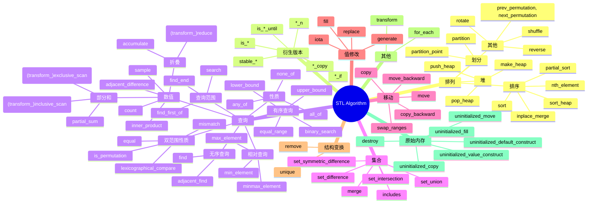

---
tags:
  - 个人笔记
---

# 📒 C 和 C++ 高级话题

## STL 容器

- https://lemire.me/blog/2016/09/15/the-memory-usage-of-stl-containers-can-be-surprising/

## STL 算法

!!! quote

    - [:simple-youtube: CppCon 2018: Jonathan Boccara “105 STL Algorithms in Less Than an Hour”](https://www.youtube.com/watch?v=2olsGf6JIkU)

分类：



经典用法：

```cpp
collection.erase(
    std::remove(begin(collection), end(collection), value),
    end(collection));
```

