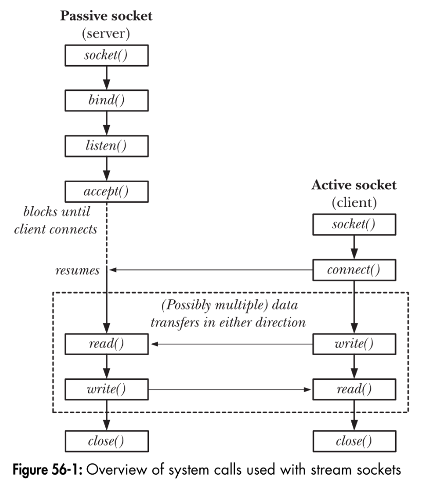
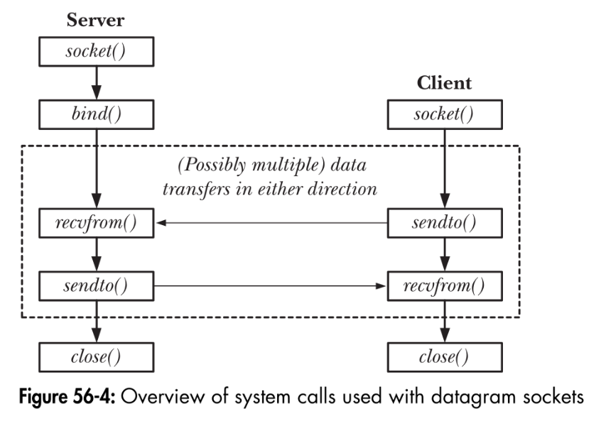

# The Linux Programming Interface

- System call, portability
- Universal File I/O
- Process ID, Memory layout
    - text, initialized, bss, heap, stack
    - page

History of UNIX. Fundamental: kernel, shell, user and groups, directory hierarchy, file I/O, programs

- 跳过的部分：
    - 6.8 Nonlocal Goto
    - 7 Memory Allocation
    - 8 Users and Groups

## 进程

- 每个进程都有 PID（Process ID）和 PPID（Parent PID），形成树状结构。所有进程的祖先是 `init` 进程（PID 为 1）。

    ```c
    #include <unistd.h>
    pid_t getpid(void);
    pid_t getppid(void);
    ```

    - 孤儿（orphan）进程会自动被 `init` 进程收养（adpot）。
    - `init` 的 PPID 为 1，即自身。
- 环境变量列表（Environment List）
    - 新进程创建时，拷贝一份父进程的环境变量列表。
    - 在 shell 中使用 `export` 可以将变量放入环境变量列表。`bash` 可以使用 `NAME=value program` 将变量添加到子进程的环境变量列表，而不影响父进程。

    ```c
    // 通过 `environ` 全局变量访问环境变量列表
    extern char **environ;

    char **ep;
    for (ep = environ; *ep != NULL; ep++)
        puts(*ep);

    // 通过函数访问环境变量
    #include <stdlib.h>
    char *getenv(const char *name);
    int putenv(char *string);
    int setenv(const char *name, const char *value, int overwrite);
    int unsetenv(const char *name);
    int clearenv(void);
    ```

- 进程凭证（Process Credentials）：一系列相关的 UID 和 GID
    - 实际用户/组（read UID/GID）：进程的归属
    - 有效用户/组（effective UID/GID）
        - 和辅助组一起，决定进程的权限，这些权限包括访问文件、IPC 对象、发送信号等。
        - 为 `0` 时拥有超级用户权限，称为特权进程（privileged process）。某些系统调用只有特权进程才能调用。
        - 一般与实际用户相同，但可以通过系统调用和 SUID/SGID 机制改变。
    - 保存用户/组（saved SUID/SGID）
        - 文件具有两个特殊的权限位：SUID 和 SGID。当执行这类文件时，进程的有效用户/组会被设置为文件的所有者/组。
        - 例子：`mount, umount, passwd, su, wall`。
    - 文件系统用户/组（file system UID/GID）
    - 辅助组（supplementary GIDs）

- `/proc/PID/` 下的一些文件：
    - `status`

## 第三十五章：进程优先级与调度

### 进程优先级（Nice Value）

Linux 和大多数 UNIX 实现都采用 round-robin 调度策略：

- 每个进程都能在一小段时间内使用 CPU，称为 time slice。
- 这保证每个进程均匀地分到时间。因此，进程无法控制自己何时能占用 CPU，也无法控制占用时长。

进程的 nice value 间接影响内核调度策略：

- nice value 从 -20 到 19，数值越小，优先级越高。
- 只有特权进程可以将自己的 nice value 设置为负值，其余进程只能降低自己的优先级。
- `fork()` 和 `exec()` 继承 nice value。
- 使用库函数 `getpriority()` 和 `setpriority()` 获取和设置 nice value。

    ```c
    #include <sys/resource.h>
    int getpriority(int which, id_t who);
    int setpriority(int which, id_t who, int prio);
    ```

- 命令 `nice`、`renice` 用于设置 nice value。

### 实时进程调度概述

略。

### 实时进程调度 API

略。

### CPU 亲和性

当进程经过调度重新运行时，它可能已经不在原来的 CPU 上了。缓存机制会导致性能下降：

- 为保证缓存一致性，多 CPU 架构只允许缓存保存在一个 CPU 上。因此旧 CPU 上的缓存要被清理，新 CPU 上的缓存要被填充。
- 置换缓存时先让缓存失效，如果缓存脏则需要写回内存，否则丢弃。
- Cache line 是 CPU 缓存与内存之间的数据传输单位，大小在 32 到 128 字节之间。可以类比虚拟内存中的页。
- 如果多个进程要访问同一个资源，那么将它们调度到同一个 CPU 上可以减少缓存失效。

亲和性实际上是线程的属性，可以为每个线程单独设置。

Linux 实现两种 CPU 亲和性：

- 软亲和性：尽可能让进程在同一 CPU 上运行。

    ```c
    #define _GNU_SOURCE
    #include <sched.h>
    int sched_setaffinity(pid_t pid, size_t len, cpu_set_t *set);
    int sched_getaffinity(pid_t pid, size_t len, cpu_set_t *set);
    void CPU_ZERO(cpu_set_t *set);
    void CPU_SET(int cpu, cpu_set_t *set);
    void CPU_CLR(int cpu, cpu_set_t *set);
    int CPU_ISSET(int cpu, cpu_set_t *set);
    ```

    - 这些系统调用同样会检查权限。
    - `fork()` 和 `exec()` 继承 CPU 亲和性。

- 硬亲和性：限制进程只能在指定的 CPU 上运行。
    - 内核启动选项 `isolcpus` 可以将 CPU 从调度器中移除，只能使用本节描述的方法将进程调度到这些 CPU 上。
    - 内核选项 `cpusets` 可以精细控制 CPU 和内存如何分配给进程。

    ??? note "Linux 内核文档：CPUSETS"

        - 前置知识：cgroups

        cpusets 扩展了内核已有的 sched_setaffinity（控制 CPU）和 mbind、set_mempolicy（控制内存）机制：

        - cpuset 按层次结构划分，root cpuset 包含所有 CPU 和内存节点。这一层次结构可以挂载到 `/dev/cpuset`，从用户空间管理。可以列出附加到某个 cpuset 的所有 task。
        - 每个 task 都附加到一个 cpuset，可以通过 task 结构中的指针访问。对该 task 的 sched_setaffinity 和 mbind 等操作都受 cpuset 限制。

        cpuset 实现为不影响性能的路径上的一些内核钩子，比如 `fork()`、`exec()`、`exit()` 和 `page_alloc.c` 等。

        `/proc/<pid>/status` 文件中包含了 cpuset 信息 `Cpus_allowed` 和 `Mems_allowed`。

## 网络

第 56-61 章都在介绍套接字编程。

### 第五十六章 套接字：简介

概念：

- **通信域（communication domain）**：决定地址格式和通信的范围。`AF_UNIX`、`AF_INET`、`AF_INET6`。
- **套接字类型（socket type）**：每种套接字实现至少提供两种
    - `SOCK_STREAM`：可靠双向字节流，面向连接。
    - `SOCK_DGRAM`：无连接，不可靠（乱序、丢失），消息边界。

一张图概括 Socket 通信模式：

<div style="display: flex; justify-content: space-between;">
    
    
</div>

- 对于 stream 模式，其中客户端的 `connect()` 可能发生在服务器的 `accept()` 之前，此时客户端阻塞。

### 第五十七章 套接字：UNIX 域

TODO

### 第五十八章 套接字：TCP/IP 网络基础

略。

### 第五十九章 套接字：Internet 域


