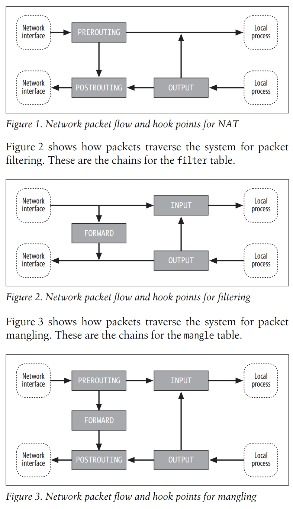

# Linux iptables Pocket Reference: Firewalls, NAT & Accounting

!!! note "完成日期：2024/09/01。"

这份手册很简短，没有什么目录结构。简单记一些要点：

## 基本概念

- table
    - 内置表 `nat`、`filter`、`mangle`，其中 `filter` 是默认表。
- chain
    - chain 由 rules 和 policy 组成。packet 流过 chain 时逐条匹配 rules，如果没有匹配到，就按照 policy 处理。
        - 内核网络栈在不同节点提供了一些 hook，chain 就是挂载在这些 hook 上的。
        - chain 包括：`PREROUTING`、`INPUT`、`FORWARD`、`OUTPUT`、`POSTROUTING`，意义就和名字一样。
    - policy 决定到达 chain 末尾的 packet 的处理方式。
        - 对于内置的 chain，默认为 `ACCEPT`，可以设置为内置目标 `ACCEPT`、`DROP`、`REJECT`。
        - 用户定义的 chain 默认为 `RETURN`，不可更改。
        - 如果要做其他处理，应当在 chain 的尾部设置匹配所有 packet 的 rule。
    - rule 由 match（匹配条件）和 target 组成。
        - 每个 rule 都有 byte 和 packet 计数器。
        - 如果没有 match，则匹配所有；如果没有 target，则什么都不做，计数器变化。
        - match 可以通过扩展添加。
        - target 如上所述，此外还有 `QUEUE` 可以发送到用户空间处理。

数据包可以以 nat、mangle、filter 三种方式流过表，如下图所示：



对应的命令行参数，还是比较好记的：

| 参数 | 说明 |
| --- | --- |
| `-t <table>` | **T**able |
| `-N <chain>` | **N**ew chain |
| `-A <chain>` | **A**ppend rule to chain |
| `-I <chain> [index]` | **I**nsert rule to chain |
| `-D <chain> [index | rule]` | **D**elete rule chain |
| `-F <chain>` | **F**lush chain |
| `-P <chain> <target>` | default **P**olicy for chain |
| `-R <chain> <index> <rule>` | **R**eplace rule |
| `-m <match> [options]` | **M**atch |
| `-j <target> [options]` | **J**ump to target |

## 应用方面

概述：

- Packet filtering、Accounting、Connection tracking、mangling：基本的监管功能，也为下面的技术提供连接管理功能。
- NAT：分为 SNAT 和 DNAT。
- Masquerading：SNAT 的特殊情况，改写包使得源地址为本机地址。
    - 作为路由时这是最常见的情况。
    - 与 SNAT 相比，**自动检测本机地址**。
- Port forwarding：DNAT 的特殊情况，改写目的地址为本机的包的目的地址为其他地址，且**相关的**回复包的源地址改为本机地址。

### Connection tracking

iptables 跟踪连接的生命周期。即使对于 UDP 这样的无连接协议，也会通过通信模式识别“连接”。

不管底层的连接状态有多复杂，iptables 从逻辑上将连接区分为四种状态：

| 状态 | 说明 |
| --- | --- |
| `ESTABLISHED` | 检测到双向通信 |
| `NEW` | 新连接 |
| `RELATED` | 新连接，且与已有连接有关 |
| `INVALID` | 不属于任何已知连接 |

### Accounting

添加无 match 和 target 的 rule，可以统计流量。注意用 `-i` 和 `-o` 区分输入和输出。

```shell
iptables -A FORWARD -i eth1
iptables -A FORWARD -o eth1
iptables -A INPUT   -i eth1
iptables -A OUTPUT  -i eth1
```

使用 `-L [chain]` 列出 chain 中的 rule，如果不指定 chain，则列出所有 chain。

```shell
iptables -L -v
```

### NAT

NAT 基于 Connection tracking。

- SNAT、MASQUERADE
    - 在包离开内核前修改，因此在 `POSTROUTING` 链。
    - target：如果主机有静态 IP，使用 `SNAT`；如果为动态 IP，使用 `MASQUERADE`。`MASQUERADE` 还包括网口不在线的处理逻辑，会有额外开销。故静态最好还是用 `SNAT`。

    ```shell
    iptables -t nat -A POSTROUTING -o eth1 -j SNAT
    iptables -t nat -A POSTROUTING -o eth1 -j MASQUERADE
    ```

    而如果想让本机作为路由，仅仅设置 SNAT 是不够的，还需要配置转发规则（其中的 match 后文介绍）：

    ```shell
    iptables -t nat -A POSTROUTING -o <wan> -j MASQUERADE
    iptables -A FORWARD -i <wan> -o <lan> -m state --state RELATED,ESTABLISHED -j ACCEPT
    iptables -A FORWARD -i <lan> -o <wan> -j ACCEPT
    ```

- DNAT
    - 在包被路由到本地进程或者被转发到其他主机前修改，因此在 `PREROUTING` 链。
    - target：`DNAT`。

    ```shell
    iptables -t nat -A PREROUTING -i eth1 \
        -p tcp --dport 80 -j DNAT --to-destination 192.168.1.3:8080
    ```

- Transparent proxy
    - 截获特定连接，并将其重定向。对连接双方来说是透明的。
    - target：`REDIRECT`。

    下面的例子代理到本机端口：

    ```shell
    iptables -t nat -A PREROUTING -i eth1 \
        -p tcp --dport 80 -j REDIRECT --to-port 8080
    ```

    代理到其他主机需要借助插件实现。

## match

```text
-m <match> [options]
```

match 可以有 options。对于 `ip`、`tcp`、`udp` 等常用的 match，可以不加 `-m` 直接使用其 `option`。

下文中有些 `option` 可以使用可选的 `!` 反转匹配条件。

略去了一些不常用的、高级的 match，比如标记 `mark` 匹配。

- `icmp`

    ICMP 包格式定义在 RFC 792 中：

    ```text
        0                   1                   2                   3
        0 1 2 3 4 5 6 7 8 9 0 1 2 3 4 5 6 7 8 9 0 1 2 3 4 5 6 7 8 9 0 1
    +-+-+-+-+-+-+-+-+-+-+-+-+-+-+-+-+-+-+-+-+-+-+-+-+-+-+-+-+-+-+-+-+
    |     Type      |     Code      |          Checksum             |
    +-+-+-+-+-+-+-+-+-+-+-+-+-+-+-+-+-+-+-+-+-+-+-+-+-+-+-+-+-+-+-+-+
    |                             unused                            |
    +-+-+-+-+-+-+-+-+-+-+-+-+-+-+-+-+-+-+-+-+-+-+-+-+-+-+-+-+-+-+-+-+
    |      Internet Header + 64 bits of Original Data Datagram      |
    +-+-+-+-+-+-+-+-+-+-+-+-+-+-+-+-+-+-+-+-+-+-+-+-+-+-+-+-+-+-+-+-+
    ```

    `type` 和 `code` 字段组合定义了 `typename`，可以在 [Internet Control Message Protocol (ICMP) Parameters - IANA](https://www.iana.org/assignments/icmp-parameters/icmp-parameters.xhtml)上查到。

    - `--icmp-type [!] typename`
    - `--icmp-code [!] type[/code]`

- `ip` 可以不加 `-m` 直接使用 option。

    IP 包格式定义在 RFC 791 中：

    ```text
        0                   1                   2                   3
        0 1 2 3 4 5 6 7 8 9 0 1 2 3 4 5 6 7 8 9 0 1 2 3 4 5 6 7 8 9 0 1
    +-+-+-+-+-+-+-+-+-+-+-+-+-+-+-+-+-+-+-+-+-+-+-+-+-+-+-+-+-+-+-+-+
    |Version|  IHL  |Type of Service|          Total Length         |
    +-+-+-+-+-+-+-+-+-+-+-+-+-+-+-+-+-+-+-+-+-+-+-+-+-+-+-+-+-+-+-+-+
    |         Identification        |Flags|      Fragment Offset    |
    +-+-+-+-+-+-+-+-+-+-+-+-+-+-+-+-+-+-+-+-+-+-+-+-+-+-+-+-+-+-+-+-+
    |  Time to Live |    Protocol   |         Header Checksum       |
    +-+-+-+-+-+-+-+-+-+-+-+-+-+-+-+-+-+-+-+-+-+-+-+-+-+-+-+-+-+-+-+-+
    |                       Source Address                          |
    +-+-+-+-+-+-+-+-+-+-+-+-+-+-+-+-+-+-+-+-+-+-+-+-+-+-+-+-+-+-+-+-+
    |                    Destination Address                        |
    +-+-+-+-+-+-+-+-+-+-+-+-+-+-+-+-+-+-+-+-+-+-+-+-+-+-+-+-+-+-+-+-+
    |                    Options                    |    Padding    |
    +-+-+-+-+-+-+-+-+-+-+-+-+-+-+-+-+-+-+-+-+-+-+-+-+-+-+-+-+-+-+-+-+
    ```

    其中 TOS 字段经历多次修改，也不怎么常用，不作介绍。Options 也不做介绍。

    - `-d [!] addr[/mask]`、`-s [!] addr[/mask]`：目的/源地址。
    - `-i [!] in`、`-o [!] out`：输入/输出接口。如果接口名以 `+` 结尾，表示匹配所有以该名字开头的接口。
    - `-p [!] proto`：协议。

- `iplimit`

    限制连接数。

    - `[!] --iplimit-above count`：大于 count 个连接。
    - `--iplimit-mask n`：掩码，用于限制连接数的范围。

    ```shell
    iptables -A INPUT -p tcp --dport 80 -m iplimit --iplimit-above 10 --iplimit-mask 24 -j REJECT
    ```

- `length`

    匹配包的长度。

    - `--length [min][:][max]`：长度范围。

    ```shell
    iptables -A INPUT -p icmp --icmp-type ping -m length --length 1000 -j DROP
    ```

- `limit`

    匹配直到达到包速率限制，然后停止匹配。

    - `--limit [rate[/unit]]`：速率限制，例如 `3/hour`，默认单位 `second`。
    - `--limit-burst [count]`：突发包数。

    ```shell
    iptables -A INPUT -p icmp --icmp-type ping -m limit --limit 10/s -j ACCEPT
    iptables -A INPUT -p icmp --icmp-type ping -m limit ! --limit 10/s -j DROP
    ```

- `mac`

    匹配 MAC 地址。仅 `PREROUTING`、`FORWARD`、`INPUT` 链。

    - `--mac-source [!] mac`：源 MAC 地址。

    ```shell
    iptables -A PREROUTING -i eth1 -m mac --mac-source ! 00:11:22:33:44:55 -j DROP
    ```

- `multiport`

    匹配多个端口。

    - `--dports port[,port,...]`：目的端口。
    - `--sports port[,port,...]`：源端口。
    - `--ports port[,port,...]`：源或目的端口。

- `nth`：匹配每 n 个包中的特定包。
- `owner`：匹配包的所有者，可以通过 UID、GID、进程名等。
- `pkttype`

    匹配包的类型。

    - `--pkt-type [!] broadcast|multicast|unicast`：广播、组播、单播。

- `psd`

    匹配 port scan detection，用于防止端口扫描。可以配置延迟、范围等阈值。

    ```shell
    iptables -A INPUT -m psd -j DROP
    ```

- `random`

    随机匹配。

    - `--average percent`：平均匹配率。

    ```shell
    iptables -A INPUT -p icmp --icmp-type ping -m random --average 10 -j DROP
    ```

- `state`

    匹配连接状态。

    - `--state state[,state,...]`：连接状态。

    ```shell
    iptables -A FORWARD -m state NEW -i eth0 -j DROP
    ```

- `string`：匹配载荷中的字符串。
- `tcp`

    TCP 包格式定义在 RFC 793 中：

    ```text
        0                   1                   2                   3
        0 1 2 3 4 5 6 7 8 9 0 1 2 3 4 5 6 7 8 9 0 1 2 3 4 5 6 7 8 9 0 1
    +-+-+-+-+-+-+-+-+-+-+-+-+-+-+-+-+-+-+-+-+-+-+-+-+-+-+-+-+-+-+-+-+
    |          Source Port          |       Destination Port        |
    +-+-+-+-+-+-+-+-+-+-+-+-+-+-+-+-+-+-+-+-+-+-+-+-+-+-+-+-+-+-+-+-+
    |                        Sequence Number                        |
    +-+-+-+-+-+-+-+-+-+-+-+-+-+-+-+-+-+-+-+-+-+-+-+-+-+-+-+-+-+-+-+-+
    |                    Acknowledgment Number                      |
    +-+-+-+-+-+-+-+-+-+-+-+-+-+-+-+-+-+-+-+-+-+-+-+-+-+-+-+-+-+-+-+-+
    |  Data |           |U|A|P|R|S|F|                               |
    | Offset| Reserved  |R|C|S|S|Y|I|            Window             |
    |       |           |G|K|H|T|N|N|                               |
    +-+-+-+-+-+-+-+-+-+-+-+-+-+-+-+-+-+-+-+-+-+-+-+-+-+-+-+-+-+-+-+-+
    |           Checksum            |         Urgent Pointer        |
    +-+-+-+-+-+-+-+-+-+-+-+-+-+-+-+-+-+-+-+-+-+-+-+-+-+-+-+-+-+-+-+-+
    |                    Options                    |    Padding    |
    +-+-+-+-+-+-+-+-+-+-+-+-+-+-+-+-+-+-+-+-+-+-+-+-+-+-+-+-+-+-+-+-+
    ```

    - `--dport [!] port[:port]`：目的端口。
    - `--sport [!] port[:port]`：源端口。
    - `--mss value[:value]`：最大分段大小。
    - `--tcp-flags [!] mask comp`：TCP 标志。
    - `--syn`：等价于 `--tcp-flags SYN,RST,ACK SYN`。

    ```shell
    iptables -A INPUT -p tcp --dport 80 -m tcp --tcp-flags SYN,ACK,FIN,RST SYN -j DROP
    ```

- `tcpmss`
- `time`
- `ttl`
- `udp`

    UDP 包格式定义在 RFC 768 中：

    ```text
        0      7 8     15 16    23 24    31
    +--------+--------+--------+--------+
    |     Source      |   Destination   |
    |      Port       |      Port       |
    +--------+--------+--------+--------+
    |                 |                 |
    |     Length      |    Checksum     |
    +--------+--------+--------+--------+
    |
    |          data octets ...
    ```

    - `--dport [!] port[:port]`：目的端口。
    - `--sport [!] port[:port]`：源端口。

    ```shell
    iptables -A INPUT -p udp --dport 53 -j ACCEPT
    ```

- `unclean`

    匹配异常 IP、ICMP、TCP、UDP 头。

## target

| target | 说明 |
| --- | --- |
| `ACCEPT` | 停止在当前 chain 的处理，进入下一个表。 |
| `DNAT --to-destination a1[-a2][:p1-p2]` | 仅 `nat` 表 `PREROUTING` 和 `OUTPUT` 链。修改目的地址，可以通过指定范围实现负载均衡，连接由 Connection tracking 管理。 |
| `DROP` | 丢弃包，不回复。 |
| `LOG` | 记录到 syslog。 |
| `MASQUERADE --to-ports p1[-p2]` | |
| `NETMAP --to addr[/mask]` | 工作在 `PREROUTING` 和 `POSTROUTING`，进行子网间地址映射。 |
| `REDIRECT --to-ports p1[-p2]` | 重定向包到本机端口。 |
| `REJECT --reject-with type` | 拒绝包，回复 ICMP 或 TCP 消息。 |
| `ROUTE --iface name --ifindex index` | 工作在 `mangle` 表的 `PREROUTING` 链，绕过内核路由表，直接路由到特定接口。 |
| `SNAT --to-source a1[-a2][:p1-p2]` | |
| `TCPMSS --set-mss value --clamp-mss-to-pmtu` | 修改 TCP 最大分段大小。 |
| `TTL --ttl-dec amount --ttl-inc amount --ttl-set ttl` | 修改 TTL。 |

`REJECT` 的一些类型：

```text
icmp-host-prohibited
icmp-net-unreachable
icmp-port-unreachable
tcp-reset
```

## 其他实用工具

```shell
iptables-restore
iptables-save
```

## 一些其他方面的提示

- 有些插件的功能需要内核编译时开启，如 `CONFIG_IP_NF_MATCH_UNCLEAN`。
- 配置 DNAT 时，注意内外网的 DNS 解析。应当让内网主机解析到内网地址，外网主机解析到外网地址。当然，也可以通过 NAT 回流解决。
