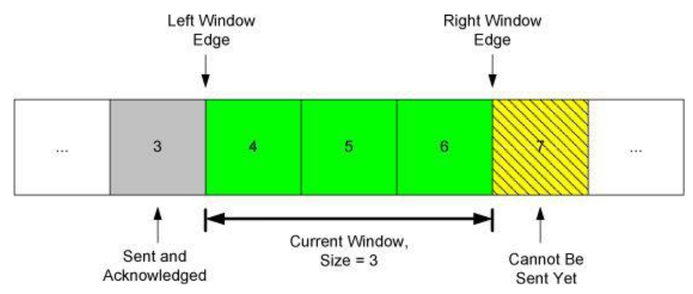
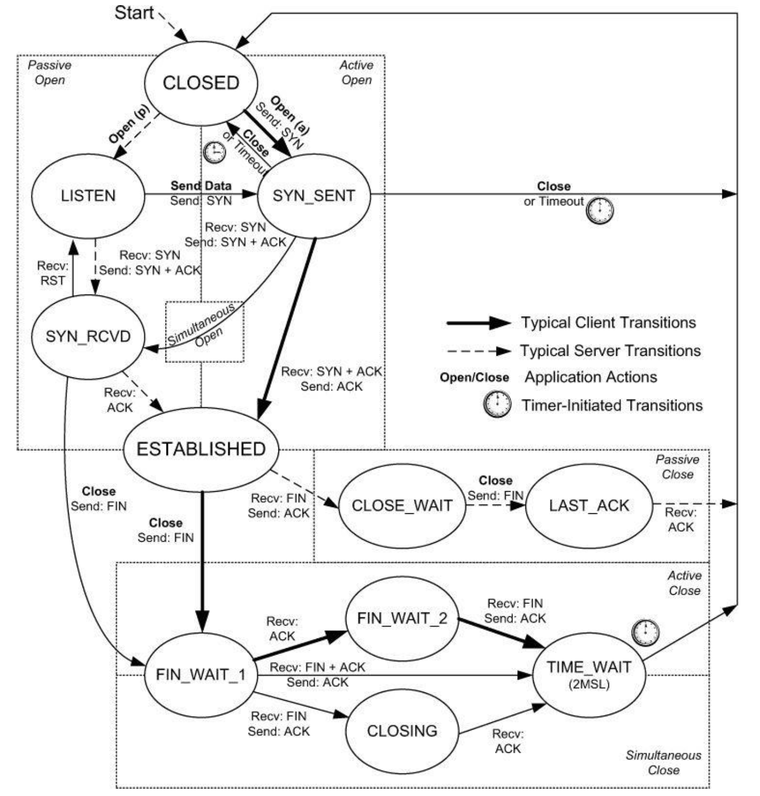

# TCP/IP Illustrated, Volume 1: The Protocols

## 第十二章：TCP 导言

### 12.1 基本概念和思想

- ARQ（Automatic Repeat reQuest）：自动重传请求

    在有损信道上保证数据可靠传输有两种思路：一种是使用纠错码纠正传输中发生的错误，另一种是尝试重传。TCP 采用的是第二种思路。原因是实际传输中不是简单的信道，而是多个信道相连，会发生的错误不仅有比特错误，还有丢包、乱序等问题。TCP 使用下面的方法保证数据可靠传输：

    - 接收方回复 ACK 确认收到的数据。
    - 使用校验和检查数据是否损坏。
    - 使用序列号（sequence number）解决乱序和重复包问题。

- 滑动窗口（Sliding Window）

    为了提高吞吐量，TCP 需要允许多个数据包同时在网络中传输，这就需要解决流量控制和拥塞控制问题。TCP 使用窗口机制解决这些问题。“窗口”是一个很形象的描述：把会话中的数据包排成一列，只看其中某个区间，就像透过窗户看风景一样。随着过去的数据包被确认，窗口向未来的方向“滑动”，允许发送方发送更多的数据包。发送方和接收方都有窗口。

    <figure markdown="span">

    
    
<figcaption>
    TCP 窗口
     <small>
    TCP/IP 详解 卷 1：协议
    </small></figcaption></figure>

- 流量控制（Flow Control）

    TCP 流控有两种方式：

    - 基于速率（rate-based）：发送方根据接收方的接收速率调整发送速率。
    - 基于窗口（window-based）：接收方发送 window advertisement/update 调整发送方窗口大小。假设中间过程无损，传输速率可以通过 $\frac{包大小\times 窗口大小}{RTT}$ 计算，因此可以通过调整窗口大小来调整传输速率。

    传输过程中，如果路由器等网络设备的缓存不足以支持相应的传输速率，也会导致数据包丢失，这涉及拥塞控制（Congestion Control），暂不作介绍。

### 12.3 TCP 报头和封装

TCP 向上层应用提供全双工（full-duplex）的字节流（byte stream）服务，将字节流分割成 IP 包发送。TCP 传递到 IP 层的数据单元称为 TCP 报文段（segment）。

TCP 报头一般长度为 20 字节，最大长度为 60 字节。包含固定的**源端口、目的端口**、序列号、确认号、头部长度、保留位、标志位、窗口大小、校验和、紧急指针，以及可选的选项字段。

- 序列号（sequence number）是报文内容中第一个字节在字节流中的偏移量。出于安全考虑，第一次握手时的初始序列号（initial sequence number，ISN）是随机的。
- 确认号（acknowledgment number）是接收方期望接收的下一个**字节**的序列号。

    ACK 是累积的（cumulative），表示该序号之前的所有数据都已经收到，这能一定程度上应对 ACK 丢包问题。该性质可以用于拥塞控制，参考 dupliate ACK。此外现代 TCP 有 SACK 选项（Selective Acknowledgement），可以更精确地指定丢失的数据包。

- 八个标志位如下：

    | 类型 | 描述 |
    | --- | --- |
    | CWR | Congestion Window Reduced，发送方降低发送速率 |
    | ECE | ECN Echo，表明接收方支持 ECN |
    | URG（罕见） | Urgent，紧急指针有效 |
    | ACK | Acknowledgment，确认号有效 |
    | PSH（罕见） | Push，接收方应该尽快交付数据（到应用） |
    | RST | Reset，重置连接 |
    | SYN | Synchronize，同步序列号以初始化连接 |
    | FIN | Finish，结束连接 |

- 校验和涵盖 TCP 报头和数据，还包括 IP 报头中的某些字段。
- 常用的选项字段是最大报文段长度（Maximum Segment Size，MSS），标明希望收到的最大 TCP 报文段长度。

## 第十三章：TCP 连接管理

### 13.2

- 建立连接三次握手（Three-Way Handshake）

    其中 SYN 可以携带数据，但是罕见，因为 Berkely socket API 不支持。

- 断开连接四次握手
- 半开放（half-open）与半关闭（half-close）状态
- 同步连接和断开（跳过）
- ISN 的选择

    对于 TCP 来说，目的/源地址/端口组成四元组，确定一个连接。但是，连接可以被多次实例化（instantiation），比如断开后重连。如果上一次的连接的包在网络中延迟，则可能进入下一次连接的数据流。

    在 TCP 的发展历史中，两个因素使得 TCP 四元组容易遭受攻击：不断增加的窗口大小和使用长连接的应用。[RFC 5961](https://tools.ietf.org/html/rfc5961) 对 TCP inbound 攻击进行了防范，并合并到了新的 TCP 标准中。

- 重传超时（RTO）

    3s -> 6s -> 12s -> 24s ...

    TCP 重传超时呈指数增长（expotential backoff）。系统可以配置重传次数。

- NAT

    NAT 一般实现部分的 TCP 状态机，通过 SYN 位等来跟踪连接状态。NAT 会修改 IP 报头中的地址和端口，因此需要修改 TCP 报头中的校验和。NAT 极少修改 TCP 载荷，这需要调整序列号，容易造成状态机不同步，导致连接错误运行。

### 13.3 TCP 选项

每个选项由三部分组成：`kind length data`

- NOP：用于填充，有些字段需要对齐到 4B。此外，**TCP 头长度字段使用 32 bit 作为单位**，也有对齐的要求。
- EOL：End of List，选项列表结束。
- MSS：愿意接受的最大报文段长度。仅覆盖报文段。一些有趣的数值：
    - 默认值：536 Byte，因 IPv4 最小 MTU 为 576，减去 20 字节 IP 头和 20 字节 TCP 头。
    - 1460 Byte：Ethernet MTU 1500，减去 20 字节 IPv4 头和 20 字节 TCP 头。
    - 1440 Byte：Ethernet MTU 1500，减去 40 字节 IPv6 头和 20 字节 TCP 头。
- WSCALE/WSOPT：窗口缩放因子。报头中的 Window Advertisement 字段为 16 bit，该选项指定其左移的位数，最高可以达到 $(2^{16}-1)\times 2^{14}$，接近 $2^{30}-1$。因此，在实现 TCP 时，常常使用 32 位来保存窗口大小。注意：**该选项只能在连接建立（SYN）时使用**，连接建立后固定。
- 此外还有如 Timestamp 等选项，可以计算 RTT 等。

### 13.4 TCP 路径 MTU 发现（PMTUD）

连接建立时，使用网络接口的最小 MTU 和对端发布的 MSS 作为选择发送 MSS（SMSS）的基准。如果对端不发布（罕见情况），使用默认值 536 Byte。

SMSS 设定后，该 TCP 连接发送的 IPv4 数据包都设置 DF（Don't Fragment）位，如果发现数据包过大，会收到 ICMP 报文，根据该报文调整 SMSS 并重传。

由于路由可能动态变化，TCP 建议每 10 分钟尝试更大的 SMSS。

PMTUD 在防火墙和 NAT 环境下，因为无法收到 ICMP 保温，可能产生著名的黑洞问题。

### 13.5 TCP 状态转换

<figure markdown="span">

<figcaption>
TCP 状态机
 <small>
TCP/IP 详解 卷 1：协议
</small></figcaption></figure>

在连接关闭后，TCP 连接会进入 TIME_WAIT 状态，等待 2MSL（Maximum Segment Lifetime）后释放资源。MSL 是任何报文在网络中的最长生存时间，RFC 规定为 2 分钟。

### 13.6 Reset 段

## 第十四章：TCP 超时与重传

## 第十五章：TCP 流量控制和窗口管理

## 第十六章：TCP 拥塞控制

## 第十七章：TCP 保活

## 第十八章：安全

### 18.4 密码学基础和安全机制

### 18.5 证书、证书权威和公共密钥基础设施

### 18.6 TCP/IP 安全协议和分层

### 18.9 传输层安全

