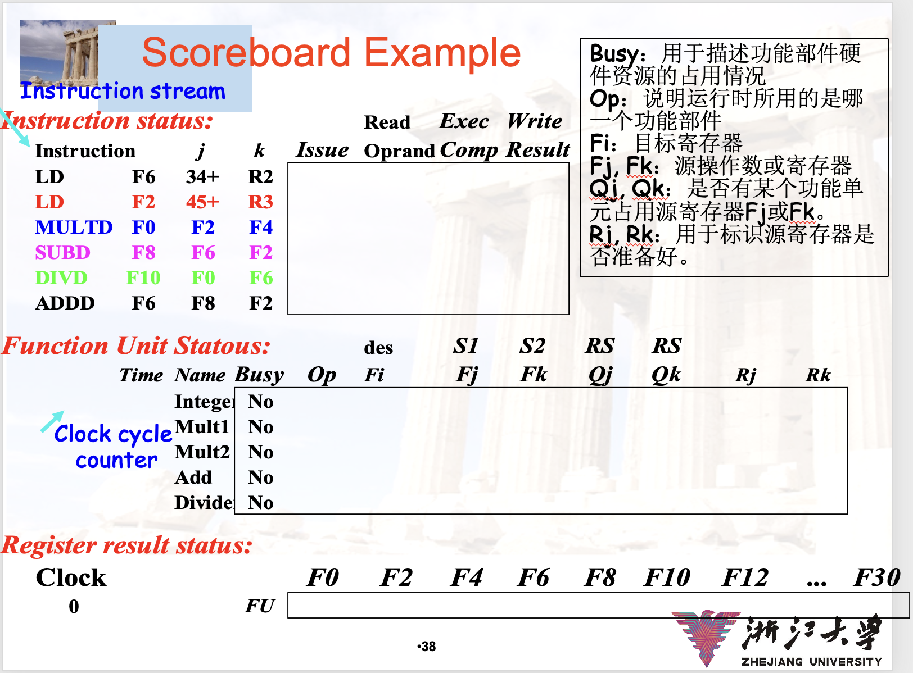
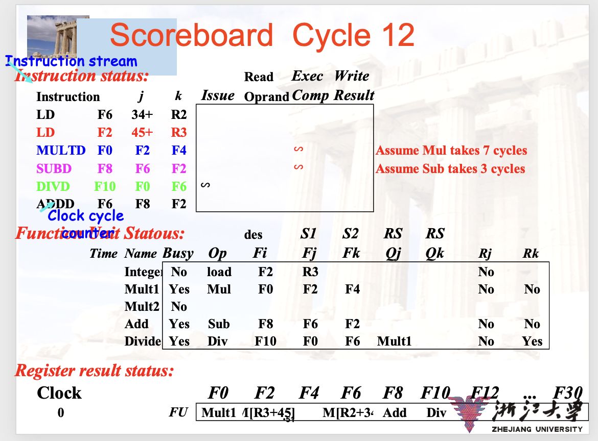

# Computer Architecture: A Quantitative Approach

## 第一章 量化设计与分析基础

### 1.5 集成电路中功率和能量的趋势

系统设计者考虑三个问题：

- 处理器需要的**最大功率**是多少？如果供电系统不能满足峰值功率需求，往往会导致电压下降，设备无法正常工作。
- **持续的功率**是多少？一般称为 **TDP（Thermal Design Power）**，通常比峰值功耗低，比平均功耗高。一般系统的供电和散热系统都和 TDP 相匹配。
- 能耗和能耗效率。通常**以能耗而不是功率作为指标**，不论是 PC 还是云服务场景。

    !!! exmaple

        处理器 A 比 B 功率高 $20%$，但只需要 $70%$ 的时间来完成任务。**对于一个相同的任务**，A 的能耗为 $1.2 \times 0.7 = 0.84$，比 B 少。

处理器内的能耗分为两种：

- 动态能耗（dynamic energy）：切换晶体管开关消耗的能量 $E_{\text{dynamic}} \propto C \times V^2$，与电容负载和电压有关。20 年来，处理器的电压从 5V 降到 1V，正是为了降低动态能耗。
- 静态能耗（static energy）：晶体管漏电流消耗的能量 $E_{\text{static}} \propto I \times V$，随着晶体管数量的增加而增加。比如一些高性能芯片中使用大量的 SRAM 缓存，将显著增加静态能耗。

### 1.7 可靠性

基础设施服务商提供 SLA（Service Level Agreement）或者 SLO（Service Level Objective）来保证服务的可靠性。在 SLA 中，系统在 Service Accomplishment 和 Service Interruption 两个状态间切换，切换的原因分别为 failure 和 restoration。相应地定义了一下可靠性指标：

- 可靠性指标：
    - MTTF（Mean Time To Failure）：正常运行的平均时间
    - FIT（Failure In Time）：每 $10^9$ 小时的故障次数

    上面两个指标互为倒数。比如，MTTF 为 $10^6$ 小时，则 FIT 为 $\frac{10^9}{10^6} = 10^3$。

    - MTTR（Mean Time To Repair）
    - MTBF（Mean Time Between Failure）= MTTF + MTTR
- 可用性指标：

    $$
    \text{Availability} = \frac{\text{MTTF}}{\text{MTTF} + \text{MTTR}}
    $$

要计算多个子系统组成的系统的可靠性（MTTF），一般先计算每个子系统的 FIT，相加得到整个系统的 FIT，取倒数即为 MTTF。

## 第三章 指令级并行及其利用

!!! abstract

    课上内容对应关系：

    - 3-1 讲：合并了 3.1、3.2 和 3.4、3.5 节，内容包括循环展开和动态调度。
    - 3-2 讲：3.3 节，简单的分支预测技术
    - 3-3 讲：3.6 节，改进 Tomasulo 进行分支预测
    - 3-4 讲：3.7、3.8 节，多发射和超长指令字

技术及其总结：TODO

### 3.1 指令级并行：概念与挑战

#### 什么是 ILP（Instruction-Level Parallelism）？

- **基本块（basic block）**：一段代码，除入口外没有其他**转入**分支，除出口外没有其他**转出**分支。

basic block 中的并行度很小，因为这些指令之间的依赖程度比较高。需要跨越多个 basic block 利用 ILP。循环级并行是最简单的 ILP。

- **循环级并行（Loop-Level Parallelism）**：一些简单的循环如 `x[i] = x[i] + y[i]` 的每次迭代之间没有依赖关系，可以并行执行。可以通过**编译器静态展开循环**或利用**硬件动态展开循环**。替代方法还有**使用向量处理器**（第四章）。

#### 数据依赖与冒险

判断**指令间的依赖关系**：

- **数据依赖（真依赖）**：指令 $i$ 的结果被指令 $j$ 使用，或指令之间存在依赖链。
    - 两种方法：保持依赖但避免冒险（通过**调度**，可以由硬件或软件完成），通过转换代码来消除依赖。
- **名称依赖**：两条指令使用相同的寄存器或内存地址（称为**名称**），在该名称上没有数据流动时。

    假设指令 $i$ 位于指令 $j$ 之前：

    - $j$ 对 $i$ 读取的名称执行**写**操作时，称为**反依赖（antidependence）**
    - $i$ 和 $j$ 都对相同的名称执行**写**操作时，称为**输出依赖（output dependence）**

    这两种情况都必须保证指令执行的顺序。但是由于不是**真依赖**，所以只需要改变这些指令使用的名称，就不再冲突，这些指令可以重排或同时执行。

- **数据冒险**：假设指令 $i$ 位于指令 $j$ 之前，$j$ 可能发生的冒险有：
    - **RAW 写后读**：$j$ 必须在 $i$ 写入之后读取，对应**真依赖**。
    - **WAW 写后写**：$j$ 必须在 $i$ 写入之后写入，对应**输出依赖**。
    - **WAR 读后写**：$j$ 必须在 $i$ 读取之后写入，对应**反依赖**。对于大多数流水线，所有读操作都比写操作早一些，所以不会发生 WAR。
    - 没有 RAR 冒险。

#### 控制依赖

- **控制依赖**：控制依赖并**不是一个必须保持**的关键特性。在不影响程序正确执行的情况下，可以执行一些还不应当执行的指令。
    - 通常要求**保护异常行为**，即改变指令的执行顺序不得导致程序引发任何新异常。

        比如：

        ```asm
            add x2, x3, x4
            beq x2, x0, L1
            ld  x1, 0(x2)
        L1:
        ```

        `beq` 和 `ld` 之间没有数据依赖，只有控制依赖。可以调换这两条指令的顺序，但是可能导致 `ld` 触发异常（段错误）。可能需要在执行分支操作时**忽略该异常**。**投机执行（speculation）**可以解决这一异常。

### 3.1 动态调度

顺序发射和执行的最大问题在于：如果当前指令 stall，那么后续指令都无法继续。在硬件具有多个功能单元（Functional Unit，FU）的情况下，其他功能单元可能空闲。我们可以通过**动态调度**将其利用起来。

!!! note "技术：动态调度与乱序执行"

    由硬件重新安排指令的**执行**顺序（根据可用的功能单元等决定），以最大化 ILP。动态调度仍然保持顺序发射。

    > 动态调度的一些好处：
    >
    > - 最重要的好处：通过调度执行其他指令，使处理器能够承受无法预测的延迟，比如缓存未命中等。
    > - 转移编译器的任务，编译器不需要为不同的流水线分别生成代码。
    > - 解决一些编译期无法确定的依赖问题。

    按顺序解码和发射指令，但让指令在操作数可用时立即执行，这就是**顺序发射、乱序执行（out-of-order execution）**。ID 阶段被分为 **Issue** 和 **Read Operands** 两个阶段：

    - Issue 阶段**检查结构冒险**：如果对应的 FU 忙，就等待。
    - Read Operands 阶段**等待数据冒险**：如果所需的操作数不可用，就等待。

    !!! warning "乱序执行带来了 WAR 和 WAW 冒险"

        RISC-V 流水线本来不存在 WAR（流水线写操作比读操作晚），但乱序执行时可能会发生。

        同样地，必须考虑 WAW。这两种冒险都通过 stall 后面的指令完成。

与前文编译器执行的静态调度相比：

- 静态调度通过隔离相互依赖的指令，尝试尽可能消除 stall。
- 动态调度尝试在依赖存在时，通过调度抵消 stall。

!!! note "动态调度技术 1：记分板（scoreboard）"

    假设有：

    - 2 个浮点乘法
    - 1 个浮点加法
    - 1 个浮点除法
    - 1 个整数单元用于所有内存引用、分支和整数运算

    指令四步：

    - 发射：指令对应的功能单元空闲，没有相同目的寄存器的指令在执行（防 WAW）。
    - 读操作数：如果没有先前发射的活跃指令将写入，那么操作数就是可用的。当操作数可用时，记分板告诉功能单元读取操作数并开始执行。解决 RAW。
    - 执行
    - 写回：需要检查 WAR，如果有冲突则 stall。

    使用这样一张图来记录 scoreboard

    

    中间状态例：

    

!!! note "动态调度技术 2：Tomasulo 方法"

    Tomasulo 方法通过**寄存器重命名（register renaming）**解决了 WAR 和 WAW 冒险。

    !!! example "寄存器重命名"

        例如，对于下面的指令：

        ```asm
        fadd.d  f6, f0, f8
        fsub.d  f8, f10, f14
        fmul.d  f6, f10, f8
        ```

        注意 `fsub` 指令利用 `f8` 暂存自己的结果，供 `fmul` 使用，但需要先等待 `fadd` 使用完 `f8`。可以用于暂存 `fsub` 结果的寄存器重命名，解决 `fadd` 和 `fsub` 之间的反依赖问题。

        ```asm
        fadd.d  f6, f0, f8
        fsub.d  S, f10, f14
        fmul.d  f6, f10, S
        ```

    寄存器重命名通过称为**保留站（reservation station）**的硬件结构实现，它与功能单元相连，存储等待发射的指令和它们的操作数。操作数直接发送到保留站，执行时直接从保留站读取，不经过寄存器。操作数在功能单元之间的传递通过**公共数据总线（common data bus，CDB）**完成。

与 scoreboard 相比，Tomasulo 使用重命名解决了反依赖和输出依赖，并且可以改进实现后文将介绍的投机执行。

### 3.2 利用 ILP 的基本编译器技术

#### 基本流水线调度和循环展开

为了避免 stall，相关指令要在流水线中拉开距离。编译器根据流水线中可用的功能单元（Functional Unit）来执行调度。

!!! example

    对于下面这个简单的循环：

    ```c
    for (i = 999; i >= 0; i = i-1)
        x[i] = x[i] + s;
    ```

    不做调度就是：

    ```asm
    Loop:   fld     f0, 0(x1)
            stall
            fadd.d  f4, f0, f2
            stall
            stall
            fsd     f4, 0(x1)
            addi    x1, x1, -8
            bne     x1, x2, Loop
    ```

    最简单的调度：将 `addi` 上移，与浮点计算 overlap：

    ```asm
    Loop:   fld     f0, 0(x1)
            addi    x1, x1, -8
            fadd.d  f4, f0, f2
            stall
            stall
            fsd     f4, 8(x1)
            bne     x1, x2, Loop
    ```

    对于上面这段代码，运算只有 3 个周期（fld、fadd.d、fsd），其余都是循环的开销。循环展开力图减少循环开销所占的比例：

    ```asm
    Loop:   fld     f0, 0(x1)
            fadd.d  f4, f0, f2
            fsd     f4, 0(x1)
            fld     f6, -8(x1)
            fadd.d  f8, f6, f2
            fsd     f8, -8(x1)
            fld     f0, -16(x1)
            fadd.d  f12, f0, f2
            fsd     f12, -16(x1)
            fld     f14, -24(x1)
            fadd.d  f16, f14, f2
            fsd     f16, -24(x1)
            addi    x1, x1, -32
            bne     x1, x2, Loop
    ```

    这要求循环次数是展开因子的整数倍。在实际程序中，循环展开一般分为两段：第一段不展开，执行 $n \mod k$ 次，第二段循环展开 $n / k$ 次。

    上面这段代码还有真依赖，我们还可以进行调度，让其在流水线中完全没有 stall：

    ```asm
    Loop:   fld     f0, 0(x1)
            fld     f6, -8(x1)
            fld     f0, -16(x1)
            fld     f14, -24(x1)
            fadd.d  f4, f0, f2
            fadd.d  f8, f6, f2
            fadd.d  f12, f0, f2
            fadd.d  f16, f14, f2
            fsd     f4, 0(x1)
            fsd     f8, -8(x1)
            fsd     f12, -16(x1)
            fsd     f16, -24(x1)
            addi    x1, x1, -32
            bne     x1, x2, Loop
    ```

#### 循环展开和调度总结

- 确保循环迭代是独立的，没有依赖关系。
- 使用不同的寄存器避免名称依赖。
- 调整循环测试、跳转指令。

此外有一些限制因素需要考虑：

- 展开得越多，效果逐渐减弱。
- 代码体积增加，需要考虑 I-cache 的影响。
- 造成寄存器压力，需要考虑寄存器分配。

### 3.2 分支预测

对于分支跳转指令，PC 在分支指令的 ID 阶段末尾确定，此时完成地址计算和比较。在此之前，我们需要预测分支的结果，以便在 IF 阶段就开始取指。

!!! note "分支预测技术 1：静态分支预测"

    > 该技术在书本 C.2 节介绍。

    书本将下面四种方法成为静态分支预测，它们都不需要运行时的动态信息。静态分支预测需要编译器考虑，使代码的路径与硬件预测尽可能一致。

    - **Stall Pipeline**：在分支指令后**重做 IF（相当于一次 stall）**，即分支指令的下一条为 IF IF ID ...。缺点是如果 untaken，就浪费了一次 IF。
    - **静态预测**：predicted-not-taken 或 predicted-taken。编译器需要考虑硬件实现，使代码的路径与硬件预测尽可能一致。
    - **分支延迟槽（branch delay slot）**：在分支指令后放一个**不论分支结果如何都会执行**的指令以避免浪费。编译器需要找到合适的指令填充。

        ```text
        branch instruction
        sequential instruction
        branch target if taken
        ```

!!! info "补充一些术语"

    - 基于方向的静态预测：

        根据分支目标相对分支指令的位置，分支可区分为**前向分支（forward branch）**和**后向分支（backward branch）**。通常，后向分支是循环的分支，前向分支是其他分支。因此，**基于方向的静态预测**通常将前向分支预测为 untaken，后向分支预测为 taken，以充分利用循环的特点。

!!! note "分支预测技术 2：动态预测"

    > 该部分在书本 C.2 节介绍。

    - Branch-Prediction Buffer：一块内存，**使用分支指令的低位作为索引**，存储一个 bit 表示最近一次分支的结果。
    - 2-bit prediction：上一种方法单个 bit 太不稳定，比如一个大部分情况下 taken 的分支，遇到一次 untaken，就会导致两次错误预测。2-bit prediction **使用两个 bit**，相当于为这种情况增加了一个缓冲区，表现更加稳定。自然地，可以扩展到 n-bit prediction。当计数器为 $\geq 2^{n-1}$ 时，预测 taken。

!!! note "分支预测技术 3：相关分支预测（correlating branch predictor）"

    > 该技术在书本 3.3 节介绍。

    $(m, n)$ 相关分支预测器就是将 $n$ 比特分支预测器复制 $m$ 份，并**将历史记录存入移位计数器对这些预测器进行索引**。这样一共需要两层索引，又称为 two-level predictor。

    !!! example

        考虑下面的代码：

        ```c
        if (aa == 2)
            aa = 0;
        if (bb == 2)
            bb = 0;
        if (aa != bb)
        ```

        最后一个分支的结果与前两个分支有关。于是我们希望能够利用前两个分支的结果来预测第三个分支：

        - 如果前两个分支都满足，预测第三个分支满足
        - 如果前两个分支只满足一个，预测第三个分支不满足
        - 如果前两个分支都不满足，再单独预测第三个分支。

!!! note "分支预测技术 4：锦标赛预测器（Tournament Predictor）"

    > 该技术在书本 3.3 节介绍。

    使用**全局（global）和局部（local）两个预测器**，用一个**选择器**在它们中选择。

    - 全局预测器使用分支历史进行索引。
    - 局部预测器使用分支地址进行索引。
    - 选择器使用分支地址进行索引，使用饱和计数器。

    锦标赛预测器表现好的关健在于：能够为不同分支选择正确的预测模式。

!!! note "分支预测技术 5：分支目标缓冲（Branch Target Buffer/Cache，BTB）"

    > 该技术在书本 3.9 节浅浅提及。

    前述的分支预测技术仅预测是否执行。BTB 在此基础上缓冲、预测分支的目标地址。

    > 大致的工作流程（不重要）
    >
    > - **IF 阶段**：将 PC 发送到 BTB，寻找条目是否存在。
    > - **ID 阶段**：
    >     - 条目存在：
    >         - take：顺利执行
    >         - not take：flush pipeline，删除 BTB 条目
    >     - 条目不存在：
    >         - take：插入 BTB 条目
    >         - not take：顺利执行

    一些变种：直接缓存指令而不是地址；指令和地址都缓存；缓存多条路径（take 和 not take 都缓存）。

上面几个重要的分支预测技术示意图如下：


!!! note "分支预测技术 6：集成取指单元（Integrated Instruction Fetch Units）"

    > 该技术在书本第 3.9 节介绍。

    为了满足多发射处理器的需求，现代处理器开始使用集成的取指单元，把下列功能集成到一个单元中：

    - 分支预测
    - 指令预取（Instruction Prefetching）
    - 指令缓存（Instruction memory access and buffering）

    设计的集成取指单元需要实现上述功能，从而在一个时钟周期内取多条指令。

!!! note "分支预测技术 7：返回地址预测器（Return Address Predictors）"

    > 该技术在书本第 3.12 的案例探究中浅浅提及。

    将返回地址记录在类似于栈的 buffer 中，避免到内存中取返回地址。

### 3.3 基于硬件的投机执行

> 本讲内容对应书本 3.6 节

对于宽发射（wide-issue）处理器来说，分支预测、动态调度仍不足以充分利用 ILP，可能每个周期都需要执行分支指令，这就需要**投机执行（speculative execution）**。

在使用分支预测和动态调度时，我们总是假设分支预测是正确的，从而进行**取指和发射**。这样做只能部分地将基本块重叠，还需要等待分支结果才能执行下一基本块。投机执行在此之上更进一步，将分支预测推入**执行**阶段。

!!! note "技术：投机执行（Speculation）"

    在控制依赖被解决之前就执行指令。投机执行需要具有撤销错误执行的指令序列的能力。

    为了能够撤销指令的副作用，我们为执行阶段添加提交（commit）步骤：

    - 在指令提交前，它可以将自己的结果 bypass 给后续指令，但不能执行写寄存器和内存等不可逆的操作。
    - 指令提交意味着该指令不再是投机执行的一部分，指令的效果生效。

    **允许指令乱序执行，但必须顺序提交**。

为了实现提交步骤，需要添加 **reorder buffer（ROB）**用于**存放完成执行但没有提交的指令的结果**，并起到 bypass 的作用。

## 第五章 线程级并行

!!! abstract

    本章内容上课讲的组织与书上不同，相当于梳理了比较重要的内容，并穿插了附录 I 中的内容。因此本章按课上的内容组织整理。

### 5.1 多处理器

- 费林分类法（Flynn's Taxonomy）对计算模式做分类：
    - SISD：单指令单数据流，传统的单处理器
    - MISD：多指令单数据流，很少见
    - SIMD：单指令多数据流，如向量处理器（第四章）
    - MIMD：多指令多数据流，多处理器系统（本章内容）

多处理器架构主要根据主存的组织方式分类。关心的问题有两个：

- 物理上是否集中：所有处理器对所有内存的访存延迟是否一致？
- 逻辑上是否共享：所有处理器是否都能透明地访问所有内存？

这两个维度是正交的。比如 DSM（Distributed Shared Memory）系统指物理上分布式内存，但逻辑上是共享内存。

- 物理上集中：SMP（Symmetric Multiprocessor）/UMA（Uniform Memory Access）。

    UMA 理论上很美好，但在现实中受到内存总线带宽的限制。随着系统规模的增加，延迟也会增加。因此 UMA 只适用于小规模 SMP，难以扩展。

- 物理上分布：NUMA（Non-Uniform Memory Access）
    - 逻辑上共享：DSM（Distributed Shared Memory）。
    - 逻辑上分布：由多个独立私有的地址空间组成，处理器不能直接访问远端内存。

        一般指集群，需要使用消息传递（Message Passing）进行通信。

并行编程范式梳理如下：

- 编程模型：
    - 多道程序设计（Multiprogramming）：任务之间没有通信。
    - 共享内存空间（Shared Memory）
    - 消息传递（Message Passing）
    - 数据并行（Data Parallelism）：多个 agent 在多个数据集上并行，同时交换数据。
- 通信抽象：
    - 共享内存空间

        这种通信方式的重点是保证**一致性**。

    - 消息传递

        需要了解基本原理。消息传递本质上就是通过 Send 和 Receive 操作进行内存间的拷贝，各端提供自己的缓冲区（本地地址），并且相互同步。

        Send 需要指定本地缓存和远端需要接收的进程，Receive 需要指定本地缓存和远端发送的进程。所谓指定“进程”，实际上是给消息打 Tag，接收方根据 Tag 来接收消息。同步一般发生在 Send 完成、缓冲区释放、Receive 等待等时刻。

        直接内存访问（DMA）出现后实现了无阻塞的消息传递。

    这两种通信机制的对比：

    | 方面 | 共享内存 | 消息传递 |
    | --- | --- | --- |
    | 特点 | 地址空间共享 | 地址空间独立，显式通信 |
    | 同步 | 需要显式做同步 | 消息传递收发时隐式同步 |
    | 编程难度 | 低 | 高 |
    | 硬件实现难度 | 高 | 低 |

本节最后总结了多处理器中的基础性问题：

1. 命名。可以联系第三章的 Tomasulo 算法，命名影响数据的存放、访问和传递。
2. 内存空间布局。涉及全局和分段式内存、物理和虚拟内存。
3. 同步。
4. 延迟和带宽。

### 5.2 一致性

在多处理器系统中，每个处理器有自己的缓存，可能产生不同处理器看到的同一内存位置的数据不一致的问题。

我们将缓存的数据区分为两类：

- 私有数据（private）：只有一个处理器使用。此时数据只在一个处理器的缓存中，不需要一致性。
- 共享数据（shared）：多个处理器使用。此时多个处理器的缓存持有数据的副本，需要保证一致性。对于共享数据，缓存提供：
    - 迁移（migration），即将数据移动到本地缓存，减小延迟。
    - 复制（replication），同时减小内存带宽，用于并行程序。

书本从两个方面描述共享内存系统的一致性：

- coherence：
    - 程序顺序：处理器 P 向 X 写入值后读取，期间没有其他处理器写入 X，返回 P 写入的值。
    - 保证一致：处理器 P1 向 X 写入值后，处理器 P2 读取，期间没有对 X 的写入。只要写入和延迟的间隔足够，返回 P1 写入的值。
    - 对同一内存位置的写入操作是串行化（serialize）的，即被看见的顺序相同。
- consistency：
    - 定义一个写操作何时被看见。

!!! note "理解 SMP 和 NUMA 的关系"

    NUMA并不与SMP架构相冲突，反而可以看作是SMP架构的一种扩展。简单来说，NUMA是SMP架构的一个优化版本，适用于处理器数目非常多的系统。在NUMA中，多个处理器仍然对称工作（SMP），但每个处理器连接到自己本地的内存，而不是共享内存。

!!! note "一致性技术：Snooping 协议"

!!! note "一致性技术：目录协议（Directory Protocol）"

    > 该技术在 5.4 节介绍。
    >
    > 目录协议在 SMP 和 DSM 的实现不同。对于前者，只需要一个统一的目录；对于后者，需要多个目录，才能使系统容易扩展。
    >
    > 我们只学习 DSM 上的目录协议。

    **目录（directory）**：记录每个可能被缓存的块的状态。状态包括：哪些缓存持有块的副本，是否是脏的（dirty）等。
