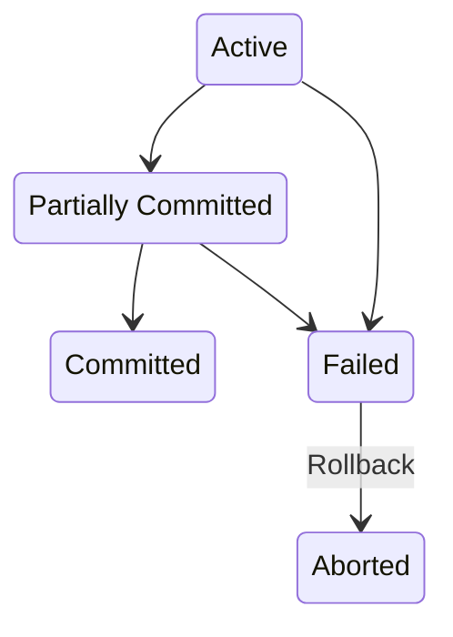
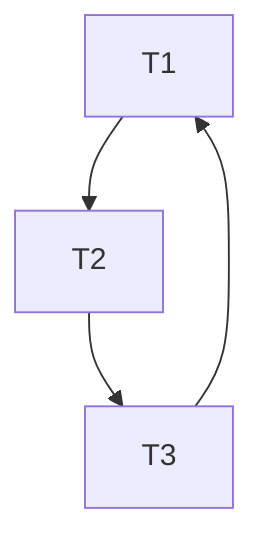

# [大二春夏] 数据库系统

## 关系代数

| Operation | Description | Symbol |
| --- | --- | --- |
| Select | satisfy a **predicate** | $\sigma_{predicate}(relation)$ |
| Project | select a subset of **attributes** | $\Pi_{attribute-list}(relation)$ |
| Cartesian-Product | combine two relations | $relation_1 \times relation_2$ |
| Join | combine two relations | $\sigma_{common\ predicate}(relation_1\times relation_2) = relation_1 \bowtie_{predicate} relation_2$ |
| Basic Set Operation | union, intersection, difference | $relation_1 \cup relation_2, relation_1 \cap relation_2, relation_1 - relation_2$ |
| Assignment | assign a new name to a relation | $new\_relation \leftarrow expression$ |
| Rename | rename the attributes of a relation | $\rho_{new\_name(new\_attribute\_list)}(relation)$ |

## 第四章

!!! abstract

    - Join
    - View
    - Index
    - Transaction
    - Integrity Constraint
    - Data Types and Schemas
    - Authorization

### 联结 Join

- 联结的种类：inner、left outer、right outer、full outer
- 联结的条件：natural、on、using

#### 自然联结：匹配公共属性相同的元组

注意下面两个的不同：

```sql
from student natural join takes natural join course

from student natural join takes, course
where takes.course_id = course.course_id
```

为防止上面的情况，一般使用 `using` 指定联结列：

```sql
from (student natural join takes) natural join course using (course_id)
```

使用 `on` 指定联结条件：

```sql
from student join takes on student.ID = takes.ID
```

#### 外部联结

可以理解为：如果没有匹配的元组，就用 NULL 填充其他属性。保留所有信息。

有 left、right、full 三种。关系代数符号：⟕、⟖、⟗。

#### 内部联结

使用自然联结时，会自动去掉重复的（联结所使用的）列。内部联结则保留。

### 视图 View

```sql
create view v as <query expression>
```

相当于存储了一个表达式。

Materialized view：存储了结果，而不是表达式。

允许简单视图的更新。

```sql
insert into faculty values ('30765', 'Green', 'Music');
```

### 索引 Index

```sql
create index <name> on <relation-name> (attribute);
```

### 事务 Transaction

作为一个整体执行的一组操作。

事务的结尾必须是 commit 或 rollback。

### 完整性约束 Integrity Constraint

常见：

```sql
not null
primary key
unique(a1, a2, ...)
check(predicate)
```

- unique 指明了 superkey，其中 candidate key 可以是空的，primary key 不可以。
- check 可以含有查询，比如

```sql
check(time_slot_id in (select time_slot_id from time_slot))
```

#### 引用完整性 Referential Integrity

默认拒绝。

cascade 级联操作

```sql
foreign key (a1, a2, ...) references r(b1, b2, ...)
    on delete cascade
    on update cascade
```

#### 断言 Assertion

数据库始终满足的条件。

```sql
create assertion <assertion-name> check (predicate)
```

### 触发器 Triggers

对数据库进行修改时的副作用。

ECA：Event-Condition-Action

- 事件：insert、delete、update
    - 发生前后：`after update of salary on instructor`
    - 引用发生前后的值：`new.salary`、`old.salary`

```sql
create trigger setnull_trigger before update of takes
    referencing new row as nrow
    for each row
        when (nrow.grade= ' ')
        begin atomic
            set nrow.grade = null;
end;
```

### 数据类型和模式 Data Types and Schemas

- date、time、timestamp、interval
- Large Object: BLOB (binary)、CLOB (character)，查询时返回定位器 pointer 而不是实际数据
- 自定义：
    - `create type Dollars as numeric (12,2) final`
    - `create domain person_name char(20) not null`

### 授权 Authorization

- 权限 privilege：read、insert、update、delete
    - index、resources、alteration、drop

```sql
grant <privilege list> on <relation or view> to <user list>
grant select on  department to Amit,Satoshi
revoke <privilege list> on <relation or view> from <user list>
create role <name>
grant <role> to <users>
```

## 第五章

!!! abstract

    - SQL 编程
    - 函数和过程

### JDBC

- Open connection
- Create statement
- Execute query
- Fetch result
- Handle Errors

#### SQL Injection

不使用字符串拼接，而是使用参数化查询。

```java
PreparedStatement pstmt = conn.prepareStatement("select * from student where ID = ?");
pstmt.setString(1, "12345");
ResultSet rs = pstmt.executeQuery();
```

这里的 `?` 就是参数。

```java
setString
setInt
setDate
```

#### 结果

```java
while (rs.next()) {
    System.out.println(rs.getString("ID"));
}
```

元数据 `.getMetaData()`：

```java
ResultSet rsmd = rs.getMetaData();
int numCols = rsmd.getColumnCount();
for (int i = 1; i <= numCols; i++) {
    System.out.print(rsmd.getColumnName(i) + "\t");
    System.out.print(rsmd.getColumnTypeName(i) + "\t");
}
```

#### 事务

```java
conn.setAutoCommit(false);
conn.commit();
conn.rollback();
```

### 函数与过程

```sql
create function f (a1 type1, a2 type2, ...) returns type
    begin
    declare v1 type1;
        select ... into v1
        from ...
        where ...;
    return v1;
end;

select ...
from ...
where f(a1, a2, ...) = ...;
```

表函数：

```sql
create function f (a1 type1, a2 type2, ...) returns table (c1 type1, c2 type2, ...)
    begin
    ...
end;
```

过程：

```sql
create procedure p (in a1 type1, out a2 type2, inout a3 type3, ...)
    begin
    ...
end;

declare a2 type2;
call p(a1, a2, a3, ...);
```

常用语句：

```sql
while ... do
    ...
end while;

repeat 
    ...
until ...
end repeat;

declare n interger default 0;
for r as 
    select ... from ...
    where ...
do
    set n = n + r.budget
end for;

if ... then
    ...
elseif ... then
    ...
else
    ...
end if;
```

## 第六章 E-R 模型

设计数据库的两种模式：ER 模型、范式理论。

- Entity：由 attributes 描述，如 `instructor=(ID, name, dept_name, salary)`
- Relationship：多个 entities 之间的联系。Relationshop Sets 表示为：$\{(e_1, e_2, ..., e_n)|e_i \in E_i\}$
- 整体用 ER 图表示
- 基本概念：entity sets、relationship sets、attributes

### Relationship Set

- 可以有 attributes
- Degree：relationship 的元素个数。一般都是二元关系 binary relationship。

### Attribute

- Simple/Composite
- Single-Valued/Multi-Valued
- Derived
- Domain：属性的取值范围

### E-R 模型

- 基本概念：实体集、关系集、属性
- entity set, extension of the entity set, attributes possessed by each member of an entity set, simple attributes, composite and multivalued attributes, value
- relationships of the same type, relationship instance, participation, entity's role, descriptive attributes, degree of the relationship set
- Complex Attributes: domain (value set), simple, composite, single-valued, multivalued, derived
- Mapping Cardinalities: one-to-one, one-to-many, ..., total, partial participation, minimum and maximum cardinality
- Primary Key: primary key of the "many" side is a minimal superkey, replace the non-binary relationship set as an entity, weak entity set, identifying entity set, discriminator attributes, strong entity set, existence dependent, own, identifying relationship
- Removing Redundant Attributes in Entity Sets: <!-- Skip From 6.6 -->

### 关系型数据库

标准化方法：

- 一个给定的关系提要是不是好的形式
- 如果不是，无损分解为更小的关系提要

## 第六部分：查询处理与优化

查询需要被分解成能用关系代数表示的操作。有多种分解方法，需要找到代价最低的。

// TODO：查询过程

### 第十五章：查询处理

本章学习对各种操作进行估值的算法，以及如何估计这些操作的代价。

### 第十六章：查询优化


## 第七部分：事务管理 Transaction Management

- 事务：逻辑上的一组操作。
- 原子性（atomicity）：要么全部执行，要么全部不执行。
- 持久性（durability）：一旦事务提交，其结果就是永久的。
- 隔离（isolation）：并发执行的事务之间需要隔离，不应该互相影响。
- 一致性（consistency）：事务执行前后，数据库应该保持一致性。

事务的以上性质合称为 ACID 特性。

### 第十七章：事务 Transaction

!!! abstract

    讲解事务的抽象的性质。介绍用可串行化（serializability）来描述事务的隔离性。

#### 事务模型

在本章建立的模型中，考虑事务对数据执行两类简单操作：`read(X)` 和 `write(X)`，分别表示从硬盘读取数据到内存和将内存中的数据写回硬盘。并且，`write(X)` 操作立即发生。在第十九章恢复管理中，会讨论何时将数据写回硬盘。

一个示例的事务如：

```text
T1: read(A); A := A - 50; write(A)
```

事务具有状态，如下图所示：



- 实现原子性：由恢复系统（recovery system）负责。
    -所有对数据库的更改（modification）都在执行前先写入日志（log）中。记录的内容包括事务、数据、新旧值。
    - 如果事务没有成功执行（abort），就应当由恢复系统执行借助日志（log）进行回滚（roll back）。
- 实现持久性：同样由恢复系统负责。第十九章将讨论如何应对硬盘上的数据丢失。本章考虑主存中的数据丢失，可以通过：
    - 写回完成后再返回事务完成
    - 事务更新的有关信息写入磁盘，以便故障恢复后重建
- 实现隔离：一种办法是串行执行。并发执行由并发控制系统（concurrency control system）负责。

#### 事务的调度

- 调度（schedule）：用于表示事务中的具体指令（instruction）的执行顺序。
    - 不同事务中访问相同数据的指令，只要其中一个为写指令，就会产生冲突。
    - 不冲突的指令可以交换执行顺序。能通过交换顺序得到的调度称为冲突等价。
- 冲突可串行化（conflict serializable）：一个调度是某个可串行（serial）调度的等价。

!!! example

    ```text
        T1   |   T2
     read(A) | 
     write(A)|
             | read(A)
             | write(A)
     read(B) |
     write(B)|
    ```

    等价于下面这个串行的调度：

    ```text
        T1   |   T2
             | read(A)
             | write(A)
     read(A) | 
     write(A)| 
     read(B) |
     write(B)|
    ```

- 视图等价（view equivalent）：两个调度中事务读取和写入的数据均相同。
- 视图可串行化（view serializable）：视图等价于某个可串行调度。

!!! example

    视图可串行化但不冲突可串行化的例子：

    ```text
        T1   |   T2     |   T3
     read(A) |          |
             | write(A) |
     write(A)|          |
             |          | write(A)
    ```

    这样的调度有盲写（blind write）的问题。

- 前驱图（precedence graph）：用于判断一个调度是否可串行化。
    - 节点表示事务
    - 边表示一个事务的操作依赖于另一个事务的操作（即读取了另一个事务的写入结果）
    - 如果图中没有环（acyclic），那么调度是可串行化的，串行化的结果就是前驱图的拓扑排序。



- 可恢复调度（recoverable schedule）：如果事务 T2 读取了事务 T1 的写入结果，那么 T1 必须在 T2 之前提交（commit）。否则就会出现幻读等问题。
- 级联回滚（cascading rollback）：一个事务的回滚导致其他事务的回滚。比如一个事务写入的数据此后被多个事务使用，然后该事务回滚，那么其他事务也需要回滚。
- 无级联调度（cascadeless schedule）：不存在级联回滚的调度。
    - 读取某个事务的写入结果前，保证该事务已经提交即可。
    - 无级联调度是可恢复的。

#### 并发控制

所有调度都是冲突或视图可串行化（conflict/ view serializable）的，可恢复的（recoverable）和无级联的（cascadeless）。

#### 一致性级别 Levels of Consistency

- 串行（serializable）：默认
- 可重复读（repeatable read）：只读取已提交的数据
- 读已提交（Read commited）：读取已提交的数据
- 读未提交（Read uncommited）：读取未提交的数据


### 第十八章：并发控制 Concurrency Control

!!! abstract

    介绍几种并发控制技术以保证事务隔离：封锁（lock）、时间戳（timestamp）、多版本（multiversion）。

#### 并发执行可能产生的几种问题

- 丢失更新（lost update）：两个事务同时读取数据，然后一个事务更新数据，另一个事务再更新数据。
- 脏读（dirty read）：一个事务读取了另一个事务的中间结果。比如，一个事务读取了另一个事务更新的数据，但随后另一个事务回滚了。
- 不可重复读（nonrepeatable read）：字面意思。隔离性应当保证事务连续两次读取相同数据获得的值一样。
- 幻读（phantom read）：相同的查询在事务执行过程中返回不同的结果。或者第二次读取相同数据时被告知不存在。

### 第十九章：恢复管理 Recovery Management