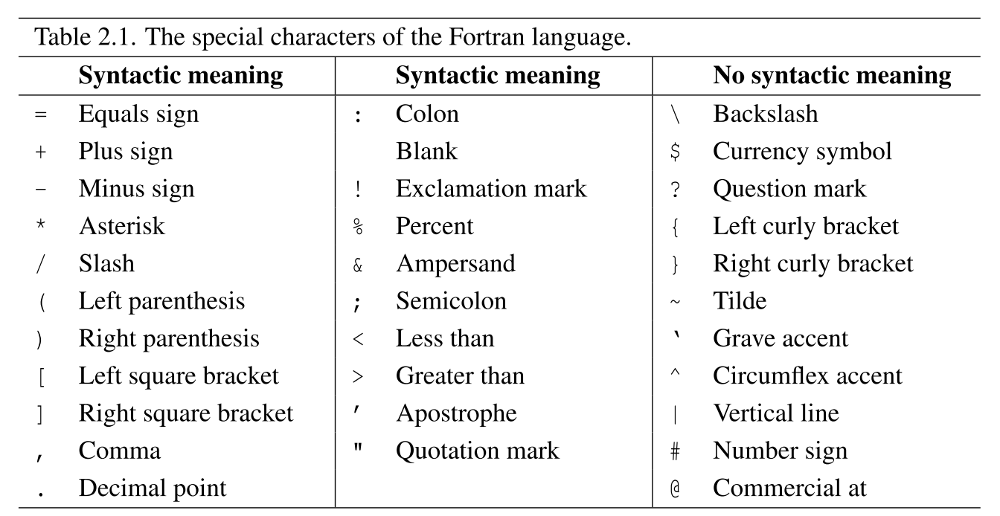
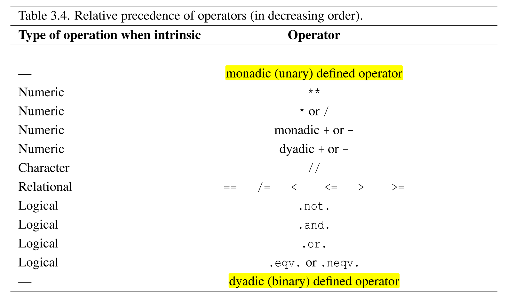

---
tags:
    - 较完善
---

# Fortran

??? abstract "大部分内容来自《Modern Fotran Explained》2018 版。"

    章节列表：

    1. [x] Whence Fortran?
    2. [x] Language Elements
    3. [x] Expressions and assignments
    4. [ ] Control constructs
    5. [ ] Program units and procedures
    6. [ ] Allocation of data
    7. [ ] Array features
    8. [ ] Specification statements
    9. [ ] Intrinsic procedures and modules
    10. [ ] Data transfer
    11. [ ] Edit descriptors
    12. [ ] Operations on external files
    13. [ ] Advanced type parameter features
    14. [ ] Procedure pointers
    15. [ ] Object-oriented programming
    16. [ ] Submodules
    17. [ ] Coarrays
    18. [ ] Floating-point exception handling
    19. [ ] Interoperability with C
    20. [ ] Fortran 2018 coarray enhancements
    21. [ ] Fortran 2018 enhancements to interoperability with C
    22. [ ] Fortran 2018 conformance with ISO/IEC/IEEE 60559:2011
    23. [ ] Minor Fortran 2018 features

## 第二章 Language Elements

### 2.2 Fortran 字符集

- 字符串以外的地方**大小写无关**。
- Fortran 特殊字符：



### 2.3 Token

- 标签、关键字、名字、常量、运算符、分隔符。
- 部分关键字对之间的空格是可以省略的，比如：`else if`、`end do`、`in out` 等。**一般将其连写，不适用空格形式**。

### 2.4 源文件格式

- 每行最多包含 132 个字符。

!!! tip "更改长度限制"

    在编译某些 Fortran 项目时可能遇到长度超过 132 的代码。如果使用 `gfortran` 编译，可以添加 `-ffree-line-length-512` 将长度限制更改为 512。Fortran 编译选项一般可以在 `./configure` 中使用 `FCFLAG=` 进行设置。

    参见 [StackOverflow: Line truncated, Syntax error in argument list](https://stackoverflow.com/questions/34194589/line-truncated-syntax-error-in-argument-list)

- 使用 `!` 进行单行注释。
- 使用 `&` 标记将语句分布到多行。语句接到下一行开头。
    - 如果下一行开头的第一个非空字符是 `&`，则接到它后面。这样可以切断 Token。
    - `&` 不能为注释跨行。注释可以夹杂在断行之间。

    ```fortran
    type, public :: t_ma& !a line break
        &trix(rows, cols, k)
    ```

- 可以使用 `;` 分隔一行中的多个语句。
- 语句标签：每个语句（不是复合语句的一部分）都可以打标签。标签可以由 1 - 5 个数字组成。不允许全零，允许前导零。

    ```fortran
    100 continue
    ```

    前导 0 并不重要，比如 `10` 和 `010` 是同一个标签。

### 2.5 类型的概念

- 5 种内置类型
    - 每种内置类型（type）都有一个默认的种类（kind）和编译器决定的其他种类。种类由一个非负整数表示。

!!! tip "区分类型（type）及其种类（kind)"

    这或许是初学时非常难以理解的一点：**每个内置类型都有一个默认种类和由编译器决定的其他变种**。每个种类都和一个称为**种类参数（kind type parameter）**的非负整数相关联。比如在 QuickStart 中曾经见过：

    ```fortran
    integer, parameter :: dp = kind(0d0)
    real(kind=dp), parameter :: x = 9.3
    ```

    初学者很可能看不懂 `kind()` 的参数是什么东西。`0d0` 其实是一个双精度浮点数常量，`kind()` 函数返回的参数的 `kind` 值，比如这边就是内置类型 `real` 中的双精度对应的 `kind` 值。使用它作为 `real` 的 `kind` 参数，就可以声明一个双精度浮点数了。

    `kind` 值也可以接在常量后跟一个下划线。比如：

    ```fortran
    integer, parameter :: k6 = selected_int_kind(6)
    -123456_k6 
    +1_k6
     2_k6
    ```

    如果某个编译器上，`k6` 的值就是 `3`，那也可以直接用：`2_3`。

### 2.6 内置类型的字面量

- 数值类型：整数、实数、复数
- 非数值类型：字符、逻辑

#### 整数字面量

- 标准没有规定范围。如果计算机字长为 $n$，范围一般为 $-2^{n-1}\sim 2^{n-1}-1$。
- 定宽整形 `selected_int_kind()`：

    ```fortran
    interger, parameter :: k6 = selected_int_kind(6)
    -999999_k6
    +1_k6
    ```

- 获得种类和范围信息 `range()`、`kind()`

    ```fortran
    kind(1)
    range(2_k6)
    ```

#### 实数字面量

- 标准也没有规定范围和有效位数。一般编译器遵守 IEEE 浮点规范，范围为 $10^{-37}\sim 10^{37}$。
- 指定精度和范围（$10^{-n}\sim 10^n$） `selected_real_kind()`

    ```fortran
    integer, parameter :: long = selected_real_kind(9, 99)
    12.3456789e30_long
    ```

- 除了种类、范围外，还可以获得精度信息 `precision()`。

#### 复数字面量

```fortran
(1., 3.2)
(1.0, 3.7_8)
```

- 复数的类型有以下情况：
    - 如果其中一个分量是整数：类型为另一个分量
    - 如果两个分量均为整数：类型为默认实数类型
    - 如果两个分量均为实数且种类不同：种类为精度最高的一个分量

!!! tip "总结一下：至少是实数，精度取最高"

- 可以查询种类、范围、精度。

#### 字符串字面量

- 可以使用单或双引号引起。在字符串内使用引号有以下两种方式：
    - 重复两次：`"He said, ""Hello!"""`
    - 使用异种引号：`'He said, "Hello!"'`
- 字符串的长度可以是 0：`""`
- 长字符串的写法：

    ```fortran
    long_string =               &
        "This is a long string  &
        & that is continued on  &
        & the next line."
    ```

    - 不允许附加注释。

- 字典序规则
    - 空格小于所有字母和数字。
    - 数字和字母间的顺序并不固定。
    - 其余特殊字符间的顺序也不固定。

!!! tip "记住字典序规则"

!!! info "岁月史书"

    之所以会产生这么奇葩的字典序规则，是因为 Fortran 不仅要支持 ASCII，还要支持如 EBCDIC 等编码。

存储 Fortran 字符集外的字符将在后文介绍。

#### 逻辑字面量

```fortran
.true._1
.false._long
```

非默认种类的逻辑字面量一般用于紧凑地存储逻辑数列。

#### 二进制值常量（boz 常量）

```fortran
b'1001'
z'a2f'
```

- 使用 `b`、`o` 和 `z` 开头，单/双引号引起。
- 长度不允许超过最大整数、实数。
- 使用场景十分有限。

### 2.8 内置类型的标量变量

- 声明语句可以接受参数
    - 只有字符接收两个参数（多了一个 `len`），其他都只接受一个参数即 `kind`
        - 无名参数默认为长度参数

```fortran
! 这两个等价
integer(kind=4) ::i
integer(4) :: i
! 这两个不等价
character(kind=4) :: c
character(4) :: c
```

### 2.9 派生类型

```fortran
type point
    real :: x, y
end type point
type triangle
    type(point) :: a, b, c
end type triangle
```

- 成员选择器 `%`：`triangle%a`。
- 派生类型字面量：`person('Smith', 'John', 42)`
- 复数类型有伪成员 `re` 和 `im`，也可以通过内置函数 `real()` 和 `aimag()` 获得。

### 2.10 内置类型的数组

!!! note "一些术语"

    - rank：数组的维数。
    - extent：每个维度的大小。
    - shape：每个维度的大小组成的元组。

!!! tip "Fortran 数组下标默认从 $1$ 开始。"

- 定长数组
    - 使用 `dimension` **属性**声明
    - 可以指定头尾元素的下标
    - 支持最多 15 维
    - 如果名字后面跟了自己的维度信息，那么 `dimension` 属性将不会作用于该数组。

    ```fortran
    real, dimension(10):: a
    real, dimension(-10:5)::vector
    real, dimension(-10:5, -20:-1)::grid
    integer, dimension(10) :: c, d, e(8, 7)
    ```

- 有些语句数组序迭代数组中的元素：先迭代外层的维度

    ```text
    grid(-10, -20, 0, -15, 1, 1, 1)
    grid( -9, -20, 0, -15, 1, 1, 1)
    ...
    ```

    - 但标准并不要求数组按这样的顺序存放
- 切片
    - 数组的切片是一个数组，但不能使用下标访问其中的单个元素

    ```fortran
    c(1:i, 1:j, k) !Rank-two array with extents i and j
    a(ipoint) ! ipoint is a rank-one integer array
    ```

    - designator 不能连用：

    ```fortran
    b(k, 1:n)(l) ! false
    b(k, l) ! correct
    ```

- 数组常量使用 `(/ /)` 或 `[]` 引起，其中可以使用构造器

    ```fortran
    (/ 1, 2, 3, 5, 10 /)
    [1, 2, 3, 4, 5]
    (/ (i, i = 2,8,2) /)
    (/ (i*0.1, i=11,15) /)
    ```

- `allocatable` 属性和 `allocate` 语句：数组的维数在声明时确定，大小在 `allocate` 后确定。

    ```fortran
    real, dimension(:, :), allocatable :: a
    allocate (a(n, 0:n+1)) 
    deallocate (a)
    ```

### 2.11 字符串的子串

- 可以创建字符串的数组。

    ```fortran
    character(len=80), dimension(60) :: page
    page(j)(i:i)
    ```

!!! tip "注意 `len` 和 `dimension` 的区别"

- 引用字符串的子串必须使用 `:`，**即使只访问一个字符**
    - 缺省下界默认为 1，缺省上界默认为字符串长度

    ```fortran
    line(i:i)
    line(:i)
    line(:)
    ```

### 2.12 指针

```fortran
real, pointer, dimension(:,:) :: a
```

- `pointer` 属性
- 数组指针只需声明 `rank`
- 置为空指针 `nullify()`

!!! tip "注意空指针和野指针的差异"

- 为指针分配空间 `allocate()`

    ```fortran
    allocate (son, x(10), y(-10:10), a(n, n))
    ```

!!! tip "上面两个函数都能同时接受多个指针"

!!! tip "声明指针时总是初始化"

    内置函数 `null()` 返回空指针

    ```fortran
    real, pointer :: son => null()
    ```

!!! example "链表结构"

    ```fortran
    type entry 
        real                    :: value 
        integer                 :: index 
        type(entry), pointer    :: next 
    end type entry
    ```

??? question "章末练习"

    - 第 6 题：Legal designators

        ```fortran
        character(len=10), dimension(0:5, 3) ::c 
        c(3,2)(0:9) ! 不合法，字符串子串的选择应当从 1 开始。
        ```

    - 第 8 题：Is array?

        ```fortran
        type(triplet), dimension(10) :: t
        t(5:5) ! 数组切片也是数组
        ```

## 第三章 表达式和赋值

### 3.2 数值表达式

- 一元正负号不能直接接在运算符后。比如 $x^{-y}$ 应当写为 `x**(-y)`
- 整数的除法将趋零截断。在指数运算时需要特别注意这一点

    !!! danger "`2**(-3)` is `1/(2**3)` is `0`!"

- 混合类型表达式将会统一使用最高级的类型形式的值。比如，如果 `a+b` 中 `a` 是整数，`b` 是复数，那么 `a` 将被替换为：

    ```fortran
    complex(a, 0, kind(b))
    ```

    !!! warning "混合类型表达式中的常量并不会自动提升，它会保持自己的精度，而该精度并不一定比表达式高。记得为这些常数指定 `kind` 值。"

!!! info "有关复分析的内容：任意实数都能被写为复数的幂，关于 raising a complex value to a complex power 的数值方面的问题，请参阅书本。"

### 3.3 已定义和未定义的变量

- 变量具有**定义**和**未定义**两种状态
    - 对于复合类型（数组、派生类型、字符串）的对象，其中的所有**非指针**子对象被定义时，该对象被定义

!!! tip "可能出现数组中一个元素失去定义，而导致整个数组被视为未定义的情况"

- 指针还有另一层状态：**关联和未关联（association）**
    - 指针是否定义取决于它关联的对象是否定义
    - 即使它已经关联了某个对象，它仍有可能未定义

### 3.4 数值赋值

对于 `variable = expr`，赋予的值为 `type(expr, kind(variable))`。

### 3.5 比较运算符

!!! warning "`/=` 表示不等于"

其余运算符和 C 一样，并且字符串可以直接比较（按字典序）。

```fortran
'ab' < 'ace' ! True
```

没有内置其他混合类型的比较运算符，可以自定义。

### 3.6 逻辑表达式与赋值

```fortran
logical :: i,j,k,l ! declaration
.not. .and. .or. .eqv. .neqv. ! operators
( .not.k .and. j .neqv. .not.l) .or. i
cond = a>b .or. x<0.0 .and. y>1.0
```

支持短路运算。

### 3.7 字符串表达式与赋值

- `//` 连接两个字符串：

```fortran
word1(4:4)//word2(2:4)//’S’
```

- kind 相同的字符串可以相互连接和赋值
    - 长度不一致时会截断或填充**空格（blank characters）**
    - 赋值的两侧可以重叠，比如 `result(3:5)=result(1:3)`。

!!! warning "未定义的字符在比较中总是会使比较错误"

    ```fortran
    character(len=5) :: fill 
    fill(1:4) = 'AB'
    fill == 'AB' ! False
    ```

    事实上，`fill` 现在的状态是 `AB  x`，即 AB 后跟两个空格，再是一个未定义的元素。改为 `fill(1:5)` 上面的片段就会正确。

- 关于 ASCII、EBCDIC 和 ISO 10646 编码的使用问题，请参阅书本。

!!! note "书本的错误"

    书本 42 代码疑似出现错误：

    ```fortran
    integer, parameter :: ascii = selected_char_kind('ASCII')
    character(ascii) :: x = ascii_'X'
    ```

    在 2.8 节我们已经知道，`character` 类型的无名参数视为 `len`，此处用法是不严谨的，应改为：

    ```fortran
    character(kind=ascii) :: x = ascii_'X'
    ```

### 3.8 结构构造器

```fortran
! structure constructor
derived-type-spec ([component-spec-list])
! component-spec
[keyword=]expr
[keyword=]target ! not =>
```

### 3.9 自定义运算符

- 使用 `interface` 块将**运算符与函数关联**

!!! example "`interval` 类型及其自定义运算符"

    ```fortran
    type interval
        real :: lower, upper
    end type interval

    function add_interval(a,b)
        type(interval) :: add_interval
        type(interval), intent(in) :: a, b
        add_interval%lower = a%lower + b%lower
        add_interval%upper = a%upper + b%upper
    end function add_interval

    interface operator(+)
        module procedure add_interval
    end interface 
    ```

    - 运算符可以是任意内置运算符，或者使用小数点包围的不超过 63 个字符的序列，比如 `.sum.`
    - 不能覆盖内置类型已经定义好的运算符

- 运算符优先级

    

### 3.10 自定义赋值

使用 `subroutine`：

```fortran
subroutine real_from_interval(a,b) 
    real, intent(out) :: a
    type(interval), intent(in) :: b 
    a = (b%lower + b%upper)/2
end subroutine real_from_interval

interface assignment(=) 
    module procedure real_from_interval
end interface
```

- 自定义赋值函数的
    - 第一个参数 `intent` 为 `out` 或 `inout`，对应变量
    - 第二个参数 `intent` 为 `int`，对应表达式
- 内置的赋值会为派生类型的所有非指针成员赋值，包括已经重定义了赋值的成员
- 无法覆盖内置类型之间的内置赋值行为

### 3.11 数组表达式

一元、二元运算符都可以用于数组。二元运算符要求两个操作数的形状相同，或其中一个是标量（可以广播）。

```fortran
real, dimension(10,20) ::a,b
real, dimension(5)::v
a + b
a == b ! 会产生一个布尔数组，而不是只有一个布尔值
a(2:9,5:10) + b(1:8,15:20) ! 对应关系只用于形状，而与下标无关
```

### 3.12 数组赋值

- 按元素赋值
- 广播赋值

!!! tip "和字符串子串的行为一致，赋值右侧的操作数在赋值发生前会被求值"

    ```fortran
    v(2:5) = v(1:4)
    ```

### 3.13 表达式中的指针

- 不需要显式解引用就能访问指针所指对象

!!! note "注意和 C 语言的差异"

    这意味着，如果赋值语句的两端都是指针，相应的对象将被赋值，而不是指针被赋值。

    Fortran 这样做的原因是科学和工程中访问指针所指对象比更改所指对象频繁得多。

- `=>` 为指针赋值，即改变指针所指

    ```fortran
    pointer => target
    ```

    !!! tip "`pointer` 和 `target` 的类型、类型参数、`rank` 都必须相同"

    - `target` 可以是变量，也可以是值为指针的函数如 `null()`
    - `target` 如果是变量，必须具有 `target` 属性

        ```fortran
        real, target :: y
        ```

    - 指针指向的子对象（切片、子串、成员）可以直接作为 `target`

        ```fortran
        character(len=80), dimensioin(:), pointer :: page
        type(entry) :: node
        ! valid target
        page, page(10), page(2:4), page(2)(3:15)
        node%next%value
        ```

    - `target` 为指针时，发生指针拷贝
        - 指针的关联状态也会被拷贝

        !!! tip "显然指针无法指向指针"

- 结构赋值时，指针成员发生指针赋值

!!! example "链表操作：插入头节点"

    ```fortran
    allocate(current)
    current = entry(new_value, new_index, first)
    first => current
    ```

??? question "章末练习"

    - 第 6 题：

        ```fortran
        d < c .and. 3.0 ! 非法：逻辑运算符不接受数值
        ```

    - 第 8 题：疑似答案错误

        ```fortran
        d = b + 1 ! 应当合法，1 提升为 real，从而参与运算
        r = b + c ! 显然不合法，根据定义结果为 interval，无法赋值给 real
        ```

    - 第 10 题：数组切片有待后续章节深入学习

        ```fortran
        real, dimension(5, 6) :: a, b
        real, dimension(5)    :: c
        c = a(:,2) + b(5,:5) ! is valid
        ```

## 第四章 控制结构

### 4.2 `if` 结构和语句

```fortran
[name:] if (scalar-logical-expr) then
            block
        [else if (scalar-logical-expr) then [name]
            block]...
        [else [name]
            block]
        end if [name]
! example
swap: if(x < y) then
        temp = x
        x = y
        y = temp
    end if swap
! simplest form
if (scalar-logical-expr) action-stmt
! example
if (x-y > 0.0) x = 0.0
```

- `name` 必须保持一致

### 4.3 `case` 结构

```fortran
[name:] select case (expr)
        [case selector [name]
            block]...
        end select [name]
! example
select case (number)
case (:-1)
    n_sign = -1
case (0)
    n_sign = 0
case (1:)
    n_sign = 1
end select
```

- `expr` 和 `selector` 可以是字符、逻辑、整数
    - 可以指定范围，如 `case (low:high)`
    - `case default`
    - 不允许重叠，仅有一个 `selector` 可以满足

### 4.4 `do` 结构

```fortran
[name:] do [,]variable=expr1,expr2[,expr3]
            block
        end do [name]
! example
do  i = 1, 10
    sum = sum+a(i)
end do
! complex one
do i = j+4, m, -k(j)**2
! zero-trip loop
do i = 1, n
! endless loop
[name:] do
    exit [name]
    cycle [name]
end do
```

- `expr` 中的变量**取初值**，循环中的改变不会影响迭代
- 上面的 zero-trip loop，如果 $n\leq 0$，则不会进入循环
- `variable` 在循环结束后**可用**

!!! question "结束后，它的值是 $n$ 吗？"

!!! example "链表迭代“

    ```fortran
    type(entry), pointer :: first, current
    current => first
    do
        if (current%index == 10) exit
        current => current%next
    end do
    ```

### 4.5-4.6

- `exit` 语句可以从除 `do concurrent` 和 `critical` 外的所有语句跳出
- `go to label` 无条件跳转
    - 块语句的内外不能随意跳转

## 第五章 程序单元

- 三类程序单元：主程序、外部子程序、模块
    - 主程序的主要作用就是调用辅助程序
    - 子程序定义 `function` 和 `subroutine`，统称为 procedure
        - `function` 返回一个对象，通常不改变参数（就像数学上函数的意义一样）
        - `subroutine` 执行更复杂的任务，通过改变参数等方法返回多个结果
    - 如果子程序自身是一个程序单元，就称为外部子程序
        - 可以通过 Fortran 以外的方式定义
    - 否则就是模块
        - 模块中还有数据定义、派生数据类型定义、`interface` 块等

### 主程序

```fortran
[program program-name]
    [specification-stmts]
    [executable-stmts]
[contains
    [internal-subprogram]...]
end[program[program-name]]
```

- `stop` 语句可以在主程序（和子程序中）出现，停止程序执行

```fortran
stop stop-code ! integer or character constant expression
stop 'load_data_type_1'
```

- `subroutine`、`function` 的结构与 `program` 一致，只是首语句可以附带参数列表
- 在子程序间传递信息有两种方式：
    - 使用模块
    - 使用参数

### 模块

```fortran
module module-name
    [specification-stmts]
[contains
    [module-subprogram]...]
end [module[module-name]]
```

- `use module-name` 使用模块

### 子例程

- C 中的形参现称为 dummy argument，实参名称未变
- 实参和形参的数组形状应当一致
    - 可以自动推断形状，形参声明如下：

        ```fortran
        real, dimension([lower-bound]:, ...) :: da
        ```

        - `pointer` 和 `allocatable` 属性的形参不会自动推断（它们也不需要知道形状）
- 指针实参可以赋给非指针形参，只要 target 类型一致即可

!!! warning "实参有几条限制，较难理解，请参阅书本"

    大概就是，如果对某个形参进行了修改，那么在子例程中只能使用该形参引用对应的实参。

    ```fortran
    call modify(a(1:5), a(3:9))
    ```

    则 `a(3:5)` 不应当通过任何一个形参改变。如果通过其中一个形参进行了修改，则会造成另一形参不可用。

- 多数情况下，实现可以拷贝实参以提高效率，指向实参的指针不会与形参关联。但有情况不允许拷贝，此时，内部关联到这些形参的指针在退出后，仍然关联到实参的对应位置。

!!! tip "这些行为都和 C/C++ 中的指针有些相似，能大概理解就好"

- `return` 语句不能出现在主程序中。它将控制权交还给调用者。

### `intent`

- 定义 `operator` 的 `function` 形参必须 `intent=in`
- 定义 assignment 的 `subroutine`，第一个形参必须 `intent=out` 或 `inout`，第二个形参必须 `in`
- 如果没有 `intent`，但子例程改变了形参，对应的实参必须是变量

!!! tip "加上括号，可以把变量实参变成表达式，从而无法修改"

- 对于指针，`intent` 描述其本身，`in` 的指针对象的值可以改变

### 函数

- 返回值的类型可以直接写在 `function` 前面

### 隐式接口

下面两种方式不能同时使用：

- `external external-name-list` 声明外部名字，此时参数类型通过调用语句自动推断
- 或者使用 `interface` 块说明接口，其中 `interface-body` 部分基本就是函数声明头的拷贝：

    ```fortran
    interface
        interface-body
    end interface
    ```

!!! note "使用 `interface` 可以声明 C 或汇编的外部接口"

!!! note "库的组织结构"

    - 写一系列的 `subprogram`
    - 把它们的 `interface` 放在一个 `module` 中，然后 `use` 它

    有点像 C 的头文件

- `interface` 块无法获得其宿主环境中的名字，可以使用 `import` 让这些名字可用

    ```fortran
    import [[::] import-name-list]
    ! example
    module m
        type t
    contains
        subroutine
            interface
                function fun(f)
                    import :: t
    ```

### 过程作为参数

用 `interface` 块声明即可。函数形参不允许 `intent` 属性（没有意义）。

```fortran
real function minimum(a, b, func)
    interface
        real function func(x)
            real, intent(in) :: x
```

内部、外部、模块的过程、过程指针都可以作为实参。

- 当调用内部过程时，过程可以使用被调语句环境中的变量（称为**宿主环境**）

### 关键字与可选参数

- 调用时关键字参数放在普通参数后面
- 使用内置函数 `present()` 判断参数是否存在

### 作用域

- 作用域单元有：派生类型定义 `type`、过程接口块 `interface`、程序单元或 `subprogram`
- 宿主关联的有：派生类型定义、模块 `subprogram`、内部 `subprogram`
- 全局的名字有：程序单元、外部过程

### 递归

- 都需要在函数定义前加上 `recursive` 关键字
- 直接调用自己的，函数名字不能用于函数的结果，需要 `result` 变量

    ```fortran
    recursive function sum(top) result(s)
        s = top%value + sum(top%next)
    ```

- 间接递归则不需要 `result`

### 重载和泛型接口

```fortran
interface [generic-spec]
    [interface-body]...
    [[module]procedure[::]procedure-name-list]...
end interface [generic-spec]
```

其中 `generic-spec` 可以是 `generic-name` 和运算符。


<!-- 2024.02.13 P85 -->
