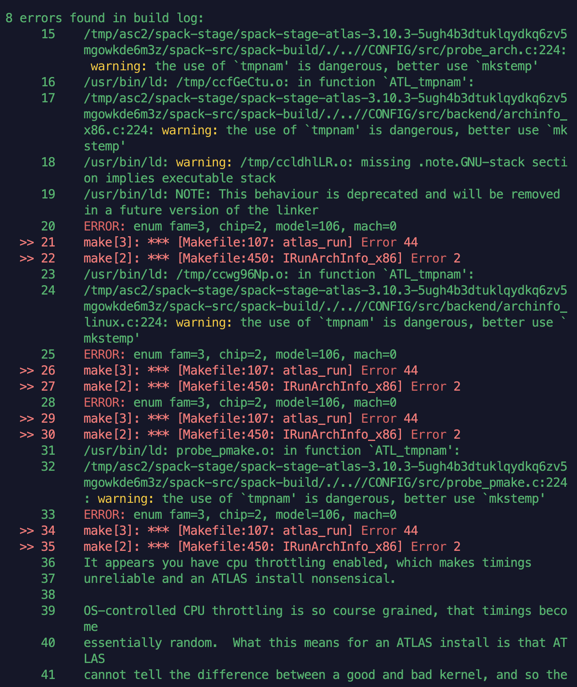
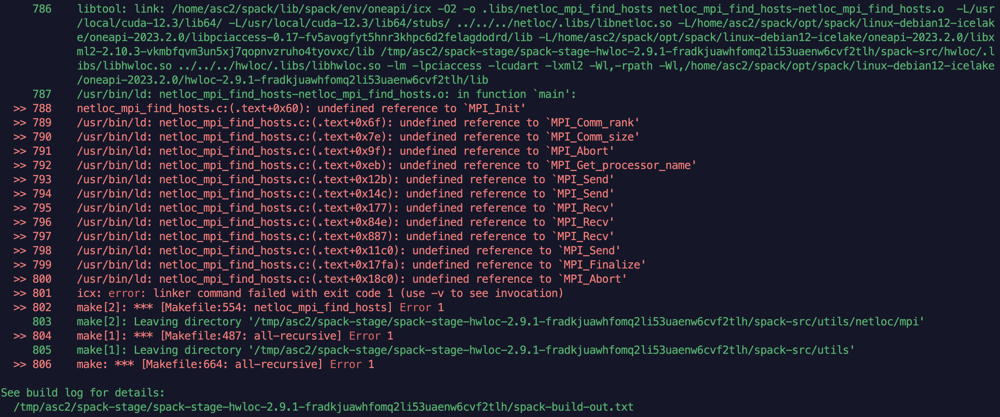

---
tags:
    - 完善
---

# Spack

## 初次安装

> [https://spack.readthedocs.io/en/latest/getting_started.html](https://spack.readthedocs.io/en/latest/getting_started.html)

- 添加 shell 支持
    - 如果集群上已经下载过 Spack，加载脚本一般在 `spack/share/spack/setup-env.sh`
- 配置编译器 `spack compiler`
    - `list` `add=find` `info`
    - `spack config edit compilers` 可以进一步指定编译选项、设置环境变量。
    - spack 常常是不能自动检测到 gfortran 的，之后安装 OpenMPI 会报缺少 Fortran 编译器，记得配置一下。
- 添加系统已有的包： `spack config edit packages` ，以 CUDA 为例：

```yaml
packages:
  all:
    variants: +cuda cuda_arch=80
  cuda:
    externals:
    - spec: "cuda@12.3%gcc@12.2.0 arch=linux-debian12-x86_64"
      prefix: /usr/local/cuda-12.3
      extra_attributes:
        environment:
          prepend_path:
            LD_LIBRAY_PATH: /usr/local/cuda-12.3/lib64
```

- Spack 建议如果系统中有这些包就写进去： `openssl`  `git` 。这些包确实很多系统都有附带，直接使用可以节省一些编译时间。当然很多时候我们用 Spack 就是不想自己解决依赖，希望一行命令解决所有事情，全都让 Spack 自己装一套也行。

## 基础

> [https://spack.readthedocs.io/en/latest/basic_usage.html](https://spack.readthedocs.io/en/latest/basic_usage.html)

- 安装： `spack install`
    - `@` 指定版本
    - `^` 依赖项
    - `%` 指定编译器
    - `+` 启用选项， `++` 在依赖之间传递选项
    - `-` 关闭选项， `--` 在依赖之间传递选项。
    - `~` 与 `-` 同义。它们两个的存在只是为了在某些情况下阻止 shell 展开、又能阻断标识符名称这些作用。

> `~` and `-`are the same. `~` is there to disambiguate from `-` because `-` is also a valid identifier. `-` is also allowed because `~` can be expanded by shells if you add a space before it...

- `name==<value>` 指定非布尔形变量的值（上面两个都用于布尔形变量）
- `target=, os=` 指定架构
- `flag=` 指定编译选项，可以用的有：`cflags`, `cxxflags`, `fflags`, `cppflags`, `ldflags`, and `ldlibs`

建议：安装前检查依赖关系是否正确：

```bash
spack spec -I <package> #确认依赖的包是否是你想要的包
spack install <package> #再执行安装，否则调整选项
```

- 位置： `spack location`
    - `--install-dir`
- 配置： `spack config`
    - `edit`
- 已安装的包： `spack find`
    - 详细信息： `-dfv` 包含依赖、编译选项、变量，都是常用的信息。
- 查询： `spack info` 、 `spack list`
- 差异： `spack diff` ，安装了不同选项、版本的程序时，可以用它来比较差异。

## 结合 `pkg-config` 处理库依赖

执行 `spack load` 后我们会发现环境变量中多出了很多 `PKG_CONFIG_PATH` 。 `pkg-config` 通过它执行第三方库头文件和库文件的编译、链接。这样我们就不用手写 `-I` 等指令了。下面是一个例子。

```bash
c++ example.cpp $(pkg-config --cflags --libs gtk+-3.0 webkit2gtk-4.0) -o example
```

Spack 已经帮我们弄好了这些包的配置。如果需要自己为某个包写配置，需要学习编写 `.pc` 文件。

## 进阶概念

- Virtual Packages: 虚包

比如 OpenMPI、IntelMPI、MPICH，它们是 MPI 的不同实现。因此它们都提供一个虚包 mpi，其他程序只会依赖于 mpi 这个包，而不会依赖于某个具体实现。
使用 `spack info --all` 可以查看提供的虚包，这里以 ATLAS 为例，可以看到：

```yaml
Virtual Packages: 
    atlas provides blas, lapack, lapack@3.6.1
```

也就是说， `atlas` 会自动取代 `blas/lapack` 等的位置，提供它们的服务。

## 错误处理

### 过于老旧的包

!!! info inline end "ATLAS 无法识别 CPU"

    

构建过程的很多错误往往是因为代码太老、不符合新的语法规范、功能弃用。如果有可能，不要再使用该包，选择新的可替代的包，不然可能需要花很大精力调整编译选项。比如 ATLAS，其稳定的包已经是 2016 年的了，编译时爆出了很多弃用的函数、不能识别目前的 CPU 等等问题，因此还是放弃该包比较好。

对于 BLAS，其实官网提供了 Vendor-Specific 的列表，可以找到：`intel-oneapi-mkl` 就是 Intel 平台上的优化实现，改用它即可。

### 解决编译、链接问题

这些问题常常是由于编写安装脚本的人没有考虑完善导致的，没有指定链接某些库，导致编译过程中断。如果对 `ld` 等链接工具熟悉，就能够自行添加相应的选项完成编译。下面记录几个例子：

```bash
spack install hwloc@2.9.1%oneapi ^intel-oneapi-mpi%oneapi
```

使用 `intel-oneapi-mpi` 依赖安装 `hwloc` ，提示缺少 MPI 相关符号，很显然是没链接 MPI 库。



- 首先检查 786 行的编译命令，其实这里并没有指定链接 MPI 库，因此应当添加 `-lmpi` 选项。更改为：

```bash
spack install hwloc@2.9.1%oneapi ldflags="-lmpi" ^intel-oneapi-mpi%oneapi
```

- 这个问题折腾了我一个多小时，才慢慢找到上面这个问题。一开始我反射性地认为可能是路径缺失，因此尝试以各种方式为 `ld` 添加搜索路径，但最后发现它根本没指定链接。
- 如果是路径问题， `ld` 的报错应该是找不到某个库，而不是未定义符号，比如：

```bash
/usr/bin/ld: cannot find -lzlib
```
